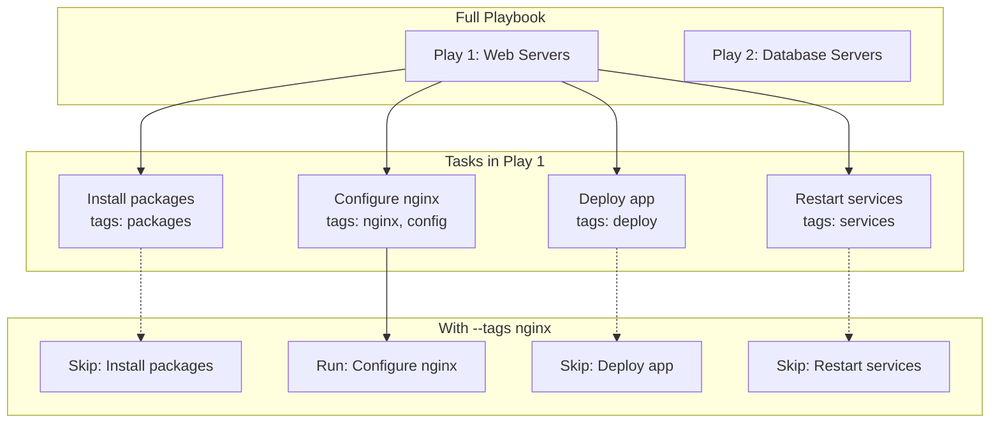
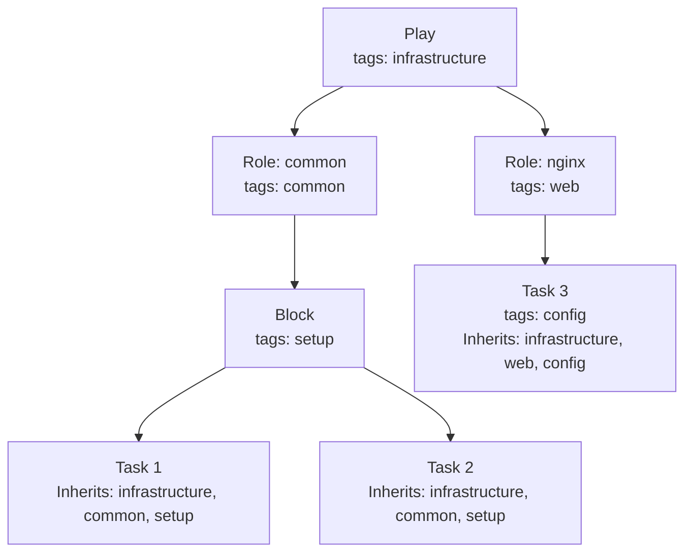

# How to Handle Ansible Tags for Selective Execution

Author: [nawazdhandala](https://www.github.com/nawazdhandala)

Tags: Ansible, Tags, Automation, DevOps, Playbooks, Best Practices

Description: Master Ansible tags to selectively run specific tasks, roles, and plays for faster development cycles and targeted deployments.

---

Ansible tags allow you to run specific portions of your playbooks without executing everything. This is invaluable during development, debugging, and when you need to perform targeted updates in production. This guide covers tag strategies, syntax variations, and best practices.

## Understanding Tags

Tags are labels you attach to tasks, blocks, roles, or entire plays. When running a playbook, you can choose which tags to run or skip.



## Basic Tag Syntax

### Tagging Individual Tasks

```yaml
# playbook.yml

---
- name: Configure web server
  hosts: webservers
  tasks:
    - name: Install nginx
      apt:
        name: nginx
        state: present
      tags: packages

    - name: Copy nginx configuration
      template:
        src: nginx.conf.j2
        dest: /etc/nginx/nginx.conf
      tags: configuration

    - name: Start nginx service
      service:
        name: nginx
        state: started
        enabled: yes
      tags: services
```

### Multiple Tags per Task

```yaml
# A task can have multiple tags
- name: Deploy application
  copy:
    src: app/
    dest: /var/www/app/
  tags:
    - deploy
    - application
    - web
```

### Tagging Blocks

Apply tags to multiple tasks at once using blocks:

```yaml
- name: Configure web server
  hosts: webservers
  tasks:
    - name: Database configuration tasks
      tags: database
      block:
        - name: Install PostgreSQL client
          apt:
            name: postgresql-client
            state: present

        - name: Configure database connection
          template:
            src: database.yml.j2
            dest: /etc/app/database.yml

        - name: Test database connectivity
          command: pg_isready -h {{ db_host }}
```

### Tagging Roles

```yaml
# Tagging entire roles
- name: Configure infrastructure
  hosts: all
  roles:
    - role: common
      tags: common

    - role: security
      tags:
        - security
        - hardening

    - role: monitoring
      tags: monitoring
```

### Tagging Plays

```yaml
# Tag an entire play
- name: Configure web tier
  hosts: webservers
  tags: web
  tasks:
    - name: Install web packages
      apt:
        name: "{{ item }}"
        state: present
      loop:
        - nginx
        - php-fpm

- name: Configure database tier
  hosts: dbservers
  tags: database
  tasks:
    - name: Install database packages
      apt:
        name: postgresql
        state: present
```

## Running with Tags

### Execute Specific Tags

```bash
# Run only tasks tagged with 'configuration'
ansible-playbook site.yml --tags configuration

# Run multiple tags
ansible-playbook site.yml --tags "packages,configuration"

# Short form
ansible-playbook site.yml -t "packages,services"
```

### Skip Specific Tags

```bash
# Run everything except tasks tagged 'slow'
ansible-playbook site.yml --skip-tags slow

# Skip multiple tags
ansible-playbook site.yml --skip-tags "backup,cleanup"
```

### List Available Tags

```bash
# See all tags in a playbook without running it
ansible-playbook site.yml --list-tags

# Output example:
# playbook: site.yml
#   play #1 (webservers): Configure web server  TAGS: []
#     TASK TAGS: [configuration, packages, services, deploy]
```

## Special Tags

Ansible provides built-in special tags for common scenarios.

### The 'always' Tag

Tasks tagged with `always` run regardless of which tags are specified:

```yaml
- name: Setup tasks
  hosts: all
  tasks:
    - name: Gather custom facts
      setup:
        gather_subset: min
      tags: always  # This always runs

    - name: Install packages
      apt:
        name: nginx
        state: present
      tags: packages

    - name: Log completion
      debug:
        msg: "Playbook completed at {{ ansible_date_time.iso8601 }}"
      tags: always  # This always runs
```

### The 'never' Tag

Tasks tagged with `never` only run when explicitly requested:

```yaml
- name: Maintenance tasks
  hosts: all
  tasks:
    - name: Normal operation
      debug:
        msg: "Regular task"

    - name: Dangerous cleanup - only run when explicitly called
      file:
        path: /var/log/app/
        state: absent
      tags: never  # Must use --tags never to run this

    - name: Debug information
      debug:
        var: ansible_facts
      tags:
        - never
        - debug  # Run with --tags debug
```

```bash
# This will NOT run the 'never' tagged task
ansible-playbook site.yml

# This WILL run the 'never' tagged task
ansible-playbook site.yml --tags never

# Run the debug task specifically
ansible-playbook site.yml --tags debug
```

## Tag Inheritance

Tags flow down from plays to roles to blocks to tasks.



### Example of Tag Inheritance

```yaml
- name: Configure servers
  hosts: all
  tags: base  # Applied to all tasks in this play
  tasks:
    - name: Update apt cache
      apt:
        update_cache: yes
      tags: packages  # Task has both 'base' and 'packages' tags

    - name: Security tasks
      tags: security  # Block has 'base' and 'security'
      block:
        - name: Configure firewall
          # Inherits 'base' and 'security'
          ufw:
            state: enabled

        - name: Configure fail2ban
          # Inherits 'base' and 'security'
          apt:
            name: fail2ban
            state: present
```

## Practical Tag Strategies

### Environment-Based Tags

```yaml
# site.yml - Different environments

- name: Deploy application
  hosts: all
  tasks:
    - name: Deploy to production
      tags:
        - production
        - deploy
      include_tasks: deploy-production.yml

    - name: Deploy to staging
      tags:
        - staging
        - deploy
      include_tasks: deploy-staging.yml

    - name: Deploy to development
      tags:
        - development
        - deploy
      include_tasks: deploy-development.yml
```

```bash
# Deploy only to production
ansible-playbook site.yml --tags production

# Deploy only to staging
ansible-playbook site.yml --tags staging
```

### Component-Based Tags

```yaml
# infrastructure.yml

- name: Configure full stack
  hosts: all
  tasks:
    - name: Configure networking
      tags: networking
      include_role:
        name: networking

    - name: Configure storage
      tags: storage
      include_role:
        name: storage

    - name: Configure compute
      tags: compute
      include_role:
        name: compute

    - name: Configure monitoring
      tags: monitoring
      include_role:
        name: monitoring
```

```bash
# Update only networking
ansible-playbook infrastructure.yml --tags networking

# Update storage and compute
ansible-playbook infrastructure.yml --tags "storage,compute"
```

### Lifecycle-Based Tags

```yaml
# application.yml

- name: Application lifecycle
  hosts: appservers
  tasks:
    # Installation phase
    - name: Install dependencies
      tags:
        - install
        - initial
      apt:
        name: "{{ dependencies }}"
        state: present

    # Configuration phase
    - name: Configure application
      tags:
        - configure
        - update
      template:
        src: app.conf.j2
        dest: /etc/app/app.conf

    # Deployment phase
    - name: Deploy code
      tags:
        - deploy
        - update
      git:
        repo: "{{ app_repo }}"
        dest: /opt/app
        version: "{{ app_version }}"

    # Restart phase
    - name: Restart application
      tags:
        - restart
        - update
      service:
        name: app
        state: restarted
```

```bash
# Initial setup
ansible-playbook application.yml --tags initial

# Routine updates (configure, deploy, restart)
ansible-playbook application.yml --tags update

# Just restart
ansible-playbook application.yml --tags restart
```

## Tags with Includes and Imports

### Static Imports (import_tasks)

Tags specified at the import statement are applied to all imported tasks:

```yaml
- name: Configure servers
  hosts: all
  tasks:
    - name: Import common tasks
      import_tasks: common.yml
      tags: common
      # All tasks in common.yml get the 'common' tag
```

### Dynamic Includes (include_tasks)

Tags on include_tasks apply only to the include itself, not the included tasks:

```yaml
- name: Configure servers
  hosts: all
  tasks:
    - name: Include role-specific tasks
      include_tasks: "{{ role_type }}.yml"
      tags: dynamic
      # Only the include statement has the 'dynamic' tag
      # Tasks inside the file keep their own tags
```

To pass tags to included tasks, use `apply`:

```yaml
- name: Include with tags
  include_tasks:
    file: database.yml
    apply:
      tags:
        - database
        - always
  tags:
    - database
    - always
```

## Best Practices

### 1. Use Consistent Tag Naming

```yaml
# Good: Consistent, descriptive tags
tags: packages
tags: configuration
tags: services
tags: security
tags: monitoring

# Avoid: Inconsistent naming
tags: pkgs
tags: config
tags: svc
tags: sec
```

### 2. Document Available Tags

```yaml
# playbook.yml
# Available tags:
#   - packages: Install/update system packages
#   - configuration: Update configuration files
#   - services: Start/restart services
#   - security: Apply security hardening
#   - deploy: Deploy application code
#   - rollback: Rollback to previous version

---
- name: Deploy application
  hosts: all
  # ... tasks with documented tags
```

### 3. Combine Tags Logically

```yaml
# Group related operations
- name: Install and configure nginx
  tags:
    - nginx
    - web
    - packages
  block:
    - apt:
        name: nginx
        state: present
    - template:
        src: nginx.conf.j2
        dest: /etc/nginx/nginx.conf
```

### 4. Use 'never' for Dangerous Operations

```yaml
- name: Dangerous operations
  tags:
    - never
    - danger
    - cleanup
  block:
    - name: Remove all logs
      file:
        path: /var/log/
        state: absent
        recurse: yes

    - name: Reset database
      command: dropdb myapp
```

### 5. Always Tag for Validation

```yaml
- name: Validation task
  tags:
    - always
    - validate
  block:
    - name: Check required variables
      assert:
        that:
          - app_version is defined
          - db_host is defined
        fail_msg: "Required variables not set"
```

## Debugging Tag Issues

### List All Tags

```bash
# View tags without running
ansible-playbook site.yml --list-tags
```

### Check Which Tasks Would Run

```bash
# Dry run with specific tags
ansible-playbook site.yml --tags "packages" --list-tasks

# Output shows only tasks that would run:
# playbook: site.yml
#   play #1 (all): Configure servers
#     Install system packages
#     Install application dependencies
```

### Verify Tag Inheritance

```yaml
# Add debug task to verify effective tags
- name: Show effective tags
  debug:
    msg: "This task runs with tags: packages, base"
  tags:
    - packages
    - always  # So we can always see which tags are active
```

---

Tags are essential for managing complex Ansible deployments. Start with simple, consistent tag names aligned with your workflow, then build up to sophisticated tagging strategies as your needs grow. Use the `always` tag for critical setup tasks, the `never` tag for dangerous operations, and combine tags logically to enable flexible selective execution. Remember to document your tags so team members know which ones to use for common operations.
