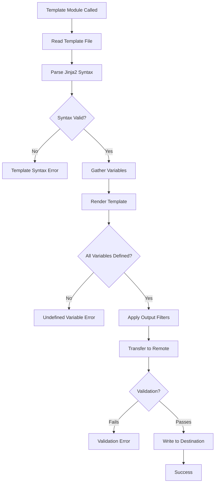

# How to Fix "Template Module" Rendering Errors

Author: [nawazdhandala](https://www.github.com/nawazdhandala)

Tags: Ansible, Jinja2, Template Module, Troubleshooting, DevOps, Configuration Management

Description: Learn how to diagnose and fix common Ansible template module errors including undefined variables, syntax errors, and encoding issues.

---

> The Ansible template module uses Jinja2 templating to dynamically generate configuration files. Template errors can be challenging to debug because they occur during rendering, not execution. This guide covers common template errors and their solutions.

Understanding how the template module processes files helps identify where errors occur in the rendering pipeline.

---

## Template Processing Flow



---

## Error 1: Undefined Variable

### Symptoms

```
fatal: [webserver]: FAILED! => {
    "changed": false,
    "msg": "AnsibleUndefinedVariable: 'database_host' is undefined"
}
```

### Causes and Solutions

#### Cause 1: Variable not defined

```yaml
# templates/config.conf.j2
# Template references undefined variable
database_host = {{ database_host }}
database_port = {{ database_port }}
```

```yaml
# playbook.yml
# Solution: Define the variable before using template
---
- name: Configure application
  hosts: appservers
  vars:
    # Define all variables used in template
    database_host: localhost
    database_port: 5432

  tasks:
    - name: Generate config file
      ansible.builtin.template:
        src: config.conf.j2
        dest: /etc/myapp/config.conf
```

#### Cause 2: Variable from missing host or group vars

```yaml
# Solution: Check variable precedence and file locations
# group_vars/appservers.yml
---
database_host: "{{ vault_database_host }}"
database_port: 5432

# host_vars/webserver1.yml
---
# Override for specific host
database_host: db.webserver1.local
```

#### Cause 3: Variable scope in loops

```yaml
# Problem: Variable defined inside loop not available outside
- name: Process items
  ansible.builtin.template:
    src: item.conf.j2
    dest: "/etc/myapp/{{ item }}.conf"
  loop: "{{ config_items }}"
  # item is available inside loop, but template uses item_name

# Template that causes error:
# config_name = {{ item_name }}  # WRONG: item_name is undefined

# Solution: Use correct loop variable
# Template:
# config_name = {{ item }}  # CORRECT: use loop variable directly
```

#### Cause 4: Optional variables

```yaml
# templates/config.conf.j2
# Handle optional variables with defaults
database_host = {{ database_host | default('localhost') }}
database_port = {{ database_port | default(5432) }}

# For nested variables that might not exist

cache_host = {{ cache_config.host | default('localhost') }}
cache_port = {{ cache_config.port | default(6379) }}

```

---

## Error 2: Template Syntax Error

### Symptoms

```
fatal: [webserver]: FAILED! => {
    "changed": false,
    "msg": "TemplateSyntaxError: unexpected '}'"
}
```

Or:

```
fatal: [webserver]: FAILED! => {
    "changed": false,
    "msg": "TemplateSyntaxError: Encountered unknown tag 'endif'."
}
```

### Causes and Solutions

#### Cause 1: Mismatched braces or tags

```jinja2
{# Wrong: Missing closing brace #}
server_name = {{ server_name }

{# Correct: Properly closed #}
server_name = {{ server_name }}

{# Wrong: Unclosed block #}

debug = true

{# Correct: Properly closed block #}

debug = true

```

#### Cause 2: Incorrect tag syntax

```jinja2
{# Wrong: Using wrong delimiters #}


{# Correct: Variables use {{ }}, statements use  #}
server_name = {{ server_name }}


debug = true

```

#### Cause 3: Comment syntax errors

```jinja2
{# Wrong: Using wrong comment syntax #}
// This is not a Jinja2 comment
<!-- This is HTML comment, not Jinja2 -->

{# Correct: Use Jinja2 comment syntax #}
{# This is a proper Jinja2 comment #}
```

#### Cause 4: Nested quotes issues

```jinja2
{# Wrong: Improper quote nesting #}
message = "Hello {{ user_name | default("Guest") }}"

{# Correct: Use different quote types #}
message = "Hello {{ user_name | default('Guest') }}"

{# Or escape the quotes #}
message = "Hello {{ user_name | default(\"Guest\") }}"
```

---

## Error 3: Filter Not Found

### Symptoms

```
fatal: [webserver]: FAILED! => {
    "changed": false,
    "msg": "TemplateError: no filter named 'to_yaml'"
}
```

### Solutions

```yaml
# Solution 1: Use correct filter name
# templates/config.yml.j2
{{ config_data | to_nice_yaml }}

# Solution 2: Ensure required collections are installed
# Some filters require specific collections
# requirements.yml
collections:
  - name: ansible.utils  # Provides many useful filters

# Solution 3: Use built-in Python methods
{{ my_list | join(',') }}
{{ my_string | lower }}
{{ my_string | upper }}
{{ my_string | replace('old', 'new') }}

# Solution 4: Create custom filter plugin
# plugins/filter/custom_filters.py
def custom_format(value, format_string):
    return format_string.format(value)

class FilterModule:
    def filters(self):
        return {
            'custom_format': custom_format
        }
```

---

## Error 4: Type Conversion Errors

### Symptoms

```
fatal: [webserver]: FAILED! => {
    "changed": false,
    "msg": "TemplateError: int() argument must be a string or a number, not 'list'"
}
```

### Solutions

```jinja2
{# Problem: Trying to add different types #}
total = {{ count + "5" }}

{# Solution 1: Explicit type conversion #}
total = {{ count | int + 5 }}

{# Solution 2: String formatting #}
message = "Count is {{ count | string }}"

{# Problem: Iterating over non-iterable #}
  {# count is an integer #}

{# Solution: Check type before iteration #}


{{ item }}


{{ count }}


{# Problem: Boolean from string #}
  {# String "true" is always truthy #}

{# Solution: Proper boolean conversion #}

feature_enabled = yes

```

---

## Error 5: Encoding Issues

### Symptoms

```
fatal: [webserver]: FAILED! => {
    "changed": false,
    "msg": "UnicodeDecodeError: 'utf-8' codec can't decode byte 0xff in position 0"
}
```

### Solutions

```yaml
# Solution 1: Ensure template file is UTF-8 encoded
# Check encoding on control node
# file templates/config.conf.j2
# Convert to UTF-8 if needed
# iconv -f ISO-8859-1 -t UTF-8 config.conf.j2 > config.conf.j2.new

# Solution 2: Specify encoding in template task
- name: Generate config with encoding
  ansible.builtin.template:
    src: config.conf.j2
    dest: /etc/myapp/config.conf
    # Specify output encoding
    output_encoding: utf-8
```

```jinja2
{# templates/config.conf.j2 #}
{# Add encoding declaration at the top #}
{# -*- coding: utf-8 -*- #}
# Configuration file

# Handle special characters safely
description = {{ description | default('Default') }}
```

---

## Error 6: Whitespace Control Issues

### Symptoms

Template produces unwanted blank lines or missing newlines:

```
# Expected output:
server {
    listen 80;
}

# Actual output with blank lines:
server {

    listen 80;

}
```

### Solutions

```jinja2
{# Problem: Block statements add newlines #}

ssl on;


{# Solution 1: Use whitespace control characters #}
{# Minus sign removes whitespace before/after #}

ssl on;


{# Solution 2: Use set block for complex logic #}


ssl on;
ssl_certificate {{ ssl_cert_path }};


{{ ssl_config }}

{# Solution 3: Configure whitespace in template module #}
# In playbook:
# - name: Generate config
#   ansible.builtin.template:
#     src: config.conf.j2
#     dest: /etc/myapp/config.conf
#     trim_blocks: yes
#     lstrip_blocks: yes
```

```yaml
# playbook.yml
# Use trim_blocks and lstrip_blocks for cleaner output
- name: Generate nginx config
  ansible.builtin.template:
    src: nginx.conf.j2
    dest: /etc/nginx/nginx.conf
    # Remove first newline after block tag
    trim_blocks: yes
    # Remove leading whitespace from block tags
    lstrip_blocks: yes
```

---

## Error 7: Recursive Template Inclusion Errors

### Symptoms

```
fatal: [webserver]: FAILED! => {
    "changed": false,
    "msg": "RecursionError: maximum recursion depth exceeded"
}
```

### Solutions

```jinja2
{# Problem: Circular include #}
{# template_a.j2 includes template_b.j2 which includes template_a.j2 #}

{# Solution 1: Use include with context control #}


{# Solution 2: Use conditionals to prevent recursion #}








{# Solution 3: Restructure templates to avoid recursion #}
{# base.j2 #}
{{ header_content }}
{{ main_content }}
{{ footer_content }}

{# Instead of circular includes, use inheritance #}


Custom content here

```

---

## Error 8: Variable Interpolation in Template Path

### Symptoms

```
fatal: [webserver]: FAILED! => {
    "changed": false,
    "msg": "Could not find or access 'templates/{{ app_name }}.conf.j2'"
}
```

### Solutions

```yaml
# Problem: Template path not interpolated
- name: Deploy app config
  ansible.builtin.template:
    src: "templates/{{ app_name }}.conf.j2"  # This might not work as expected
    dest: /etc/myapp/config.conf

# Solution 1: Variable interpolation works in src parameter
- name: Deploy app config
  ansible.builtin.template:
    src: "{{ app_name }}.conf.j2"  # Ansible searches in templates/ automatically
    dest: /etc/myapp/config.conf
  vars:
    app_name: myapp

# Solution 2: Use absolute path with playbook_dir
- name: Deploy app config
  ansible.builtin.template:
    src: "{{ playbook_dir }}/templates/{{ app_name }}.conf.j2"
    dest: /etc/myapp/config.conf

# Solution 3: Use first_found for multiple options
- name: Deploy app config
  ansible.builtin.template:
    src: "{{ lookup('first_found', template_options) }}"
    dest: /etc/myapp/config.conf
  vars:
    template_options:
      - "templates/{{ app_name }}-{{ environment }}.conf.j2"
      - "templates/{{ app_name }}.conf.j2"
      - "templates/default.conf.j2"
```

---

## Error 9: Dictionary/List Access Errors

### Symptoms

```
fatal: [webserver]: FAILED! => {
    "changed": false,
    "msg": "AnsibleError: template error while templating string: expected name or number"
}
```

### Solutions

```jinja2
{# Problem: Incorrect dictionary access #}
value = {{ my_dict.key-with-dashes }}

{# Solution 1: Use bracket notation for special characters #}
value = {{ my_dict['key-with-dashes'] }}

{# Problem: Accessing nested dict that might not exist #}
value = {{ config.database.host }}

{# Solution 2: Use default filter for nested access #}
value = {{ config.database.host | default('localhost') }}

{# Solution 3: Check existence first #}

value = {{ config.database.host }}

value = localhost


{# Solution 4: Use omit for optional values #}
value = {{ config.database.host | default(omit) }}

{# Problem: List index out of range #}
first_item = {{ my_list[0] }}

{# Solution 5: Safe list access #}

first_item = {{ my_list[0] }}


{# Or use default #}
first_item = {{ my_list[0] | default('none') }}
```

---

## Error 10: Validation Errors

### Symptoms

```
fatal: [webserver]: FAILED! => {
    "changed": false,
    "msg": "failed to validate: /usr/sbin/nginx -t -c /tmp/ansible.xxx.conf"
}
```

### Solutions

```yaml
# The validate parameter runs a command to check the generated file
# %s is replaced with the temp file path

# Problem: Validation command fails
- name: Deploy nginx config
  ansible.builtin.template:
    src: nginx.conf.j2
    dest: /etc/nginx/nginx.conf
    validate: /usr/sbin/nginx -t -c %s

# Solution 1: Debug the generated template first
- name: Generate config to temp location for debugging
  ansible.builtin.template:
    src: nginx.conf.j2
    dest: /tmp/nginx.conf.debug
  register: debug_template

- name: Display generated content
  ansible.builtin.command: cat /tmp/nginx.conf.debug
  register: template_content
  changed_when: false

- name: Show template content
  ansible.builtin.debug:
    var: template_content.stdout_lines

# Solution 2: Validate separately with better error handling
- name: Generate nginx config
  ansible.builtin.template:
    src: nginx.conf.j2
    dest: /etc/nginx/nginx.conf
  register: nginx_config

- name: Validate nginx configuration
  ansible.builtin.command: /usr/sbin/nginx -t
  register: nginx_validate
  changed_when: false
  when: nginx_config.changed

- name: Rollback on validation failure
  block:
    - name: Test nginx config
      ansible.builtin.command: /usr/sbin/nginx -t
      register: nginx_test

  rescue:
    - name: Restore backup
      ansible.builtin.copy:
        src: /etc/nginx/nginx.conf.bak
        dest: /etc/nginx/nginx.conf
        remote_src: yes
```

---

## Debugging Template Errors

### Using Debug Output

```yaml
# Debug variables before using in template
- name: Debug variables for template
  ansible.builtin.debug:
    msg: |
      database_host: {{ database_host | default('UNDEFINED') }}
      database_port: {{ database_port | default('UNDEFINED') }}
      debug_mode: {{ debug_mode | default('UNDEFINED') }}
      config_items: {{ config_items | default([]) | to_nice_yaml }}

# Render template to variable for inspection
- name: Render template to variable
  ansible.builtin.set_fact:
    rendered_config: "{{ lookup('template', 'config.conf.j2') }}"

- name: Show rendered template
  ansible.builtin.debug:
    var: rendered_config
```

### Using Check Mode

```bash
# Run in check mode to see what would be generated
ansible-playbook playbook.yml --check --diff

# Increase verbosity for more details
ansible-playbook playbook.yml --check --diff -vvv
```

### Local Template Testing

```python
#!/usr/bin/env python3
# test_template.py
# Test Jinja2 templates locally without running full playbook

from jinja2 import Environment, FileSystemLoader, StrictUndefined
import yaml
import sys

# Load variables from file
with open('vars.yml') as f:
    variables = yaml.safe_load(f)

# Set up Jinja2 environment
env = Environment(
    loader=FileSystemLoader('templates'),
    undefined=StrictUndefined  # Raise error on undefined variables
)

try:
    template = env.get_template('config.conf.j2')
    output = template.render(variables)
    print("Template rendered successfully:")
    print(output)
except Exception as e:
    print(f"Template error: {e}")
    sys.exit(1)
```

---

## Best Practices for Templates

### 1. Use Default Values Consistently

```jinja2
{# Define defaults at the top of template #}




# Database Configuration
host = {{ db_host }}
port = {{ db_port }}
database = {{ db_name }}
```

### 2. Document Template Variables

```jinja2
{#
  Template: config.conf.j2

  Required Variables:
    - app_name: Name of the application
    - environment: Deployment environment (dev, staging, prod)

  Optional Variables:
    - debug_mode: Enable debug logging (default: false)
    - log_level: Logging level (default: INFO)
#}

[application]
name = {{ app_name }}
environment = {{ environment }}
debug = {{ debug_mode | default(false) | lower }}
log_level = {{ log_level | default('INFO') }}
```

### 3. Validate Template Structure

```yaml
# Create a validation playbook for templates
- name: Validate all templates
  hosts: localhost
  connection: local
  vars:
    test_variables:
      app_name: test_app
      environment: test
      database_host: localhost
      database_port: 5432

  tasks:
    - name: Find all templates
      ansible.builtin.find:
        paths: templates/
        patterns: "*.j2"
      register: template_files

    - name: Validate each template
      ansible.builtin.template:
        src: "{{ item.path }}"
        dest: "/tmp/validate_{{ item.path | basename }}"
      loop: "{{ template_files.files }}"
      check_mode: yes
```

### 4. Use Template Inheritance

```jinja2
{# base_config.j2 - Base template #}
# Application Configuration
# Generated by Ansible - DO NOT EDIT MANUALLY


# Header section



# Main configuration



# End of configuration

```

```jinja2
{# app_config.j2 - Child template #}



[application]
name = {{ app_name }}
environment = {{ environment }}

[database]
host = {{ database_host }}
port = {{ database_port }}

```

---

## Conclusion

Ansible template errors can be frustrating, but understanding common patterns makes them easier to diagnose and fix. Key takeaways:

- Always provide default values for optional variables
- Use proper Jinja2 syntax with matching delimiters and tags
- Handle whitespace carefully with control characters
- Test templates locally before deployment
- Use bracket notation for dictionary keys with special characters
- Validate generated configurations before applying them
- Document required and optional variables in templates

By following these practices, you can write robust templates that generate consistent configurations across your infrastructure.

---

*Looking for comprehensive infrastructure monitoring? [OneUptime](https://oneuptime.com) provides real-time monitoring and alerting for your Ansible-managed infrastructure.*

**Related Reading:**
- [How to Fix "Copy Module" File Transfer Errors](/blog/post/2026-01-24-ansible-copy-module-errors/view)
- [How to Handle Ansible Handlers and Notifications](/blog/post/2026-01-24-ansible-handlers-notifications/view)
