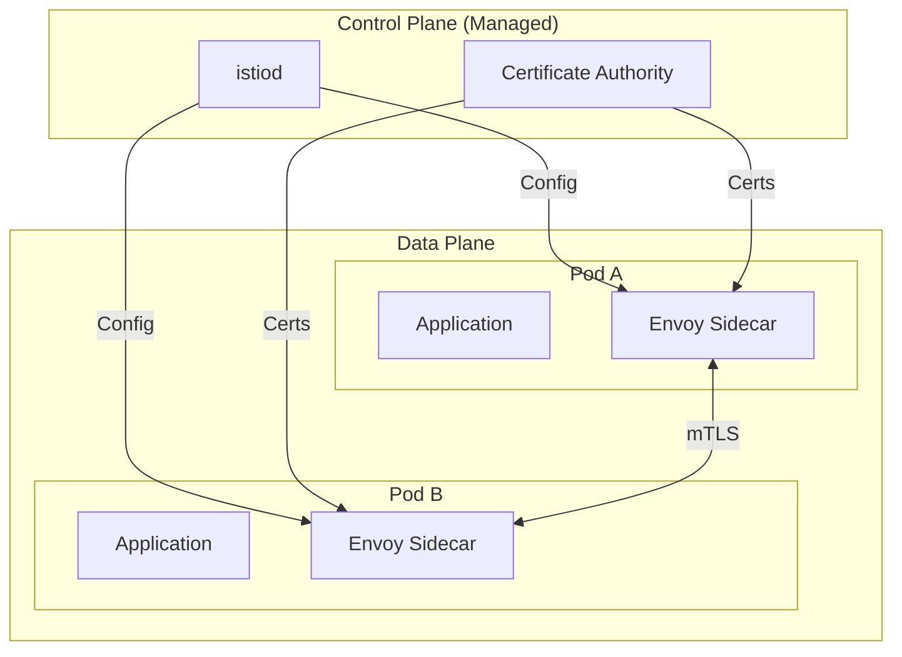
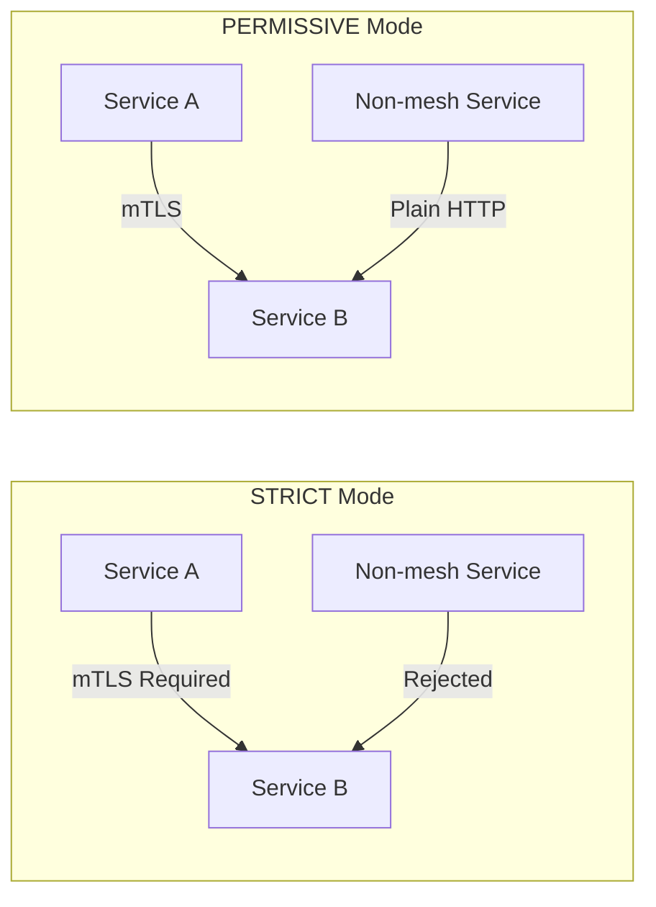

# How to Fix 'Anthos' Service Mesh Errors

Author: [nawazdhandala](https://www.github.com/nawazdhandala)

Tags: Google Cloud, Anthos, Service Mesh, Istio, Kubernetes, Troubleshooting, GKE

Description: A practical guide to diagnosing and fixing common Anthos Service Mesh errors including sidecar injection failures, mTLS issues, and traffic management problems.

---

Anthos Service Mesh (ASM) provides a managed Istio-based service mesh for your Kubernetes clusters. When things go wrong, debugging can be challenging because issues can stem from the control plane, data plane, or configuration. Let's walk through the most common errors and their solutions.

## Understanding ASM Architecture

Before diving into fixes, understand the components involved.



## Common Error 1: Sidecar Injection Not Working

Pods are deployed but the Envoy sidecar proxy is not injected.

### Diagnosis

```bash
# Check if the namespace has injection label
kubectl get namespace my-namespace --show-labels

# Check if pods have the sidecar
kubectl get pods -n my-namespace -o jsonpath='{.items[*].spec.containers[*].name}' | tr ' ' '\n' | sort -u

# Should see 'istio-proxy' in the output
```

### Fix: Enable Namespace Injection

```bash
# For managed ASM, use the revision label
# First, find the ASM revision
kubectl get controlplanerevision -n istio-system

# Label the namespace with the revision
kubectl label namespace my-namespace \
    istio.io/rev=asm-managed-stable \
    --overwrite

# Or for automatic injection (older method)
kubectl label namespace my-namespace \
    istio-injection=enabled \
    --overwrite
```

### Fix: Check MutatingWebhookConfiguration

```bash
# List webhooks
kubectl get mutatingwebhookconfiguration | grep istio

# Describe the webhook to check for issues
kubectl describe mutatingwebhookconfiguration istio-sidecar-injector-asm-managed-stable

# Verify the webhook service is running
kubectl get pods -n istio-system -l app=istiod
```

### Fix: Pod Annotations Preventing Injection

```yaml
# Check if pod has injection disabled
# Bad - injection disabled
apiVersion: v1
kind: Pod
metadata:
  annotations:
    sidecar.istio.io/inject: "false"  # Remove this

# Good - ensure injection is enabled
apiVersion: v1
kind: Pod
metadata:
  annotations:
    sidecar.istio.io/inject: "true"
```

## Common Error 2: mTLS Connection Failures

Services cannot communicate, with errors like "connection reset" or "upstream connect error".

### Understanding mTLS Modes



### Diagnosis

```bash
# Check PeerAuthentication policies
kubectl get peerauthentication -A

# Check DestinationRule TLS settings
kubectl get destinationrule -A -o yaml | grep -A5 "tls:"

# Test connectivity from inside a pod
kubectl exec -it deploy/my-app -c istio-proxy -- \
    curl -v http://target-service:8080
```

### Fix: Configure Consistent mTLS Mode

```yaml
# Set namespace-wide mTLS to PERMISSIVE for migration
apiVersion: security.istio.io/v1beta1
kind: PeerAuthentication
metadata:
  name: default
  namespace: my-namespace
spec:
  mtls:
    mode: PERMISSIVE  # Allow both mTLS and plain text

---
# After all services have sidecars, switch to STRICT
apiVersion: security.istio.io/v1beta1
kind: PeerAuthentication
metadata:
  name: default
  namespace: my-namespace
spec:
  mtls:
    mode: STRICT
```

### Fix: DestinationRule Conflicts

```yaml
# Bad - DestinationRule disabling TLS for mesh traffic
apiVersion: networking.istio.io/v1beta1
kind: DestinationRule
metadata:
  name: my-service
spec:
  host: my-service
  trafficPolicy:
    tls:
      mode: DISABLE  # This breaks mTLS

---
# Good - Use ISTIO_MUTUAL for mesh traffic
apiVersion: networking.istio.io/v1beta1
kind: DestinationRule
metadata:
  name: my-service
spec:
  host: my-service
  trafficPolicy:
    tls:
      mode: ISTIO_MUTUAL  # Uses mesh certificates
```

## Common Error 3: 503 Service Unavailable

Requests fail with 503 errors, often with "no healthy upstream" messages.

### Diagnosis

```bash
# Check if destination pods are ready
kubectl get pods -n target-namespace -l app=target-service

# Check Envoy clusters
kubectl exec -it deploy/my-app -c istio-proxy -- \
    pilot-agent request GET clusters | grep target-service

# Check Envoy stats for upstream errors
kubectl exec -it deploy/my-app -c istio-proxy -- \
    pilot-agent request GET stats | grep -E "upstream_cx|upstream_rq_5xx"
```

### Fix: Health Check Configuration

```yaml
# Ensure proper health checks in deployment
apiVersion: apps/v1
kind: Deployment
metadata:
  name: my-service
spec:
  template:
    spec:
      containers:
        - name: app
          readinessProbe:
            httpGet:
              path: /health
              port: 8080
            initialDelaySeconds: 5
            periodSeconds: 10
          livenessProbe:
            httpGet:
              path: /health
              port: 8080
            initialDelaySeconds: 15
            periodSeconds: 20
```

### Fix: Correct Service Port Naming

```yaml
# Port naming is crucial for Istio protocol detection
apiVersion: v1
kind: Service
metadata:
  name: my-service
spec:
  ports:
    # Good - named ports with protocol prefix
    - name: http-web    # Istio detects HTTP
      port: 80
      targetPort: 8080
    - name: grpc-api    # Istio detects gRPC
      port: 9090
      targetPort: 9090

    # Bad - unnamed or incorrectly named
    - name: web         # Protocol unknown
      port: 80
    - port: 8080        # No name at all
```

## Common Error 4: VirtualService Not Routing Traffic

Traffic routing rules are not being applied.

### Diagnosis

```bash
# Check VirtualService configuration
kubectl get virtualservice -n my-namespace -o yaml

# Verify the VirtualService is attached to the correct gateway
kubectl get gateway -n my-namespace

# Check proxy configuration
istioctl proxy-config routes deploy/my-app -n my-namespace
```

### Fix: Correct VirtualService Configuration

```yaml
# Common mistake: wrong host format
apiVersion: networking.istio.io/v1beta1
kind: VirtualService
metadata:
  name: my-service-routes
  namespace: my-namespace
spec:
  # For mesh internal traffic, use short name or FQDN
  hosts:
    - my-service                           # Same namespace
    - my-service.other-namespace.svc.cluster.local  # Different namespace

  # For external traffic, specify gateway
  gateways:
    - my-gateway
    - mesh  # Include 'mesh' for internal traffic

  http:
    - match:
        - uri:
            prefix: /api/v2
      route:
        - destination:
            host: my-service
            subset: v2
            port:
              number: 8080
    - route:
        - destination:
            host: my-service
            subset: v1
            port:
              number: 8080
```

### Fix: Missing DestinationRule Subsets

```yaml
# VirtualService references subsets that must exist in DestinationRule
apiVersion: networking.istio.io/v1beta1
kind: DestinationRule
metadata:
  name: my-service
  namespace: my-namespace
spec:
  host: my-service
  subsets:
    - name: v1
      labels:
        version: v1
    - name: v2
      labels:
        version: v2
```

## Common Error 5: Gateway Configuration Issues

External traffic is not reaching your services.

### Diagnosis

```bash
# Check gateway status
kubectl get gateway -n my-namespace -o yaml

# Verify ingress gateway is running
kubectl get pods -n istio-system -l app=istio-ingressgateway

# Check gateway service external IP
kubectl get svc -n istio-system istio-ingressgateway

# Test from gateway pod
kubectl exec -it deploy/istio-ingressgateway -n istio-system -- \
    curl -v http://localhost:8080/
```

### Fix: Correct Gateway and VirtualService

```yaml
apiVersion: networking.istio.io/v1beta1
kind: Gateway
metadata:
  name: my-gateway
  namespace: my-namespace
spec:
  selector:
    istio: ingressgateway  # Must match gateway pod labels
  servers:
    - port:
        number: 80
        name: http
        protocol: HTTP
      hosts:
        - "api.example.com"
    - port:
        number: 443
        name: https
        protocol: HTTPS
      hosts:
        - "api.example.com"
      tls:
        mode: SIMPLE
        credentialName: api-example-com-cert  # Secret in istio-system

---
apiVersion: networking.istio.io/v1beta1
kind: VirtualService
metadata:
  name: api-routes
  namespace: my-namespace
spec:
  hosts:
    - "api.example.com"
  gateways:
    - my-gateway  # Reference the gateway
  http:
    - route:
        - destination:
            host: api-service
            port:
              number: 8080
```

## Common Error 6: Certificate Errors

TLS handshake failures or certificate validation errors.

### Diagnosis

```bash
# Check certificate status
kubectl get secret -n istio-system | grep credential

# Verify certificate is valid
kubectl get secret api-example-com-cert -n istio-system -o jsonpath='{.data.tls\.crt}' | \
    base64 -d | openssl x509 -text -noout | grep -A2 "Validity"

# Check mesh CA certificate
kubectl exec -it deploy/my-app -c istio-proxy -- \
    cat /var/run/secrets/istio/root-cert.pem | openssl x509 -text -noout
```

### Fix: Create TLS Secret Correctly

```bash
# Create secret in istio-system namespace for Gateway TLS
kubectl create secret tls api-example-com-cert \
    --cert=tls.crt \
    --key=tls.key \
    -n istio-system

# For SDS-based certificate management
kubectl create secret generic api-example-com-cert \
    --from-file=tls.crt=cert.pem \
    --from-file=tls.key=key.pem \
    --from-file=ca.crt=ca.pem \
    -n istio-system
```

## Using istioctl for Debugging

The `istioctl` command is essential for ASM debugging.

```bash
# Analyze configuration for issues
istioctl analyze -n my-namespace

# Check proxy synchronization
istioctl proxy-status

# Dump Envoy configuration
istioctl proxy-config all deploy/my-app -n my-namespace -o json

# Check specific Envoy configuration
istioctl proxy-config cluster deploy/my-app -n my-namespace
istioctl proxy-config listener deploy/my-app -n my-namespace
istioctl proxy-config route deploy/my-app -n my-namespace
istioctl proxy-config endpoint deploy/my-app -n my-namespace

# Debug specific connection issues
istioctl proxy-config log deploy/my-app -n my-namespace --level debug
```

## Monitoring ASM Health

Set up proper monitoring to catch issues early.

```bash
# Enable access logging
kubectl apply -f - <<EOF
apiVersion: telemetry.istio.io/v1alpha1
kind: Telemetry
metadata:
  name: mesh-default
  namespace: istio-system
spec:
  accessLogging:
    - providers:
        - name: envoy
EOF

# View access logs
kubectl logs deploy/my-app -c istio-proxy -f | grep -v healthz
```

## Troubleshooting Checklist

When ASM is not working, run through this checklist:

1. **Verify ASM installation** - Check istiod pods are running
2. **Check namespace labels** - Ensure injection is enabled
3. **Verify sidecar injection** - Pods should have istio-proxy container
4. **Check service port naming** - Use protocol prefixes (http-, grpc-, tcp-)
5. **Review mTLS settings** - Ensure consistent mode across namespace
6. **Validate VirtualService/DestinationRule** - Run `istioctl analyze`
7. **Check certificate validity** - Expired certs cause silent failures
8. **Review Envoy logs** - Often contain the real error message

ASM adds complexity but provides powerful traffic management and security capabilities. Most errors come from mismatched configurations between VirtualServices, DestinationRules, and actual service deployments.
