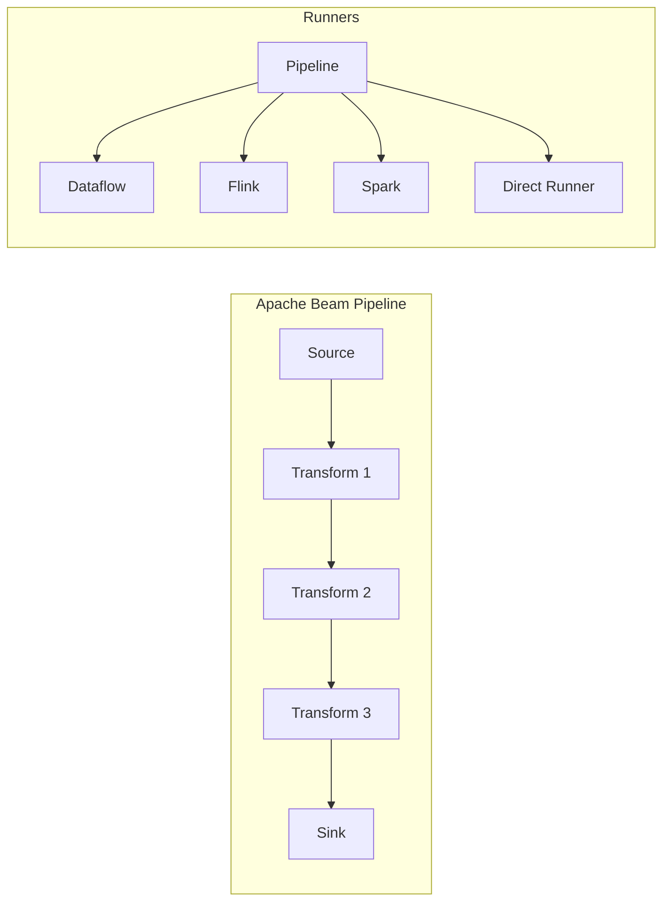

# How to Handle Apache Beam Pipelines

Author: [nawazdhandala](https://www.github.com/nawazdhandala)

Tags: Apache Beam, Data Pipelines, Stream Processing, Batch Processing, Google Dataflow, Apache Flink, Data Engineering

Description: Learn how to build, deploy, and manage Apache Beam pipelines for both batch and stream processing with practical examples and best practices.

---

> Apache Beam provides a unified programming model for both batch and streaming data processing. Its portability across multiple runners makes it an excellent choice for data pipelines that need to run on different execution engines.

Whether you are processing historical data in batch mode or handling real-time events, Apache Beam offers a consistent API. This guide covers pipeline development, testing, deployment, and operational best practices.

---

## Understanding Beam Pipeline Architecture

Apache Beam pipelines consist of three main components: the Pipeline itself, PCollections (the data), and PTransforms (the operations).



---

## Building Your First Pipeline

Start with a simple pipeline that reads data, transforms it, and writes results.

```python
# basic_pipeline.py
# A simple Apache Beam pipeline for processing events

import apache_beam as beam
from apache_beam.options.pipeline_options import PipelineOptions, StandardOptions

def run_basic_pipeline():
    """
    Basic pipeline that reads events, filters, transforms, and writes output.
    """
    # Configure pipeline options
    options = PipelineOptions()
    options.view_as(StandardOptions).runner = 'DirectRunner'  # Local testing

    with beam.Pipeline(options=options) as pipeline:
        # Read input data
        events = (
            pipeline
            | 'ReadEvents' >> beam.io.ReadFromText('gs://bucket/events/*.json')
            | 'ParseJSON' >> beam.Map(parse_json_event)
        )

        # Filter and transform
        processed = (
            events
            | 'FilterValid' >> beam.Filter(lambda e: e.get('status') == 'active')
            | 'ExtractFields' >> beam.Map(extract_relevant_fields)
            | 'AddTimestamp' >> beam.Map(add_processing_timestamp)
        )

        # Write output
        processed | 'WriteOutput' >> beam.io.WriteToText(
            'gs://bucket/processed/output',
            file_name_suffix='.json'
        )


def parse_json_event(line: str) -> dict:
    """Parse a JSON line into a dictionary."""
    import json
    return json.loads(line)


def extract_relevant_fields(event: dict) -> dict:
    """Extract only the fields we need for downstream processing."""
    return {
        'event_id': event.get('id'),
        'user_id': event.get('user_id'),
        'action': event.get('action'),
        'timestamp': event.get('created_at')
    }


def add_processing_timestamp(event: dict) -> dict:
    """Add a processing timestamp to track when we handled this event."""
    from datetime import datetime
    event['processed_at'] = datetime.utcnow().isoformat()
    return event


if __name__ == '__main__':
    run_basic_pipeline()
```

---

## Handling Streaming Data

For real-time processing, Beam provides windowing and triggering mechanisms.

```python
# streaming_pipeline.py
# Apache Beam pipeline for streaming data with windowing

import apache_beam as beam
from apache_beam.options.pipeline_options import PipelineOptions, StandardOptions
from apache_beam.transforms.window import FixedWindows, SlidingWindows, Sessions
from apache_beam.transforms.trigger import AfterWatermark, AfterProcessingTime, AccumulationMode
import apache_beam.transforms.window as window

def run_streaming_pipeline():
    """
    Streaming pipeline with windowing for aggregating events over time.
    """
    options = PipelineOptions([
        '--streaming',
        '--runner=DataflowRunner',
        '--project=my-project',
        '--region=us-central1',
        '--temp_location=gs://bucket/temp'
    ])

    with beam.Pipeline(options=options) as pipeline:
        # Read from Pub/Sub
        events = (
            pipeline
            | 'ReadPubSub' >> beam.io.ReadFromPubSub(
                topic='projects/my-project/topics/events'
            )
            | 'DecodeBytes' >> beam.Map(lambda x: x.decode('utf-8'))
            | 'ParseJSON' >> beam.Map(parse_json_event)
            | 'ExtractTimestamp' >> beam.Map(extract_event_timestamp)
                .with_output_types(beam.typehints.Dict[str, object])
        )

        # Apply windowing - 5 minute fixed windows
        windowed_events = (
            events
            | 'AddEventTimestamp' >> beam.Map(
                lambda x: beam.window.TimestampedValue(x, x['timestamp'])
            )
            | 'Window' >> beam.WindowInto(
                FixedWindows(5 * 60),  # 5 minutes
                trigger=AfterWatermark(
                    early=AfterProcessingTime(60),  # Early results every minute
                    late=AfterProcessingTime(60)    # Late data handling
                ),
                accumulation_mode=AccumulationMode.ACCUMULATING
            )
        )

        # Aggregate by user
        user_metrics = (
            windowed_events
            | 'KeyByUser' >> beam.Map(lambda e: (e['user_id'], e))
            | 'GroupByUser' >> beam.GroupByKey()
            | 'ComputeMetrics' >> beam.ParDo(ComputeUserMetrics())
        )

        # Write to BigQuery
        user_metrics | 'WriteToBigQuery' >> beam.io.WriteToBigQuery(
            table='my-project:analytics.user_metrics',
            schema='user_id:STRING,window_start:TIMESTAMP,event_count:INTEGER,actions:STRING',
            write_disposition=beam.io.BigQueryDisposition.WRITE_APPEND,
            create_disposition=beam.io.BigQueryDisposition.CREATE_IF_NEEDED
        )


class ComputeUserMetrics(beam.DoFn):
    """
    DoFn to compute metrics for each user within a window.
    """

    def process(self, element, window=beam.DoFn.WindowParam):
        user_id, events = element
        events_list = list(events)

        # Get window boundaries
        window_start = window.start.to_utc_datetime()
        window_end = window.end.to_utc_datetime()

        # Compute metrics
        actions = [e.get('action') for e in events_list]

        yield {
            'user_id': user_id,
            'window_start': window_start.isoformat(),
            'window_end': window_end.isoformat(),
            'event_count': len(events_list),
            'actions': ','.join(set(actions))
        }


def extract_event_timestamp(event: dict) -> dict:
    """Extract and parse the event timestamp."""
    from datetime import datetime
    timestamp_str = event.get('created_at', '')
    event['timestamp'] = datetime.fromisoformat(timestamp_str.replace('Z', '+00:00'))
    return event
```

---

## Error Handling and Dead Letter Queues

Production pipelines need robust error handling to prevent data loss.

```python
# error_handling_pipeline.py
# Apache Beam pipeline with comprehensive error handling

import apache_beam as beam
from apache_beam import pvalue

class ProcessWithErrorHandling(beam.DoFn):
    """
    DoFn that handles errors gracefully and routes failures to dead letter queue.
    """

    # Define output tags for success and failure
    SUCCESS_TAG = 'success'
    FAILURE_TAG = 'failure'

    def process(self, element):
        try:
            # Attempt to process the element
            result = self.transform_element(element)
            yield pvalue.TaggedOutput(self.SUCCESS_TAG, result)
        except Exception as e:
            # On failure, emit to dead letter queue with error details
            error_record = {
                'original_data': element,
                'error_type': type(e).__name__,
                'error_message': str(e),
                'timestamp': self.get_current_timestamp()
            }
            yield pvalue.TaggedOutput(self.FAILURE_TAG, error_record)

    def transform_element(self, element):
        """Transform logic that might fail."""
        import json

        # Parse JSON - might fail on malformed data
        if isinstance(element, bytes):
            element = element.decode('utf-8')

        data = json.loads(element)

        # Validate required fields
        required_fields = ['id', 'user_id', 'action']
        for field in required_fields:
            if field not in data:
                raise ValueError(f"Missing required field: {field}")

        # Transform data
        return {
            'event_id': data['id'],
            'user_id': data['user_id'],
            'action': data['action'].lower(),
            'metadata': data.get('metadata', {})
        }

    def get_current_timestamp(self):
        from datetime import datetime
        return datetime.utcnow().isoformat()


def run_pipeline_with_error_handling():
    """
    Pipeline with dead letter queue for handling failures.
    """
    options = PipelineOptions()

    with beam.Pipeline(options=options) as pipeline:
        # Read input
        raw_events = pipeline | 'ReadInput' >> beam.io.ReadFromPubSub(
            subscription='projects/my-project/subscriptions/events-sub'
        )

        # Process with error handling
        results = raw_events | 'ProcessEvents' >> beam.ParDo(
            ProcessWithErrorHandling()
        ).with_outputs(
            ProcessWithErrorHandling.SUCCESS_TAG,
            ProcessWithErrorHandling.FAILURE_TAG
        )

        # Handle successful records
        results[ProcessWithErrorHandling.SUCCESS_TAG] | 'WriteSuccess' >> beam.io.WriteToBigQuery(
            table='my-project:events.processed',
            write_disposition=beam.io.BigQueryDisposition.WRITE_APPEND
        )

        # Handle failed records - dead letter queue
        results[ProcessWithErrorHandling.FAILURE_TAG] | 'WriteFailures' >> beam.io.WriteToBigQuery(
            table='my-project:events.dead_letter',
            write_disposition=beam.io.BigQueryDisposition.WRITE_APPEND
        )
```

---

## Pipeline Testing

Testing Beam pipelines is essential for maintaining reliability.

```python
# test_pipeline.py
# Unit tests for Apache Beam pipeline transforms

import unittest
import apache_beam as beam
from apache_beam.testing.test_pipeline import TestPipeline
from apache_beam.testing.util import assert_that, equal_to

class TestPipelineTransforms(unittest.TestCase):
    """
    Test cases for pipeline transforms.
    """

    def test_parse_json_event(self):
        """Test JSON parsing transform."""
        with TestPipeline() as pipeline:
            input_data = [
                '{"id": "1", "user_id": "u1", "action": "click"}',
                '{"id": "2", "user_id": "u2", "action": "view"}'
            ]

            expected_output = [
                {'id': '1', 'user_id': 'u1', 'action': 'click'},
                {'id': '2', 'user_id': 'u2', 'action': 'view'}
            ]

            result = (
                pipeline
                | beam.Create(input_data)
                | beam.Map(parse_json_event)
            )

            assert_that(result, equal_to(expected_output))

    def test_filter_valid_events(self):
        """Test filtering logic."""
        with TestPipeline() as pipeline:
            input_data = [
                {'id': '1', 'status': 'active'},
                {'id': '2', 'status': 'inactive'},
                {'id': '3', 'status': 'active'}
            ]

            expected_output = [
                {'id': '1', 'status': 'active'},
                {'id': '3', 'status': 'active'}
            ]

            result = (
                pipeline
                | beam.Create(input_data)
                | beam.Filter(lambda e: e.get('status') == 'active')
            )

            assert_that(result, equal_to(expected_output))

    def test_user_metrics_computation(self):
        """Test metrics computation DoFn."""
        with TestPipeline() as pipeline:
            # Create test data grouped by user
            input_data = [
                ('user1', [
                    {'action': 'click'},
                    {'action': 'view'},
                    {'action': 'click'}
                ])
            ]

            result = (
                pipeline
                | beam.Create(input_data)
                | beam.ParDo(ComputeUserMetricsSimple())
            )

            # Verify the output
            def check_metrics(elements):
                elements = list(elements)
                assert len(elements) == 1
                assert elements[0]['user_id'] == 'user1'
                assert elements[0]['event_count'] == 3

            assert_that(result, check_metrics)


class ComputeUserMetricsSimple(beam.DoFn):
    """Simplified metrics computation for testing."""

    def process(self, element):
        user_id, events = element
        events_list = list(events)

        yield {
            'user_id': user_id,
            'event_count': len(events_list),
            'actions': list(set(e.get('action') for e in events_list))
        }


if __name__ == '__main__':
    unittest.main()
```

---

## Deployment and Monitoring

Deploy pipelines with proper monitoring and alerting.

```python
# deployment/deploy_pipeline.py
# Deploy Apache Beam pipeline to Google Dataflow

import subprocess
import json

def deploy_to_dataflow(
    pipeline_file: str,
    job_name: str,
    project: str,
    region: str,
    template_location: str = None
):
    """
    Deploy a Beam pipeline to Google Dataflow.
    """
    args = [
        'python', pipeline_file,
        f'--runner=DataflowRunner',
        f'--project={project}',
        f'--region={region}',
        f'--job_name={job_name}',
        f'--temp_location=gs://{project}-dataflow-temp/temp',
        f'--staging_location=gs://{project}-dataflow-temp/staging',
        '--setup_file=./setup.py',
        '--max_num_workers=10',
        '--autoscaling_algorithm=THROUGHPUT_BASED',
        '--enable_streaming_engine',  # For streaming pipelines
        '--experiments=enable_prime',  # Enable Dataflow Prime
    ]

    if template_location:
        args.append(f'--template_location={template_location}')

    result = subprocess.run(args, capture_output=True, text=True)

    if result.returncode != 0:
        raise RuntimeError(f"Deployment failed: {result.stderr}")

    return result.stdout


def create_monitoring_dashboard(project: str, job_name: str):
    """
    Create a monitoring dashboard for the Dataflow job.
    """
    dashboard_config = {
        "displayName": f"Dataflow - {job_name}",
        "gridLayout": {
            "columns": 2,
            "widgets": [
                {
                    "title": "Elements Processed",
                    "xyChart": {
                        "dataSets": [{
                            "timeSeriesQuery": {
                                "timeSeriesFilter": {
                                    "filter": f'resource.type="dataflow_job" AND metric.type="dataflow.googleapis.com/job/elements_produced_count" AND resource.labels.job_name="{job_name}"'
                                }
                            }
                        }]
                    }
                },
                {
                    "title": "System Lag",
                    "xyChart": {
                        "dataSets": [{
                            "timeSeriesQuery": {
                                "timeSeriesFilter": {
                                    "filter": f'resource.type="dataflow_job" AND metric.type="dataflow.googleapis.com/job/system_lag" AND resource.labels.job_name="{job_name}"'
                                }
                            }
                        }]
                    }
                },
                {
                    "title": "Worker CPU Utilization",
                    "xyChart": {
                        "dataSets": [{
                            "timeSeriesQuery": {
                                "timeSeriesFilter": {
                                    "filter": f'resource.type="dataflow_job" AND metric.type="dataflow.googleapis.com/job/per_worker_cpu_utilization"'
                                }
                            }
                        }]
                    }
                }
            ]
        }
    }

    return dashboard_config
```

---

## Performance Optimization

Optimize your Beam pipelines for better throughput and lower latency.

```python
# optimized_pipeline.py
# Performance-optimized Apache Beam pipeline

import apache_beam as beam
from apache_beam.options.pipeline_options import PipelineOptions

def run_optimized_pipeline():
    """
    Pipeline with performance optimizations applied.
    """
    options = PipelineOptions([
        '--runner=DataflowRunner',
        '--project=my-project',
        '--region=us-central1',
        # Performance tuning options
        '--number_of_worker_harness_threads=0',  # Auto-tune
        '--experiments=shuffle_mode=service',     # Use Dataflow Shuffle
        '--experiments=use_runner_v2',            # Use Runner V2
    ])

    with beam.Pipeline(options=options) as pipeline:
        events = (
            pipeline
            | 'ReadInput' >> beam.io.ReadFromPubSub(
                subscription='projects/my-project/subscriptions/events'
            )
        )

        # Use Reshuffle to optimize parallelism after source
        reshuffled = events | 'Reshuffle' >> beam.Reshuffle()

        # Batch writes for better throughput
        processed = (
            reshuffled
            | 'Parse' >> beam.Map(parse_event)
            | 'Transform' >> beam.Map(transform_event)
        )

        # Use batched writes
        processed | 'BatchWrite' >> beam.io.WriteToBigQuery(
            table='my-project:dataset.table',
            method=beam.io.WriteToBigQuery.Method.FILE_LOADS,
            triggering_frequency=60,  # Batch writes every 60 seconds
            write_disposition=beam.io.BigQueryDisposition.WRITE_APPEND
        )
```

---

## Best Practices

1. **Use type hints** - Add type hints to improve pipeline validation and performance
2. **Prefer ParDo over Map** - ParDo is more flexible and supports side outputs
3. **Batch external calls** - Use GroupIntoBatches before making API calls
4. **Monitor system lag** - Set alerts when lag exceeds acceptable thresholds
5. **Test with DirectRunner first** - Debug locally before deploying to production runners
6. **Use Combine over GroupByKey** - Combine is more efficient for aggregations
7. **Handle late data** - Configure appropriate allowed lateness for streaming pipelines

---

*Ready for production-grade monitoring of your Beam pipelines? [OneUptime](https://oneuptime.com) provides unified observability for data processing workloads across any runner.*

**Related Reading:**
- [How to Configure Data Lake Architecture](https://oneuptime.com/blog/post/2026-01-24-data-lake-architecture/view)
- [How to Fix "Checkpoint" Failures in Spark Streaming](https://oneuptime.com/blog/post/2026-01-24-spark-streaming-checkpoint-failures/view)
