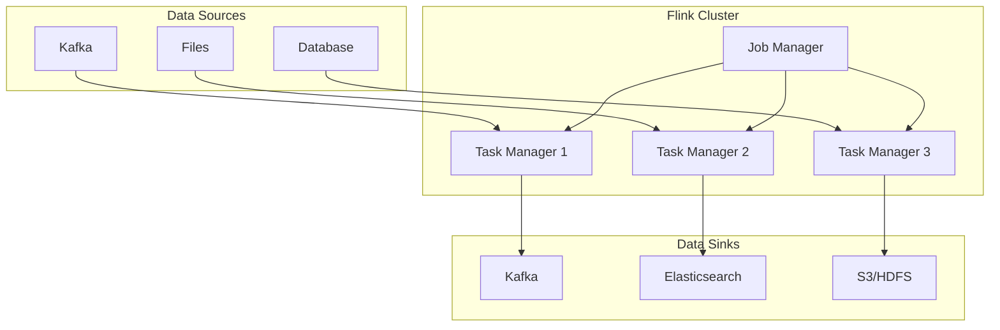

# How to Handle Apache Flink Stream Processing

Author: [nawazdhandala](https://www.github.com/nawazdhandala)

Tags: Apache Flink, Stream Processing, Real-time Analytics, Java, Data Streaming, Big Data

Description: Learn how to handle Apache Flink stream processing, including windowing, state management, watermarks, and building production-ready streaming applications.

---

Apache Flink is a powerful framework for stateful stream processing. It handles everything from simple event transformations to complex event-driven applications with exactly-once semantics. This guide covers practical patterns for building reliable Flink streaming applications.

---

## Flink Architecture Overview



---

## Basic Streaming Application

```java
// BasicStreamingJob.java

import org.apache.flink.api.common.eventtime.WatermarkStrategy;
import org.apache.flink.api.common.functions.MapFunction;
import org.apache.flink.api.common.functions.FilterFunction;
import org.apache.flink.streaming.api.datastream.DataStream;
import org.apache.flink.streaming.api.environment.StreamExecutionEnvironment;
import org.apache.flink.connector.kafka.source.KafkaSource;
import org.apache.flink.connector.kafka.source.enumerator.initializer.OffsetsInitializer;
import org.apache.flink.api.common.serialization.SimpleStringSchema;

public class BasicStreamingJob {

    public static void main(String[] args) throws Exception {
        // Create execution environment
        StreamExecutionEnvironment env = StreamExecutionEnvironment.getExecutionEnvironment();

        // Configure checkpointing for fault tolerance
        env.enableCheckpointing(60000); // Checkpoint every 60 seconds
        env.getCheckpointConfig().setMinPauseBetweenCheckpoints(30000);
        env.getCheckpointConfig().setCheckpointTimeout(120000);

        // Create Kafka source
        KafkaSource<String> source = KafkaSource.<String>builder()
            .setBootstrapServers("kafka:9092")
            .setTopics("events")
            .setGroupId("flink-consumer")
            .setStartingOffsets(OffsetsInitializer.earliest())
            .setValueOnlyDeserializer(new SimpleStringSchema())
            .build();

        // Create data stream with watermarks
        DataStream<String> stream = env.fromSource(
            source,
            WatermarkStrategy.noWatermarks(),
            "Kafka Source"
        );

        // Process the stream
        DataStream<Event> events = stream
            .map(new ParseEventFunction())
            .filter(new FilterValidEvents())
            .map(new EnrichEventFunction());

        // Output to sink
        events.print();

        // Execute the job
        env.execute("Basic Streaming Job");
    }
}

// Event POJO
class Event {
    public String eventId;
    public String eventType;
    public long timestamp;
    public String userId;
    public Map<String, String> properties;

    // Getters and setters
}

// Parse JSON to Event
class ParseEventFunction implements MapFunction<String, Event> {
    private ObjectMapper mapper = new ObjectMapper();

    @Override
    public Event map(String json) throws Exception {
        return mapper.readValue(json, Event.class);
    }
}

// Filter invalid events
class FilterValidEvents implements FilterFunction<Event> {
    @Override
    public boolean filter(Event event) {
        return event.eventId != null &&
               event.userId != null &&
               event.timestamp > 0;
    }
}

// Enrich event with additional data
class EnrichEventFunction implements MapFunction<Event, Event> {
    @Override
    public Event map(Event event) {
        // Add derived fields
        event.properties.put("processed_at", String.valueOf(System.currentTimeMillis()));
        return event;
    }
}
```

---

## Windowing Operations

```java
// WindowingExample.java

import org.apache.flink.streaming.api.windowing.assigners.*;
import org.apache.flink.streaming.api.windowing.time.Time;
import org.apache.flink.streaming.api.windowing.windows.TimeWindow;
import org.apache.flink.streaming.api.functions.windowing.WindowFunction;
import org.apache.flink.util.Collector;

public class WindowingExample {

    public static void main(String[] args) throws Exception {
        StreamExecutionEnvironment env = StreamExecutionEnvironment.getExecutionEnvironment();

        DataStream<Event> events = getEventStream(env);

        // Tumbling window - fixed size, non-overlapping
        DataStream<EventCount> tumblingCounts = events
            .keyBy(event -> event.eventType)
            .window(TumblingEventTimeWindows.of(Time.minutes(5)))
            .apply(new CountEventsFunction());

        // Sliding window - fixed size, overlapping
        DataStream<EventCount> slidingCounts = events
            .keyBy(event -> event.eventType)
            .window(SlidingEventTimeWindows.of(
                Time.minutes(10),  // Window size
                Time.minutes(5)    // Slide interval
            ))
            .apply(new CountEventsFunction());

        // Session window - gap-based
        DataStream<EventCount> sessionCounts = events
            .keyBy(event -> event.userId)
            .window(EventTimeSessionWindows.withGap(Time.minutes(30)))
            .apply(new CountEventsFunction());

        // Global window with custom trigger
        DataStream<EventCount> globalCounts = events
            .keyBy(event -> event.eventType)
            .window(GlobalWindows.create())
            .trigger(CountTrigger.of(1000))  // Trigger every 1000 events
            .apply(new CountEventsFunction());

        tumblingCounts.print();

        env.execute("Windowing Example");
    }
}

// Window function to count events
class CountEventsFunction implements WindowFunction<Event, EventCount, String, TimeWindow> {

    @Override
    public void apply(
        String key,
        TimeWindow window,
        Iterable<Event> events,
        Collector<EventCount> out
    ) {
        long count = 0;
        for (Event event : events) {
            count++;
        }

        out.collect(new EventCount(
            key,
            count,
            window.getStart(),
            window.getEnd()
        ));
    }
}

class EventCount {
    public String eventType;
    public long count;
    public long windowStart;
    public long windowEnd;

    public EventCount(String eventType, long count, long windowStart, long windowEnd) {
        this.eventType = eventType;
        this.count = count;
        this.windowStart = windowStart;
        this.windowEnd = windowEnd;
    }
}
```

---

## Window Types Visualization

```mermaid
gantt
    title Window Types Comparison
    dateFormat HH:mm

    section Tumbling
    Window 1 :a1, 00:00, 5m
    Window 2 :a2, 00:05, 5m
    Window 3 :a3, 00:10, 5m

    section Sliding
    Window A :b1, 00:00, 10m
    Window B :b2, 00:05, 10m
    Window C :b3, 00:10, 10m

    section Session
    User Session :c1, 00:02, 8m
    Gap :c2, 00:10, 30m
    New Session :c3, 00:40, 5m
```



---

## Watermarks and Event Time

```java
// WatermarkExample.java

import org.apache.flink.api.common.eventtime.*;

public class WatermarkExample {

    public static void main(String[] args) throws Exception {
        StreamExecutionEnvironment env = StreamExecutionEnvironment.getExecutionEnvironment();

        // Configure watermark strategy
        WatermarkStrategy<Event> watermarkStrategy = WatermarkStrategy
            // Allow 5 seconds of out-of-order events
            .<Event>forBoundedOutOfOrderness(Duration.ofSeconds(5))
            // Extract timestamp from event
            .withTimestampAssigner((event, timestamp) -> event.timestamp)
            // Handle idle sources
            .withIdleness(Duration.ofMinutes(1));

        DataStream<Event> events = env
            .fromSource(kafkaSource, watermarkStrategy, "Kafka Source");

        // Process with event time
        DataStream<EventCount> counts = events
            .keyBy(event -> event.eventType)
            .window(TumblingEventTimeWindows.of(Time.minutes(1)))
            .allowedLateness(Time.minutes(2))  // Allow late events
            .sideOutputLateData(lateOutputTag)  // Capture late events
            .apply(new CountEventsFunction());

        // Handle late events separately
        DataStream<Event> lateEvents = counts.getSideOutput(lateOutputTag);
        lateEvents.addSink(new LateEventSink());

        env.execute("Watermark Example");
    }
}

// Custom watermark generator for complex scenarios
class CustomWatermarkGenerator implements WatermarkGenerator<Event> {

    private long maxTimestamp = Long.MIN_VALUE;
    private final long maxOutOfOrderness = 5000; // 5 seconds

    @Override
    public void onEvent(Event event, long eventTimestamp, WatermarkOutput output) {
        // Track the maximum timestamp seen
        maxTimestamp = Math.max(maxTimestamp, event.timestamp);
    }

    @Override
    public void onPeriodicEmit(WatermarkOutput output) {
        // Emit watermark periodically
        output.emitWatermark(new Watermark(maxTimestamp - maxOutOfOrderness - 1));
    }
}
```

---

## Stateful Processing

```java
// StatefulProcessingExample.java

import org.apache.flink.api.common.state.*;
import org.apache.flink.streaming.api.functions.KeyedProcessFunction;
import org.apache.flink.configuration.Configuration;
import org.apache.flink.util.Collector;

public class StatefulProcessingExample {

    public static void main(String[] args) throws Exception {
        StreamExecutionEnvironment env = StreamExecutionEnvironment.getExecutionEnvironment();

        // Enable state backend for large state
        env.setStateBackend(new EmbeddedRocksDBStateBackend());

        DataStream<Event> events = getEventStream(env);

        // Process with state
        DataStream<UserStats> userStats = events
            .keyBy(event -> event.userId)
            .process(new UserStatsFunction());

        userStats.print();

        env.execute("Stateful Processing Example");
    }
}

// Stateful function to track user statistics
class UserStatsFunction extends KeyedProcessFunction<String, Event, UserStats> {

    // State declarations
    private ValueState<Long> eventCountState;
    private ValueState<Long> firstEventTimeState;
    private ValueState<Long> lastEventTimeState;
    private MapState<String, Long> eventTypeCountState;
    private ListState<String> recentEventsState;

    @Override
    public void open(Configuration parameters) {
        // Initialize state descriptors
        eventCountState = getRuntimeContext().getState(
            new ValueStateDescriptor<>("eventCount", Long.class)
        );

        firstEventTimeState = getRuntimeContext().getState(
            new ValueStateDescriptor<>("firstEventTime", Long.class)
        );

        lastEventTimeState = getRuntimeContext().getState(
            new ValueStateDescriptor<>("lastEventTime", Long.class)
        );

        eventTypeCountState = getRuntimeContext().getMapState(
            new MapStateDescriptor<>("eventTypeCounts", String.class, Long.class)
        );

        // Configure TTL for state cleanup
        StateTtlConfig ttlConfig = StateTtlConfig
            .newBuilder(Time.days(7))
            .setUpdateType(StateTtlConfig.UpdateType.OnReadAndWrite)
            .setStateVisibility(StateTtlConfig.StateVisibility.NeverReturnExpired)
            .build();

        ValueStateDescriptor<List<String>> recentEventsDescriptor =
            new ValueStateDescriptor<>("recentEvents", TypeInformation.of(new TypeHint<List<String>>() {}));
        recentEventsDescriptor.enableTimeToLive(ttlConfig);
    }

    @Override
    public void processElement(
        Event event,
        Context ctx,
        Collector<UserStats> out
    ) throws Exception {

        String userId = ctx.getCurrentKey();

        // Update event count
        Long currentCount = eventCountState.value();
        if (currentCount == null) {
            currentCount = 0L;
            firstEventTimeState.update(event.timestamp);
        }
        eventCountState.update(currentCount + 1);
        lastEventTimeState.update(event.timestamp);

        // Update event type counts
        Long typeCount = eventTypeCountState.get(event.eventType);
        eventTypeCountState.put(event.eventType, (typeCount == null ? 0 : typeCount) + 1);

        // Emit stats periodically (every 100 events)
        if ((currentCount + 1) % 100 == 0) {
            UserStats stats = new UserStats();
            stats.userId = userId;
            stats.totalEvents = currentCount + 1;
            stats.firstEventTime = firstEventTimeState.value();
            stats.lastEventTime = lastEventTimeState.value();

            // Collect event type distribution
            stats.eventTypeCounts = new HashMap<>();
            for (Map.Entry<String, Long> entry : eventTypeCountState.entries()) {
                stats.eventTypeCounts.put(entry.getKey(), entry.getValue());
            }

            out.collect(stats);
        }
    }
}

class UserStats {
    public String userId;
    public long totalEvents;
    public long firstEventTime;
    public long lastEventTime;
    public Map<String, Long> eventTypeCounts;
}
```

---

## Exactly-Once Processing with Kafka

```java
// ExactlyOnceKafkaJob.java

import org.apache.flink.connector.kafka.sink.KafkaSink;
import org.apache.flink.connector.kafka.sink.KafkaRecordSerializationSchema;
import org.apache.flink.streaming.api.CheckpointingMode;

public class ExactlyOnceKafkaJob {

    public static void main(String[] args) throws Exception {
        StreamExecutionEnvironment env = StreamExecutionEnvironment.getExecutionEnvironment();

        // Configure exactly-once checkpointing
        env.enableCheckpointing(60000, CheckpointingMode.EXACTLY_ONCE);
        env.getCheckpointConfig().setMinPauseBetweenCheckpoints(30000);
        env.getCheckpointConfig().setCheckpointTimeout(120000);
        env.getCheckpointConfig().setMaxConcurrentCheckpoints(1);

        // External checkpoint storage for recovery
        env.getCheckpointConfig().setExternalizedCheckpointCleanup(
            ExternalizedCheckpointCleanup.RETAIN_ON_CANCELLATION
        );

        // Kafka source with exactly-once
        KafkaSource<Event> source = KafkaSource.<Event>builder()
            .setBootstrapServers("kafka:9092")
            .setTopics("input-events")
            .setGroupId("exactly-once-consumer")
            .setStartingOffsets(OffsetsInitializer.committedOffsets(OffsetResetStrategy.EARLIEST))
            .setDeserializer(new EventDeserializer())
            .build();

        // Process events
        DataStream<ProcessedEvent> processed = env
            .fromSource(source, WatermarkStrategy.noWatermarks(), "Kafka Source")
            .keyBy(event -> event.userId)
            .process(new ProcessingFunction());

        // Kafka sink with exactly-once
        KafkaSink<ProcessedEvent> sink = KafkaSink.<ProcessedEvent>builder()
            .setBootstrapServers("kafka:9092")
            .setRecordSerializer(KafkaRecordSerializationSchema.builder()
                .setTopic("output-events")
                .setValueSerializationSchema(new ProcessedEventSerializer())
                .build()
            )
            .setDeliveryGuarantee(DeliveryGuarantee.EXACTLY_ONCE)
            .setTransactionalIdPrefix("flink-exactly-once")
            .build();

        processed.sinkTo(sink);

        env.execute("Exactly-Once Kafka Job");
    }
}
```

---

## Async I/O for External Services

```java
// AsyncIOExample.java

import org.apache.flink.streaming.api.functions.async.*;
import java.util.concurrent.CompletableFuture;

public class AsyncIOExample {

    public static void main(String[] args) throws Exception {
        StreamExecutionEnvironment env = StreamExecutionEnvironment.getExecutionEnvironment();

        DataStream<Event> events = getEventStream(env);

        // Async enrichment from external service
        DataStream<EnrichedEvent> enriched = AsyncDataStream.orderedWait(
            events,
            new AsyncEnrichmentFunction(),
            30,  // Timeout in seconds
            TimeUnit.SECONDS,
            100  // Max concurrent requests
        );

        enriched.print();

        env.execute("Async I/O Example");
    }
}

class AsyncEnrichmentFunction extends RichAsyncFunction<Event, EnrichedEvent> {

    private transient HttpClient httpClient;

    @Override
    public void open(Configuration parameters) {
        // Initialize HTTP client
        httpClient = HttpClient.newBuilder()
            .connectTimeout(Duration.ofSeconds(10))
            .build();
    }

    @Override
    public void asyncInvoke(Event event, ResultFuture<EnrichedEvent> resultFuture) {
        // Make async HTTP call
        CompletableFuture<HttpResponse<String>> future = httpClient.sendAsync(
            HttpRequest.newBuilder()
                .uri(URI.create("http://enrichment-service/user/" + event.userId))
                .GET()
                .build(),
            HttpResponse.BodyHandlers.ofString()
        );

        future.thenAccept(response -> {
            EnrichedEvent enriched = new EnrichedEvent();
            enriched.event = event;
            enriched.userProfile = parseUserProfile(response.body());

            resultFuture.complete(Collections.singleton(enriched));
        }).exceptionally(throwable -> {
            // Handle failure - return event without enrichment
            EnrichedEvent enriched = new EnrichedEvent();
            enriched.event = event;
            enriched.userProfile = null;

            resultFuture.complete(Collections.singleton(enriched));
            return null;
        });
    }

    @Override
    public void timeout(Event event, ResultFuture<EnrichedEvent> resultFuture) {
        // Handle timeout
        EnrichedEvent enriched = new EnrichedEvent();
        enriched.event = event;
        enriched.userProfile = null;
        enriched.enrichmentTimedOut = true;

        resultFuture.complete(Collections.singleton(enriched));
    }
}
```

---

## Monitoring and Metrics

```java
// MonitoringExample.java

import org.apache.flink.metrics.Counter;
import org.apache.flink.metrics.Gauge;
import org.apache.flink.metrics.Histogram;

class MonitoredProcessFunction extends KeyedProcessFunction<String, Event, ProcessedEvent> {

    // Custom metrics
    private transient Counter processedCounter;
    private transient Counter errorCounter;
    private transient Histogram processingLatency;
    private transient long lastProcessedTimestamp;

    @Override
    public void open(Configuration parameters) {
        // Register metrics
        processedCounter = getRuntimeContext()
            .getMetricGroup()
            .counter("events_processed");

        errorCounter = getRuntimeContext()
            .getMetricGroup()
            .counter("processing_errors");

        processingLatency = getRuntimeContext()
            .getMetricGroup()
            .histogram("processing_latency_ms", new DescriptiveStatisticsHistogram(1000));

        // Gauge for monitoring lag
        getRuntimeContext()
            .getMetricGroup()
            .gauge("processing_lag_ms", new Gauge<Long>() {
                @Override
                public Long getValue() {
                    return System.currentTimeMillis() - lastProcessedTimestamp;
                }
            });
    }

    @Override
    public void processElement(Event event, Context ctx, Collector<ProcessedEvent> out) {
        long startTime = System.currentTimeMillis();

        try {
            // Process event
            ProcessedEvent result = processEvent(event);
            out.collect(result);

            // Update metrics
            processedCounter.inc();
            lastProcessedTimestamp = event.timestamp;

        } catch (Exception e) {
            errorCounter.inc();
            // Handle error
        } finally {
            long latency = System.currentTimeMillis() - startTime;
            processingLatency.update(latency);
        }
    }
}
```

---

## Best Practices

1. **Enable checkpointing** - Always configure checkpointing for fault tolerance in production

2. **Use event time** - Prefer event time over processing time for consistent results

3. **Configure watermarks** - Set appropriate out-of-orderness based on your data characteristics

4. **Manage state size** - Use TTL and state cleanup to prevent unbounded state growth

5. **Handle backpressure** - Monitor and tune parallelism to handle varying load

6. **Test with realistic data** - Use production-like data volumes in testing

7. **Monitor lag** - Track consumer lag and processing latency to detect issues early

8. **Plan for recovery** - Configure external checkpoints and test recovery procedures

---

*Running Flink jobs in production? [OneUptime](https://oneuptime.com) helps you monitor job health, track processing lag, and alert on failures before data is lost.*
