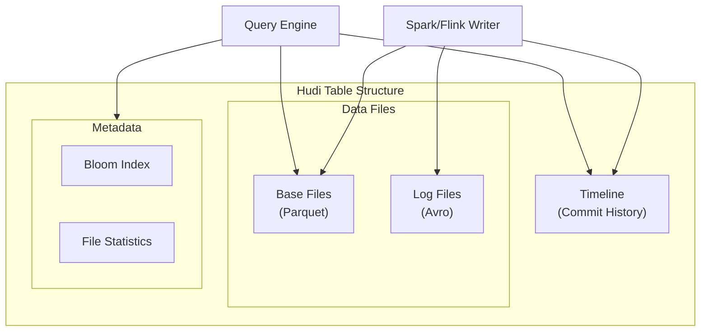

# How to Configure Apache Hudi Tables

Author: [nawazdhandala](https://www.github.com/nawazdhandala)

Tags: Apache Hudi, Data Lake, Spark, Data Engineering, Upserts, Incremental Processing, CDC

Description: Learn how to configure Apache Hudi tables for efficient upserts, incremental queries, and time travel in your data lake architecture.

---

> Apache Hudi brings database-like capabilities to your data lake, enabling upserts, deletes, and incremental processing. Proper configuration is essential for performance and reliability. This guide walks you through setting up Hudi tables for production workloads.

Data lakes without Hudi means rewriting entire partitions for a single record update. Let's do better.

---

## Apache Hudi Architecture Overview

Before configuring tables, understand how Hudi organizes data:



Hudi stores data in base files (Parquet) with delta log files for recent changes, tracked by a timeline of commits.

---

## Table Types: Copy-on-Write vs Merge-on-Read

### Copy-on-Write (CoW) Tables

Best for read-heavy workloads where query performance is critical:

```python
# PySpark: Create Copy-on-Write table
from pyspark.sql import SparkSession

spark = SparkSession.builder \
    .appName("HudiCoWExample") \
    .config("spark.serializer", "org.apache.spark.serializer.KryoSerializer") \
    .config("spark.sql.catalog.spark_catalog", "org.apache.spark.sql.hudi.catalog.HoodieCatalog") \
    .config("spark.sql.extensions", "org.apache.spark.sql.hudi.HoodieSparkSessionExtension") \
    .getOrCreate()

# Define Hudi options for CoW table
hudi_options = {
    # Table configuration
    'hoodie.table.name': 'orders',
    'hoodie.datasource.write.table.type': 'COPY_ON_WRITE',

    # Record key and partition configuration
    'hoodie.datasource.write.recordkey.field': 'order_id',
    'hoodie.datasource.write.partitionpath.field': 'order_date',
    'hoodie.datasource.write.precombine.field': 'updated_at',

    # Write operation type
    'hoodie.datasource.write.operation': 'upsert',

    # Index configuration for fast lookups
    'hoodie.index.type': 'BLOOM',
    'hoodie.bloom.index.filter.type': 'DYNAMIC_V0',

    # Parallelism settings
    'hoodie.insert.shuffle.parallelism': '200',
    'hoodie.upsert.shuffle.parallelism': '200'
}

# Write data to Hudi table
df.write.format("hudi") \
    .options(**hudi_options) \
    .mode("append") \
    .save("s3://my-bucket/hudi/orders")
```

### Merge-on-Read (MoR) Tables

Best for write-heavy workloads with near real-time data ingestion:

```python
# PySpark: Create Merge-on-Read table
hudi_mor_options = {
    # Table configuration
    'hoodie.table.name': 'events',
    'hoodie.datasource.write.table.type': 'MERGE_ON_READ',

    # Record configuration
    'hoodie.datasource.write.recordkey.field': 'event_id',
    'hoodie.datasource.write.partitionpath.field': 'event_date',
    'hoodie.datasource.write.precombine.field': 'event_time',

    # Write operation
    'hoodie.datasource.write.operation': 'upsert',

    # MoR-specific: Log file configuration
    'hoodie.logfile.max.size': '1073741824',  # 1GB max log file
    'hoodie.parquet.max.file.size': '134217728',  # 128MB base files

    # Compaction configuration (merges log files into base files)
    'hoodie.compact.inline': 'true',
    'hoodie.compact.inline.max.delta.commits': '5',

    # Index for MoR tables
    'hoodie.index.type': 'BLOOM',
    'hoodie.bloom.index.update.partition.path': 'true'
}

# Write streaming data to MoR table
events_df.write.format("hudi") \
    .options(**hudi_mor_options) \
    .mode("append") \
    .save("s3://my-bucket/hudi/events")
```

---

## Index Configuration

The index determines how Hudi locates records for updates. Choose based on your data characteristics:

```python
# Bloom Filter Index - Best for most use cases
bloom_index_options = {
    'hoodie.index.type': 'BLOOM',
    # Number of entries per bloom filter
    'hoodie.bloom.index.filter.dynamic.max.entries': '100000',
    # False positive rate (lower = more accurate but larger filters)
    'hoodie.bloom.index.filter.fpp': '0.000001',
    # Parallelize bloom filter lookups
    'hoodie.bloom.index.parallelism': '200',
    # Prune files based on partition path
    'hoodie.bloom.index.prune.by.ranges': 'true'
}

# Simple Index - Best for small tables or when records span many partitions
simple_index_options = {
    'hoodie.index.type': 'SIMPLE',
    'hoodie.simple.index.parallelism': '200'
}

# HBase Index - Best for very large tables with random updates
hbase_index_options = {
    'hoodie.index.type': 'HBASE',
    'hoodie.index.hbase.zkquorum': 'zk1:2181,zk2:2181,zk3:2181',
    'hoodie.index.hbase.zkport': '2181',
    'hoodie.index.hbase.table': 'hudi_index_orders',
    'hoodie.index.hbase.rollback.sync': 'false'
}

# Bucket Index - Best for tables with predictable key distribution
bucket_index_options = {
    'hoodie.index.type': 'BUCKET',
    'hoodie.bucket.index.hash.field': 'order_id',
    'hoodie.bucket.index.num.buckets': '256'
}
```

---

## Compaction Configuration for MoR Tables

Compaction merges log files into base files for better read performance:

```python
# Inline compaction (runs during writes)
inline_compaction_options = {
    'hoodie.compact.inline': 'true',
    # Trigger compaction after 5 delta commits
    'hoodie.compact.inline.max.delta.commits': '5',
    # Compaction strategy
    'hoodie.compaction.strategy': 'org.apache.hudi.table.action.compact.strategy.LogFileSizeBasedCompactionStrategy',
    # Target file size after compaction
    'hoodie.compaction.target.io': '512000000',  # 500MB
    # Parallelism for compaction
    'hoodie.compaction.lazy.block.read': 'true'
}

# Async compaction (separate job)
async_compaction_options = {
    'hoodie.compact.inline': 'false',  # Disable inline
    'hoodie.compact.schedule.inline': 'true'  # Only schedule, don't execute
}
```

Run async compaction as a separate Spark job:

```python
# Async compaction job
from pyspark.sql import SparkSession

spark = SparkSession.builder \
    .appName("HudiCompaction") \
    .config("spark.serializer", "org.apache.spark.serializer.KryoSerializer") \
    .getOrCreate()

# Run pending compactions
spark.read.format("hudi") \
    .option("hoodie.datasource.query.type", "snapshot") \
    .load("s3://my-bucket/hudi/events") \
    .createOrReplaceTempView("events")

# Execute compaction via SQL
spark.sql("""
    CALL run_compaction(
        op => 'RUN',
        table => 'spark_catalog.default.events'
    )
""")
```

---

## Clustering for Optimized File Layout

Clustering reorganizes data files for better query performance:

```python
# Clustering configuration
clustering_options = {
    # Enable inline clustering
    'hoodie.clustering.inline': 'true',
    'hoodie.clustering.inline.max.commits': '4',

    # Clustering strategy - sort by frequently queried columns
    'hoodie.clustering.plan.strategy.class': 'org.apache.hudi.client.clustering.plan.strategy.SparkSortAndSizeExecutionStrategy',
    'hoodie.clustering.plan.strategy.sort.columns': 'customer_id,order_date',

    # Target file size after clustering
    'hoodie.clustering.plan.strategy.target.file.max.bytes': '134217728',  # 128MB
    'hoodie.clustering.plan.strategy.small.file.limit': '104857600',  # 100MB

    # Max groups to create per clustering operation
    'hoodie.clustering.plan.strategy.max.num.groups': '30',

    # Preserve Hudi metadata during clustering
    'hoodie.clustering.preserve.commit.metadata': 'true'
}
```

Run clustering via SQL:

```sql
-- Schedule and run clustering
CALL run_clustering(
    table => 'spark_catalog.default.orders',
    predicate => 'order_date >= "2026-01-01"',
    order => 'customer_id'
);

-- Check clustering status
CALL show_clustering(table => 'spark_catalog.default.orders');
```

---

## Incremental Query Configuration

Configure tables to support efficient incremental reads:

```python
# Write with proper commit time tracking
write_options = {
    'hoodie.table.name': 'orders',
    'hoodie.datasource.write.recordkey.field': 'order_id',
    'hoodie.datasource.write.partitionpath.field': 'order_date',
    'hoodie.datasource.write.precombine.field': 'updated_at',

    # Enable record-level change tracking
    'hoodie.datasource.write.payload.class': 'org.apache.hudi.common.model.DefaultHoodieRecordPayload',

    # Keep commit timeline for incremental queries
    'hoodie.cleaner.commits.retained': '24',  # Keep 24 commits
    'hoodie.keep.min.commits': '25',
    'hoodie.keep.max.commits': '30'
}

# Read incremental changes
def read_incremental_changes(spark, table_path, begin_time):
    """Read records changed since begin_time"""
    return spark.read.format("hudi") \
        .option("hoodie.datasource.query.type", "incremental") \
        .option("hoodie.datasource.read.begin.instanttime", begin_time) \
        .load(table_path)

# Example: Get changes from last hour
from datetime import datetime, timedelta

last_hour = (datetime.now() - timedelta(hours=1)).strftime("%Y%m%d%H%M%S")
changes_df = read_incremental_changes(spark, "s3://my-bucket/hudi/orders", last_hour)
print(f"Found {changes_df.count()} changed records")
```

---

## Time Travel Configuration

Enable point-in-time queries with proper retention:

```python
# Configure timeline retention for time travel
time_travel_options = {
    'hoodie.table.name': 'orders',

    # Keep enough commits for time travel queries
    'hoodie.cleaner.policy': 'KEEP_LATEST_COMMITS',
    'hoodie.cleaner.commits.retained': '168',  # Keep 7 days (hourly commits)

    # Archive older commits but keep them queryable
    'hoodie.archive.automatic': 'true',
    'hoodie.archive.min.commits': '200',
    'hoodie.archive.max.commits': '250',

    # Enable metadata table for faster file listing
    'hoodie.metadata.enable': 'true',
    'hoodie.metadata.index.column.stats.enable': 'true'
}

# Time travel query
def query_at_timestamp(spark, table_path, timestamp):
    """Query table as of specific timestamp"""
    return spark.read.format("hudi") \
        .option("as.of.instant", timestamp) \
        .load(table_path)

# Query table state from yesterday
yesterday = "20260123120000"  # Format: yyyyMMddHHmmss
historical_df = query_at_timestamp(spark, "s3://my-bucket/hudi/orders", yesterday)
```

```sql
-- SQL time travel syntax
SELECT * FROM orders TIMESTAMP AS OF '2026-01-23 12:00:00';

-- View commit history
CALL show_commits(table => 'spark_catalog.default.orders', limit => 10);
```

---

## CDC (Change Data Capture) Configuration

Enable CDC to track all changes including deletes:

```python
# Configure CDC capture
cdc_options = {
    'hoodie.table.name': 'orders_cdc',
    'hoodie.datasource.write.recordkey.field': 'order_id',
    'hoodie.datasource.write.partitionpath.field': 'order_date',
    'hoodie.datasource.write.precombine.field': 'updated_at',

    # Enable CDC
    'hoodie.table.cdc.enabled': 'true',
    'hoodie.table.cdc.supplemental.logging.mode': 'DATA_BEFORE_AFTER'
}

# Read CDC changes
def read_cdc_changes(spark, table_path, begin_time, end_time):
    """Read CDC log showing before/after for each change"""
    return spark.read.format("hudi") \
        .option("hoodie.datasource.query.type", "incremental") \
        .option("hoodie.datasource.read.begin.instanttime", begin_time) \
        .option("hoodie.datasource.read.end.instanttime", end_time) \
        .option("hoodie.datasource.query.incremental.format", "cdc") \
        .load(table_path)

# Process CDC records
cdc_df = read_cdc_changes(spark, "s3://my-bucket/hudi/orders_cdc", "20260124000000", "20260124120000")

# CDC columns: _hoodie_operation (INSERT/UPDATE/DELETE),
#              _hoodie_change_key, before/after images
cdc_df.select("_hoodie_operation", "order_id", "amount").show()
```

---

## Performance Tuning

### Memory and Parallelism

```python
# Performance-optimized configuration
performance_options = {
    # Parallelism based on data volume
    'hoodie.insert.shuffle.parallelism': '400',
    'hoodie.upsert.shuffle.parallelism': '400',
    'hoodie.bulkinsert.shuffle.parallelism': '400',

    # Memory settings
    'hoodie.memory.spillable.map.path': '/tmp/hudi_spill',
    'hoodie.memory.merge.max.size': '1073741824',  # 1GB

    # Write client settings
    'hoodie.write.buffer.limit.bytes': '536870912',  # 512MB

    # Optimize file sizes
    'hoodie.parquet.max.file.size': '134217728',  # 128MB target
    'hoodie.parquet.small.file.limit': '104857600',  # 100MB small file threshold
    'hoodie.parquet.compression.codec': 'snappy',

    # Enable metadata table for faster operations
    'hoodie.metadata.enable': 'true',
    'hoodie.metadata.index.bloom.filter.enable': 'true'
}
```

### Spark Configuration

```python
# Spark session optimized for Hudi
spark = SparkSession.builder \
    .appName("HudiOptimized") \
    .config("spark.serializer", "org.apache.spark.serializer.KryoSerializer") \
    .config("spark.sql.shuffle.partitions", "400") \
    .config("spark.default.parallelism", "400") \
    .config("spark.memory.fraction", "0.6") \
    .config("spark.memory.storageFraction", "0.3") \
    .config("spark.sql.parquet.filterPushdown", "true") \
    .config("spark.sql.parquet.writeLegacyFormat", "false") \
    .config("spark.hadoop.parquet.enable.summary-metadata", "false") \
    .getOrCreate()
```

---

## Schema Evolution

Handle schema changes without rewriting the entire table:

```python
# Enable schema evolution
schema_evolution_options = {
    'hoodie.avro.schema.validate': 'true',
    'hoodie.schema.on.read.enable': 'true',

    # Allow compatible schema changes
    'hoodie.datasource.write.reconcile.schema': 'true'
}

# Write with new column - Hudi handles schema evolution
df_with_new_column = df.withColumn("new_field", lit("default_value"))

df_with_new_column.write.format("hudi") \
    .options(**schema_evolution_options) \
    .option("hoodie.table.name", "orders") \
    .mode("append") \
    .save("s3://my-bucket/hudi/orders")
```

---

## Best Practices

1. **Choose table type wisely** - CoW for read-heavy, MoR for write-heavy workloads
2. **Size partitions appropriately** - Aim for 128MB-1GB files per partition
3. **Use appropriate index** - Bloom for most cases, Bucket for known distributions
4. **Schedule async compaction** - Don't let log files accumulate in MoR tables
5. **Enable clustering** - Sort by frequently filtered columns
6. **Monitor timeline size** - Clean up old commits to prevent slow operations
7. **Use metadata table** - Speeds up file listing significantly on cloud storage

---

## Conclusion

Apache Hudi transforms your data lake into a powerful platform capable of handling streaming updates, time travel, and incremental processing. Key configuration decisions include:

- Table type selection based on read/write patterns
- Index configuration for efficient upserts
- Compaction and clustering for optimized storage
- Timeline retention for incremental queries and time travel

With proper configuration, Hudi eliminates the need to rewrite entire partitions and enables real-time analytics on your data lake.

---

*Need to monitor your data lake pipelines? [OneUptime](https://oneuptime.com) provides comprehensive observability for Spark, Hudi, and other data engineering tools with real-time alerting on pipeline failures.*
