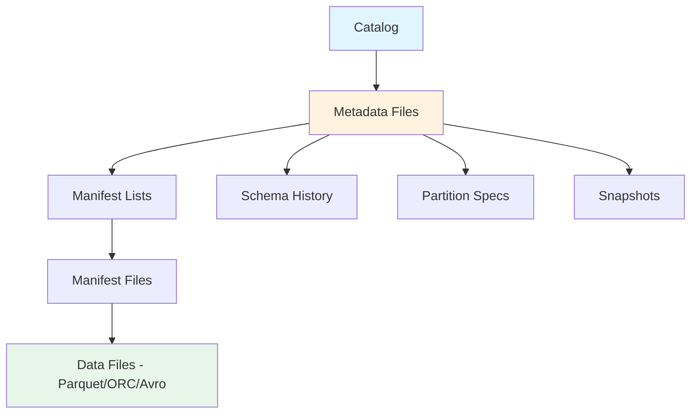
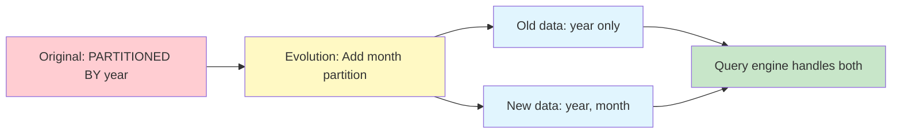

# How to Handle Apache Iceberg Tables

Author: [nawazdhandala](https://www.github.com/nawazdhandala)

Tags: Apache Iceberg, Data Lake, Data Engineering, Big Data, Table Format, Data Pipelines, Analytics

Description: Learn how to work with Apache Iceberg tables including schema evolution, time travel queries, partition management, and performance optimization for modern data lakes.

---

> Apache Iceberg has become the de facto standard for analytics table formats. Understanding how to properly handle Iceberg tables is essential for building reliable data pipelines that scale.

Apache Iceberg solves many problems that have plagued data lakes for years: schema evolution without breaking queries, time travel for auditing and recovery, and partition pruning that actually works. This guide walks you through practical techniques for working with Iceberg tables in production environments.

---

## Understanding Iceberg Architecture

Before diving into operations, let's understand how Iceberg organizes data:



Iceberg maintains metadata separately from data files, which enables many of its powerful features like atomic commits and time travel.

---

## Creating and Managing Iceberg Tables

### Basic Table Creation with Spark

```python
# create_iceberg_table.py
# This example uses PySpark to create an Iceberg table with partitioning

from pyspark.sql import SparkSession

# Initialize Spark with Iceberg support
# The catalog configuration tells Spark where to store Iceberg metadata
spark = SparkSession.builder \
    .appName("IcebergTableDemo") \
    .config("spark.sql.extensions", "org.apache.iceberg.spark.extensions.IcebergSparkSessionExtensions") \
    .config("spark.sql.catalog.iceberg_catalog", "org.apache.iceberg.spark.SparkCatalog") \
    .config("spark.sql.catalog.iceberg_catalog.type", "hadoop") \
    .config("spark.sql.catalog.iceberg_catalog.warehouse", "s3://my-bucket/warehouse") \
    .getOrCreate()

# Create a table with partitioning by date and region
# Partitioning is defined at creation time but can be evolved later
spark.sql("""
    CREATE TABLE iceberg_catalog.analytics.events (
        event_id STRING,
        user_id STRING,
        event_type STRING,
        event_data STRING,
        event_timestamp TIMESTAMP,
        region STRING
    )
    USING iceberg
    PARTITIONED BY (days(event_timestamp), region)
    TBLPROPERTIES (
        'write.format.default' = 'parquet',
        'write.parquet.compression-codec' = 'zstd'
    )
""")
```

### Table Properties for Production

```sql
-- Set important table properties for production workloads
-- These settings affect write performance and file organization

ALTER TABLE iceberg_catalog.analytics.events SET TBLPROPERTIES (
    -- Target file size of 512MB for optimal read performance
    'write.target-file-size-bytes' = '536870912',

    -- Enable automatic compaction during writes
    'write.spark.fanout.enabled' = 'true',

    -- Keep 10 snapshots for time travel (adjust based on needs)
    'history.expire.max-snapshot-age-ms' = '604800000',

    -- Enable row-level deletes for ACID operations
    'write.delete.mode' = 'merge-on-read',
    'write.update.mode' = 'merge-on-read'
);
```

---

## Schema Evolution Without Downtime

One of Iceberg's killer features is safe schema evolution. You can add, rename, or reorder columns without rewriting data.

### Adding Columns

```python
# schema_evolution.py
# Demonstrates safe schema changes that don't break existing queries

from pyspark.sql import SparkSession

spark = SparkSession.builder.getOrCreate()

# Add a new column - this is a metadata-only operation
# Existing data files are not touched
spark.sql("""
    ALTER TABLE iceberg_catalog.analytics.events
    ADD COLUMN device_type STRING AFTER event_data
""")

# Add a nested struct column for complex data
spark.sql("""
    ALTER TABLE iceberg_catalog.analytics.events
    ADD COLUMN location STRUCT<
        latitude: DOUBLE,
        longitude: DOUBLE,
        city: STRING
    >
""")

# Rename a column - also metadata-only
# Old queries using the old name will still work via column IDs
spark.sql("""
    ALTER TABLE iceberg_catalog.analytics.events
    RENAME COLUMN event_data TO event_payload
""")
```

### Handling Schema Conflicts

```python
# schema_conflict_handling.py
# How to merge data with different schemas safely

from pyspark.sql import SparkSession
from pyspark.sql.functions import lit, col

spark = SparkSession.builder.getOrCreate()

# Read data with an older schema
old_data = spark.read.parquet("s3://legacy-data/events/")

# Get the current table schema
current_schema = spark.table("iceberg_catalog.analytics.events").schema

# Add missing columns with null values
for field in current_schema.fields:
    if field.name not in old_data.columns:
        # Add the missing column with appropriate default
        old_data = old_data.withColumn(field.name, lit(None).cast(field.dataType))

# Reorder columns to match table schema
old_data = old_data.select([col(f.name) for f in current_schema.fields])

# Write to Iceberg - schema validation happens automatically
old_data.writeTo("iceberg_catalog.analytics.events").append()
```

---

## Time Travel Queries

Iceberg maintains snapshots of your table, letting you query historical states.

```python
# time_travel_queries.py
# Query historical data for auditing or recovery

from pyspark.sql import SparkSession
from datetime import datetime, timedelta

spark = SparkSession.builder.getOrCreate()

# Query data as it existed at a specific timestamp
# Useful for auditing and comparing changes
yesterday = (datetime.now() - timedelta(days=1)).strftime("%Y-%m-%d %H:%M:%S")

historical_data = spark.read \
    .option("as-of-timestamp", yesterday) \
    .table("iceberg_catalog.analytics.events")

print(f"Row count yesterday: {historical_data.count()}")

# Query a specific snapshot by ID
# First, list available snapshots
snapshots = spark.sql("""
    SELECT snapshot_id, committed_at, operation
    FROM iceberg_catalog.analytics.events.snapshots
    ORDER BY committed_at DESC
    LIMIT 10
""")
snapshots.show()

# Query a specific snapshot
snapshot_id = 1234567890123456789  # Replace with actual snapshot ID
snapshot_data = spark.read \
    .option("snapshot-id", snapshot_id) \
    .table("iceberg_catalog.analytics.events")

# Compare current vs historical for debugging
spark.sql("""
    SELECT
        'current' as version,
        COUNT(*) as row_count,
        COUNT(DISTINCT user_id) as unique_users
    FROM iceberg_catalog.analytics.events

    UNION ALL

    SELECT
        'historical' as version,
        COUNT(*) as row_count,
        COUNT(DISTINCT user_id) as unique_users
    FROM iceberg_catalog.analytics.events
    VERSION AS OF 1234567890123456789
""").show()
```

---

## Partition Evolution

Unlike Hive tables, Iceberg lets you change partitioning without rewriting data.



```python
# partition_evolution.py
# Change partitioning strategy without data rewrite

from pyspark.sql import SparkSession

spark = SparkSession.builder.getOrCreate()

# View current partition spec
spark.sql("""
    SELECT * FROM iceberg_catalog.analytics.events.partitions
""").show()

# Add a new partition field - new data will use both
# Old data remains accessible with the old partition scheme
spark.sql("""
    ALTER TABLE iceberg_catalog.analytics.events
    ADD PARTITION FIELD bucket(16, user_id)
""")

# Replace the partition scheme entirely
# This affects only new writes, not existing data
spark.sql("""
    ALTER TABLE iceberg_catalog.analytics.events
    REPLACE PARTITION FIELD days(event_timestamp)
    WITH hours(event_timestamp)
""")
```

---

## Table Maintenance Operations

Regular maintenance keeps Iceberg tables performant.

### Compaction

```python
# table_maintenance.py
# Essential maintenance operations for Iceberg tables

from pyspark.sql import SparkSession

spark = SparkSession.builder.getOrCreate()

# Compact small files into larger ones
# This improves read performance significantly
spark.sql("""
    CALL iceberg_catalog.system.rewrite_data_files(
        table => 'analytics.events',
        strategy => 'binpack',
        options => map(
            'min-file-size-bytes', '104857600',
            'max-file-size-bytes', '536870912',
            'target-file-size-bytes', '268435456'
        )
    )
""")

# Remove old snapshots to reclaim storage
# Be careful - this removes time travel history
spark.sql("""
    CALL iceberg_catalog.system.expire_snapshots(
        table => 'analytics.events',
        older_than => TIMESTAMP '2026-01-01 00:00:00',
        retain_last => 5
    )
""")

# Remove orphan files that are no longer referenced
# These can accumulate from failed writes
spark.sql("""
    CALL iceberg_catalog.system.remove_orphan_files(
        table => 'analytics.events',
        older_than => TIMESTAMP '2026-01-20 00:00:00'
    )
""")

# Rewrite manifests to improve planning time
spark.sql("""
    CALL iceberg_catalog.system.rewrite_manifests(
        table => 'analytics.events'
    )
""")
```

### Monitoring Table Health

```python
# table_health_check.py
# Monitor Iceberg table metrics for proactive maintenance

from pyspark.sql import SparkSession

spark = SparkSession.builder.getOrCreate()

# Check file distribution
file_stats = spark.sql("""
    SELECT
        COUNT(*) as total_files,
        SUM(file_size_in_bytes) / 1024 / 1024 / 1024 as total_size_gb,
        AVG(file_size_in_bytes) / 1024 / 1024 as avg_file_size_mb,
        MIN(file_size_in_bytes) / 1024 / 1024 as min_file_size_mb,
        MAX(file_size_in_bytes) / 1024 / 1024 as max_file_size_mb
    FROM iceberg_catalog.analytics.events.files
""")
file_stats.show()

# Check for small files that need compaction
small_files = spark.sql("""
    SELECT COUNT(*) as small_file_count
    FROM iceberg_catalog.analytics.events.files
    WHERE file_size_in_bytes < 104857600  -- Less than 100MB
""")
small_files.show()

# Monitor snapshot growth
snapshot_history = spark.sql("""
    SELECT
        DATE(committed_at) as commit_date,
        COUNT(*) as snapshots,
        SUM(added_data_files_count) as files_added,
        SUM(added_rows_count) as rows_added
    FROM iceberg_catalog.analytics.events.snapshots
    GROUP BY DATE(committed_at)
    ORDER BY commit_date DESC
    LIMIT 30
""")
snapshot_history.show()
```

---

## Best Practices

1. **Choose partition columns wisely**: Pick columns with moderate cardinality that align with query patterns. Too many partitions hurt performance.

2. **Set appropriate file sizes**: Target 256MB to 512MB files for most workloads. Smaller files increase metadata overhead.

3. **Schedule regular maintenance**: Run compaction and snapshot expiration as scheduled jobs, not ad-hoc operations.

4. **Use merge-on-read for frequent updates**: If you have many updates or deletes, merge-on-read mode reduces write amplification.

5. **Monitor metadata size**: Large manifests slow down query planning. Keep an eye on manifest counts and sizes.

6. **Test schema changes in staging**: Even though Iceberg handles schema evolution gracefully, test changes before applying to production.

---

## Conclusion

Apache Iceberg brings database-like reliability to data lakes. By understanding its architecture and following these patterns for schema evolution, partitioning, and maintenance, you can build data pipelines that are both performant and maintainable. The key is treating Iceberg tables as living assets that need regular care, not just static storage.
