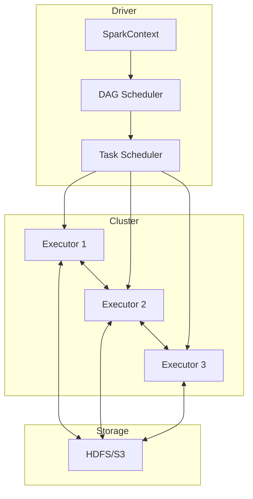
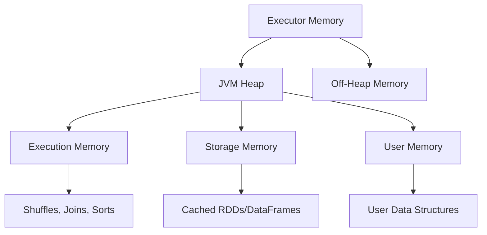

# How to Handle Apache Spark Job Optimization

Author: [nawazdhandala](https://www.github.com/nawazdhandala)

Tags: Apache Spark, Big Data, Performance, Optimization, Data Engineering, Distributed Computing

Description: A comprehensive guide to optimizing Apache Spark jobs including partitioning strategies, memory tuning, shuffle optimization, and common performance anti-patterns.

---

Apache Spark jobs can process massive datasets efficiently, but poorly optimized jobs waste resources and take hours instead of minutes. This guide covers practical techniques to optimize your Spark jobs for better performance and lower costs.

## Understanding Spark Execution

Before optimizing, you need to understand how Spark executes jobs.



### Key Concepts

- **Jobs** are triggered by actions (collect, save, count)
- **Stages** are separated by shuffle operations
- **Tasks** run on individual partitions within a stage

## Partitioning Optimization

Partitioning is the most important factor for Spark performance.

### Check Current Partitioning

```python
# Check number of partitions
df = spark.read.parquet("s3://bucket/data/")
print(f"Number of partitions: {df.rdd.getNumPartitions()}")

# Check partition sizes
def get_partition_sizes(df):
    """Get the size of each partition in bytes."""
    return df.rdd.mapPartitions(
        lambda partition: [sum(len(str(row)) for row in partition)]
    ).collect()

sizes = get_partition_sizes(df)
print(f"Partition sizes: min={min(sizes)}, max={max(sizes)}, avg={sum(sizes)/len(sizes)}")
```

### Right-Size Partitions

Target 128MB to 256MB per partition for optimal performance.

```python
# Calculate optimal partition count
def calculate_optimal_partitions(df, target_size_mb=200):
    """Calculate optimal number of partitions based on data size."""
    # Get total size in bytes
    total_size = df.rdd.map(lambda row: len(str(row))).sum()

    # Calculate optimal partitions
    target_size_bytes = target_size_mb * 1024 * 1024
    optimal_partitions = max(1, int(total_size / target_size_bytes))

    return optimal_partitions

# Repartition to optimal size
optimal = calculate_optimal_partitions(df)
df_optimized = df.repartition(optimal)
```

### Use Partitioning for Filters

```python
# Write data with partitioning for common filter columns
df.write.partitionBy("date", "region").parquet("s3://bucket/partitioned_data/")

# Spark will skip irrelevant partitions when filtering
df_filtered = spark.read.parquet("s3://bucket/partitioned_data/") \
    .filter("date = '2026-01-24' AND region = 'us-east'")
```

### Avoid Skewed Partitions

```python
# Detect skew by checking partition sizes
from pyspark.sql.functions import spark_partition_id, count

# Check row distribution across partitions
df.withColumn("partition", spark_partition_id()) \
    .groupBy("partition") \
    .agg(count("*").alias("count")) \
    .orderBy("count", ascending=False) \
    .show()

# Fix skew with salting
from pyspark.sql.functions import concat, lit, rand, floor

def salt_dataframe(df, num_salts=10):
    """Add salt column to distribute skewed keys."""
    return df.withColumn("salt", floor(rand() * num_salts).cast("int"))

# Salt before join
df_salted = salt_dataframe(df_large, num_salts=10)
df_small_exploded = df_small.crossJoin(
    spark.range(10).withColumnRenamed("id", "salt")
)

# Join on salted key
result = df_salted.join(df_small_exploded, ["key", "salt"])
```

## Memory Optimization

### Configure Memory Settings

```python
# Optimal memory configuration
spark = SparkSession.builder \
    .appName("OptimizedJob") \
    .config("spark.executor.memory", "8g") \
    .config("spark.executor.memoryOverhead", "2g") \
    .config("spark.memory.fraction", "0.8") \
    .config("spark.memory.storageFraction", "0.3") \
    .config("spark.sql.shuffle.partitions", "200") \
    .getOrCreate()
```

### Memory Architecture



### Cache Strategically

```python
# Cache only when data is reused multiple times
df = spark.read.parquet("s3://bucket/data/")

# Good: Data is used multiple times
df_filtered = df.filter("status = 'active'")
df_filtered.cache()  # Cache the filtered result

count = df_filtered.count()  # First use
summary = df_filtered.groupBy("category").count()  # Second use
df_filtered.write.parquet("output/")  # Third use

df_filtered.unpersist()  # Release memory when done

# Bad: Caching data used only once (wastes memory)
# df.cache()
# df.write.parquet("output/")  # Only one use, no benefit from cache
```

### Choose the Right Storage Level

```python
from pyspark import StorageLevel

# MEMORY_ONLY - fastest, but may cause OOM
df.persist(StorageLevel.MEMORY_ONLY)

# MEMORY_AND_DISK - spills to disk if needed
df.persist(StorageLevel.MEMORY_AND_DISK)

# MEMORY_ONLY_SER - serialized, uses less memory but more CPU
df.persist(StorageLevel.MEMORY_ONLY_SER)

# For large datasets, serialized with disk spillover
df.persist(StorageLevel.MEMORY_AND_DISK_SER)
```

## Shuffle Optimization

Shuffles are expensive because they move data between executors.

### Reduce Shuffle Data

```python
# Bad: Shuffles entire dataset
df.groupBy("key").agg(sum("value"))

# Better: Filter before grouping
df.filter("date > '2026-01-01'") \
    .groupBy("key") \
    .agg(sum("value"))

# Use aggregations that can be partially computed locally
from pyspark.sql.functions import sum, count, avg

# These are shuffle-efficient (partial aggregation)
df.groupBy("key").agg(
    sum("value"),      # Can partially sum locally
    count("*"),        # Can partially count locally
    avg("value")       # Uses sum and count internally
)
```

### Broadcast Small Tables

```python
from pyspark.sql.functions import broadcast

# Bad: Shuffle join (both tables shuffled)
result = large_df.join(small_df, "key")

# Good: Broadcast join (small table sent to all executors)
result = large_df.join(broadcast(small_df), "key")

# Configure auto-broadcast threshold
spark.conf.set("spark.sql.autoBroadcastJoinThreshold", "100m")  # 100MB
```

### Optimize Join Order

```python
# Join larger tables first, then smaller ones
# Spark optimizer usually handles this, but explicit ordering helps

# Explicitly order joins for complex queries
result = (
    largest_table
    .join(broadcast(small_lookup), "key1")
    .join(medium_table, "key2")
    .join(broadcast(another_small_lookup), "key3")
)
```

## Query Optimization

### Use Predicate Pushdown

```python
# Good: Filter pushed to data source
df = spark.read.parquet("s3://bucket/data/") \
    .filter("date = '2026-01-24'")

# Verify pushdown is happening
df.explain(True)  # Look for "PushedFilters" in the plan
```

### Avoid UDFs When Possible

```python
from pyspark.sql.functions import udf, col, when, upper

# Bad: Python UDF (slow, breaks optimization)
@udf("string")
def process_name_udf(name):
    return name.upper() if name else "UNKNOWN"

df.withColumn("processed", process_name_udf(col("name")))

# Good: Use built-in functions (fast, optimized)
df.withColumn("processed",
    when(col("name").isNotNull(), upper(col("name")))
    .otherwise("UNKNOWN")
)
```

### Column Pruning

```python
# Bad: Select all columns, then filter
df = spark.read.parquet("s3://bucket/data/")
result = df.filter("status = 'active'").select("id", "name")

# Good: Select only needed columns early
df = spark.read.parquet("s3://bucket/data/").select("id", "name", "status")
result = df.filter("status = 'active'").select("id", "name")
```

## Monitoring and Profiling

### Enable Spark UI Metrics

```python
# Configure for detailed metrics
spark.conf.set("spark.sql.adaptive.enabled", "true")
spark.conf.set("spark.sql.adaptive.coalescePartitions.enabled", "true")
spark.conf.set("spark.eventLog.enabled", "true")
spark.conf.set("spark.eventLog.dir", "s3://bucket/spark-logs/")
```

### Analyze Query Plans

```python
# Check execution plan
df.explain()        # Simple plan
df.explain(True)    # Extended plan with all details

# Look for these warning signs:
# - BroadcastNestedLoopJoin (very slow for large data)
# - CartesianProduct (explodes data size)
# - Exchange (indicates shuffle)
# - Filter after shuffle (should be before)
```

### Profile Job Performance

```python
# Add timing to critical sections
import time

class SparkJobProfiler:
    def __init__(self):
        self.timings = {}

    def time_operation(self, name):
        """Context manager for timing operations."""
        class Timer:
            def __init__(self, profiler, name):
                self.profiler = profiler
                self.name = name

            def __enter__(self):
                self.start = time.time()
                return self

            def __exit__(self, *args):
                elapsed = time.time() - self.start
                self.profiler.timings[self.name] = elapsed
                print(f"{self.name}: {elapsed:.2f}s")

        return Timer(self, name)

    def report(self):
        """Print timing report."""
        total = sum(self.timings.values())
        print("\n=== Performance Report ===")
        for name, duration in sorted(self.timings.items(), key=lambda x: -x[1]):
            pct = (duration / total) * 100
            print(f"{name}: {duration:.2f}s ({pct:.1f}%)")
        print(f"Total: {total:.2f}s")

# Usage
profiler = SparkJobProfiler()

with profiler.time_operation("read_data"):
    df = spark.read.parquet("input/")

with profiler.time_operation("transform"):
    df_transformed = df.groupBy("key").agg(sum("value"))

with profiler.time_operation("write_data"):
    df_transformed.write.parquet("output/")

profiler.report()
```

## Configuration Checklist

```python
# Production-ready Spark configuration
spark = SparkSession.builder \
    .appName("OptimizedProduction") \
    .config("spark.sql.adaptive.enabled", "true") \
    .config("spark.sql.adaptive.coalescePartitions.enabled", "true") \
    .config("spark.sql.adaptive.skewJoin.enabled", "true") \
    .config("spark.serializer", "org.apache.spark.serializer.KryoSerializer") \
    .config("spark.sql.shuffle.partitions", "auto") \
    .config("spark.default.parallelism", "200") \
    .config("spark.sql.files.maxPartitionBytes", "268435456") \
    .config("spark.sql.broadcastTimeout", "600") \
    .getOrCreate()
```

## Performance Anti-Patterns to Avoid

1. **Collecting large datasets to the driver** - Use `take()` or `show()` instead of `collect()`
2. **Using groupByKey instead of reduceByKey** - reduceByKey combines locally first
3. **Caching everything** - Only cache data that is reused
4. **Too many small files** - Compact small files before processing
5. **Wide transformations early in the pipeline** - Filter and select first
6. **Ignoring data skew** - Monitor partition sizes and use salting

---

Spark optimization is about reducing data movement (shuffles), using memory efficiently, and leveraging Spark's built-in optimizations. Start with proper partitioning, use broadcast joins for small tables, and always check your execution plans. The Spark UI is your best friend for identifying bottlenecks.
