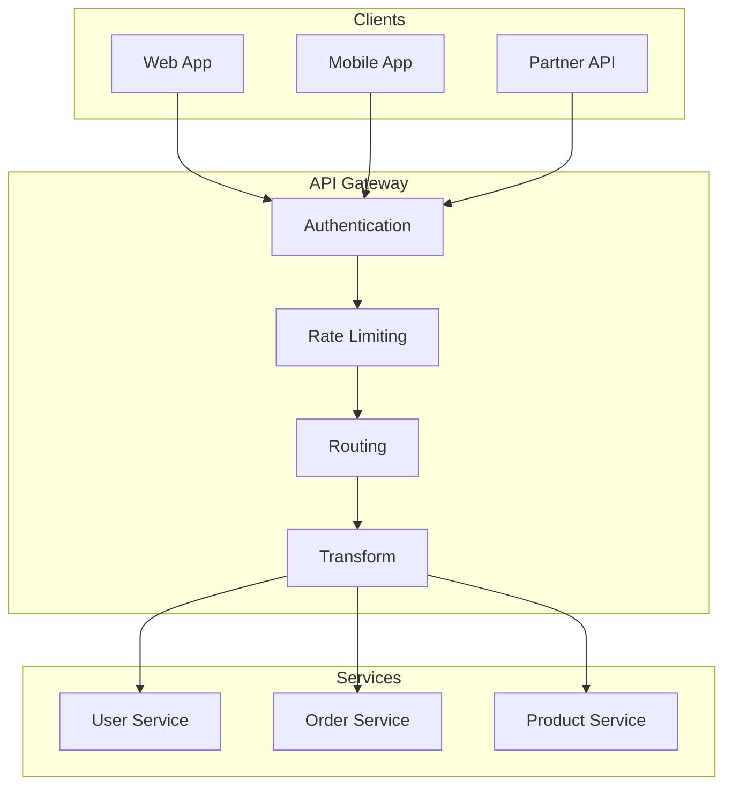
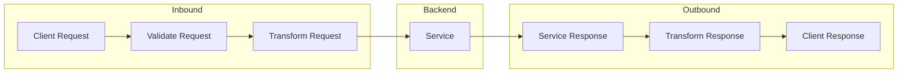

# How to Handle API Gateway Configuration

Author: [nawazdhandala](https://www.github.com/nawazdhandala)

Tags: API Gateway, Microservices, Kong, NGINX, AWS API Gateway, Rate Limiting, Authentication, Routing

Description: Learn how to configure API gateways effectively, including routing, rate limiting, authentication, and common troubleshooting patterns.

---

An API gateway is the entry point for all client requests to your microservices. Proper configuration is critical for security, performance, and reliability. This guide covers common configuration patterns and troubleshooting approaches.

## API Gateway Architecture



## Kong Gateway Configuration

Kong is a popular open-source API gateway. Here is how to configure it properly.

### Basic Service and Route Configuration

```yaml
# kong.yaml - Declarative configuration
_format_version: "3.0"
_transform: true

services:
  - name: user-service
    url: http://user-service:8080
    connect_timeout: 5000
    read_timeout: 30000
    write_timeout: 30000
    retries: 3
    routes:
      - name: user-routes
        paths:
          - /api/v1/users
        methods:
          - GET
          - POST
          - PUT
          - DELETE
        strip_path: false
        preserve_host: true

  - name: order-service
    url: http://order-service:8080
    connect_timeout: 5000
    read_timeout: 60000
    write_timeout: 60000
    retries: 2
    routes:
      - name: order-routes
        paths:
          - /api/v1/orders
        methods:
          - GET
          - POST
          - PUT
        strip_path: false

  - name: product-service
    url: http://product-service:8080
    routes:
      - name: product-routes
        paths:
          - /api/v1/products
        methods:
          - GET
```

### Rate Limiting Configuration

```yaml
# Kong rate limiting plugin configuration
plugins:
  # Global rate limiting
  - name: rate-limiting
    config:
      minute: 100
      hour: 1000
      policy: redis
      redis_host: redis
      redis_port: 6379
      redis_database: 0
      fault_tolerant: true
      hide_client_headers: false

  # Per-service rate limiting
  - name: rate-limiting
    service: order-service
    config:
      minute: 30
      hour: 500
      policy: redis
      redis_host: redis
      redis_port: 6379

  # Per-consumer rate limiting (premium tier)
  - name: rate-limiting
    consumer: premium-partner
    config:
      minute: 1000
      hour: 50000
      policy: redis
      redis_host: redis
      redis_port: 6379
```

### Authentication Configuration

```yaml
# JWT authentication plugin
plugins:
  - name: jwt
    service: user-service
    config:
      key_claim_name: iss
      secret_is_base64: false
      claims_to_verify:
        - exp

# API Key authentication for partners
  - name: key-auth
    service: partner-api
    config:
      key_names:
        - X-API-Key
        - apikey
      key_in_header: true
      key_in_query: true
      key_in_body: false
      hide_credentials: true

# OAuth 2.0 configuration
  - name: oauth2
    service: user-service
    config:
      scopes:
        - read
        - write
        - admin
      mandatory_scope: true
      token_expiration: 7200
      enable_authorization_code: true
      enable_client_credentials: true
```

## NGINX API Gateway Configuration

NGINX can serve as a lightweight API gateway with proper configuration.

### Basic Routing Configuration

```nginx
# nginx.conf - API Gateway configuration

upstream user_service {
    zone user_service 64k;
    server user-service-1:8080 weight=5;
    server user-service-2:8080 weight=5;
    keepalive 32;
}

upstream order_service {
    zone order_service 64k;
    server order-service-1:8080;
    server order-service-2:8080;
    keepalive 32;
}

# Rate limiting zones
limit_req_zone $binary_remote_addr zone=api_limit:10m rate=10r/s;
limit_req_zone $http_x_api_key zone=partner_limit:10m rate=100r/s;

# Connection limiting
limit_conn_zone $binary_remote_addr zone=conn_limit:10m;

server {
    listen 80;
    server_name api.example.com;

    # Global rate limiting
    limit_req zone=api_limit burst=20 nodelay;
    limit_conn conn_limit 10;

    # Health check endpoint
    location /health {
        access_log off;
        return 200 "OK\n";
        add_header Content-Type text/plain;
    }

    # User service routes
    location /api/v1/users {
        # Authentication check
        auth_request /auth/validate;
        auth_request_set $auth_status $upstream_status;

        # Proxy settings
        proxy_pass http://user_service;
        proxy_http_version 1.1;
        proxy_set_header Host $host;
        proxy_set_header X-Real-IP $remote_addr;
        proxy_set_header X-Forwarded-For $proxy_add_x_forwarded_for;
        proxy_set_header X-Forwarded-Proto $scheme;
        proxy_set_header Connection "";

        # Timeouts
        proxy_connect_timeout 5s;
        proxy_read_timeout 30s;
        proxy_send_timeout 30s;

        # Error handling
        proxy_intercept_errors on;
        error_page 502 503 504 /errors/service_unavailable.json;
    }

    # Order service routes with different rate limit
    location /api/v1/orders {
        limit_req zone=api_limit burst=10 nodelay;

        auth_request /auth/validate;

        proxy_pass http://order_service;
        proxy_http_version 1.1;
        proxy_set_header Host $host;
        proxy_set_header X-Real-IP $remote_addr;
        proxy_set_header X-Forwarded-For $proxy_add_x_forwarded_for;
        proxy_set_header Connection "";

        proxy_connect_timeout 5s;
        proxy_read_timeout 60s;
        proxy_send_timeout 30s;
    }

    # Internal authentication endpoint
    location = /auth/validate {
        internal;
        proxy_pass http://auth-service:8080/validate;
        proxy_pass_request_body off;
        proxy_set_header Content-Length "";
        proxy_set_header X-Original-URI $request_uri;
        proxy_set_header X-Original-Method $request_method;
    }

    # Error responses
    location /errors {
        internal;
        alias /etc/nginx/errors;
    }
}
```

### NGINX Error Response Files

```json
// /etc/nginx/errors/service_unavailable.json
{
  "error": {
    "code": "SERVICE_UNAVAILABLE",
    "message": "The service is temporarily unavailable. Please try again later.",
    "status": 503
  }
}
```

## AWS API Gateway Configuration

### OpenAPI Specification with AWS Extensions

```yaml
openapi: "3.0.1"
info:
  title: "User Service API"
  version: "1.0.0"

x-amazon-apigateway-request-validators:
  all:
    validateRequestBody: true
    validateRequestParameters: true
  params-only:
    validateRequestBody: false
    validateRequestParameters: true

paths:
  /users:
    get:
      summary: List users
      x-amazon-apigateway-request-validator: params-only
      x-amazon-apigateway-integration:
        type: http_proxy
        httpMethod: GET
        uri: http://user-service.internal/users
        connectionType: VPC_LINK
        connectionId: ${vpc_link_id}
        requestParameters:
          integration.request.header.X-Request-Id: context.requestId
        responses:
          default:
            statusCode: "200"
      parameters:
        - name: limit
          in: query
          required: false
          schema:
            type: integer
            minimum: 1
            maximum: 100
            default: 20
        - name: offset
          in: query
          required: false
          schema:
            type: integer
            minimum: 0
            default: 0
      responses:
        "200":
          description: Successful response
          content:
            application/json:
              schema:
                $ref: "#/components/schemas/UserList"

    post:
      summary: Create user
      x-amazon-apigateway-request-validator: all
      x-amazon-apigateway-integration:
        type: http_proxy
        httpMethod: POST
        uri: http://user-service.internal/users
        connectionType: VPC_LINK
        connectionId: ${vpc_link_id}
      requestBody:
        required: true
        content:
          application/json:
            schema:
              $ref: "#/components/schemas/CreateUserRequest"
      responses:
        "201":
          description: User created

  /users/{userId}:
    get:
      summary: Get user by ID
      x-amazon-apigateway-integration:
        type: http_proxy
        httpMethod: GET
        uri: http://user-service.internal/users/{userId}
        connectionType: VPC_LINK
        connectionId: ${vpc_link_id}
        requestParameters:
          integration.request.path.userId: method.request.path.userId
      parameters:
        - name: userId
          in: path
          required: true
          schema:
            type: string
            format: uuid
      responses:
        "200":
          description: Successful response

components:
  schemas:
    UserList:
      type: object
      properties:
        users:
          type: array
          items:
            $ref: "#/components/schemas/User"
        total:
          type: integer
        limit:
          type: integer
        offset:
          type: integer

    User:
      type: object
      properties:
        id:
          type: string
          format: uuid
        email:
          type: string
          format: email
        name:
          type: string
        createdAt:
          type: string
          format: date-time

    CreateUserRequest:
      type: object
      required:
        - email
        - name
      properties:
        email:
          type: string
          format: email
        name:
          type: string
          minLength: 1
          maxLength: 100
```

### Terraform Configuration for AWS API Gateway

```hcl
# api_gateway.tf

resource "aws_api_gateway_rest_api" "main" {
  name        = "user-service-api"
  description = "User Service API Gateway"

  endpoint_configuration {
    types = ["REGIONAL"]
  }

  body = file("openapi.yaml")
}

resource "aws_api_gateway_deployment" "main" {
  rest_api_id = aws_api_gateway_rest_api.main.id

  triggers = {
    redeployment = sha1(jsonencode(aws_api_gateway_rest_api.main.body))
  }

  lifecycle {
    create_before_destroy = true
  }
}

resource "aws_api_gateway_stage" "production" {
  deployment_id = aws_api_gateway_deployment.main.id
  rest_api_id   = aws_api_gateway_rest_api.main.id
  stage_name    = "production"

  access_log_settings {
    destination_arn = aws_cloudwatch_log_group.api_gateway.arn
    format = jsonencode({
      requestId         = "$context.requestId"
      ip                = "$context.identity.sourceIp"
      caller            = "$context.identity.caller"
      user              = "$context.identity.user"
      requestTime       = "$context.requestTime"
      httpMethod        = "$context.httpMethod"
      resourcePath      = "$context.resourcePath"
      status            = "$context.status"
      protocol          = "$context.protocol"
      responseLength    = "$context.responseLength"
      integrationLatency = "$context.integrationLatency"
      responseLatency   = "$context.responseLatency"
    })
  }

  xray_tracing_enabled = true
}

# Rate limiting with usage plan
resource "aws_api_gateway_usage_plan" "standard" {
  name        = "standard-plan"
  description = "Standard usage plan with rate limiting"

  api_stages {
    api_id = aws_api_gateway_rest_api.main.id
    stage  = aws_api_gateway_stage.production.stage_name
  }

  quota_settings {
    limit  = 10000
    period = "DAY"
  }

  throttle_settings {
    burst_limit = 100
    rate_limit  = 50
  }
}

resource "aws_api_gateway_usage_plan" "premium" {
  name        = "premium-plan"
  description = "Premium usage plan with higher limits"

  api_stages {
    api_id = aws_api_gateway_rest_api.main.id
    stage  = aws_api_gateway_stage.production.stage_name
  }

  quota_settings {
    limit  = 100000
    period = "DAY"
  }

  throttle_settings {
    burst_limit = 500
    rate_limit  = 200
  }
}

# VPC Link for private integration
resource "aws_api_gateway_vpc_link" "main" {
  name        = "user-service-vpc-link"
  target_arns = [aws_lb.internal.arn]
}

# CloudWatch Log Group
resource "aws_cloudwatch_log_group" "api_gateway" {
  name              = "/aws/api-gateway/user-service"
  retention_in_days = 30
}
```

## Request and Response Transformation



### Kong Request Transformation

```yaml
plugins:
  - name: request-transformer
    service: user-service
    config:
      add:
        headers:
          - X-Request-ID:$(uuid)
          - X-Forwarded-Service:user-service
        querystring:
          - version:v1
      remove:
        headers:
          - X-Internal-Token
      rename:
        headers:
          - Authorization:X-Auth-Token

  - name: response-transformer
    service: user-service
    config:
      remove:
        headers:
          - X-Powered-By
          - Server
      add:
        headers:
          - X-Response-Time:$(latency)
          - X-Gateway-Version:1.0
```

## Circuit Breaker Configuration

```yaml
# Kong circuit breaker using the circuit-breaker plugin
plugins:
  - name: circuit-breaker
    service: user-service
    config:
      # Open circuit after this many failures
      failure_count_threshold: 5
      # Check window in seconds
      failure_count_window: 60
      # Time to wait before trying again
      recovery_time: 30
      # HTTP status codes to count as failures
      upstream_codes_considered_failure:
        - 500
        - 502
        - 503
        - 504
```

## Health Check and Service Discovery

```yaml
# Kong upstream with health checks
upstreams:
  - name: user-service-upstream
    algorithm: round-robin
    hash_on: none
    healthchecks:
      active:
        https_verify_certificate: false
        http_path: /health
        timeout: 5
        healthy:
          interval: 5
          successes: 2
        unhealthy:
          interval: 5
          http_failures: 3
          tcp_failures: 3
          timeouts: 3
      passive:
        healthy:
          successes: 5
        unhealthy:
          http_failures: 5
          tcp_failures: 3
          timeouts: 3
    targets:
      - target: user-service-1:8080
        weight: 100
      - target: user-service-2:8080
        weight: 100
```

## Debugging API Gateway Issues

### Common Issues and Solutions

```bash
# Check Kong gateway status
curl -s http://localhost:8001/status | jq .

# View all configured services
curl -s http://localhost:8001/services | jq '.data[] | {name, host, port}'

# View all routes
curl -s http://localhost:8001/routes | jq '.data[] | {name, paths, service}'

# Check specific service health
curl -s http://localhost:8001/upstreams/user-service-upstream/health | jq .

# View plugin configuration
curl -s http://localhost:8001/plugins | jq '.data[] | {name, service, enabled}'

# Test request through gateway
curl -v -H "Authorization: Bearer $TOKEN" \
  http://api.example.com/api/v1/users

# Check rate limit headers
curl -I http://api.example.com/api/v1/users 2>&1 | grep -i "x-ratelimit"
```

### Logging Configuration for Debugging

```yaml
# Kong logging plugins
plugins:
  # File logging for debugging
  - name: file-log
    service: user-service
    config:
      path: /var/log/kong/user-service.log
      reopen: true

  # HTTP logging to external service
  - name: http-log
    config:
      http_endpoint: http://log-collector:8080/logs
      method: POST
      timeout: 1000
      keepalive: 60000
      flush_timeout: 2
      retry_count: 10
      content_type: application/json
      custom_fields_by_lua:
        service_name: "return kong.router.get_service().name"
```

## Best Practices Summary

1. Use declarative configuration for version control and reproducibility
2. Implement rate limiting at multiple levels (global, per-service, per-consumer)
3. Configure appropriate timeouts for each backend service
4. Use health checks to automatically remove unhealthy backends
5. Implement circuit breakers to prevent cascading failures
6. Log all requests for debugging and audit purposes
7. Use request validation to reject malformed requests early
8. Remove sensitive headers from responses
9. Enable tracing for distributed debugging
10. Test gateway configuration changes in staging before production

A well-configured API gateway is essential for a secure and reliable microservices architecture. Take time to understand your gateway's capabilities and configure them appropriately for your use case.
