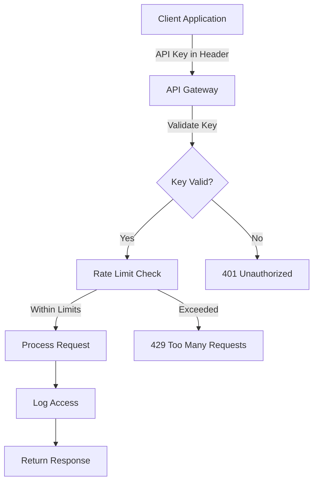
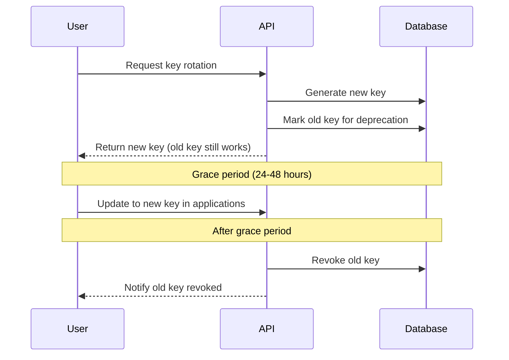

# How to Handle API Key Management

Author: [nawazdhandala](https://github.com/nawazdhandala)

Tags: Security, API, DevOps, Authentication, Best Practices

Description: A comprehensive guide to secure API key management including generation, storage, rotation, and revocation strategies for production applications.

---

API keys are the gatekeepers of your application. A leaked or mishandled API key can lead to data breaches, unauthorized access, and significant financial damage. This guide covers the complete lifecycle of API key management with practical implementation strategies.

## Understanding API Key Security

API keys serve as simple authentication tokens that identify the calling application or user. Unlike passwords, API keys are often long-lived and transmitted with every request, making their security critical.



## Generating Secure API Keys

The first step is generating keys that are cryptographically secure and virtually impossible to guess or brute-force.

```javascript
const crypto = require('crypto');

// Generate a cryptographically secure API key
// Uses 32 bytes (256 bits) of random data encoded as base64
function generateApiKey() {
  // crypto.randomBytes is cryptographically secure
  const buffer = crypto.randomBytes(32);

  // Convert to URL-safe base64 (no + or / characters)
  return buffer.toString('base64url');
}

// Generate a key with a prefix for easy identification
// Prefix helps identify key type and source at a glance
function generatePrefixedApiKey(prefix = 'sk') {
  const key = generateApiKey();
  // Format: sk_live_abc123... or sk_test_abc123...
  return `${prefix}_${key}`;
}

// Example usage
const liveKey = generatePrefixedApiKey('sk_live');
const testKey = generatePrefixedApiKey('sk_test');

console.log(liveKey);  // sk_live_a7Bx9Kp2mN4rT6wY8zQ0...
console.log(testKey);  // sk_test_c3Df5Gh7Jk9Lm1Np3Qr...
```

### Key Format Best Practices

Structure your API keys to include useful metadata while maintaining security.

```javascript
// API Key structure with embedded metadata
// Format: prefix_version_randomdata_checksum

function generateStructuredApiKey(options = {}) {
  const {
    environment = 'live',  // live, test, sandbox
    version = 'v1',        // Key version for rotation tracking
    keyType = 'sk',        // sk = secret key, pk = public key
  } = options;

  // Generate random component (24 bytes = 32 chars in base64url)
  const randomPart = crypto.randomBytes(24).toString('base64url');

  // Create the key without checksum first
  const keyWithoutChecksum = `${keyType}_${environment}_${version}_${randomPart}`;

  // Generate a 4-character checksum for validation
  const checksum = crypto
    .createHash('sha256')
    .update(keyWithoutChecksum)
    .digest('base64url')
    .slice(0, 4);

  return `${keyWithoutChecksum}_${checksum}`;
}

// Validate key format and checksum before database lookup
function validateKeyFormat(apiKey) {
  const parts = apiKey.split('_');

  // Expected format: type_env_version_random_checksum
  if (parts.length !== 5) {
    return { valid: false, error: 'Invalid key format' };
  }

  const [keyType, environment, version, randomPart, providedChecksum] = parts;

  // Validate key type
  if (!['sk', 'pk'].includes(keyType)) {
    return { valid: false, error: 'Invalid key type' };
  }

  // Validate environment
  if (!['live', 'test', 'sandbox'].includes(environment)) {
    return { valid: false, error: 'Invalid environment' };
  }

  // Verify checksum
  const keyWithoutChecksum = `${keyType}_${environment}_${version}_${randomPart}`;
  const expectedChecksum = crypto
    .createHash('sha256')
    .update(keyWithoutChecksum)
    .digest('base64url')
    .slice(0, 4);

  if (providedChecksum !== expectedChecksum) {
    return { valid: false, error: 'Invalid checksum' };
  }

  return {
    valid: true,
    keyType,
    environment,
    version,
    isTestKey: environment !== 'live'
  };
}
```

## Secure Storage of API Keys

Never store API keys in plain text. Hash them before storage, similar to passwords.

```javascript
const bcrypt = require('bcrypt');
const crypto = require('crypto');

// Store only a hash of the API key in the database
// The full key is shown to the user only once at creation time

async function createApiKeyRecord(userId, keyName) {
  // Generate the actual API key
  const apiKey = generateStructuredApiKey({ environment: 'live' });

  // Create a hash for secure storage
  // We use SHA-256 first (fast) for lookup, then bcrypt for security
  const keyHash = crypto
    .createHash('sha256')
    .update(apiKey)
    .digest('hex');

  // Store only the first 8 characters as a hint for user reference
  const keyHint = apiKey.slice(0, 8);

  // Create the database record
  const record = await ApiKey.create({
    userId,
    name: keyName,
    keyHash,           // Used for lookup and verification
    keyHint,           // Shown to user: "sk_live_..." for identification
    createdAt: new Date(),
    lastUsedAt: null,
    expiresAt: null,   // Optional expiration
    scopes: ['read'],  // Default permissions
    rateLimit: 1000,   // Requests per hour
  });

  // Return the full key only this one time
  // User must save it securely - we cannot retrieve it later
  return {
    id: record.id,
    apiKey,           // Full key - shown only once!
    hint: keyHint,
    message: 'Save this key securely. It will not be shown again.'
  };
}

// Verify an API key from a request
async function verifyApiKey(providedKey) {
  // First validate the format to avoid unnecessary database queries
  const formatCheck = validateKeyFormat(providedKey);
  if (!formatCheck.valid) {
    return { valid: false, error: formatCheck.error };
  }

  // Hash the provided key for database lookup
  const keyHash = crypto
    .createHash('sha256')
    .update(providedKey)
    .digest('hex');

  // Look up the key record
  const keyRecord = await ApiKey.findOne({ keyHash });

  if (!keyRecord) {
    return { valid: false, error: 'Invalid API key' };
  }

  // Check if key has expired
  if (keyRecord.expiresAt && keyRecord.expiresAt < new Date()) {
    return { valid: false, error: 'API key has expired' };
  }

  // Check if key is revoked
  if (keyRecord.revokedAt) {
    return { valid: false, error: 'API key has been revoked' };
  }

  // Update last used timestamp (async, don't wait)
  ApiKey.updateOne(
    { _id: keyRecord._id },
    { lastUsedAt: new Date() }
  ).catch(console.error);

  return {
    valid: true,
    userId: keyRecord.userId,
    scopes: keyRecord.scopes,
    rateLimit: keyRecord.rateLimit,
    isTestKey: formatCheck.isTestKey
  };
}
```

## API Key Authentication Middleware

Implement middleware that validates API keys on every request.

```javascript
// Middleware for API key authentication
async function apiKeyAuth(req, res, next) {
  // Check multiple locations for the API key
  const apiKey =
    req.headers['x-api-key'] ||           // Custom header (preferred)
    req.headers['authorization']?.replace('Bearer ', '') ||  // Auth header
    req.query.api_key;                     // Query parameter (not recommended)

  if (!apiKey) {
    return res.status(401).json({
      error: 'API key required',
      message: 'Provide API key in X-API-Key header'
    });
  }

  // Verify the key
  const verification = await verifyApiKey(apiKey);

  if (!verification.valid) {
    // Log failed attempts for security monitoring
    logSecurityEvent('API_KEY_INVALID', {
      ip: req.ip,
      keyHint: apiKey.slice(0, 8) + '...',
      error: verification.error
    });

    return res.status(401).json({
      error: 'Invalid API key',
      message: verification.error
    });
  }

  // Attach verification info to request for use in route handlers
  req.apiKey = verification;
  req.userId = verification.userId;

  // Log successful authentication
  logSecurityEvent('API_KEY_AUTHENTICATED', {
    userId: verification.userId,
    ip: req.ip,
    isTestKey: verification.isTestKey
  });

  next();
}

// Scope-based authorization middleware
function requireScopes(...requiredScopes) {
  return (req, res, next) => {
    const keyScopes = req.apiKey?.scopes || [];

    // Check if key has all required scopes
    const hasAllScopes = requiredScopes.every(
      scope => keyScopes.includes(scope) || keyScopes.includes('admin')
    );

    if (!hasAllScopes) {
      return res.status(403).json({
        error: 'Insufficient permissions',
        required: requiredScopes,
        provided: keyScopes
      });
    }

    next();
  };
}

// Usage in routes
app.get('/api/users', apiKeyAuth, requireScopes('users:read'), (req, res) => {
  // Handler has access to req.userId and req.apiKey
});

app.post('/api/users', apiKeyAuth, requireScopes('users:write'), (req, res) => {
  // Only keys with users:write scope can access this
});
```

## API Key Rotation Strategy

Regular key rotation limits the impact of leaked keys. Implement a grace period where both old and new keys work.



```javascript
// Rotate an API key with a grace period
async function rotateApiKey(keyId, userId, gracePeriodHours = 48) {
  // Find the existing key
  const existingKey = await ApiKey.findOne({ _id: keyId, userId });

  if (!existingKey) {
    throw new Error('API key not found');
  }

  // Generate the new key
  const newApiKey = generateStructuredApiKey({
    environment: existingKey.keyHint.includes('test') ? 'test' : 'live'
  });

  const newKeyHash = crypto
    .createHash('sha256')
    .update(newApiKey)
    .digest('hex');

  // Create the new key record
  const newKeyRecord = await ApiKey.create({
    userId,
    name: `${existingKey.name} (rotated)`,
    keyHash: newKeyHash,
    keyHint: newApiKey.slice(0, 8),
    scopes: existingKey.scopes,
    rateLimit: existingKey.rateLimit,
    previousKeyId: existingKey._id,  // Link to old key
  });

  // Mark the old key for deprecation after grace period
  const deprecationDate = new Date();
  deprecationDate.setHours(deprecationDate.getHours() + gracePeriodHours);

  await ApiKey.updateOne(
    { _id: existingKey._id },
    {
      deprecatedAt: new Date(),
      expiresAt: deprecationDate,
      replacedByKeyId: newKeyRecord._id
    }
  );

  // Schedule notification for when old key expires
  scheduleKeyExpirationNotification(existingKey._id, deprecationDate);

  return {
    newKey: {
      id: newKeyRecord._id,
      apiKey: newApiKey,
      hint: newApiKey.slice(0, 8)
    },
    oldKey: {
      id: existingKey._id,
      hint: existingKey.keyHint,
      expiresAt: deprecationDate
    },
    message: `New key created. Old key will expire in ${gracePeriodHours} hours.`
  };
}
```

## Rate Limiting by API Key

Implement per-key rate limiting to prevent abuse and ensure fair usage.

```javascript
const Redis = require('ioredis');
const redis = new Redis(process.env.REDIS_URL);

// Rate limiter using sliding window algorithm
async function checkRateLimit(keyHash, limit, windowSeconds = 3600) {
  const now = Date.now();
  const windowStart = now - (windowSeconds * 1000);
  const redisKey = `ratelimit:${keyHash}`;

  // Use Redis sorted set for sliding window
  const pipeline = redis.pipeline();

  // Remove old entries outside the window
  pipeline.zremrangebyscore(redisKey, 0, windowStart);

  // Count requests in current window
  pipeline.zcard(redisKey);

  // Add current request
  pipeline.zadd(redisKey, now, `${now}-${Math.random()}`);

  // Set expiration on the key
  pipeline.expire(redisKey, windowSeconds);

  const results = await pipeline.exec();
  const requestCount = results[1][1];

  return {
    allowed: requestCount < limit,
    current: requestCount,
    limit,
    remaining: Math.max(0, limit - requestCount),
    resetAt: new Date(now + windowSeconds * 1000)
  };
}

// Rate limiting middleware
async function rateLimitByApiKey(req, res, next) {
  const keyHash = crypto
    .createHash('sha256')
    .update(req.headers['x-api-key'] || '')
    .digest('hex');

  const limit = req.apiKey?.rateLimit || 100;  // Default 100 requests/hour

  const rateLimitResult = await checkRateLimit(keyHash, limit);

  // Set rate limit headers for client visibility
  res.set({
    'X-RateLimit-Limit': rateLimitResult.limit,
    'X-RateLimit-Remaining': rateLimitResult.remaining,
    'X-RateLimit-Reset': rateLimitResult.resetAt.toISOString()
  });

  if (!rateLimitResult.allowed) {
    return res.status(429).json({
      error: 'Rate limit exceeded',
      limit: rateLimitResult.limit,
      resetAt: rateLimitResult.resetAt
    });
  }

  next();
}
```

## Key Revocation and Audit Logging

Maintain a complete audit trail of all API key operations for security compliance.

```javascript
// Revoke an API key immediately
async function revokeApiKey(keyId, userId, reason) {
  const key = await ApiKey.findOneAndUpdate(
    { _id: keyId, userId },
    {
      revokedAt: new Date(),
      revocationReason: reason
    },
    { new: true }
  );

  if (!key) {
    throw new Error('API key not found');
  }

  // Log the revocation event
  await AuditLog.create({
    action: 'API_KEY_REVOKED',
    userId,
    keyId,
    keyHint: key.keyHint,
    reason,
    timestamp: new Date(),
    ip: getCurrentRequestIP()
  });

  // Optionally notify the user
  await sendNotification(userId, {
    type: 'API_KEY_REVOKED',
    message: `API key ${key.keyHint}... has been revoked`,
    reason
  });

  return { success: true, revokedKey: key.keyHint };
}

// Get audit history for API keys
async function getApiKeyAuditLog(userId, options = {}) {
  const { keyId, startDate, endDate, limit = 100 } = options;

  const query = { userId };

  if (keyId) query.keyId = keyId;
  if (startDate || endDate) {
    query.timestamp = {};
    if (startDate) query.timestamp.$gte = startDate;
    if (endDate) query.timestamp.$lte = endDate;
  }

  return AuditLog.find(query)
    .sort({ timestamp: -1 })
    .limit(limit);
}
```

## Security Best Practices Summary

| Practice | Description | Priority |
|----------|-------------|----------|
| Use cryptographic randomness | Generate keys with crypto.randomBytes | Critical |
| Hash before storage | Never store plain text keys | Critical |
| Implement key rotation | Support seamless key updates | High |
| Set expiration dates | Keys should not live forever | High |
| Scope-based permissions | Limit what each key can do | High |
| Rate limiting per key | Prevent abuse and DoS | High |
| Audit all operations | Log creation, usage, revocation | Medium |
| Key prefixes | Make keys identifiable at a glance | Medium |
| Grace periods for rotation | Allow time for updates | Medium |

## Environment-Specific Keys

Always separate test and production keys with clear visual indicators.

```javascript
// Ensure test keys cannot access production resources
function validateEnvironment(req, res, next) {
  const isTestKey = req.apiKey?.isTestKey;
  const isProduction = process.env.NODE_ENV === 'production';

  // Test keys in production environment should only access sandbox data
  if (isProduction && isTestKey) {
    req.sandboxMode = true;
    // Route to sandbox database/resources
  }

  next();
}
```

Proper API key management is foundational to application security. By implementing secure generation, hashed storage, rotation policies, and comprehensive audit logging, you create a robust system that protects both your application and your users from unauthorized access.
