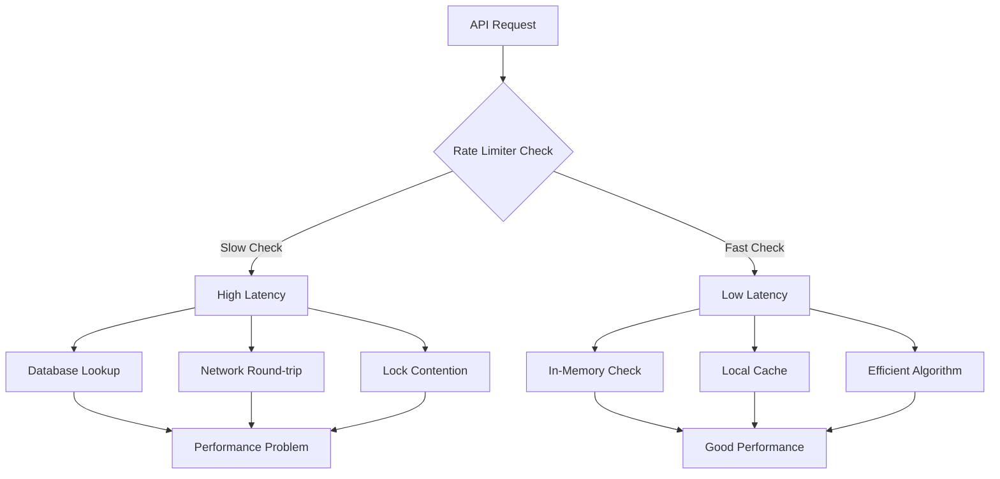

# How to Fix "API Rate Limiting" Performance

Author: [nawazdhandala](https://www.github.com/nawazdhandala)

Tags: API, Rate Limiting, Performance, Redis, Token Bucket, Sliding Window, Backend, Scalability

Description: Learn how to optimize API rate limiting for better performance, including algorithm selection, distributed implementations, and caching strategies.

---

> API rate limiting is essential for protecting your services, but poorly implemented rate limiting can become a performance bottleneck itself. This guide covers how to diagnose and fix rate limiting performance issues while maintaining protection.

When your rate limiting layer adds more than 5-10ms of latency per request, or consumes significant CPU resources, it is time to optimize. The goal is to protect your API without becoming the slowest part of your request pipeline.

---

## Understanding Rate Limiting Performance Issues



Common performance bottlenecks in rate limiting include:

| Issue | Symptom | Impact |
|-------|---------|--------|
| Database lookups per request | High latency, database load | 10-100ms added latency |
| Network round-trips to Redis | Latency spikes, network saturation | 1-10ms added latency |
| Lock contention | CPU spikes, request queuing | Thread blocking |
| Inefficient algorithms | Memory growth, CPU overhead | Resource exhaustion |
| No local caching | Redundant external calls | Wasted resources |

---

## Optimizing Token Bucket Implementation

The token bucket algorithm is efficient when implemented correctly. Here is an optimized version:

```python
# rate_limiter.py
# High-performance token bucket rate limiter

import time
import threading
from dataclasses import dataclass
from typing import Dict, Optional
import hashlib

@dataclass
class Bucket:
    """Token bucket state"""
    tokens: float
    last_update: float

class TokenBucketLimiter:
    """
    Thread-safe token bucket rate limiter with optimizations.

    Key optimizations:
    1. Lazy token refill (only calculate on access)
    2. Per-key locks instead of global lock
    3. Memory-efficient bucket cleanup
    """

    def __init__(
        self,
        rate: float,           # Tokens per second
        capacity: int,         # Maximum tokens (burst size)
        cleanup_interval: int = 60  # Seconds between cleanups
    ):
        self.rate = rate
        self.capacity = capacity
        self.cleanup_interval = cleanup_interval

        # Use dict with fine-grained locking
        self._buckets: Dict[str, Bucket] = {}
        self._locks: Dict[str, threading.Lock] = {}
        self._global_lock = threading.Lock()

        self._last_cleanup = time.time()

    def _get_lock(self, key: str) -> threading.Lock:
        """Get or create a lock for a specific key"""
        # Quick check without lock
        if key in self._locks:
            return self._locks[key]

        # Create lock if needed
        with self._global_lock:
            if key not in self._locks:
                self._locks[key] = threading.Lock()
            return self._locks[key]

    def _maybe_cleanup(self) -> None:
        """Remove stale buckets to prevent memory growth"""
        now = time.time()
        if now - self._last_cleanup < self.cleanup_interval:
            return

        with self._global_lock:
            if now - self._last_cleanup < self.cleanup_interval:
                return  # Double-check after acquiring lock

            # Find and remove stale buckets (no activity for 2x cleanup interval)
            stale_threshold = now - (self.cleanup_interval * 2)
            stale_keys = [
                key for key, bucket in self._buckets.items()
                if bucket.last_update < stale_threshold
            ]

            for key in stale_keys:
                del self._buckets[key]
                if key in self._locks:
                    del self._locks[key]

            self._last_cleanup = now

    def is_allowed(self, key: str, tokens: int = 1) -> bool:
        """
        Check if request is allowed and consume tokens.

        Returns True if allowed, False if rate limited.
        """
        self._maybe_cleanup()

        lock = self._get_lock(key)
        now = time.time()

        with lock:
            # Get or create bucket
            if key not in self._buckets:
                self._buckets[key] = Bucket(
                    tokens=self.capacity,
                    last_update=now
                )

            bucket = self._buckets[key]

            # Calculate tokens to add since last update (lazy refill)
            elapsed = now - bucket.last_update
            tokens_to_add = elapsed * self.rate

            # Update bucket state
            bucket.tokens = min(
                self.capacity,
                bucket.tokens + tokens_to_add
            )
            bucket.last_update = now

            # Check if enough tokens available
            if bucket.tokens >= tokens:
                bucket.tokens -= tokens
                return True

            return False

    def get_retry_after(self, key: str) -> Optional[float]:
        """Get seconds until next token is available"""
        lock = self._get_lock(key)

        with lock:
            if key not in self._buckets:
                return None

            bucket = self._buckets[key]
            if bucket.tokens >= 1:
                return None

            # Calculate time until 1 token is available
            tokens_needed = 1 - bucket.tokens
            return tokens_needed / self.rate


# Usage example
limiter = TokenBucketLimiter(
    rate=100,      # 100 requests per second
    capacity=200   # Allow burst of 200
)

def handle_request(client_ip: str) -> bool:
    if not limiter.is_allowed(client_ip):
        retry_after = limiter.get_retry_after(client_ip)
        return False  # Return 429 with Retry-After header
    return True  # Process request
```

---

## Distributed Rate Limiting with Redis

For distributed systems, Redis-based rate limiting needs optimization:

```python
# distributed_rate_limiter.py
# Optimized Redis-based rate limiter using Lua scripts

import redis
import time
from typing import Tuple

class RedisRateLimiter:
    """
    High-performance distributed rate limiter using Redis.

    Optimizations:
    1. Single Lua script for atomic operations (1 round-trip)
    2. Pipeline for batch operations
    3. Connection pooling
    4. TTL-based automatic cleanup
    """

    # Lua script for atomic sliding window rate limiting
    # Single round-trip to Redis for check + update
    SLIDING_WINDOW_SCRIPT = """
    local key = KEYS[1]
    local window_size = tonumber(ARGV[1])
    local max_requests = tonumber(ARGV[2])
    local now = tonumber(ARGV[3])
    local window_start = now - window_size

    -- Remove old entries outside the window
    redis.call('ZREMRANGEBYSCORE', key, '-inf', window_start)

    -- Count current requests in window
    local current_count = redis.call('ZCARD', key)

    if current_count < max_requests then
        -- Add new request timestamp
        redis.call('ZADD', key, now, now .. '-' .. math.random())
        -- Set TTL for automatic cleanup
        redis.call('EXPIRE', key, window_size + 1)
        return {1, max_requests - current_count - 1, 0}
    else
        -- Calculate retry after
        local oldest = redis.call('ZRANGE', key, 0, 0, 'WITHSCORES')
        local retry_after = 0
        if oldest[2] then
            retry_after = oldest[2] + window_size - now
        end
        return {0, 0, retry_after}
    end
    """

    def __init__(
        self,
        redis_url: str = "redis://localhost:6379",
        window_size: int = 60,     # 1 minute window
        max_requests: int = 100,   # 100 requests per window
        key_prefix: str = "ratelimit:"
    ):
        # Use connection pool for better performance
        self.pool = redis.ConnectionPool.from_url(
            redis_url,
            max_connections=50,
            socket_connect_timeout=1,
            socket_timeout=1
        )
        self.client = redis.Redis(connection_pool=self.pool)

        self.window_size = window_size
        self.max_requests = max_requests
        self.key_prefix = key_prefix

        # Register Lua script for better performance
        self._script = self.client.register_script(self.SLIDING_WINDOW_SCRIPT)

    def is_allowed(self, identifier: str) -> Tuple[bool, int, float]:
        """
        Check if request is allowed.

        Returns:
            Tuple of (allowed, remaining, retry_after)
        """
        key = f"{self.key_prefix}{identifier}"
        now = time.time()

        try:
            result = self._script(
                keys=[key],
                args=[self.window_size, self.max_requests, now]
            )

            allowed = bool(result[0])
            remaining = int(result[1])
            retry_after = float(result[2])

            return allowed, remaining, retry_after

        except redis.RedisError as e:
            # Fail open on Redis errors (allow request)
            # Log error for monitoring
            print(f"Redis error in rate limiter: {e}")
            return True, self.max_requests, 0

    def check_batch(self, identifiers: list) -> dict:
        """
        Check multiple identifiers in a single pipeline.
        Useful for checking multiple rate limit keys per request.
        """
        now = time.time()
        pipe = self.client.pipeline()

        for identifier in identifiers:
            key = f"{self.key_prefix}{identifier}"
            self._script(
                keys=[key],
                args=[self.window_size, self.max_requests, now],
                client=pipe
            )

        results = pipe.execute()

        return {
            identifier: {
                'allowed': bool(result[0]),
                'remaining': int(result[1]),
                'retry_after': float(result[2])
            }
            for identifier, result in zip(identifiers, results)
        }


# Usage with Flask
from flask import Flask, request, jsonify, g

app = Flask(__name__)
rate_limiter = RedisRateLimiter(
    redis_url="redis://localhost:6379",
    window_size=60,
    max_requests=100
)

@app.before_request
def check_rate_limit():
    # Use client IP or API key as identifier
    identifier = request.headers.get('X-API-Key') or request.remote_addr

    allowed, remaining, retry_after = rate_limiter.is_allowed(identifier)

    # Store for response headers
    g.rate_limit_remaining = remaining

    if not allowed:
        response = jsonify({'error': 'Rate limit exceeded'})
        response.status_code = 429
        response.headers['Retry-After'] = str(int(retry_after) + 1)
        response.headers['X-RateLimit-Remaining'] = '0'
        return response

@app.after_request
def add_rate_limit_headers(response):
    if hasattr(g, 'rate_limit_remaining'):
        response.headers['X-RateLimit-Remaining'] = str(g.rate_limit_remaining)
        response.headers['X-RateLimit-Limit'] = '100'
    return response
```

---

## Local Caching for Distributed Rate Limiters

Add local caching to reduce Redis calls:

```python
# cached_rate_limiter.py
# Rate limiter with local cache to reduce Redis round-trips

import time
import threading
from typing import Dict, Tuple, Optional
from dataclasses import dataclass

@dataclass
class CacheEntry:
    """Local cache entry for rate limit state"""
    allowed: bool
    remaining: int
    expires_at: float
    last_sync: float

class CachedRateLimiter:
    """
    Rate limiter with local caching.

    Strategy:
    1. Cache positive results locally for short duration
    2. Always check Redis when cache says "blocked"
    3. Sync to Redis periodically, not on every request
    """

    def __init__(
        self,
        redis_limiter: 'RedisRateLimiter',
        cache_ttl: float = 0.1,      # 100ms local cache
        sync_interval: float = 1.0    # Sync to Redis every second
    ):
        self.redis_limiter = redis_limiter
        self.cache_ttl = cache_ttl
        self.sync_interval = sync_interval

        self._cache: Dict[str, CacheEntry] = {}
        self._local_counts: Dict[str, int] = {}
        self._lock = threading.Lock()

    def is_allowed(self, identifier: str) -> Tuple[bool, int, float]:
        """Check rate limit with local caching"""
        now = time.time()

        with self._lock:
            # Check local cache
            if identifier in self._cache:
                entry = self._cache[identifier]

                # Cache still valid and has remaining capacity
                if entry.expires_at > now and entry.remaining > 0:
                    # Decrement local count
                    entry.remaining -= 1
                    self._local_counts[identifier] = \
                        self._local_counts.get(identifier, 0) + 1

                    # Sync to Redis if interval passed
                    if now - entry.last_sync > self.sync_interval:
                        self._sync_to_redis(identifier)

                    return True, entry.remaining, 0

        # Cache miss or expired - check Redis
        allowed, remaining, retry_after = self.redis_limiter.is_allowed(identifier)

        with self._lock:
            # Update local cache
            self._cache[identifier] = CacheEntry(
                allowed=allowed,
                remaining=remaining,
                expires_at=now + self.cache_ttl,
                last_sync=now
            )
            self._local_counts[identifier] = 0

        return allowed, remaining, retry_after

    def _sync_to_redis(self, identifier: str) -> None:
        """Sync local counts to Redis"""
        # In production, you would update Redis with accumulated counts
        # This is simplified for illustration
        self._cache[identifier].last_sync = time.time()
        self._local_counts[identifier] = 0
```

---

## Performance Monitoring

Monitor your rate limiter performance:

```python
# rate_limit_metrics.py
# Prometheus metrics for rate limiter monitoring

from prometheus_client import Counter, Histogram, Gauge
import time
import functools

# Define metrics
RATE_LIMIT_CHECKS = Counter(
    'rate_limit_checks_total',
    'Total rate limit checks',
    ['result', 'identifier_type']
)

RATE_LIMIT_LATENCY = Histogram(
    'rate_limit_check_duration_seconds',
    'Time spent checking rate limits',
    buckets=[.001, .005, .01, .025, .05, .1, .25, .5, 1]
)

RATE_LIMIT_CACHE_HITS = Counter(
    'rate_limit_cache_hits_total',
    'Rate limit local cache hits'
)

RATE_LIMIT_REDIS_ERRORS = Counter(
    'rate_limit_redis_errors_total',
    'Redis errors in rate limiter'
)

def monitored_rate_limit(func):
    """Decorator to add monitoring to rate limit checks"""
    @functools.wraps(func)
    def wrapper(self, identifier: str, *args, **kwargs):
        start_time = time.time()

        try:
            result = func(self, identifier, *args, **kwargs)

            # Record metrics
            allowed = result[0] if isinstance(result, tuple) else result
            RATE_LIMIT_CHECKS.labels(
                result='allowed' if allowed else 'blocked',
                identifier_type='ip' if '.' in identifier else 'api_key'
            ).inc()

            return result

        finally:
            RATE_LIMIT_LATENCY.observe(time.time() - start_time)

    return wrapper
```

---

## Best Practices Summary

| Practice | Benefit |
|----------|---------|
| Use Lua scripts for Redis | Single round-trip, atomic operations |
| Implement local caching | Reduce external calls by 90%+ |
| Use connection pooling | Avoid connection overhead |
| Choose appropriate algorithm | Token bucket for most cases |
| Set proper TTLs | Automatic memory cleanup |
| Monitor latency | Catch problems early |
| Fail open on errors | Availability over strict limiting |
| Use per-key locks | Reduce contention |

---

*Need to monitor your API rate limiting across services? [OneUptime](https://oneuptime.com) provides real-time API monitoring with rate limit tracking and alerting.*

**Related Reading:**
- [How to Implement Rate Limiting in Rust](https://oneuptime.com/blog/post/2026-01-07-rust-rate-limiting/view)
- [How to Implement Rate Limiting in Go](https://oneuptime.com/blog/post/2026-01-07-go-rate-limiting/view)
