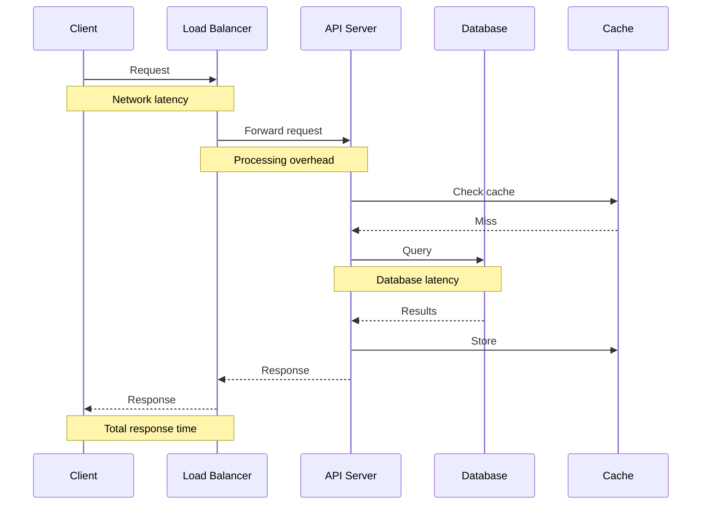
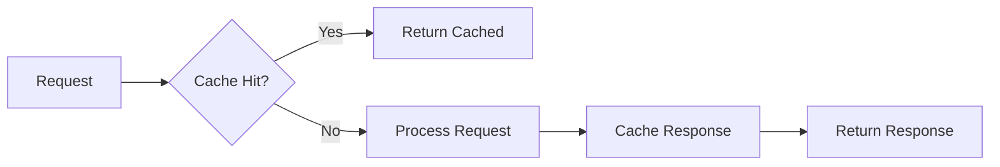

# How to Fix "API Response Time" Issues

Author: [nawazdhandala](https://www.github.com/nawazdhandala)

Tags: API, Performance, Optimization, Backend, Monitoring, DevOps

Description: Learn how to diagnose and fix slow API response times with practical techniques including profiling, database optimization, and architectural improvements.

---

Slow APIs frustrate users and cost money. Studies show that every 100ms of latency can reduce conversion rates by 1%. When your API response times creep from 50ms to 500ms, users notice. When they hit 2 seconds, users leave. This guide walks through systematic approaches to diagnosing and fixing API performance problems.

## Measuring API Response Time

Before optimizing, you need accurate measurements. Response time has multiple components:



### Implementing Request Timing

```javascript
// timing-middleware.js - Express middleware for request timing
const { performance } = require('perf_hooks');
const prometheus = require('prom-client');

// Create histogram for response times
const httpRequestDuration = new prometheus.Histogram({
  name: 'http_request_duration_seconds',
  help: 'Duration of HTTP requests in seconds',
  labelNames: ['method', 'route', 'status_code'],
  buckets: [0.01, 0.05, 0.1, 0.25, 0.5, 1, 2.5, 5, 10]
});

function timingMiddleware(req, res, next) {
  const start = performance.now();

  // Track various timing phases
  req.timing = {
    start,
    phases: {}
  };

  // Capture response finish
  res.on('finish', () => {
    const duration = (performance.now() - start) / 1000;
    const route = req.route?.path || req.path;

    httpRequestDuration
      .labels(req.method, route, res.statusCode)
      .observe(duration);

    // Log slow requests
    if (duration > 1) {
      console.warn('Slow request:', {
        method: req.method,
        path: req.path,
        duration: `${(duration * 1000).toFixed(2)}ms`,
        phases: req.timing.phases
      });
    }
  });

  next();
}

// Helper to track timing phases
function trackPhase(req, phase, fn) {
  return async (...args) => {
    const start = performance.now();
    try {
      return await fn(...args);
    } finally {
      req.timing.phases[phase] = performance.now() - start;
    }
  };
}

module.exports = { timingMiddleware, trackPhase };
```

## Common Causes and Fixes

### 1. N+1 Query Problem

One of the most common performance killers:

```javascript
// BAD: N+1 queries - 1 query for posts + N queries for authors
async function getPostsWithAuthors() {
  const posts = await db.query('SELECT * FROM posts LIMIT 100');

  // This executes 100 separate queries!
  for (const post of posts) {
    post.author = await db.query(
      'SELECT * FROM users WHERE id = ?',
      [post.author_id]
    );
  }

  return posts;
}

// GOOD: Single query with JOIN
async function getPostsWithAuthors() {
  return db.query(`
    SELECT
      p.*,
      u.id as author_id,
      u.name as author_name,
      u.email as author_email
    FROM posts p
    JOIN users u ON p.author_id = u.id
    LIMIT 100
  `);
}

// GOOD: Batch loading with DataLoader
const DataLoader = require('dataloader');

const userLoader = new DataLoader(async (userIds) => {
  const users = await db.query(
    'SELECT * FROM users WHERE id IN (?)',
    [userIds]
  );

  // Map results back to original order
  const userMap = new Map(users.map(u => [u.id, u]));
  return userIds.map(id => userMap.get(id));
});

async function getPostsWithAuthors() {
  const posts = await db.query('SELECT * FROM posts LIMIT 100');

  // Batches all author lookups into single query
  await Promise.all(posts.map(async post => {
    post.author = await userLoader.load(post.author_id);
  }));

  return posts;
}
```

### 2. Missing Database Indexes

Unindexed queries are a silent performance killer:

```sql
-- Find slow queries in PostgreSQL
SELECT
  query,
  calls,
  mean_exec_time,
  total_exec_time
FROM pg_stat_statements
ORDER BY mean_exec_time DESC
LIMIT 20;

-- Find missing indexes
SELECT
  schemaname || '.' || relname as table,
  seq_scan,
  seq_tup_read,
  idx_scan,
  seq_tup_read / seq_scan as avg_seq_tup_read
FROM pg_stat_user_tables
WHERE seq_scan > 0
ORDER BY seq_tup_read DESC
LIMIT 20;
```

```javascript
// query-analyzer.js - Automatic query analysis
class QueryAnalyzer {
  constructor(pool) {
    this.pool = pool;
    this.slowQueryThreshold = 100; // ms
  }

  async query(sql, params) {
    const start = Date.now();

    try {
      // Run EXPLAIN ANALYZE in development
      if (process.env.NODE_ENV === 'development') {
        const explain = await this.pool.query(
          `EXPLAIN (ANALYZE, BUFFERS, FORMAT JSON) ${sql}`,
          params
        );
        this.analyzeExplain(sql, explain.rows[0]);
      }

      return await this.pool.query(sql, params);
    } finally {
      const duration = Date.now() - start;
      if (duration > this.slowQueryThreshold) {
        console.warn('Slow query detected:', {
          sql: sql.substring(0, 200),
          duration: `${duration}ms`,
          params: params?.slice(0, 5)
        });
      }
    }
  }

  analyzeExplain(sql, plan) {
    const { 'Seq Scan': seqScans, 'Index Scan': indexScans } =
      this.countNodeTypes(plan['QUERY PLAN'][0]);

    if (seqScans > 0 && indexScans === 0) {
      console.warn('Query using sequential scan (missing index?):', {
        sql: sql.substring(0, 100)
      });
    }
  }

  countNodeTypes(node, counts = {}) {
    counts[node['Node Type']] = (counts[node['Node Type']] || 0) + 1;

    if (node.Plans) {
      node.Plans.forEach(p => this.countNodeTypes(p, counts));
    }

    return counts;
  }
}
```

### 3. Synchronous Blocking Operations

```javascript
// BAD: Blocking the event loop
const crypto = require('crypto');

app.get('/hash', (req, res) => {
  // This blocks for ~100ms on typical hardware
  const hash = crypto.pbkdf2Sync(
    req.query.password,
    'salt',
    100000,
    64,
    'sha512'
  );
  res.json({ hash: hash.toString('hex') });
});

// GOOD: Async operation
app.get('/hash', async (req, res) => {
  const hash = await new Promise((resolve, reject) => {
    crypto.pbkdf2(
      req.query.password,
      'salt',
      100000,
      64,
      'sha512',
      (err, derivedKey) => {
        if (err) reject(err);
        else resolve(derivedKey);
      }
    );
  });
  res.json({ hash: hash.toString('hex') });
});

// BETTER: Use worker threads for CPU-intensive work
const { Worker, isMainThread, parentPort, workerData } = require('worker_threads');

if (isMainThread) {
  app.get('/hash', async (req, res) => {
    const hash = await runInWorker('hash', {
      password: req.query.password
    });
    res.json({ hash });
  });

  function runInWorker(task, data) {
    return new Promise((resolve, reject) => {
      const worker = new Worker(__filename, {
        workerData: { task, data }
      });
      worker.on('message', resolve);
      worker.on('error', reject);
    });
  }
} else {
  const { task, data } = workerData;

  if (task === 'hash') {
    const hash = crypto.pbkdf2Sync(data.password, 'salt', 100000, 64, 'sha512');
    parentPort.postMessage(hash.toString('hex'));
  }
}
```

### 4. Inefficient Serialization

```javascript
// BAD: Serializing large objects repeatedly
app.get('/users', async (req, res) => {
  const users = await db.query('SELECT * FROM users');

  // Each user object is serialized individually
  res.json(users.map(user => ({
    id: user.id,
    name: user.name,
    email: user.email,
    // ... many more fields
    permissions: JSON.parse(user.permissions), // Parsing in loop!
    settings: JSON.parse(user.settings)
  })));
});

// GOOD: Use streaming JSON for large responses
const { Transform } = require('stream');

app.get('/users', async (req, res) => {
  res.setHeader('Content-Type', 'application/json');
  res.write('[');

  let first = true;
  const cursor = db.queryCursor('SELECT * FROM users');

  for await (const user of cursor) {
    if (!first) res.write(',');
    first = false;

    res.write(JSON.stringify({
      id: user.id,
      name: user.name,
      email: user.email
    }));
  }

  res.write(']');
  res.end();
});

// GOOD: Pre-serialize frequently accessed data
class CachedSerializer {
  constructor() {
    this.cache = new Map();
  }

  serialize(key, data, transform) {
    const cacheKey = `${key}:${data.updatedAt}`;

    if (!this.cache.has(cacheKey)) {
      this.cache.set(cacheKey, JSON.stringify(transform(data)));

      // Limit cache size
      if (this.cache.size > 10000) {
        const firstKey = this.cache.keys().next().value;
        this.cache.delete(firstKey);
      }
    }

    return this.cache.get(cacheKey);
  }
}
```

### 5. Missing Response Compression

```javascript
// compression-middleware.js
const compression = require('compression');

// Enable compression for responses > 1KB
app.use(compression({
  threshold: 1024,
  level: 6, // Balance between speed and compression ratio
  filter: (req, res) => {
    // Don't compress already compressed content
    if (req.headers['x-no-compression']) {
      return false;
    }
    return compression.filter(req, res);
  }
}));

// For even better performance, use pre-compressed static assets
const staticOptions = {
  setHeaders: (res, path) => {
    if (path.endsWith('.gz')) {
      res.setHeader('Content-Encoding', 'gzip');
    } else if (path.endsWith('.br')) {
      res.setHeader('Content-Encoding', 'br');
    }
  }
};
```

## Architectural Improvements

### Connection Pooling

```javascript
// db-pool.js - Properly configured connection pool
const { Pool } = require('pg');

const pool = new Pool({
  host: process.env.DB_HOST,
  database: process.env.DB_NAME,
  user: process.env.DB_USER,
  password: process.env.DB_PASSWORD,

  // Pool configuration
  min: 5,                    // Minimum connections to keep
  max: 20,                   // Maximum connections
  idleTimeoutMillis: 30000,  // Close idle connections after 30s
  connectionTimeoutMillis: 5000, // Fail if can't connect in 5s

  // Statement timeout to prevent long-running queries
  statement_timeout: 30000
});

// Monitor pool health
setInterval(() => {
  console.log('Pool stats:', {
    total: pool.totalCount,
    idle: pool.idleCount,
    waiting: pool.waitingCount
  });
}, 60000);
```

### Response Caching



```javascript
// response-cache.js - API response caching
const redis = require('ioredis');
const client = new redis(process.env.REDIS_URL);

function cacheMiddleware(options = {}) {
  const { ttl = 60, keyGenerator } = options;

  return async (req, res, next) => {
    // Skip non-GET requests
    if (req.method !== 'GET') {
      return next();
    }

    const cacheKey = keyGenerator
      ? keyGenerator(req)
      : `api:${req.originalUrl}`;

    // Check cache
    const cached = await client.get(cacheKey);
    if (cached) {
      const { data, contentType } = JSON.parse(cached);
      res.setHeader('Content-Type', contentType);
      res.setHeader('X-Cache', 'HIT');
      return res.send(data);
    }

    // Capture response
    const originalSend = res.send.bind(res);
    res.send = async (body) => {
      // Cache successful responses
      if (res.statusCode >= 200 && res.statusCode < 300) {
        await client.setex(cacheKey, ttl, JSON.stringify({
          data: body,
          contentType: res.getHeader('Content-Type')
        }));
      }

      res.setHeader('X-Cache', 'MISS');
      return originalSend(body);
    };

    next();
  };
}

// Usage
app.get('/products',
  cacheMiddleware({ ttl: 300 }),
  async (req, res) => {
    const products = await db.query('SELECT * FROM products');
    res.json(products);
  }
);
```

## Performance Monitoring Dashboard

Track key metrics to identify issues early:

| Metric | Warning Threshold | Critical Threshold |
|--------|------------------|-------------------|
| P50 response time | > 100ms | > 500ms |
| P95 response time | > 500ms | > 2000ms |
| P99 response time | > 1000ms | > 5000ms |
| Error rate | > 1% | > 5% |
| Database query time | > 50ms avg | > 200ms avg |
| Connection pool wait | > 10ms | > 100ms |

```javascript
// metrics-endpoint.js - Expose performance metrics
const prometheus = require('prom-client');

// Collect default metrics
prometheus.collectDefaultMetrics({ prefix: 'api_' });

// Custom business metrics
const activeRequests = new prometheus.Gauge({
  name: 'api_active_requests',
  help: 'Number of requests currently being processed'
});

const dbQueryDuration = new prometheus.Histogram({
  name: 'api_db_query_duration_seconds',
  help: 'Database query duration',
  labelNames: ['query_type'],
  buckets: [0.001, 0.005, 0.01, 0.05, 0.1, 0.5, 1]
});

app.get('/metrics', async (req, res) => {
  res.set('Content-Type', prometheus.register.contentType);
  res.end(await prometheus.register.metrics());
});
```

## Quick Wins Checklist

| Optimization | Impact | Effort |
|--------------|--------|--------|
| Add database indexes | High | Low |
| Enable response compression | Medium | Low |
| Implement connection pooling | High | Low |
| Cache frequently accessed data | High | Medium |
| Fix N+1 queries | High | Medium |
| Use async operations | Medium | Medium |
| Stream large responses | Medium | Medium |
| Add CDN for static content | High | Low |

Start with profiling to identify your actual bottlenecks. The most common issues are database-related: missing indexes, N+1 queries, and poor connection management. Fix these first, then move to application-level optimizations like caching and async processing.
