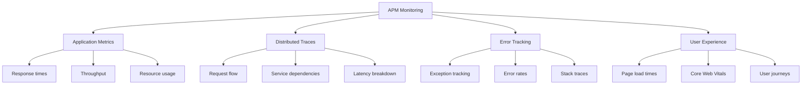
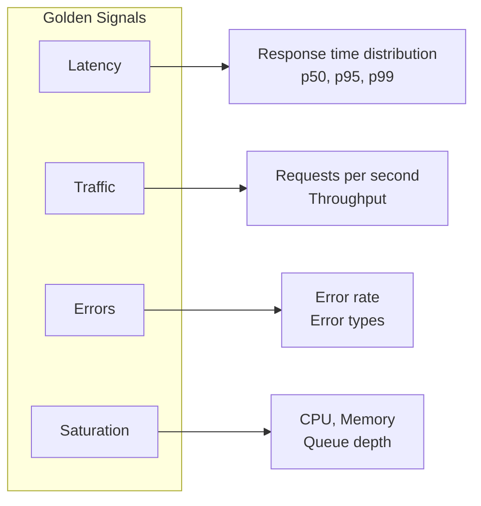
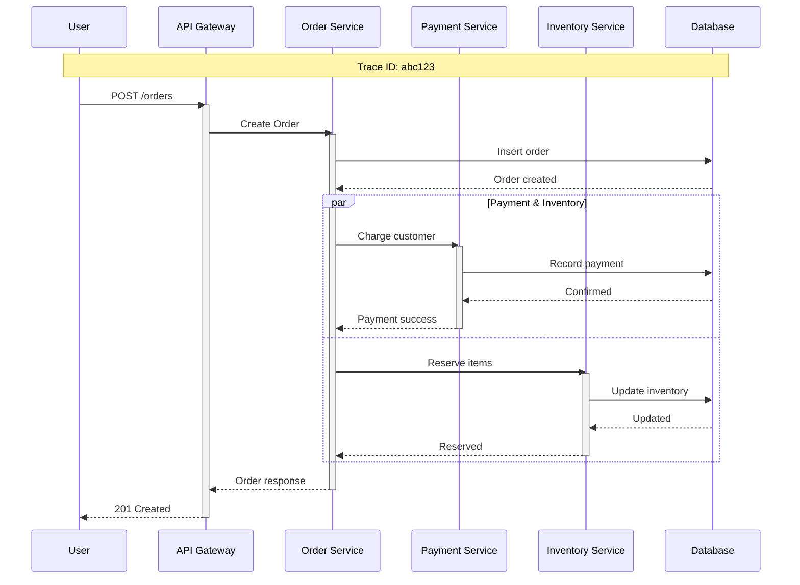
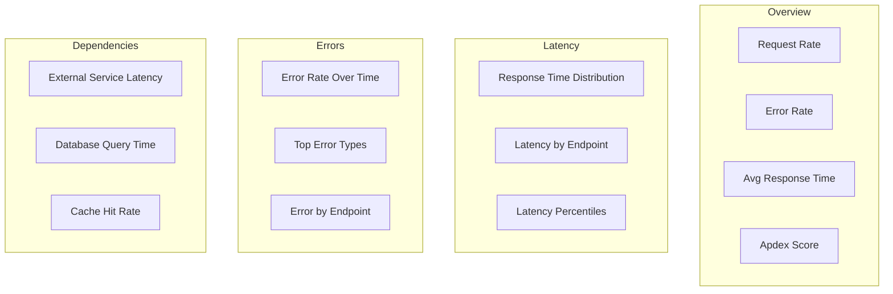

# How to Implement APM Monitoring

Author: [nawazdhandala](https://www.github.com/nawazdhandala)

Tags: APM, Application Performance Monitoring, Observability, Tracing, Metrics, Alerting, OpenTelemetry

Description: A practical guide to implementing Application Performance Monitoring (APM), covering instrumentation strategies, key metrics, distributed tracing, and alerting best practices.

---

> Application Performance Monitoring (APM) gives you visibility into how your application behaves in production. It helps you identify performance bottlenecks, track errors, and understand user experience. This guide covers how to implement APM effectively, from basic instrumentation to advanced distributed tracing.

Without APM, debugging production issues becomes guesswork. With proper APM in place, you can quickly identify slow endpoints, trace requests across services, and catch errors before users report them.

---

## What APM Monitors



---

## Setting Up OpenTelemetry for APM

OpenTelemetry provides vendor-neutral instrumentation that works with most APM backends.

### Python/FastAPI Setup

```python
# requirements.txt
# opentelemetry-api
# opentelemetry-sdk
# opentelemetry-exporter-otlp
# opentelemetry-instrumentation-fastapi
# opentelemetry-instrumentation-requests
# opentelemetry-instrumentation-sqlalchemy

# telemetry.py
import os
from opentelemetry import trace, metrics
from opentelemetry.sdk.trace import TracerProvider
from opentelemetry.sdk.trace.export import BatchSpanProcessor
from opentelemetry.sdk.metrics import MeterProvider
from opentelemetry.sdk.metrics.export import PeriodicExportingMetricReader
from opentelemetry.exporter.otlp.proto.grpc.trace_exporter import OTLPSpanExporter
from opentelemetry.exporter.otlp.proto.grpc.metric_exporter import OTLPMetricExporter
from opentelemetry.sdk.resources import Resource, SERVICE_NAME, SERVICE_VERSION
from opentelemetry.instrumentation.fastapi import FastAPIInstrumentor
from opentelemetry.instrumentation.requests import RequestsInstrumentor
from opentelemetry.instrumentation.sqlalchemy import SQLAlchemyInstrumentor

def setup_telemetry(app, service_name: str, service_version: str = "1.0.0"):
    """Initialize OpenTelemetry with tracing and metrics"""

    # Define resource attributes that identify this service
    resource = Resource.create({
        SERVICE_NAME: service_name,
        SERVICE_VERSION: service_version,
        "deployment.environment": os.getenv("ENVIRONMENT", "development"),
        "host.name": os.getenv("HOSTNAME", "unknown")
    })

    # Configure trace provider
    trace_provider = TracerProvider(resource=resource)

    # Export traces to OTLP endpoint (works with OneUptime, Jaeger, etc.)
    otlp_exporter = OTLPSpanExporter(
        endpoint=os.getenv("OTEL_EXPORTER_OTLP_ENDPOINT", "http://localhost:4317"),
        insecure=True
    )

    # Use batch processor for efficient export
    trace_provider.add_span_processor(
        BatchSpanProcessor(
            otlp_exporter,
            max_queue_size=2048,
            max_export_batch_size=512,
            scheduled_delay_millis=5000
        )
    )

    trace.set_tracer_provider(trace_provider)

    # Configure metrics
    metric_reader = PeriodicExportingMetricReader(
        OTLPMetricExporter(
            endpoint=os.getenv("OTEL_EXPORTER_OTLP_ENDPOINT", "http://localhost:4317"),
            insecure=True
        ),
        export_interval_millis=60000  # Export every 60 seconds
    )

    meter_provider = MeterProvider(
        resource=resource,
        metric_readers=[metric_reader]
    )
    metrics.set_meter_provider(meter_provider)

    # Auto-instrument FastAPI
    FastAPIInstrumentor.instrument_app(app)

    # Auto-instrument HTTP client
    RequestsInstrumentor().instrument()

    return trace.get_tracer(service_name)

# main.py
from fastapi import FastAPI, Request
from telemetry import setup_telemetry
from opentelemetry import trace

app = FastAPI(title="Order Service")
tracer = setup_telemetry(app, "order-service", "2.1.0")

@app.get("/api/orders/{order_id}")
async def get_order(order_id: str):
    # Auto-instrumented by FastAPIInstrumentor
    # You can add custom spans for more detail
    with tracer.start_as_current_span("fetch_order_details") as span:
        span.set_attribute("order.id", order_id)

        order = await fetch_order_from_db(order_id)

        if order:
            span.set_attribute("order.status", order.status)
            span.set_attribute("order.total", order.total)
        else:
            span.set_attribute("order.found", False)

        return order
```

### Node.js/Express Setup

```javascript
// telemetry.js
const { NodeSDK } = require('@opentelemetry/sdk-node');
const { getNodeAutoInstrumentations } = require('@opentelemetry/auto-instrumentations-node');
const { OTLPTraceExporter } = require('@opentelemetry/exporter-trace-otlp-grpc');
const { OTLPMetricExporter } = require('@opentelemetry/exporter-metrics-otlp-grpc');
const { PeriodicExportingMetricReader } = require('@opentelemetry/sdk-metrics');
const { Resource } = require('@opentelemetry/resources');
const { SemanticResourceAttributes } = require('@opentelemetry/semantic-conventions');

function setupTelemetry(serviceName, serviceVersion = '1.0.0') {
    const resource = new Resource({
        [SemanticResourceAttributes.SERVICE_NAME]: serviceName,
        [SemanticResourceAttributes.SERVICE_VERSION]: serviceVersion,
        [SemanticResourceAttributes.DEPLOYMENT_ENVIRONMENT]: process.env.NODE_ENV || 'development'
    });

    const traceExporter = new OTLPTraceExporter({
        url: process.env.OTEL_EXPORTER_OTLP_ENDPOINT || 'http://localhost:4317'
    });

    const metricReader = new PeriodicExportingMetricReader({
        exporter: new OTLPMetricExporter({
            url: process.env.OTEL_EXPORTER_OTLP_ENDPOINT || 'http://localhost:4317'
        }),
        exportIntervalMillis: 60000
    });

    const sdk = new NodeSDK({
        resource,
        traceExporter,
        metricReader,
        instrumentations: [
            getNodeAutoInstrumentations({
                // Configure specific instrumentations
                '@opentelemetry/instrumentation-http': {
                    ignoreIncomingPaths: ['/health', '/ready']
                },
                '@opentelemetry/instrumentation-express': {
                    enabled: true
                },
                '@opentelemetry/instrumentation-pg': {
                    enabled: true
                }
            })
        ]
    });

    sdk.start();

    // Graceful shutdown
    process.on('SIGTERM', () => {
        sdk.shutdown()
            .then(() => console.log('Telemetry shut down'))
            .catch((error) => console.error('Error shutting down telemetry', error))
            .finally(() => process.exit(0));
    });

    return sdk;
}

module.exports = { setupTelemetry };

// app.js
const { setupTelemetry } = require('./telemetry');
setupTelemetry('user-service', '1.2.0');

const express = require('express');
const { trace } = require('@opentelemetry/api');

const app = express();
const tracer = trace.getTracer('user-service');

app.get('/api/users/:userId', async (req, res) => {
    const { userId } = req.params;

    // Create custom span for business logic
    const span = tracer.startSpan('fetch_user_with_permissions');
    span.setAttribute('user.id', userId);

    try {
        const user = await getUserFromDatabase(userId);
        const permissions = await getPermissions(userId);

        span.setAttribute('user.found', !!user);
        span.setAttribute('permissions.count', permissions.length);

        res.json({ user, permissions });
    } catch (error) {
        span.recordException(error);
        span.setStatus({ code: 2, message: error.message });
        res.status(500).json({ error: 'Internal server error' });
    } finally {
        span.end();
    }
});

app.listen(3000);
```

---

## Key Metrics to Collect

### The Four Golden Signals



### Custom Metrics Implementation

```python
from opentelemetry import metrics
from opentelemetry.metrics import Counter, Histogram, UpDownCounter
import time

# Get a meter for creating metrics
meter = metrics.get_meter("order-service")

# Counter for total requests
request_counter = meter.create_counter(
    name="http_requests_total",
    description="Total HTTP requests",
    unit="1"
)

# Histogram for response time distribution
response_time = meter.create_histogram(
    name="http_response_time_seconds",
    description="HTTP response time in seconds",
    unit="s"
)

# Gauge for active connections
active_connections = meter.create_up_down_counter(
    name="active_connections",
    description="Number of active connections",
    unit="1"
)

# Business metric: orders processed
orders_processed = meter.create_counter(
    name="orders_processed_total",
    description="Total orders processed",
    unit="1"
)

order_value = meter.create_histogram(
    name="order_value_dollars",
    description="Order value distribution",
    unit="USD"
)

# Middleware for automatic metric collection
from fastapi import Request
from starlette.middleware.base import BaseHTTPMiddleware

class MetricsMiddleware(BaseHTTPMiddleware):
    async def dispatch(self, request: Request, call_next):
        start_time = time.time()

        # Track active connections
        active_connections.add(1)

        try:
            response = await call_next(request)

            # Record metrics
            duration = time.time() - start_time
            labels = {
                "method": request.method,
                "endpoint": request.url.path,
                "status_code": str(response.status_code)
            }

            request_counter.add(1, labels)
            response_time.record(duration, labels)

            return response
        finally:
            active_connections.add(-1)

# Usage in business logic
async def process_order(order_data):
    tracer = trace.get_tracer("order-service")

    with tracer.start_as_current_span("process_order") as span:
        span.set_attribute("order.items_count", len(order_data["items"]))

        # Process the order...
        order = create_order(order_data)

        # Record business metrics
        orders_processed.add(1, {"status": "success", "type": order.type})
        order_value.record(order.total, {"currency": "USD", "type": order.type})

        return order
```

---

## Distributed Tracing

### Trace Context Propagation

```python
from opentelemetry import trace
from opentelemetry.propagate import inject, extract
import httpx

tracer = trace.get_tracer("order-service")

async def call_payment_service(order_id: str, amount: float):
    """Call payment service with trace context propagation"""

    with tracer.start_as_current_span("call_payment_service") as span:
        span.set_attribute("order.id", order_id)
        span.set_attribute("payment.amount", amount)
        span.set_attribute("peer.service", "payment-service")

        # Inject trace context into request headers
        headers = {}
        inject(headers)

        async with httpx.AsyncClient() as client:
            response = await client.post(
                "http://payment-service/api/charge",
                headers=headers,
                json={"order_id": order_id, "amount": amount}
            )

            span.set_attribute("http.status_code", response.status_code)

            if response.status_code >= 400:
                span.set_status(trace.Status(trace.StatusCode.ERROR))

            return response.json()

# Receiving service extracts context
from fastapi import Request

@app.post("/api/charge")
async def charge(request: Request):
    # Extract trace context from incoming request
    context = extract(request.headers)

    # Create span as child of the extracted context
    with tracer.start_as_current_span("process_payment", context=context) as span:
        # This span is now part of the same trace
        data = await request.json()
        span.set_attribute("order.id", data["order_id"])

        result = process_payment(data)
        return result
```

### Visualizing Traces



---

## Error Tracking

### Structured Error Handling

```python
from opentelemetry import trace
from opentelemetry.trace import Status, StatusCode
import traceback
import logging

logger = logging.getLogger(__name__)
tracer = trace.get_tracer("order-service")

class OrderError(Exception):
    """Base exception for order-related errors"""
    def __init__(self, message: str, order_id: str = None, error_code: str = None):
        super().__init__(message)
        self.order_id = order_id
        self.error_code = error_code

class PaymentError(OrderError):
    """Payment processing failed"""
    pass

class InventoryError(OrderError):
    """Inventory operation failed"""
    pass

def record_error(span, error: Exception, include_traceback: bool = True):
    """Record error details on the current span"""

    # Record the exception with full details
    span.record_exception(error)

    # Set error status
    span.set_status(Status(StatusCode.ERROR, str(error)))

    # Add error attributes for filtering
    span.set_attribute("error.type", type(error).__name__)
    span.set_attribute("error.message", str(error))

    if isinstance(error, OrderError):
        if error.order_id:
            span.set_attribute("error.order_id", error.order_id)
        if error.error_code:
            span.set_attribute("error.code", error.error_code)

    if include_traceback:
        span.set_attribute("error.traceback", traceback.format_exc())

async def create_order(order_data: dict):
    with tracer.start_as_current_span("create_order") as span:
        order_id = generate_order_id()
        span.set_attribute("order.id", order_id)

        try:
            # Validate order
            validate_order(order_data)

            # Process payment
            try:
                await process_payment(order_id, order_data["total"])
            except Exception as e:
                raise PaymentError(
                    f"Payment failed: {e}",
                    order_id=order_id,
                    error_code="PAYMENT_FAILED"
                )

            # Reserve inventory
            try:
                await reserve_inventory(order_id, order_data["items"])
            except Exception as e:
                raise InventoryError(
                    f"Inventory reservation failed: {e}",
                    order_id=order_id,
                    error_code="INVENTORY_UNAVAILABLE"
                )

            # Create order record
            order = await save_order(order_id, order_data)

            span.set_attribute("order.status", "created")
            return order

        except OrderError as e:
            record_error(span, e)
            logger.error(f"Order error: {e}", exc_info=True)
            raise
        except Exception as e:
            record_error(span, e)
            logger.error(f"Unexpected error creating order: {e}", exc_info=True)
            raise
```

---

## Alerting on APM Data

### Alert Rules Configuration

```yaml
# alerting-rules.yaml
groups:
  - name: apm-alerts
    rules:
      # High error rate alert
      - alert: HighErrorRate
        expr: |
          sum(rate(http_requests_total{status_code=~"5.."}[5m]))
          /
          sum(rate(http_requests_total[5m]))
          > 0.05
        for: 5m
        labels:
          severity: critical
        annotations:
          summary: "High error rate detected"
          description: "Error rate is {{ $value | humanizePercentage }} (threshold: 5%)"

      # Slow response time alert
      - alert: SlowResponseTime
        expr: |
          histogram_quantile(0.95, rate(http_response_time_seconds_bucket[5m]))
          > 2
        for: 5m
        labels:
          severity: warning
        annotations:
          summary: "Slow response times detected"
          description: "95th percentile response time is {{ $value }}s (threshold: 2s)"

      # High latency on specific endpoint
      - alert: CheckoutLatencyHigh
        expr: |
          histogram_quantile(0.99,
            rate(http_response_time_seconds_bucket{endpoint="/api/checkout"}[5m])
          ) > 5
        for: 2m
        labels:
          severity: critical
        annotations:
          summary: "Checkout endpoint is slow"
          description: "99th percentile checkout latency is {{ $value }}s"

      # Apdex score dropping
      - alert: LowApdexScore
        expr: |
          (
            sum(rate(http_response_time_seconds_bucket{le="0.5"}[5m]))
            + sum(rate(http_response_time_seconds_bucket{le="2.0"}[5m])) / 2
          )
          /
          sum(rate(http_response_time_seconds_count[5m]))
          < 0.85
        for: 10m
        labels:
          severity: warning
        annotations:
          summary: "User satisfaction score is low"
          description: "Apdex score is {{ $value }} (threshold: 0.85)"
```

### Implementing Alert Thresholds in Code

```python
from dataclasses import dataclass
from typing import Optional
import asyncio

@dataclass
class AlertThreshold:
    metric: str
    condition: str  # "gt" or "lt"
    threshold: float
    duration_seconds: int
    severity: str

class APMAlertChecker:
    def __init__(self, metrics_client):
        self.metrics = metrics_client
        self.thresholds = [
            AlertThreshold(
                metric="error_rate",
                condition="gt",
                threshold=0.05,
                duration_seconds=300,
                severity="critical"
            ),
            AlertThreshold(
                metric="p99_latency",
                condition="gt",
                threshold=2.0,
                duration_seconds=300,
                severity="warning"
            ),
            AlertThreshold(
                metric="throughput",
                condition="lt",
                threshold=10,
                duration_seconds=600,
                severity="warning"
            )
        ]
        self.alert_state = {}

    async def check_alerts(self):
        """Check all alert thresholds"""
        for threshold in self.thresholds:
            value = await self.metrics.get_metric(threshold.metric)

            is_breached = (
                (threshold.condition == "gt" and value > threshold.threshold) or
                (threshold.condition == "lt" and value < threshold.threshold)
            )

            alert_key = f"{threshold.metric}:{threshold.condition}:{threshold.threshold}"

            if is_breached:
                if alert_key not in self.alert_state:
                    self.alert_state[alert_key] = asyncio.get_event_loop().time()
                elif asyncio.get_event_loop().time() - self.alert_state[alert_key] >= threshold.duration_seconds:
                    await self.fire_alert(threshold, value)
            else:
                # Clear alert state if condition is no longer met
                if alert_key in self.alert_state:
                    del self.alert_state[alert_key]

    async def fire_alert(self, threshold: AlertThreshold, current_value: float):
        """Send alert notification"""
        alert = {
            "metric": threshold.metric,
            "threshold": threshold.threshold,
            "current_value": current_value,
            "severity": threshold.severity,
            "message": f"{threshold.metric} is {current_value} ({threshold.condition} {threshold.threshold})"
        }

        # Send to alerting system
        await send_to_oneuptime(alert)
        await send_to_slack(alert)
```

---

## Dashboard Design

### Key Dashboard Panels



### Dashboard JSON Example

```json
{
  "dashboard": {
    "title": "Order Service APM",
    "panels": [
      {
        "title": "Request Rate",
        "type": "stat",
        "targets": [
          {
            "expr": "sum(rate(http_requests_total[5m]))",
            "legendFormat": "req/s"
          }
        ]
      },
      {
        "title": "Error Rate",
        "type": "gauge",
        "targets": [
          {
            "expr": "sum(rate(http_requests_total{status_code=~\"5..\"}[5m])) / sum(rate(http_requests_total[5m])) * 100",
            "legendFormat": "Error %"
          }
        ],
        "thresholds": [
          {"value": 0, "color": "green"},
          {"value": 1, "color": "yellow"},
          {"value": 5, "color": "red"}
        ]
      },
      {
        "title": "Response Time Percentiles",
        "type": "timeseries",
        "targets": [
          {
            "expr": "histogram_quantile(0.50, rate(http_response_time_seconds_bucket[5m]))",
            "legendFormat": "p50"
          },
          {
            "expr": "histogram_quantile(0.95, rate(http_response_time_seconds_bucket[5m]))",
            "legendFormat": "p95"
          },
          {
            "expr": "histogram_quantile(0.99, rate(http_response_time_seconds_bucket[5m]))",
            "legendFormat": "p99"
          }
        ]
      },
      {
        "title": "Top Slow Endpoints",
        "type": "table",
        "targets": [
          {
            "expr": "topk(10, histogram_quantile(0.95, sum by (endpoint) (rate(http_response_time_seconds_bucket[5m]))))",
            "format": "table"
          }
        ]
      }
    ]
  }
}
```

---

## Best Practices

1. **Start with auto-instrumentation** - Get basic visibility quickly, then add custom spans for business logic

2. **Use semantic conventions** - Follow OpenTelemetry naming standards for attributes

3. **Sample in production** - Use head-based or tail-based sampling to reduce data volume

4. **Set meaningful thresholds** - Base alert thresholds on actual baseline performance

5. **Track business metrics** - Technical metrics matter, but business metrics (orders, revenue) are often more meaningful

6. **Correlate traces with logs** - Include trace IDs in log messages for easy debugging

7. **Monitor the monitors** - Ensure your APM pipeline itself is healthy

8. **Keep cardinality under control** - Avoid high-cardinality labels that explode metric storage

---

## Conclusion

APM is essential for maintaining reliable, performant applications in production. By implementing proper instrumentation with OpenTelemetry, collecting the right metrics, and setting up meaningful alerts, you gain the visibility needed to quickly identify and resolve issues.

Start with the basics (latency, throughput, errors) and gradually add more detailed instrumentation as you learn where the important bottlenecks are. The goal is not to monitor everything, but to monitor the things that matter for your users and business.

---

*Ready to implement APM for your applications? [OneUptime](https://oneuptime.com) provides comprehensive APM with distributed tracing, metrics, logs, and intelligent alerting. Get started with native OpenTelemetry support and see your application performance in real-time.*

**Related Reading:**
- [How to Instrument Python Applications with OpenTelemetry](https://oneuptime.com/blog)
- [Three Pillars of Observability](https://oneuptime.com/blog)
- [Setting Up Effective Alerts](https://oneuptime.com/blog)
