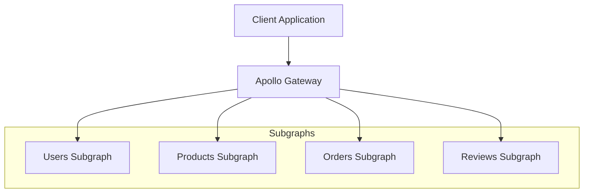
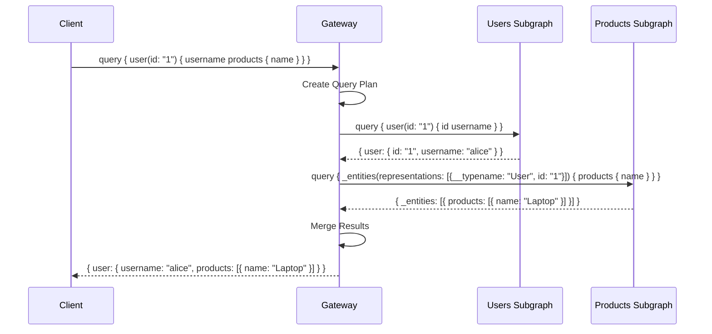
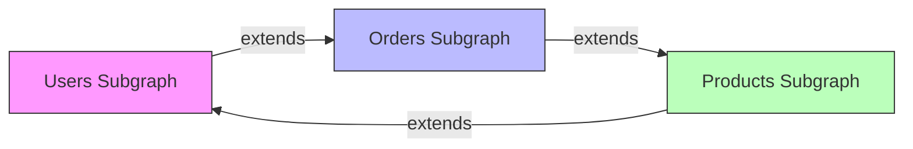

# How to Configure Apollo Federation

Author: [nawazdhandala](https://www.github.com/nawazdhandala)

Tags: GraphQL, Apollo Federation, API Gateway, Microservices, Backend, Node.js

Description: A comprehensive guide to setting up Apollo Federation for building a unified GraphQL API from multiple microservices.

---

Apollo Federation allows you to compose multiple GraphQL services into a single unified API. Instead of building one monolithic GraphQL server, you can split your schema across multiple services that each own their part of the data graph. This guide walks you through configuring Apollo Federation from scratch.

## Understanding Apollo Federation Architecture

Apollo Federation uses a gateway that combines multiple subgraphs into a single supergraph. Each subgraph is a standalone GraphQL service that defines its portion of the schema.



The gateway handles query planning, which determines which subgraphs to query and how to combine the results. This happens automatically based on the schema definitions.

## Step 1: Install Required Dependencies

Start by installing the necessary packages for both the gateway and subgraphs.

For the gateway:

```bash
# Create a new directory for the gateway
mkdir apollo-gateway && cd apollo-gateway

# Initialize the project
npm init -y

# Install gateway dependencies
# @apollo/gateway: The federation gateway runtime
# @apollo/server: Apollo Server v4 for running the gateway
# graphql: The GraphQL JavaScript reference implementation
npm install @apollo/gateway @apollo/server graphql
```

For each subgraph:

```bash
# Create a subgraph directory
mkdir users-subgraph && cd users-subgraph

# Initialize the project
npm init -y

# Install subgraph dependencies
# @apollo/subgraph: Enables federation features in your schema
# @apollo/server: Apollo Server for running the subgraph
# graphql: Required peer dependency
npm install @apollo/subgraph @apollo/server graphql
```

## Step 2: Create a Subgraph Service

Each subgraph needs to extend the base schema with federation directives. Here is a complete example of a Users subgraph.

```javascript
// users-subgraph/index.js
import { ApolloServer } from '@apollo/server';
import { startStandaloneServer } from '@apollo/server/standalone';
import { buildSubgraphSchema } from '@apollo/subgraph';
import { gql } from 'graphql-tag';

// Define the schema using federation directives
// The @key directive marks User as an entity that can be referenced by other subgraphs
const typeDefs = gql`
  # Extend the Query type to add user-related queries
  type Query {
    # Get a user by their ID
    user(id: ID!): User
    # Get all users with optional pagination
    users(limit: Int, offset: Int): [User!]!
  }

  # The @key directive defines the primary key for this entity
  # Other subgraphs can reference User by its id field
  type User @key(fields: "id") {
    id: ID!
    email: String!
    username: String!
    createdAt: String!
  }
`;

// Sample data for demonstration
const users = [
  { id: '1', email: 'alice@example.com', username: 'alice', createdAt: '2024-01-15' },
  { id: '2', email: 'bob@example.com', username: 'bob', createdAt: '2024-02-20' },
  { id: '3', email: 'charlie@example.com', username: 'charlie', createdAt: '2024-03-10' },
];

// Resolvers handle the actual data fetching
const resolvers = {
  Query: {
    // Fetch a single user by ID
    user: (_, { id }) => users.find(user => user.id === id),
    // Fetch multiple users with pagination support
    users: (_, { limit = 10, offset = 0 }) => users.slice(offset, offset + limit),
  },
  User: {
    // __resolveReference is called when another subgraph references this entity
    // The gateway passes the reference object containing the key fields (id)
    __resolveReference: (reference) => {
      return users.find(user => user.id === reference.id);
    },
  },
};

// Build the subgraph schema with federation support
const server = new ApolloServer({
  schema: buildSubgraphSchema({ typeDefs, resolvers }),
});

// Start the server on port 4001
const { url } = await startStandaloneServer(server, {
  listen: { port: 4001 },
});

console.log(`Users subgraph ready at ${url}`);
```

## Step 3: Create Another Subgraph That References Entities

The real power of federation comes from extending types defined in other subgraphs. Here is a Products subgraph that extends User.

```javascript
// products-subgraph/index.js
import { ApolloServer } from '@apollo/server';
import { startStandaloneServer } from '@apollo/server/standalone';
import { buildSubgraphSchema } from '@apollo/subgraph';
import { gql } from 'graphql-tag';

const typeDefs = gql`
  type Query {
    # Get a product by ID
    product(id: ID!): Product
    # Get all products with optional filtering
    products(category: String): [Product!]!
  }

  # Product is an entity owned by this subgraph
  type Product @key(fields: "id") {
    id: ID!
    name: String!
    price: Float!
    category: String!
    # Reference to User entity defined in users-subgraph
    seller: User!
  }

  # Extend User type from users-subgraph
  # The @key directive must match the one in the owning subgraph
  # @external marks fields that are defined in another subgraph
  extend type User @key(fields: "id") {
    id: ID! @external
    # Add new field to User type from this subgraph
    products: [Product!]!
  }
`;

const products = [
  { id: 'p1', name: 'Laptop', price: 999.99, category: 'Electronics', sellerId: '1' },
  { id: 'p2', name: 'Headphones', price: 149.99, category: 'Electronics', sellerId: '1' },
  { id: 'p3', name: 'Book', price: 29.99, category: 'Books', sellerId: '2' },
];

const resolvers = {
  Query: {
    product: (_, { id }) => products.find(p => p.id === id),
    products: (_, { category }) => {
      if (category) {
        return products.filter(p => p.category === category);
      }
      return products;
    },
  },
  Product: {
    // Return a reference object for the seller
    // The gateway will resolve the full User object from users-subgraph
    seller: (product) => ({ __typename: 'User', id: product.sellerId }),
    __resolveReference: (reference) => products.find(p => p.id === reference.id),
  },
  User: {
    // Resolve the products field we added to User
    // This is called when a query requests user.products
    products: (user) => products.filter(p => p.sellerId === user.id),
  },
};

const server = new ApolloServer({
  schema: buildSubgraphSchema({ typeDefs, resolvers }),
});

const { url } = await startStandaloneServer(server, {
  listen: { port: 4002 },
});

console.log(`Products subgraph ready at ${url}`);
```

## Step 4: Configure the Apollo Gateway

The gateway combines all subgraphs into a unified API. It needs to know where each subgraph is running.

```javascript
// gateway/index.js
import { ApolloServer } from '@apollo/server';
import { startStandaloneServer } from '@apollo/server/standalone';
import { ApolloGateway, IntrospectAndCompose } from '@apollo/gateway';

// Configure the gateway with subgraph locations
// IntrospectAndCompose fetches schemas from subgraphs at runtime
const gateway = new ApolloGateway({
  supergraphSdl: new IntrospectAndCompose({
    subgraphs: [
      // Each subgraph needs a unique name and URL
      { name: 'users', url: 'http://localhost:4001/graphql' },
      { name: 'products', url: 'http://localhost:4002/graphql' },
      // Add more subgraphs as needed
      // { name: 'orders', url: 'http://localhost:4003/graphql' },
      // { name: 'reviews', url: 'http://localhost:4004/graphql' },
    ],
  }),
});

// Create the Apollo Server with the gateway
const server = new ApolloServer({
  gateway,
  // Disable subscriptions in the gateway (handled differently in federation)
  subscriptions: false,
});

// Start the gateway server
const { url } = await startStandaloneServer(server, {
  listen: { port: 4000 },
});

console.log(`Gateway ready at ${url}`);
```

## Step 5: Use Managed Federation (Production)

For production, use Apollo Studio's managed federation instead of IntrospectAndCompose. This provides schema validation, composition checking, and deployment safety.

```javascript
// gateway/index.js (production configuration)
import { ApolloServer } from '@apollo/server';
import { startStandaloneServer } from '@apollo/server/standalone';
import { ApolloGateway } from '@apollo/gateway';

// In production, the gateway fetches the supergraph from Apollo Studio
// Set APOLLO_KEY and APOLLO_GRAPH_REF environment variables
const gateway = new ApolloGateway();

const server = new ApolloServer({
  gateway,
});

const { url } = await startStandaloneServer(server, {
  listen: { port: process.env.PORT || 4000 },
});

console.log(`Gateway ready at ${url}`);
```

Set the required environment variables:

```bash
# Your Apollo Studio API key
export APOLLO_KEY=service:my-graph:xxxxxxxxxxxxx

# Your graph reference in the format graph-id@variant
export APOLLO_GRAPH_REF=my-graph@production
```

## Step 6: Publish Subgraph Schemas to Apollo Studio

Use the Rover CLI to publish each subgraph schema to Apollo Studio.

```bash
# Install the Rover CLI tool
npm install -g @apollo/rover

# Publish the users subgraph schema
# --name: Unique identifier for this subgraph
# --schema: Path to the schema file or introspection URL
# --routing-url: The URL where this subgraph is deployed
rover subgraph publish my-graph@production \
  --name users \
  --schema ./users-subgraph/schema.graphql \
  --routing-url https://users.myapi.com/graphql

# Publish the products subgraph schema
rover subgraph publish my-graph@production \
  --name products \
  --schema ./products-subgraph/schema.graphql \
  --routing-url https://products.myapi.com/graphql
```

## Understanding Query Execution Flow

When a query spans multiple subgraphs, the gateway creates a query plan.



## Step 7: Configure Custom Directives

Federation 2 introduces several useful directives for controlling schema composition.

```graphql
# products-subgraph/schema.graphql

# @shareable allows multiple subgraphs to resolve the same field
type Product @key(fields: "id") {
  id: ID!
  name: String!
  # Both subgraphs can resolve this field
  price: Float! @shareable
}

# @inaccessible hides a field from the public API
type InternalProduct @key(fields: "id") {
  id: ID!
  name: String!
  # This field is only used internally between subgraphs
  internalCode: String! @inaccessible
}

# @override takes ownership of a field from another subgraph
extend type User @key(fields: "id") {
  id: ID! @external
  # This subgraph now owns the email field instead of users-subgraph
  email: String! @override(from: "users")
}

# @provides specifies which fields this subgraph can resolve
# when returning a reference to an entity
type Order @key(fields: "id") {
  id: ID!
  # When resolving product, this subgraph can also provide name and price
  product: Product! @provides(fields: "name price")
}

# @requires specifies fields needed from the entity to resolve a field
extend type Product @key(fields: "id") {
  id: ID! @external
  price: Float! @external
  # Need the price to calculate the discount
  discountedPrice: Float! @requires(fields: "price")
}
```

## Step 8: Implement Error Handling

Proper error handling ensures failures in one subgraph do not crash the entire query.

```javascript
// gateway/index.js with error handling
import { ApolloServer } from '@apollo/server';
import { startStandaloneServer } from '@apollo/server/standalone';
import { ApolloGateway, IntrospectAndCompose, RemoteGraphQLDataSource } from '@apollo/gateway';

// Custom data source with error handling and retry logic
class AuthenticatedDataSource extends RemoteGraphQLDataSource {
  // Add authentication headers to requests
  willSendRequest({ request, context }) {
    // Forward authentication from the client request
    if (context.authToken) {
      request.http.headers.set('Authorization', context.authToken);
    }
    // Add tracing headers for observability
    request.http.headers.set('x-request-id', context.requestId);
  }

  // Handle errors from subgraphs
  didEncounterError(error, fetchRequest, fetchResponse, context) {
    console.error(`Error from subgraph: ${error.message}`, {
      subgraph: fetchRequest.url,
      requestId: context.requestId,
    });
    // You can modify or wrap the error here
    throw error;
  }

  // Process responses for logging or modification
  async didReceiveResponse({ response, request, context }) {
    // Log slow queries
    const duration = Date.now() - context.startTime;
    if (duration > 1000) {
      console.warn(`Slow subgraph response: ${duration}ms`, {
        subgraph: request.url,
      });
    }
    return response;
  }
}

const gateway = new ApolloGateway({
  supergraphSdl: new IntrospectAndCompose({
    subgraphs: [
      { name: 'users', url: 'http://localhost:4001/graphql' },
      { name: 'products', url: 'http://localhost:4002/graphql' },
    ],
  }),
  // Use the custom data source for all subgraph requests
  buildService({ name, url }) {
    return new AuthenticatedDataSource({ url });
  },
});

const server = new ApolloServer({
  gateway,
  // Custom error formatting
  formatError: (error) => {
    // Log the full error server-side
    console.error('GraphQL Error:', error);

    // Return a sanitized error to the client
    return {
      message: error.message,
      // Include path for debugging
      path: error.path,
      // Optionally include extensions
      extensions: {
        code: error.extensions?.code || 'INTERNAL_ERROR',
      },
    };
  },
});

const { url } = await startStandaloneServer(server, {
  listen: { port: 4000 },
  // Build context for each request
  context: async ({ req }) => ({
    authToken: req.headers.authorization,
    requestId: req.headers['x-request-id'] || crypto.randomUUID(),
    startTime: Date.now(),
  }),
});

console.log(`Gateway ready at ${url}`);
```

## Step 9: Monitor Federation Performance

Set up monitoring to track query plan execution and subgraph health.

```javascript
// gateway/plugins/metrics.js
import { ApolloServerPluginUsageReporting } from '@apollo/server/plugin/usageReporting';

// Custom plugin to track federation-specific metrics
const federationMetricsPlugin = {
  // Called when the server starts
  async serverWillStart() {
    console.log('Gateway starting...');
    return {
      // Called when the server is shutting down
      async drainServer() {
        console.log('Gateway shutting down...');
      },
    };
  },

  // Called for each request
  async requestDidStart() {
    const startTime = Date.now();

    return {
      // Track query planning time
      async didResolveOperation(requestContext) {
        const planningTime = Date.now() - startTime;
        console.log(`Query planning took ${planningTime}ms`);
      },

      // Track total execution time
      async willSendResponse(requestContext) {
        const totalTime = Date.now() - startTime;
        const operationName = requestContext.operationName || 'anonymous';

        console.log(`Operation ${operationName} completed in ${totalTime}ms`);

        // Log slow queries for investigation
        if (totalTime > 2000) {
          console.warn('Slow query detected', {
            operationName,
            duration: totalTime,
            query: requestContext.request.query,
          });
        }
      },

      // Track errors
      async didEncounterErrors(requestContext) {
        for (const error of requestContext.errors) {
          console.error('GraphQL error:', {
            message: error.message,
            path: error.path,
            operationName: requestContext.operationName,
          });
        }
      },
    };
  },
};

export { federationMetricsPlugin };
```

## Common Federation Patterns

### Pattern 1: Shared Types Across Subgraphs

```graphql
# Define an interface that multiple subgraphs can implement
interface Node {
  id: ID!
}

# Each subgraph implements the interface for its types
type User implements Node @key(fields: "id") {
  id: ID!
  username: String!
}

type Product implements Node @key(fields: "id") {
  id: ID!
  name: String!
}
```

### Pattern 2: Computed Fields

```graphql
# orders-subgraph/schema.graphql
extend type Product @key(fields: "id") {
  id: ID! @external
  price: Float! @external
  # Computed field based on orders data
  totalSales: Int!
  # Field that requires data from the owning subgraph
  averageRating: Float! @requires(fields: "price")
}
```

### Pattern 3: Pagination Across Subgraphs

```graphql
# Use connections for consistent pagination
type Query {
  products(first: Int, after: String): ProductConnection!
}

type ProductConnection {
  edges: [ProductEdge!]!
  pageInfo: PageInfo!
  totalCount: Int!
}

type ProductEdge {
  cursor: String!
  node: Product!
}

type PageInfo {
  hasNextPage: Boolean!
  hasPreviousPage: Boolean!
  startCursor: String
  endCursor: String
}
```

## Troubleshooting Federation Issues

### Issue: Schema Composition Errors

```bash
# Check schema composition locally before publishing
rover subgraph check my-graph@production \
  --name users \
  --schema ./users-subgraph/schema.graphql

# View the composed supergraph schema
rover supergraph compose --config ./supergraph.yaml
```

### Issue: Entity Resolution Failures

When entity resolution fails, check that key fields match across subgraphs.

```javascript
// Debug resolver for entity resolution
User: {
  __resolveReference: (reference, context, info) => {
    console.log('Resolving User reference:', reference);
    const user = users.find(u => u.id === reference.id);
    if (!user) {
      console.error(`User not found: ${reference.id}`);
    }
    return user;
  },
},
```

### Issue: Circular Dependencies



Avoid circular dependencies by carefully planning which subgraph owns each type. Use the `@shareable` directive when multiple subgraphs need to resolve the same field.

---

Apollo Federation transforms how you build GraphQL APIs at scale. By splitting your schema across focused subgraphs, you gain independent deployability, team autonomy, and better performance through parallel execution. Start with a simple two-subgraph setup and expand as your needs grow.
