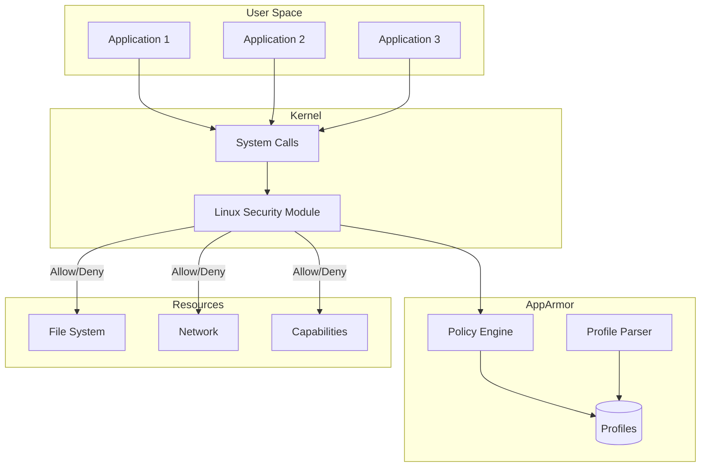
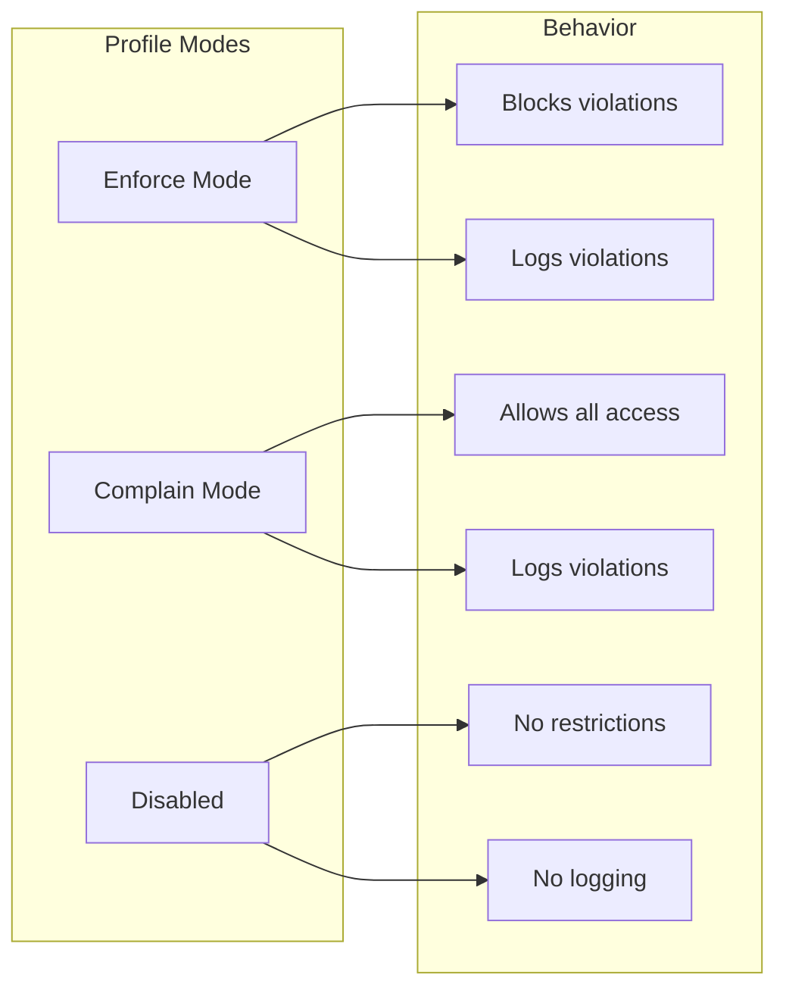
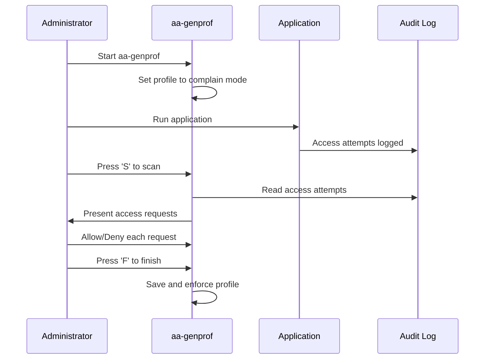
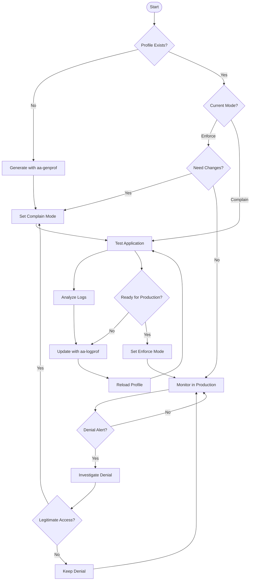

# How to Configure AppArmor Security Profiles

Author: [nawazdhandala](https://www.github.com/nawazdhandala)

Tags: AppArmor, Linux Security, Mandatory Access Control, Ubuntu, Debian, Security Profiles, Hardening

Description: Learn how to configure AppArmor security profiles to restrict application capabilities and protect your Linux systems from potential security threats.

---

> AppArmor is a Mandatory Access Control (MAC) security system that confines programs to a limited set of resources. Unlike traditional discretionary access controls, AppArmor profiles define exactly what files, network access, and capabilities each application can use.

Your web server should not be reading SSH keys. Your database should not be executing shell commands. AppArmor makes sure they cannot.

---

## Understanding AppArmor Architecture

AppArmor works by associating security profiles with programs:



---

## Checking AppArmor Status

Before configuring profiles, verify AppArmor is running:

```bash
# Check if AppArmor is enabled in the kernel
cat /sys/module/apparmor/parameters/enabled
# Output: Y (if enabled)

# Check AppArmor service status
sudo systemctl status apparmor

# List all loaded profiles and their modes
sudo aa-status
```

Example output from `aa-status`:

```
apparmor module is loaded.
47 profiles are loaded.
45 profiles are in enforce mode.
   /usr/bin/man
   /usr/sbin/mysqld
   /usr/sbin/nginx
2 profiles are in complain mode.
   /usr/bin/custom-app
3 processes have profiles defined.
```

---

## Profile Modes Explained

AppArmor profiles operate in different modes:



```bash
# Switch profile to enforce mode (blocks violations)
sudo aa-enforce /etc/apparmor.d/usr.sbin.nginx

# Switch profile to complain mode (logs but allows)
sudo aa-complain /etc/apparmor.d/usr.sbin.nginx

# Disable a profile entirely
sudo aa-disable /etc/apparmor.d/usr.sbin.nginx
```

---

## Creating a Basic AppArmor Profile

Let's create a profile for a custom application:

```bash
# Create a new profile file
sudo nano /etc/apparmor.d/usr.local.bin.myapp
```

Basic profile structure:

```bash
# AppArmor profile for /usr/local/bin/myapp
# This profile restricts the application to only necessary resources

#include <tunables/global>

# Profile definition - path must match the executable
/usr/local/bin/myapp {
  # Include common abstractions for basic functionality
  #include <abstractions/base>

  # Allow reading the application binary
  /usr/local/bin/myapp mr,

  # Allow reading configuration files
  /etc/myapp/** r,
  /etc/myapp/config.yml r,

  # Allow reading and writing to data directory
  /var/lib/myapp/** rw,

  # Allow reading and writing to log files
  /var/log/myapp/** rw,
  /var/log/myapp/ r,

  # Allow reading shared libraries
  /usr/lib/** mr,
  /lib/** mr,

  # Allow network access (TCP)
  network inet stream,
  network inet6 stream,

  # Deny access to sensitive files explicitly
  deny /etc/shadow r,
  deny /etc/passwd w,
  deny /root/** rwx,
}
```

---

## Permission Flags Reference

Understanding the permission flags is essential:

| Flag | Permission | Description |
|------|------------|-------------|
| `r` | Read | Read file contents |
| `w` | Write | Write to file |
| `a` | Append | Append to file only |
| `m` | Memory map | Memory map executable |
| `x` | Execute | Execute file |
| `l` | Link | Create hard links |
| `k` | Lock | File locking |
| `ix` | Inherit execute | Execute and inherit current profile |
| `px` | Profile execute | Execute with specific profile |
| `ux` | Unconfined execute | Execute without any profile |
| `cx` | Child execute | Execute with child profile |

---

## Generating Profiles Automatically

Use `aa-genprof` to generate profiles by monitoring application behavior:

```bash
# Start profile generation for an application
# This will monitor the app and ask about each access
sudo aa-genprof /usr/local/bin/myapp

# In another terminal, run your application through all its features
# Exercise all normal functionality to capture required permissions
/usr/local/bin/myapp --all-features

# Return to aa-genprof terminal and press 'S' to scan logs
# Then 'F' to finish and save the profile
```

The workflow for `aa-genprof`:



---

## Profile for Web Server (Nginx)

Here is an example profile for Nginx:

```bash
# /etc/apparmor.d/usr.sbin.nginx
# AppArmor profile for Nginx web server

#include <tunables/global>

/usr/sbin/nginx {
  # Base abstractions
  #include <abstractions/base>
  #include <abstractions/nameservice>

  # Capabilities required by nginx
  capability net_bind_service,  # Bind to ports below 1024
  capability setuid,            # Change user ID
  capability setgid,            # Change group ID
  capability dac_override,      # Override file permissions

  # Nginx binary and modules
  /usr/sbin/nginx mr,
  /usr/lib/nginx/modules/** mr,

  # Configuration files (read only)
  /etc/nginx/** r,
  /etc/nginx/nginx.conf r,
  /etc/nginx/sites-enabled/** r,
  /etc/nginx/sites-available/** r,
  /etc/nginx/conf.d/** r,

  # SSL certificates (read only)
  /etc/ssl/** r,
  /etc/letsencrypt/** r,

  # Web content directory (read only)
  /var/www/** r,
  /var/www/html/** r,

  # Log files (write access)
  /var/log/nginx/** rw,
  /var/log/nginx/ r,

  # PID and lock files
  /run/nginx.pid rw,
  /var/run/nginx.pid rw,

  # Temporary files for uploads
  /var/lib/nginx/tmp/** rw,
  /var/cache/nginx/** rw,

  # Network access
  network inet stream,
  network inet6 stream,

  # Unix sockets for PHP-FPM
  /run/php/*.sock rw,

  # Explicitly deny sensitive paths
  deny /etc/shadow r,
  deny /root/** rwx,
  deny /home/** rwx,
  deny /proc/*/mem rwx,
}
```

---

## Profile for Database (MySQL/MariaDB)

Securing a database server with AppArmor:

```bash
# /etc/apparmor.d/usr.sbin.mysqld
# AppArmor profile for MySQL/MariaDB database server

#include <tunables/global>

/usr/sbin/mysqld {
  #include <abstractions/base>
  #include <abstractions/nameservice>
  #include <abstractions/mysql>

  # Required capabilities
  capability dac_override,
  capability setgid,
  capability setuid,
  capability sys_resource,

  # MySQL binary
  /usr/sbin/mysqld mr,

  # Configuration
  /etc/mysql/** r,
  /etc/mysql/my.cnf r,
  /etc/mysql/mysql.conf.d/** r,
  /etc/mysql/conf.d/** r,

  # Data directory (full access)
  /var/lib/mysql/ r,
  /var/lib/mysql/** rwk,

  # Temporary directory
  /tmp/** rw,
  /var/tmp/** rw,

  # Log files
  /var/log/mysql/ r,
  /var/log/mysql/** rw,

  # Runtime files
  /run/mysqld/ r,
  /run/mysqld/** rw,
  /var/run/mysqld/ r,
  /var/run/mysqld/** rw,

  # Socket file
  /var/run/mysqld/mysqld.sock rw,

  # Network (disable if only using sockets)
  network inet stream,
  network inet6 stream,

  # Deny access to other application data
  deny /var/www/** rwx,
  deny /home/** rwx,
  deny /root/** rwx,
}
```

---

## Using Abstractions

Abstractions are reusable profile components:

```bash
# View available abstractions
ls /etc/apparmor.d/abstractions/

# Common abstractions:
# - base: Basic system access
# - nameservice: DNS, passwd, group lookups
# - authentication: PAM, login services
# - ssl_certs: SSL certificate access
# - php: PHP interpreter access
# - python: Python interpreter access
```

Create a custom abstraction:

```bash
# /etc/apparmor.d/abstractions/mycompany-base
# Custom abstraction for company applications

# Common library paths
/opt/mycompany/lib/** mr,
/opt/mycompany/share/** r,

# Company CA certificates
/etc/mycompany/ssl/** r,

# Shared configuration
/etc/mycompany/common.conf r,

# Shared logging directory
/var/log/mycompany/ r,
/var/log/mycompany/** rw,
```

Use the custom abstraction in profiles:

```bash
/usr/local/bin/myapp {
  #include <abstractions/base>
  #include <abstractions/mycompany-base>

  # App-specific rules here
  /usr/local/bin/myapp mr,
}
```

---

## Testing and Debugging Profiles

Test profiles before enforcing them:

```bash
# Put profile in complain mode first
sudo aa-complain /etc/apparmor.d/usr.local.bin.myapp

# Run your application and check for denials
sudo journalctl -f | grep apparmor

# Or check the audit log
sudo tail -f /var/log/audit/audit.log | grep apparmor

# Alternative: check dmesg
sudo dmesg | grep apparmor
```

Example denial message:

```
audit: type=1400 audit(1706097600.123:456): apparmor="DENIED"
  operation="open" profile="/usr/local/bin/myapp" name="/etc/secret.conf"
  pid=1234 comm="myapp" requested_mask="r" denied_mask="r"
```

Interpreting the denial:
- `apparmor="DENIED"`: Access was blocked
- `profile`: Which profile blocked it
- `name`: The file that was accessed
- `requested_mask="r"`: Read access was requested
- `operation`: Type of operation (open, read, write, exec)

---

## Updating Profiles with aa-logprof

After finding denials, use `aa-logprof` to update profiles:

```bash
# Scan logs and interactively update profiles
sudo aa-logprof

# Example interaction:
# Profile: /usr/local/bin/myapp
# Path: /etc/newconfig.conf
# Mode: r
#
# [A]llow / [(D)eny] / (I)gnore / (G)lob / Glob with (E)xtension / (N)ew / (S)ave
```

Options explained:
- **Allow**: Add this rule to the profile
- **Deny**: Add explicit deny rule
- **Ignore**: Skip this entry
- **Glob**: Use wildcard pattern
- **New**: Create new profile for executed binary
- **Save**: Save changes and continue

---

## Profile Workflow Diagram

The complete workflow for managing AppArmor profiles:



---

## Managing Multiple Profiles

Commands for bulk profile management:

```bash
# Reload all profiles after editing
sudo systemctl reload apparmor

# Or reload a specific profile
sudo apparmor_parser -r /etc/apparmor.d/usr.sbin.nginx

# Load a new profile
sudo apparmor_parser -a /etc/apparmor.d/usr.local.bin.myapp

# Remove a profile from kernel (temporary)
sudo apparmor_parser -R /etc/apparmor.d/usr.local.bin.myapp

# Check syntax without loading
sudo apparmor_parser -p /etc/apparmor.d/usr.local.bin.myapp
```

---

## Securing Containers with AppArmor

Apply AppArmor profiles to Docker containers:

```bash
# Run container with default docker profile
docker run --security-opt apparmor=docker-default nginx

# Run container with custom profile
docker run --security-opt apparmor=my-nginx-profile nginx

# Disable AppArmor for a container (not recommended)
docker run --security-opt apparmor=unconfined nginx
```

Custom profile for containers:

```bash
# /etc/apparmor.d/my-container-profile
#include <tunables/global>

profile my-container-profile flags=(attach_disconnected,mediate_deleted) {
  #include <abstractions/base>

  # Container-specific rules
  network inet stream,
  network inet6 stream,

  # Deny dangerous capabilities
  deny capability sys_admin,
  deny capability sys_ptrace,

  # Allow reading container filesystem
  / r,
  /** r,

  # Allow writing to specific paths only
  /tmp/** rw,
  /var/run/** rw,

  # Deny access to host paths (if mounted)
  deny /host/** rwx,
  deny /etc/shadow r,
}
```

---

## Common Issues and Solutions

### Issue 1: Profile Not Loading

```bash
# Check for syntax errors
sudo apparmor_parser -p /etc/apparmor.d/profile_name

# View detailed parsing output
sudo apparmor_parser -v /etc/apparmor.d/profile_name

# Common fix: Check include paths exist
ls /etc/apparmor.d/abstractions/
ls /etc/apparmor.d/tunables/
```

### Issue 2: Application Fails After Enabling Profile

```bash
# Switch to complain mode temporarily
sudo aa-complain /etc/apparmor.d/profile_name

# Collect denials
sudo journalctl --since "5 minutes ago" | grep apparmor

# Update profile
sudo aa-logprof

# Re-enable enforce mode
sudo aa-enforce /etc/apparmor.d/profile_name
```

### Issue 3: Child Process Denied

```bash
# Add proper execution rules for child processes
/path/to/child_process px -> child_profile,

# Or inherit parent profile
/path/to/child_process ix,

# Or run unconfined (use sparingly)
/path/to/child_process ux,
```

---

## Best Practices

Follow these guidelines for effective AppArmor configuration:

1. **Start in complain mode**: Always test profiles in complain mode before enforcing
2. **Use abstractions**: Leverage existing abstractions for common functionality
3. **Principle of least privilege**: Only grant necessary permissions
4. **Document profiles**: Add comments explaining why each rule exists
5. **Version control**: Keep profiles in git for change tracking
6. **Regular audits**: Review profiles periodically for outdated rules
7. **Monitor denials**: Set up alerts for AppArmor denials in production
8. **Test thoroughly**: Exercise all application features during profile generation

---

## Monitoring AppArmor in Production

Set up monitoring for AppArmor events:

```bash
# Create a script to monitor AppArmor denials
#!/bin/bash
# /usr/local/bin/apparmor-monitor.sh

# Monitor for AppArmor denials and alert
journalctl -f -k | grep --line-buffered "apparmor=\"DENIED\"" | while read line; do
    # Extract profile and path from denial
    profile=$(echo "$line" | grep -oP 'profile="\K[^"]+')
    path=$(echo "$line" | grep -oP 'name="\K[^"]+')

    # Log to monitoring system
    logger -p security.warning "AppArmor denial: $profile accessing $path"

    # Send alert (customize for your alerting system)
    # curl -X POST http://alerting-system/webhook -d "AppArmor: $profile denied $path"
done
```

---

## Summary

AppArmor provides powerful application confinement with manageable complexity:

- Profiles define exactly what each application can access
- Complain mode allows safe testing before enforcement
- Automatic profile generation with `aa-genprof` simplifies creation
- Abstractions enable reusable security policies
- Integration with containers extends protection to modern workloads

Start with the most exposed applications (web servers, databases) and gradually expand coverage. Remember that a well-tuned AppArmor profile is a critical layer in your defense-in-depth security strategy.
