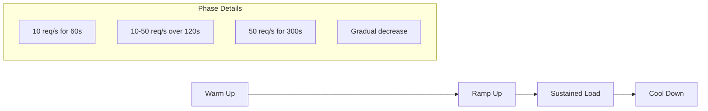

# How to Configure Artillery for Load Testing

Author: [nawazdhandala](https://www.github.com/nawazdhandala)

Tags: Artillery, Load Testing, Performance Testing, Node.js, DevOps, CI/CD

Description: A practical guide to configuring Artillery for load testing your applications, including scenarios, phases, custom logic, and integration with CI/CD pipelines.

---

Artillery is a modern, powerful load testing toolkit built on Node.js. It lets you write performance tests as code, simulate realistic user behavior, and catch performance regressions before they hit production. If you're running any kind of web service, API, or WebSocket server, Artillery should be part of your testing toolkit.

## Installing Artillery

Artillery runs on Node.js and can be installed globally or as a project dependency. For CI/CD integration, installing as a dev dependency is recommended so your tests run with a consistent version.

```bash
# Install globally for quick testing
npm install -g artillery

# Or as a dev dependency (recommended for projects)
npm install --save-dev artillery

# Verify installation
npx artillery version
```

## Your First Load Test

### Basic Configuration

Artillery tests are defined in YAML files. The configuration specifies your target, test phases, and scenarios. Let's start with a simple example that tests an API endpoint.

```yaml
# load-test.yaml
config:
  # Target URL - the base URL for all requests
  target: "https://api.example.com"

  # Test phases define how load ramps up over time
  phases:
    # Warm-up phase: 10 users per second for 60 seconds
    - duration: 60
      arrivalRate: 10
      name: "Warm up"

    # Ramp-up phase: increase from 10 to 50 users per second
    - duration: 120
      arrivalRate: 10
      rampTo: 50
      name: "Ramp up load"

    # Sustained load: maintain 50 users per second
    - duration: 300
      arrivalRate: 50
      name: "Sustained load"

scenarios:
  # Each scenario defines a user journey
  - name: "Get user profile"
    flow:
      # GET request to /api/users endpoint
      - get:
          url: "/api/users/123"
```

Run the test:

```bash
# Execute the load test
npx artillery run load-test.yaml

# Generate HTML report
npx artillery run load-test.yaml --output results.json
npx artillery report results.json
```

## Understanding Test Phases

Phases control how virtual users arrive at your system. The diagram below shows a typical load test pattern with warm-up, ramp-up, and sustained load phases.



### Advanced Phase Configuration

```yaml
config:
  target: "https://api.example.com"
  phases:
    # Fixed rate phase
    - duration: 60
      arrivalRate: 20
      name: "Constant load"

    # Ramp phase - gradual increase
    - duration: 120
      arrivalRate: 20
      rampTo: 100
      name: "Ramp to peak"

    # Pause phase - useful for recovery testing
    - duration: 30
      arrivalRate: 0
      name: "Recovery period"

    # Spike test - sudden load increase
    - duration: 10
      arrivalRate: 200
      name: "Spike"
```

## Writing Realistic Scenarios

Real users don't just hit a single endpoint. They browse, search, add items to carts, and check out. Artillery lets you model these complex flows.

### Multi-Step User Journey

```yaml
config:
  target: "https://shop.example.com"
  phases:
    - duration: 300
      arrivalRate: 10

scenarios:
  - name: "Shopping flow"
    # Weight determines how often this scenario runs
    weight: 7
    flow:
      # Browse products
      - get:
          url: "/api/products"
          capture:
            # Extract product ID from response for later use
            - json: "$.products[0].id"
              as: "productId"

      # Think time - simulates user reading the page
      - think: 3

      # View product details
      - get:
          url: "/api/products/{{ productId }}"

      - think: 2

      # Add to cart
      - post:
          url: "/api/cart"
          json:
            productId: "{{ productId }}"
            quantity: 1
          capture:
            - json: "$.cartId"
              as: "cartId"

      # Checkout
      - post:
          url: "/api/checkout"
          json:
            cartId: "{{ cartId }}"
          expect:
            # Verify successful response
            - statusCode: 200

  - name: "Quick browse"
    # Lower weight - runs less frequently
    weight: 3
    flow:
      - get:
          url: "/api/products"
      - think: 5
```

### Using Variables and Data Files

Load data from CSV files to make tests more realistic. This is useful for testing with different user credentials or product IDs.

```yaml
config:
  target: "https://api.example.com"
  # Load test data from CSV
  payload:
    path: "users.csv"
    fields:
      - "username"
      - "password"
    # Use data sequentially or randomly
    order: random
  phases:
    - duration: 300
      arrivalRate: 20

scenarios:
  - name: "User login flow"
    flow:
      - post:
          url: "/api/login"
          json:
            username: "{{ username }}"
            password: "{{ password }}"
          capture:
            - json: "$.token"
              as: "authToken"

      # Use captured token for authenticated requests
      - get:
          url: "/api/profile"
          headers:
            Authorization: "Bearer {{ authToken }}"
```

Create a CSV file with test data:

```csv
username,password
user1@test.com,password123
user2@test.com,password456
user3@test.com,password789
```

## Custom Logic with JavaScript

When YAML isn't enough, Artillery supports custom JavaScript functions for complex scenarios. Create a processor file to handle authentication, data transformation, or custom assertions.

```javascript
// processor.js
module.exports = {
  // Generate unique order ID for each request
  generateOrderId: function(context, events, done) {
    context.vars.orderId = `ORD-${Date.now()}-${Math.random().toString(36).substr(2, 9)}`;
    return done();
  },

  // Custom authentication logic
  setAuthHeader: function(requestParams, context, ee, next) {
    // Generate JWT or fetch from auth service
    const token = generateToken(context.vars.userId);
    requestParams.headers = requestParams.headers || {};
    requestParams.headers['Authorization'] = `Bearer ${token}`;
    return next();
  },

  // Log response for debugging
  logResponse: function(requestParams, response, context, ee, next) {
    if (response.statusCode !== 200) {
      console.log(`Error: ${response.statusCode} - ${response.body}`);
    }
    return next();
  },

  // Custom validation
  validateResponse: function(requestParams, response, context, ee, next) {
    const body = JSON.parse(response.body);
    if (!body.success) {
      // Emit custom metric
      ee.emit('counter', 'validation_failures', 1);
    }
    return next();
  }
};
```

Reference the processor in your test:

```yaml
config:
  target: "https://api.example.com"
  processor: "./processor.js"
  phases:
    - duration: 120
      arrivalRate: 10

scenarios:
  - name: "Order placement"
    flow:
      # Call custom function before request
      - function: "generateOrderId"
      - post:
          url: "/api/orders"
          # Use beforeRequest hook
          beforeRequest: "setAuthHeader"
          # Use afterResponse hook
          afterResponse: "validateResponse"
          json:
            orderId: "{{ orderId }}"
            items:
              - productId: "PROD-001"
                quantity: 2
```

## Setting Performance Thresholds

Define acceptable performance criteria and fail the test if they aren't met. This is essential for CI/CD integration.

```yaml
config:
  target: "https://api.example.com"
  phases:
    - duration: 300
      arrivalRate: 50

  # Define performance thresholds
  ensure:
    # 95th percentile response time under 500ms
    p95: 500
    # 99th percentile under 1000ms
    p99: 1000
    # Median response time under 200ms
    median: 200
    # Maximum response time under 3000ms
    max: 3000
    # Error rate below 1%
    maxErrorRate: 1

scenarios:
  - flow:
      - get:
          url: "/api/health"
```

## Testing WebSocket Connections

Artillery supports WebSocket testing for real-time applications. This is useful for chat apps, live dashboards, or any service using persistent connections.

```yaml
config:
  target: "wss://realtime.example.com"
  phases:
    - duration: 120
      arrivalRate: 10

scenarios:
  - name: "Chat session"
    engine: ws
    flow:
      # Connect to WebSocket
      - send: '{"type": "join", "room": "general"}'

      # Wait for acknowledgment
      - think: 1

      # Send messages
      - loop:
          - send: '{"type": "message", "text": "Hello!"}'
          - think: 2
        count: 5

      # Leave room
      - send: '{"type": "leave"}'
```

## CI/CD Integration

Integrate Artillery into your deployment pipeline to catch performance regressions early. Here's an example GitHub Actions workflow.

```yaml
# .github/workflows/load-test.yaml
name: Load Test

on:
  push:
    branches: [main]
  pull_request:
    branches: [main]

jobs:
  load-test:
    runs-on: ubuntu-latest

    steps:
      - uses: actions/checkout@v4

      - name: Setup Node.js
        uses: actions/setup-node@v4
        with:
          node-version: '20'

      - name: Install Artillery
        run: npm install -g artillery

      - name: Run load test
        run: |
          artillery run tests/load-test.yaml \
            --output results.json \
            --quiet

      - name: Generate report
        if: always()
        run: artillery report results.json --output report.html

      - name: Upload report
        if: always()
        uses: actions/upload-artifact@v4
        with:
          name: load-test-report
          path: report.html

      - name: Check thresholds
        run: |
          # Artillery exits with non-zero code if thresholds fail
          artillery run tests/load-test.yaml --ensure
```

## Distributed Load Testing

For large-scale tests, Artillery Pro supports distributed testing across multiple workers. For the open-source version, you can run multiple instances manually.

```bash
# Run test on multiple machines
# Machine 1
artillery run load-test.yaml --output results-1.json

# Machine 2
artillery run load-test.yaml --output results-2.json

# Combine results
artillery report results-1.json results-2.json --output combined-report.html
```

## Best Practices

1. **Start small**: Begin with low load and gradually increase to find your system's limits.
2. **Use realistic data**: Load test with production-like data volumes and patterns.
3. **Include think time**: Real users pause between actions. Add `think` steps to simulate this.
4. **Monitor your system**: Run load tests while watching CPU, memory, and database metrics.
5. **Test regularly**: Integrate load tests into CI/CD to catch regressions early.
6. **Test in production-like environments**: Staging environments should mirror production infrastructure.

---

Artillery makes load testing accessible and maintainable. Start with simple tests, add complexity as needed, and integrate into your deployment pipeline. Your future self will thank you when you catch that performance regression before it becomes a production incident.
