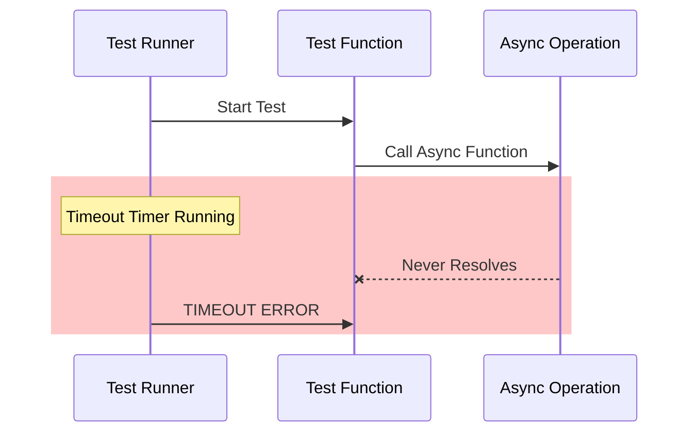
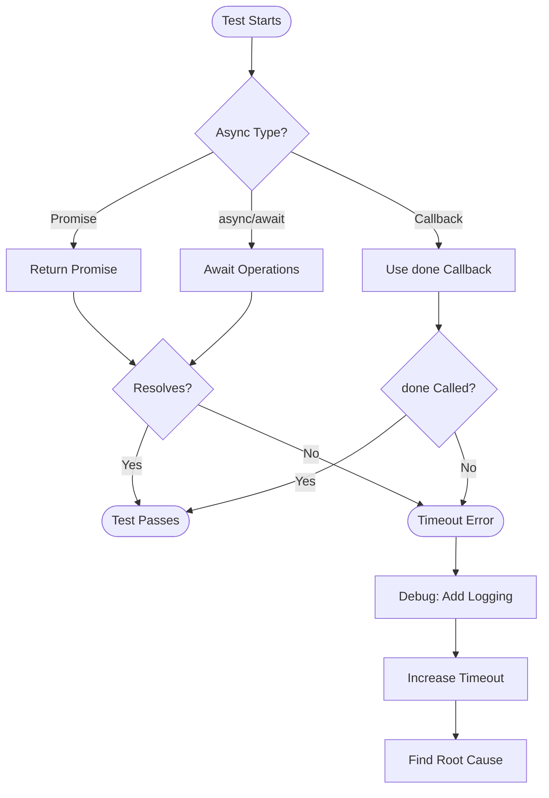

# How to Fix 'Async Test' Timeout Errors

Author: [nawazdhandala](https://www.github.com/nawazdhandala)

Tags: Testing, JavaScript, Async, Jest, Mocha, Timeout, Node.js, Debugging

Description: Learn how to diagnose and fix async test timeout errors in JavaScript testing frameworks including Jest, Mocha, and Vitest.

---

Async test timeout errors are among the most frustrating issues to debug. Your test hangs, eventually fails with a timeout message, and you're left wondering whether the issue is your code, your test, or the testing framework itself. This guide covers the common causes and practical solutions for async timeout errors across popular JavaScript testing frameworks.

## Understanding Async Test Timeouts

When a test involves asynchronous operations, the test runner needs to know when the operation completes. If the test doesn't signal completion within the configured timeout period, the runner assumes something went wrong and fails the test.



## Common Causes and Solutions

### 1. Forgetting to Return Promises

The most common cause is simply forgetting to return or await a promise:

```javascript
// WRONG - Promise not returned
test('fetches user data', () => {
  // This test will pass before the assertion runs
  fetchUser(1).then(user => {
    expect(user.name).toBe('John');
  });
});

// CORRECT - Return the promise
test('fetches user data', () => {
  return fetchUser(1).then(user => {
    expect(user.name).toBe('John');
  });
});

// CORRECT - Use async/await
test('fetches user data', async () => {
  const user = await fetchUser(1);
  expect(user.name).toBe('John');
});
```

### 2. Missing done() Callback

When using the done callback pattern, forgetting to call it causes timeouts:

```javascript
// WRONG - done() never called
test('processes data', (done) => {
  processData((result) => {
    expect(result).toBe('success');
    // Missing done() call!
  });
});

// CORRECT - Call done() after assertions
test('processes data', (done) => {
  processData((result) => {
    expect(result).toBe('success');
    done();
  });
});

// CORRECT - Call done.fail() on errors
test('processes data', (done) => {
  processData((error, result) => {
    if (error) {
      done.fail(error);
      return;
    }
    expect(result).toBe('success');
    done();
  });
});
```

### 3. Promises That Never Resolve

Sometimes the underlying code has bugs that prevent promises from resolving:

```javascript
// Problematic function - might never resolve
function fetchWithRetry(url, maxRetries = 3) {
  return new Promise((resolve, reject) => {
    let attempts = 0;

    function attempt() {
      fetch(url)
        .then(resolve)
        .catch(error => {
          attempts++;
          if (attempts < maxRetries) {
            // BUG: If this branch runs infinitely,
            // promise never resolves
            attempt();
          }
          // BUG: Missing else with reject!
        });
    }

    attempt();
  });
}

// Fixed version
function fetchWithRetry(url, maxRetries = 3) {
  return new Promise((resolve, reject) => {
    let attempts = 0;

    function attempt() {
      fetch(url)
        .then(resolve)
        .catch(error => {
          attempts++;
          if (attempts < maxRetries) {
            attempt();
          } else {
            reject(error); // Now the promise will reject
          }
        });
    }

    attempt();
  });
}
```

## Framework-Specific Solutions

### Jest Configuration

Configure timeouts in Jest at different levels:

```javascript
// jest.config.js - Global timeout
module.exports = {
  testTimeout: 10000, // 10 seconds for all tests
};

// Per-file timeout
jest.setTimeout(15000);

// Per-test timeout
test('slow operation', async () => {
  await slowOperation();
}, 30000); // 30 seconds for this test only

// Per-describe block
describe('slow tests', () => {
  beforeAll(() => {
    jest.setTimeout(30000);
  });

  test('first slow test', async () => {
    await slowOperation();
  });

  test('second slow test', async () => {
    await anotherSlowOperation();
  });
});
```

### Mocha Configuration

Mocha offers similar timeout controls:

```javascript
// .mocharc.json - Global timeout
{
  "timeout": 10000
}

// Per-test timeout
it('slow operation', async function() {
  this.timeout(30000); // Must use function(), not arrow
  await slowOperation();
});

// Per-suite timeout
describe('slow tests', function() {
  this.timeout(30000);

  it('first slow test', async function() {
    await slowOperation();
  });
});

// Disable timeout for debugging
it('debugging test', async function() {
  this.timeout(0); // No timeout
  await debugOperation();
});
```

### Vitest Configuration

Vitest provides modern timeout configuration:

```javascript
// vitest.config.js
import { defineConfig } from 'vitest/config';

export default defineConfig({
  test: {
    testTimeout: 10000,
    hookTimeout: 10000,
  },
});

// Per-test timeout
import { test } from 'vitest';

test('slow operation', async () => {
  await slowOperation();
}, { timeout: 30000 });

// Using test.extend for reusable timeouts
const slowTest = test.extend({
  timeout: 30000,
});

slowTest('my slow test', async () => {
  await slowOperation();
});
```

## Debugging Timeout Strategies

### Strategy 1: Add Progress Logging

```javascript
test('complex async flow', async () => {
  console.log('Starting test');

  console.log('Fetching user...');
  const user = await fetchUser(1);
  console.log('User fetched:', user.id);

  console.log('Processing data...');
  const result = await processUserData(user);
  console.log('Data processed');

  console.log('Saving results...');
  await saveResults(result);
  console.log('Results saved');

  expect(result.status).toBe('complete');
});
```

### Strategy 2: Wrap with Timeout Utility

```javascript
// timeout-utils.js
function withTimeout(promise, ms, message = 'Operation timed out') {
  const timeout = new Promise((_, reject) => {
    setTimeout(() => reject(new Error(message)), ms);
  });
  return Promise.race([promise, timeout]);
}

// In your test
test('fetches user with custom timeout', async () => {
  const user = await withTimeout(
    fetchUser(1),
    5000,
    'fetchUser took longer than 5 seconds'
  );
  expect(user.name).toBe('John');
});
```

### Strategy 3: Use AbortController

```javascript
test('cancellable fetch operation', async () => {
  const controller = new AbortController();

  // Set a timeout to abort
  const timeoutId = setTimeout(() => {
    controller.abort();
  }, 5000);

  try {
    const response = await fetch('/api/data', {
      signal: controller.signal
    });
    const data = await response.json();
    expect(data).toBeDefined();
  } finally {
    clearTimeout(timeoutId);
  }
});
```

## Async Test Flow Visualization



## Common Patterns That Cause Timeouts

### Pattern 1: Event Emitters Without Cleanup

```javascript
// PROBLEMATIC - Event might never fire
test('handles event', (done) => {
  const emitter = new EventEmitter();

  emitter.on('data', (data) => {
    expect(data).toBe('expected');
    done();
  });

  // If triggerEvent() fails silently, done() never runs
  triggerEvent(emitter);
});

// FIXED - Add timeout and error handling
test('handles event', (done) => {
  const emitter = new EventEmitter();
  const timeout = setTimeout(() => {
    done.fail('Event never fired');
  }, 5000);

  emitter.on('data', (data) => {
    clearTimeout(timeout);
    expect(data).toBe('expected');
    done();
  });

  emitter.on('error', (error) => {
    clearTimeout(timeout);
    done.fail(error);
  });

  triggerEvent(emitter);
});
```

### Pattern 2: Database Connection Issues

```javascript
// PROBLEMATIC - Connection might hang
test('queries database', async () => {
  const connection = await db.connect();
  const results = await connection.query('SELECT * FROM users');
  expect(results.length).toBeGreaterThan(0);
});

// FIXED - Add connection timeout and cleanup
test('queries database', async () => {
  const connection = await db.connect({
    connectionTimeout: 5000,
    requestTimeout: 10000
  });

  try {
    const results = await connection.query('SELECT * FROM users');
    expect(results.length).toBeGreaterThan(0);
  } finally {
    await connection.close();
  }
});
```

### Pattern 3: Unresolved Mock Responses

```javascript
// PROBLEMATIC - Mock never responds
test('fetches data', async () => {
  jest.spyOn(api, 'fetch').mockImplementation(() => {
    // Returns undefined, not a promise!
  });

  const data = await api.fetch('/endpoint');
  expect(data).toBeDefined();
});

// FIXED - Return proper mock promise
test('fetches data', async () => {
  jest.spyOn(api, 'fetch').mockResolvedValue({
    data: 'mocked response'
  });

  const data = await api.fetch('/endpoint');
  expect(data).toBeDefined();
});
```

## Best Practices

### 1. Set Reasonable Default Timeouts

```javascript
// jest.config.js
module.exports = {
  testTimeout: 5000, // 5 seconds is reasonable for unit tests

  // Different timeouts for different test types
  projects: [
    {
      displayName: 'unit',
      testMatch: ['**/*.unit.test.js'],
      testTimeout: 5000,
    },
    {
      displayName: 'integration',
      testMatch: ['**/*.integration.test.js'],
      testTimeout: 30000,
    },
  ],
};
```

### 2. Always Clean Up Resources

```javascript
describe('Database tests', () => {
  let connection;

  beforeAll(async () => {
    connection = await db.connect();
  });

  afterAll(async () => {
    // Always close connections
    if (connection) {
      await connection.close();
    }
  });

  afterEach(async () => {
    // Clean up test data
    await connection.query('DELETE FROM test_users');
  });
});
```

### 3. Use Fake Timers for Time-Dependent Tests

```javascript
test('retries after delay', async () => {
  jest.useFakeTimers();

  const promise = retryWithDelay(mockFn, 3, 1000);

  // Fast-forward through all retries
  jest.advanceTimersByTime(3000);

  await promise;

  expect(mockFn).toHaveBeenCalledTimes(3);

  jest.useRealTimers();
});
```

## Conclusion

Async test timeout errors usually stem from one of three issues: forgetting to return or await promises, unhandled promise rejections, or operations that genuinely take too long. Start debugging by adding logging to identify where execution stalls. Use framework-specific timeout configuration to set appropriate limits for different test types. Remember that tests should be deterministic and fast - if a test regularly needs a long timeout, consider whether it should be restructured or moved to a different test suite. With proper async handling patterns, timeout errors become rare exceptions rather than regular frustrations.
