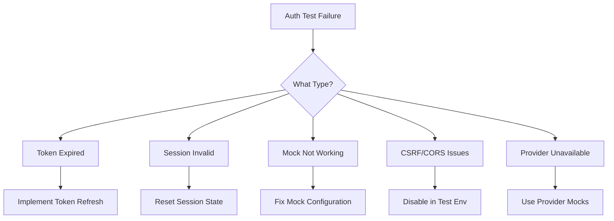

# How to Fix "Authentication" Test Issues

Author: [nawazdhandala](https://www.github.com/nawazdhandala)

Tags: Testing, Authentication, Security, JWT, OAuth, API Testing, Unit Testing, Integration Testing

Description: A practical guide to fixing common authentication issues in tests, including token handling, session management, and mocking auth providers.

---

Authentication tests are notoriously tricky. They involve tokens that expire, sessions that need management, third-party providers that are hard to mock, and security measures that actively try to block automated access. This guide covers the most common authentication testing issues and provides concrete solutions to fix them.

## Common Authentication Test Failures



## Issue 1: Token Expiration During Tests

JWT tokens expiring mid-test is one of the most common issues. Tests that work individually fail when run together because the token expires.

### Solution: Token Management Utility

```javascript
// auth-test-helper.js
const jwt = require('jsonwebtoken');

class TestAuthHelper {
  constructor(secretKey) {
    this.secretKey = secretKey;
    this.tokens = new Map();
  }

  /**
   * Generate a test token that will not expire during tests
   * @param {Object} payload - Token payload
   * @param {number} expiresInHours - Hours until expiration
   */
  generateTestToken(payload, expiresInHours = 24) {
    const token = jwt.sign(
      {
        ...payload,
        iat: Math.floor(Date.now() / 1000),
      },
      this.secretKey,
      { expiresIn: `${expiresInHours}h` }
    );

    this.tokens.set(payload.userId || payload.sub, token);
    return token;
  }

  /**
   * Get a fresh token, regenerating if expired
   */
  getFreshToken(userId, payload = {}) {
    const existingToken = this.tokens.get(userId);

    if (existingToken) {
      try {
        // Check if token is still valid
        jwt.verify(existingToken, this.secretKey);
        return existingToken;
      } catch (error) {
        // Token expired, generate new one
        console.log(`Token expired for user ${userId}, regenerating`);
      }
    }

    return this.generateTestToken({ userId, ...payload });
  }

  /**
   * Create authorization header
   */
  getAuthHeader(userId, payload = {}) {
    const token = this.getFreshToken(userId, payload);
    return { Authorization: `Bearer ${token}` };
  }

  /**
   * Clear all cached tokens
   */
  clearTokens() {
    this.tokens.clear();
  }
}

// Usage in tests
const authHelper = new TestAuthHelper(process.env.JWT_SECRET);

describe('Protected API Endpoints', () => {
  let authHeader;

  beforeAll(() => {
    // Generate token once for all tests
    authHeader = authHelper.getAuthHeader('test-user-1', {
      email: 'test@example.com',
      role: 'admin'
    });
  });

  afterAll(() => {
    authHelper.clearTokens();
  });

  test('GET /api/profile returns user data', async () => {
    const response = await fetch('/api/profile', {
      headers: authHeader
    });

    expect(response.status).toBe(200);
  });

  test('POST /api/settings updates settings', async () => {
    const response = await fetch('/api/settings', {
      method: 'POST',
      headers: {
        ...authHeader,
        'Content-Type': 'application/json'
      },
      body: JSON.stringify({ theme: 'dark' })
    });

    expect(response.status).toBe(200);
  });
});
```

## Issue 2: Session State Bleeding Between Tests

Tests that pass individually but fail when run together often have session state issues.

### Solution: Session Isolation

```python
# test_auth.py
import pytest
from flask import Flask
from flask.testing import FlaskClient

class IsolatedTestClient(FlaskClient):
    """Test client that ensures session isolation between tests."""

    def __init__(self, *args, **kwargs):
        super().__init__(*args, **kwargs)
        self._session_data = {}

    def reset_session(self):
        """Clear all session data."""
        self._session_data = {}
        # Clear cookies
        self.cookie_jar.clear()

@pytest.fixture
def client(app):
    """Create a test client with session isolation."""
    app.test_client_class = IsolatedTestClient
    client = app.test_client()

    yield client

    # Clean up after each test
    client.reset_session()

@pytest.fixture
def authenticated_client(client, test_user):
    """Create an authenticated test client."""
    # Perform login
    response = client.post('/auth/login', json={
        'email': test_user.email,
        'password': 'testpassword123'
    })

    assert response.status_code == 200

    # Store the auth token in client
    token = response.json['access_token']
    client.environ_base['HTTP_AUTHORIZATION'] = f'Bearer {token}'

    yield client

    # Logout and clear session
    client.post('/auth/logout')
    client.reset_session()

# Tests using isolated sessions
class TestUserProfile:
    def test_get_profile_authenticated(self, authenticated_client):
        """Authenticated users can access their profile."""
        response = authenticated_client.get('/api/profile')
        assert response.status_code == 200

    def test_get_profile_unauthenticated(self, client):
        """Unauthenticated users are rejected."""
        # This test uses a fresh client with no session
        response = client.get('/api/profile')
        assert response.status_code == 401
```

## Issue 3: Mocking OAuth Providers

External OAuth providers like Google, GitHub, or Auth0 cannot be called in tests. You need to mock them properly.

### Solution: Mock OAuth Flow

```javascript
// oauth-mock.js
const nock = require('nock');

/**
 * Mock OAuth provider responses for testing
 */
class OAuthMock {
  constructor() {
    this.mocks = [];
  }

  /**
   * Mock Google OAuth token exchange
   */
  mockGoogleAuth(userData = {}) {
    const defaultUser = {
      sub: 'google-user-123',
      email: 'test@gmail.com',
      name: 'Test User',
      picture: 'https://example.com/photo.jpg',
      email_verified: true,
      ...userData
    };

    // Mock token endpoint
    const tokenMock = nock('https://oauth2.googleapis.com')
      .post('/token')
      .reply(200, {
        access_token: 'mock-google-access-token',
        token_type: 'Bearer',
        expires_in: 3600,
        id_token: this._createMockIdToken(defaultUser)
      });

    // Mock userinfo endpoint
    const userinfoMock = nock('https://www.googleapis.com')
      .get('/oauth2/v3/userinfo')
      .reply(200, defaultUser);

    this.mocks.push(tokenMock, userinfoMock);
    return this;
  }

  /**
   * Mock GitHub OAuth flow
   */
  mockGitHubAuth(userData = {}) {
    const defaultUser = {
      id: 12345,
      login: 'testuser',
      email: 'test@github.com',
      name: 'Test User',
      avatar_url: 'https://example.com/avatar.jpg',
      ...userData
    };

    // Mock token endpoint
    const tokenMock = nock('https://github.com')
      .post('/login/oauth/access_token')
      .reply(200, {
        access_token: 'mock-github-access-token',
        token_type: 'bearer',
        scope: 'user:email'
      });

    // Mock user endpoint
    const userMock = nock('https://api.github.com')
      .get('/user')
      .reply(200, defaultUser);

    // Mock email endpoint
    const emailMock = nock('https://api.github.com')
      .get('/user/emails')
      .reply(200, [
        { email: defaultUser.email, primary: true, verified: true }
      ]);

    this.mocks.push(tokenMock, userMock, emailMock);
    return this;
  }

  /**
   * Mock Auth0 authentication
   */
  mockAuth0(domain, userData = {}) {
    const defaultUser = {
      sub: 'auth0|123456',
      email: 'test@example.com',
      email_verified: true,
      name: 'Test User',
      ...userData
    };

    // Mock token endpoint
    const tokenMock = nock(`https://${domain}`)
      .post('/oauth/token')
      .reply(200, {
        access_token: 'mock-auth0-access-token',
        token_type: 'Bearer',
        expires_in: 86400
      });

    // Mock userinfo endpoint
    const userinfoMock = nock(`https://${domain}`)
      .get('/userinfo')
      .reply(200, defaultUser);

    this.mocks.push(tokenMock, userinfoMock);
    return this;
  }

  /**
   * Create a mock ID token
   */
  _createMockIdToken(payload) {
    // Create a simple mock token (header.payload.signature)
    const header = Buffer.from(JSON.stringify({ alg: 'RS256' })).toString('base64');
    const body = Buffer.from(JSON.stringify(payload)).toString('base64');
    return `${header}.${body}.mock-signature`;
  }

  /**
   * Verify all mocked endpoints were called
   */
  verifyAllCalled() {
    return this.mocks.every(mock => mock.isDone());
  }

  /**
   * Clean up all mocks
   */
  cleanup() {
    nock.cleanAll();
    this.mocks = [];
  }
}

// Usage in tests
describe('OAuth Authentication', () => {
  let oauthMock;

  beforeEach(() => {
    oauthMock = new OAuthMock();
  });

  afterEach(() => {
    oauthMock.cleanup();
  });

  test('Google OAuth login creates user account', async () => {
    oauthMock.mockGoogleAuth({
      email: 'newuser@gmail.com',
      name: 'New User'
    });

    const response = await request(app)
      .post('/auth/google/callback')
      .send({ code: 'mock-auth-code' });

    expect(response.status).toBe(200);
    expect(response.body.user.email).toBe('newuser@gmail.com');
    expect(oauthMock.verifyAllCalled()).toBe(true);
  });

  test('GitHub OAuth links existing account', async () => {
    oauthMock.mockGitHubAuth({
      email: 'existing@example.com',
      login: 'existinguser'
    });

    const response = await request(app)
      .post('/auth/github/callback')
      .send({ code: 'mock-auth-code' });

    expect(response.status).toBe(200);
    expect(response.body.linked).toBe(true);
  });
});
```

## Issue 4: CSRF Token Mismatches

CSRF protection can cause authentication tests to fail unexpectedly.

### Solution: CSRF Token Handling

```python
# test_helpers.py
import re

class CSRFTestMixin:
    """Mixin to handle CSRF tokens in tests."""

    def get_csrf_token(self, response):
        """Extract CSRF token from response."""
        # Try to find in HTML form
        html_match = re.search(
            r'name="csrf_token"\s+value="([^"]+)"',
            response.data.decode()
        )
        if html_match:
            return html_match.group(1)

        # Try to find in cookies
        csrf_cookie = response.headers.get('Set-Cookie', '')
        cookie_match = re.search(r'csrf_token=([^;]+)', csrf_cookie)
        if cookie_match:
            return cookie_match.group(1)

        # Try JSON response
        try:
            return response.json.get('csrf_token')
        except:
            pass

        return None

    def post_with_csrf(self, client, url, data=None, **kwargs):
        """Make a POST request with proper CSRF token."""
        # First, get a page to obtain CSRF token
        get_response = client.get(url)
        csrf_token = self.get_csrf_token(get_response)

        if data is None:
            data = {}

        # Add CSRF token to form data
        data['csrf_token'] = csrf_token

        # Also add to headers for APIs
        headers = kwargs.get('headers', {})
        headers['X-CSRF-Token'] = csrf_token
        kwargs['headers'] = headers

        return client.post(url, data=data, **kwargs)

# Usage in tests
class TestLoginWithCSRF(CSRFTestMixin):
    def test_login_with_valid_csrf(self, client):
        """Login succeeds with valid CSRF token."""
        response = self.post_with_csrf(
            client,
            '/auth/login',
            data={
                'email': 'test@example.com',
                'password': 'password123'
            }
        )

        assert response.status_code == 302  # Redirect on success

    def test_login_fails_without_csrf(self, client):
        """Login fails without CSRF token."""
        response = client.post('/auth/login', data={
            'email': 'test@example.com',
            'password': 'password123'
        })

        assert response.status_code == 400  # Bad request
```

## Issue 5: Test Database Authentication State

User authentication state in the test database becoming inconsistent.

### Solution: Consistent Test User Factory

```python
# factories.py
import bcrypt
from datetime import datetime, timedelta

class TestUserFactory:
    """Factory for creating consistent test users."""

    DEFAULT_PASSWORD = 'TestPassword123!'

    def __init__(self, db_session):
        self.db = db_session
        self._password_hash = self._hash_password(self.DEFAULT_PASSWORD)

    def _hash_password(self, password):
        """Create password hash once for efficiency."""
        return bcrypt.hashpw(
            password.encode(),
            bcrypt.gensalt()
        ).decode()

    def create(self, **overrides):
        """Create a test user with sensible defaults."""
        defaults = {
            'email': f'test-{datetime.now().timestamp()}@example.com',
            'password_hash': self._password_hash,
            'is_active': True,
            'is_verified': True,
            'created_at': datetime.utcnow(),
            'last_login': None
        }

        user_data = {**defaults, **overrides}
        user = User(**user_data)

        self.db.add(user)
        self.db.commit()

        # Attach plain password for test convenience
        user._test_password = self.DEFAULT_PASSWORD

        return user

    def create_with_session(self, **overrides):
        """Create a user with an active session."""
        user = self.create(**overrides)

        session = Session(
            user_id=user.id,
            token=self._generate_session_token(),
            expires_at=datetime.utcnow() + timedelta(hours=24),
            is_active=True
        )

        self.db.add(session)
        self.db.commit()

        user._test_session = session
        return user

    def create_unverified(self, **overrides):
        """Create an unverified user."""
        return self.create(is_verified=False, **overrides)

    def create_inactive(self, **overrides):
        """Create an inactive/disabled user."""
        return self.create(is_active=False, **overrides)

# conftest.py
@pytest.fixture
def user_factory(db_session):
    """Provide user factory to tests."""
    factory = TestUserFactory(db_session)
    yield factory

@pytest.fixture
def test_user(user_factory):
    """Create a standard test user."""
    return user_factory.create()

@pytest.fixture
def authenticated_user(user_factory):
    """Create a user with an active session."""
    return user_factory.create_with_session()

# tests
class TestAuthenticationFlows:
    def test_active_user_can_login(self, client, test_user):
        """Active verified users can log in."""
        response = client.post('/auth/login', json={
            'email': test_user.email,
            'password': test_user._test_password
        })

        assert response.status_code == 200

    def test_unverified_user_cannot_login(self, client, user_factory):
        """Unverified users are rejected."""
        user = user_factory.create_unverified()

        response = client.post('/auth/login', json={
            'email': user.email,
            'password': user._test_password
        })

        assert response.status_code == 403
        assert 'verify your email' in response.json['message'].lower()
```

## Authentication Test Checklist

When troubleshooting authentication test failures, verify:

- Tokens have sufficient expiration time for the full test suite
- Session state is properly isolated between tests
- OAuth providers are mocked correctly with realistic responses
- CSRF tokens are included in form submissions and API calls
- Test users are created with consistent, known passwords
- Database state is reset between tests
- Cookies and headers are properly cleared in teardown
- Rate limiting is disabled or accounted for in test configuration

By addressing these common issues systematically, you can build a reliable authentication test suite that catches real bugs without false positives from configuration problems.
