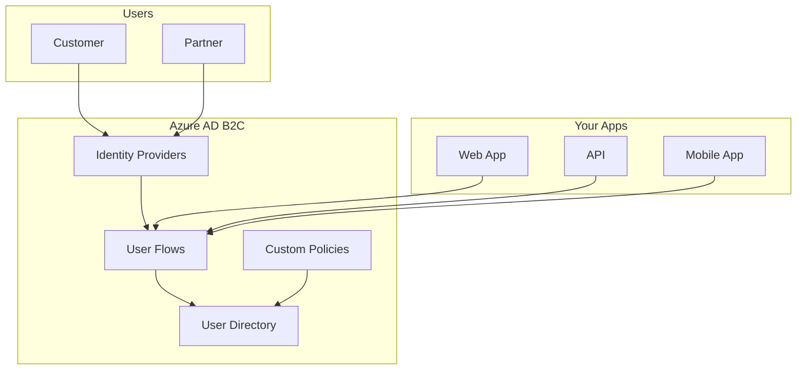
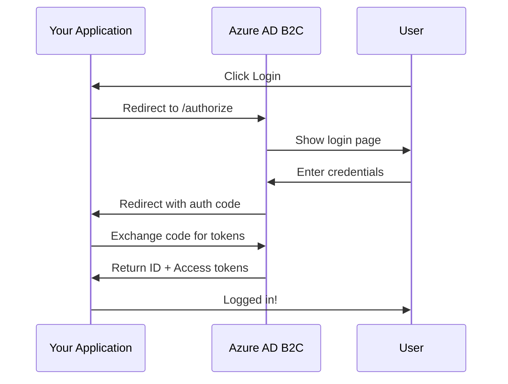
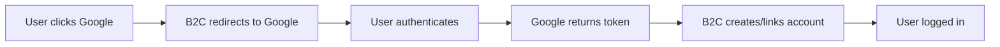

# How to Configure Azure Active Directory B2C

Author: [nawazdhandala](https://www.github.com/nawazdhandala)

Tags: Azure, Azure AD B2C, Authentication, Identity, Security, OAuth, OIDC

Description: A step-by-step guide to setting up Azure Active Directory B2C for customer authentication with user flows, custom policies, and application integration.

---

Azure Active Directory B2C (Azure AD B2C) is a customer identity management service that lets you add authentication to your applications. Unlike regular Azure AD which is for employees, B2C is designed for external users like customers and partners. This guide walks you through setting it up properly.

## Understanding Azure AD B2C Architecture

Before diving into configuration, understand how the pieces fit together.



### Key Concepts

| Component | Purpose |
|-----------|---------|
| Tenant | Your B2C directory (separate from Azure AD) |
| User Flow | Pre-built authentication journey |
| Custom Policy | XML-based custom authentication logic |
| Application Registration | Connects your app to B2C |
| Identity Provider | External login (Google, Facebook, etc.) |

## Step 1: Create Azure AD B2C Tenant

First, create a dedicated B2C tenant. This is separate from your main Azure AD.

```bash
# You cannot create B2C tenant via CLI - use Azure Portal
# Go to: Azure Portal > Create a resource > Azure Active Directory B2C

# After creation, link it to your subscription
az account set --subscription "Your Subscription"

# Verify tenant exists
az rest --method GET \
    --url "https://management.azure.com/subscriptions/{subscription-id}/providers/Microsoft.AzureActiveDirectory/b2cDirectories?api-version=2021-04-01"
```

In the Azure Portal:
1. Search for "Azure AD B2C"
2. Click "Create a new Azure AD B2C Tenant"
3. Enter organization name and domain (e.g., contosob2c.onmicrosoft.com)
4. Select your subscription and create a new resource group

## Step 2: Register Your Application

Register each application that will use B2C for authentication.



### Register Web Application

In Azure Portal under your B2C tenant:

1. Go to **App registrations** > **New registration**
2. Enter name: "My Web App"
3. Select account type: "Accounts in any identity provider or organizational directory"
4. Add redirect URI: `https://myapp.com/auth/callback`

After registration, configure additional settings:

```bash
# Get the Application (client) ID from the portal
# Then configure via Microsoft Graph API

# Add a client secret
az rest --method POST \
    --url "https://graph.microsoft.com/v1.0/applications/{app-object-id}/addPassword" \
    --body '{"passwordCredential": {"displayName": "Production Secret"}}'
```

### Configure API Permissions

For a web app that calls your API:

```json
{
    "requiredResourceAccess": [
        {
            "resourceAppId": "your-api-app-id",
            "resourceAccess": [
                {
                    "id": "scope-id-for-read",
                    "type": "Scope"
                },
                {
                    "id": "scope-id-for-write",
                    "type": "Scope"
                }
            ]
        }
    ]
}
```

## Step 3: Create User Flows

User flows are the easiest way to add authentication. They provide pre-built UI for common scenarios.

### Sign Up and Sign In Flow

1. In Azure Portal, go to **User flows**
2. Click **New user flow**
3. Select **Sign up and sign in**
4. Choose version **Recommended**

Configure the flow:

```yaml
# User flow configuration
Name: B2C_1_signupsignin
Identity providers:
  - Email signup
  - Google (if configured)
  - Facebook (if configured)

User attributes to collect:
  - Email Address (required)
  - Display Name (required)
  - Given Name
  - Surname

Application claims to return:
  - Email Addresses
  - Display Name
  - Identity Provider
  - User's Object ID
```

### Password Reset Flow

Create a separate flow for password reset:

```yaml
Name: B2C_1_passwordreset
Identity providers:
  - Email verification

User attributes:
  - Email Address (read-only)
```

### Profile Edit Flow

Allow users to update their profile:

```yaml
Name: B2C_1_profileedit
User attributes:
  - Display Name
  - Given Name
  - Surname
  - Job Title
```

## Step 4: Configure Identity Providers

Add social login options to improve user experience.

### Add Google as Identity Provider



1. Create OAuth credentials in Google Cloud Console
2. In B2C, go to **Identity providers** > **Google**
3. Enter Client ID and Client Secret from Google

```json
{
    "name": "Google",
    "type": "Google",
    "clientId": "your-google-client-id.apps.googleusercontent.com",
    "clientSecret": "your-google-client-secret"
}
```

### Add Microsoft Account

```json
{
    "name": "Microsoft",
    "type": "MicrosoftAccount",
    "clientId": "your-microsoft-app-id",
    "clientSecret": "your-microsoft-secret"
}
```

## Step 5: Integrate with Your Application

### ASP.NET Core Integration

Install the required packages:

```bash
dotnet add package Microsoft.Identity.Web
dotnet add package Microsoft.Identity.Web.UI
```

Configure authentication in your app:

```csharp
// Program.cs
var builder = WebApplication.CreateBuilder(args);

// Add B2C authentication
builder.Services.AddAuthentication(OpenIdConnectDefaults.AuthenticationScheme)
    .AddMicrosoftIdentityWebApp(options =>
    {
        builder.Configuration.Bind("AzureAdB2C", options);
        options.SignUpSignInPolicyId = "B2C_1_signupsignin";
        options.ResetPasswordPolicyId = "B2C_1_passwordreset";
        options.EditProfilePolicyId = "B2C_1_profileedit";
    });

builder.Services.AddControllersWithViews()
    .AddMicrosoftIdentityUI();

var app = builder.Build();

app.UseAuthentication();
app.UseAuthorization();
```

Configuration in appsettings.json:

```json
{
    "AzureAdB2C": {
        "Instance": "https://contosob2c.b2clogin.com",
        "Domain": "contosob2c.onmicrosoft.com",
        "ClientId": "your-app-client-id",
        "ClientSecret": "your-app-client-secret",
        "SignedOutCallbackPath": "/signout-callback-oidc",
        "SignUpSignInPolicyId": "B2C_1_signupsignin"
    }
}
```

### React/JavaScript Integration

Use MSAL.js for frontend applications:

```javascript
// authConfig.js
import { PublicClientApplication } from "@azure/msal-browser";

const msalConfig = {
    auth: {
        clientId: "your-app-client-id",
        authority: "https://contosob2c.b2clogin.com/contosob2c.onmicrosoft.com/B2C_1_signupsignin",
        knownAuthorities: ["contosob2c.b2clogin.com"],
        redirectUri: "http://localhost:3000"
    },
    cache: {
        cacheLocation: "sessionStorage",
        storeAuthStateInCookie: false
    }
};

export const msalInstance = new PublicClientApplication(msalConfig);

// Login request
export const loginRequest = {
    scopes: ["openid", "profile", "https://contosob2c.onmicrosoft.com/api/read"]
};
```

```jsx
// App.jsx
import { MsalProvider, useMsal, useIsAuthenticated } from "@azure/msal-react";
import { msalInstance, loginRequest } from "./authConfig";

function LoginButton() {
    const { instance } = useMsal();

    const handleLogin = () => {
        instance.loginRedirect(loginRequest);
    };

    return <button onClick={handleLogin}>Sign In</button>;
}

function App() {
    return (
        <MsalProvider instance={msalInstance}>
            <LoginButton />
        </MsalProvider>
    );
}
```

## Step 6: Secure Your API

Configure your API to accept B2C tokens:

```csharp
// API Program.cs
builder.Services.AddAuthentication(JwtBearerDefaults.AuthenticationScheme)
    .AddMicrosoftIdentityWebApi(options =>
    {
        builder.Configuration.Bind("AzureAdB2C", options);
        options.TokenValidationParameters.NameClaimType = "name";
    },
    options => builder.Configuration.Bind("AzureAdB2C", options));

// Protect endpoints
app.MapGet("/api/data", [Authorize] (ClaimsPrincipal user) =>
{
    var userId = user.FindFirst("sub")?.Value;
    return new { message = $"Hello {user.Identity?.Name}", userId };
});
```

API configuration:

```json
{
    "AzureAdB2C": {
        "Instance": "https://contosob2c.b2clogin.com",
        "Domain": "contosob2c.onmicrosoft.com",
        "ClientId": "your-api-client-id",
        "SignUpSignInPolicyId": "B2C_1_signupsignin"
    }
}
```

## Customizing the UI

### Custom Page Layouts

You can customize the B2C pages with your own HTML/CSS:

```html
<!-- hosted on your server at https://myapp.com/b2c/unified.html -->
<!DOCTYPE html>
<html>
<head>
    <title>Sign In - My App</title>
    <style>
        body { font-family: 'Segoe UI', sans-serif; background: #f5f5f5; }
        .container { max-width: 400px; margin: 50px auto; padding: 20px; background: white; border-radius: 8px; }
        /* The B2C content will be injected into div#api */
        #api { margin-top: 20px; }
    </style>
</head>
<body>
    <div class="container">
        
        <div id="api"></div>
    </div>
</body>
</html>
```

Configure custom UI in user flow:
1. Go to your user flow > **Page layouts**
2. Select "Unified sign up or sign in page"
3. Use custom page content: Yes
4. Enter your custom page URL

## Monitoring and Troubleshooting

### Enable Audit Logs

```bash
# View sign-in logs
az rest --method GET \
    --url "https://graph.microsoft.com/v1.0/auditLogs/signIns?\$filter=appId eq 'your-app-id'"
```

### Common Issues

**Issue: "AADB2C90117 - The scope provided in the request is invalid"**

Solution: Register the API scopes correctly and use full scope URLs:

```javascript
// Wrong
scopes: ["read", "write"]

// Correct
scopes: ["https://contosob2c.onmicrosoft.com/api/read"]
```

**Issue: "AADB2C90006 - The redirect URI is not registered"**

Solution: Add all redirect URIs to your app registration, including localhost for development.

**Issue: Users cannot sign in with social providers**

Solution: Ensure the identity provider is added to the user flow under "Identity providers".

## Security Best Practices

- [ ] Use HTTPS for all redirect URIs
- [ ] Store client secrets in Azure Key Vault
- [ ] Enable MFA for sensitive applications
- [ ] Set appropriate token lifetimes
- [ ] Use refresh tokens for long sessions
- [ ] Implement proper logout (front-channel + back-channel)
- [ ] Regularly rotate client secrets

---

Azure AD B2C provides a flexible identity solution for customer-facing applications. Start with user flows for quick setup, then move to custom policies when you need more control. The key is getting the application registrations and scopes correct - most issues come from misconfigured redirect URIs or scope names.
