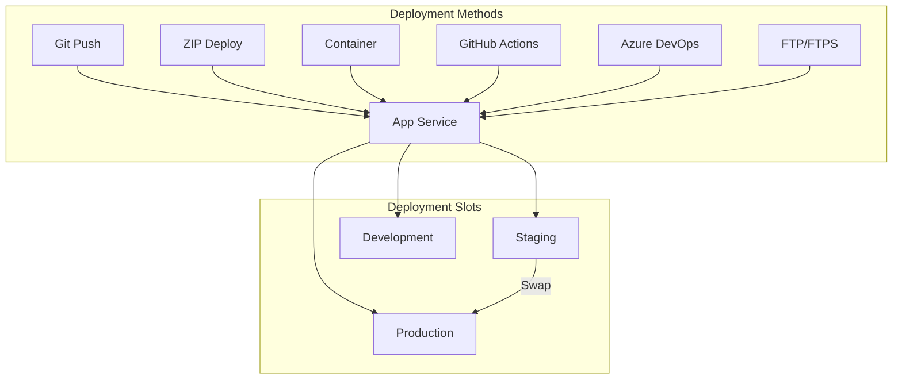
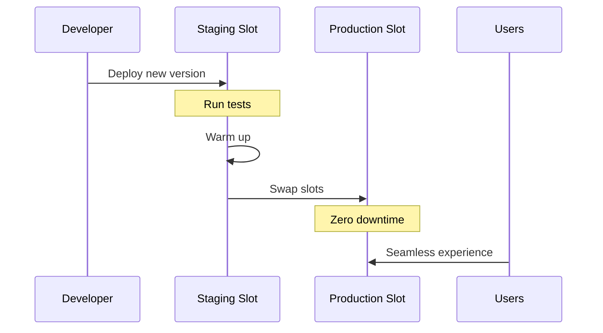

# How to Handle Azure App Service Deployment

Author: [nawazdhandala](https://www.github.com/nawazdhandala)

Tags: Azure, App Service, Deployment, CI/CD, DevOps, Web Apps, Cloud

Description: A comprehensive guide to deploying applications to Azure App Service, covering multiple deployment methods, best practices, and troubleshooting common issues.

---

Azure App Service is Microsoft's fully managed platform for hosting web applications, REST APIs, and mobile backends. Getting deployment right is critical for maintaining reliable applications. This guide covers all the major deployment methods and helps you choose the right approach for your situation.

## Deployment Methods Overview



## Method 1: Local Git Deployment

Set up a Git remote directly to App Service for simple push-to-deploy workflows.

### Configure Local Git

```bash
# Enable local git deployment
az webapp deployment source config-local-git \
  --name myapp \
  --resource-group mygroup

# Get the deployment URL (looks like https://user@myapp.scm.azurewebsites.net/myapp.git)
az webapp deployment list-publishing-credentials \
  --name myapp \
  --resource-group mygroup \
  --query scmUri \
  --output tsv
```

### Push to Deploy

```bash
# Add Azure as a remote
git remote add azure https://<deployment-username>@myapp.scm.azurewebsites.net/myapp.git

# Deploy by pushing
git push azure main

# Or deploy a different branch
git push azure feature-branch:main
```

## Method 2: ZIP Deploy

Upload a ZIP file containing your application. This is fast and works well for CI/CD pipelines.

### Using Azure CLI

```bash
# Create a ZIP of your application
cd /path/to/your/app
zip -r deploy.zip . -x "*.git*" -x "node_modules/*" -x "*.env"

# Deploy the ZIP file
az webapp deploy \
  --resource-group mygroup \
  --name myapp \
  --src-path deploy.zip \
  --type zip

# For async deployment (returns immediately)
az webapp deploy \
  --resource-group mygroup \
  --name myapp \
  --src-path deploy.zip \
  --type zip \
  --async true
```

### Using cURL

```bash
# Get publishing credentials
CREDS=$(az webapp deployment list-publishing-credentials \
  --name myapp \
  --resource-group mygroup \
  --query "{user:publishingUserName, pass:publishingPassword}" \
  --output tsv)

USER=$(echo $CREDS | cut -f1)
PASS=$(echo $CREDS | cut -f2)

# Deploy using Kudu API
curl -X POST \
  -u "$USER:$PASS" \
  --data-binary @deploy.zip \
  "https://myapp.scm.azurewebsites.net/api/zipdeploy"
```

## Method 3: GitHub Actions

Automate deployments directly from GitHub.

### Generate Publish Profile

```bash
# Download publish profile
az webapp deployment list-publishing-profiles \
  --name myapp \
  --resource-group mygroup \
  --xml > publish-profile.xml

# Add this as a GitHub secret named AZURE_WEBAPP_PUBLISH_PROFILE
```

### GitHub Actions Workflow

```yaml
# .github/workflows/azure-deploy.yml
name: Deploy to Azure App Service

on:
  push:
    branches: [main]
  workflow_dispatch:

env:
  AZURE_WEBAPP_NAME: myapp
  NODE_VERSION: '20.x'

jobs:
  build-and-deploy:
    runs-on: ubuntu-latest

    steps:
      - name: Checkout code
        uses: actions/checkout@v4

      - name: Set up Node.js
        uses: actions/setup-node@v4
        with:
          node-version: ${{ env.NODE_VERSION }}
          cache: 'npm'

      - name: Install dependencies
        run: npm ci

      - name: Build application
        run: npm run build

      - name: Run tests
        run: npm test

      - name: Deploy to Azure Web App
        uses: azure/webapps-deploy@v3
        with:
          app-name: ${{ env.AZURE_WEBAPP_NAME }}
          publish-profile: ${{ secrets.AZURE_WEBAPP_PUBLISH_PROFILE }}
          package: .
```

### Using OIDC Authentication (Recommended)

```yaml
# More secure than publish profiles
name: Deploy with OIDC

on:
  push:
    branches: [main]

permissions:
  id-token: write
  contents: read

jobs:
  deploy:
    runs-on: ubuntu-latest
    steps:
      - uses: actions/checkout@v4

      - name: Azure Login
        uses: azure/login@v2
        with:
          client-id: ${{ secrets.AZURE_CLIENT_ID }}
          tenant-id: ${{ secrets.AZURE_TENANT_ID }}
          subscription-id: ${{ secrets.AZURE_SUBSCRIPTION_ID }}

      - name: Deploy to App Service
        uses: azure/webapps-deploy@v3
        with:
          app-name: myapp
          package: .
```

## Method 4: Container Deployment

Deploy Docker containers to App Service.

### Build and Push to Azure Container Registry

```bash
# Create container registry
az acr create \
  --resource-group mygroup \
  --name myregistry \
  --sku Basic

# Build and push image
az acr build \
  --registry myregistry \
  --image myapp:v1 \
  .
```

### Configure App Service for Containers

```bash
# Create App Service with container
az webapp create \
  --resource-group mygroup \
  --plan myplan \
  --name myapp \
  --deployment-container-image-name myregistry.azurecr.io/myapp:v1

# Enable managed identity for ACR pull
az webapp identity assign \
  --resource-group mygroup \
  --name myapp

# Grant ACR pull permission
PRINCIPAL_ID=$(az webapp identity show --name myapp --resource-group mygroup --query principalId -o tsv)
ACR_ID=$(az acr show --name myregistry --query id -o tsv)

az role assignment create \
  --assignee $PRINCIPAL_ID \
  --role AcrPull \
  --scope $ACR_ID

# Configure continuous deployment
az webapp deployment container config \
  --enable-cd true \
  --name myapp \
  --resource-group mygroup
```

### Multi-Container with Docker Compose

```yaml
# docker-compose.yml
version: '3'
services:
  web:
    image: myregistry.azurecr.io/frontend:latest
    ports:
      - "80:80"
  api:
    image: myregistry.azurecr.io/backend:latest
    ports:
      - "8080:8080"
    environment:
      - DATABASE_URL=${DATABASE_URL}
```

```bash
# Deploy multi-container app
az webapp config container set \
  --resource-group mygroup \
  --name myapp \
  --multicontainer-config-type compose \
  --multicontainer-config-file docker-compose.yml
```

## Deployment Slots for Zero-Downtime



### Create and Use Deployment Slots

```bash
# Create a staging slot
az webapp deployment slot create \
  --name myapp \
  --resource-group mygroup \
  --slot staging

# Deploy to staging
az webapp deploy \
  --resource-group mygroup \
  --name myapp \
  --slot staging \
  --src-path deploy.zip \
  --type zip

# Swap staging to production
az webapp deployment slot swap \
  --name myapp \
  --resource-group mygroup \
  --slot staging \
  --target-slot production
```

### Slot-Specific Settings

```bash
# Mark settings as slot-specific (won't swap)
az webapp config appsettings set \
  --name myapp \
  --resource-group mygroup \
  --slot staging \
  --slot-settings ENVIRONMENT=staging

# Connection strings that stick to the slot
az webapp config connection-string set \
  --name myapp \
  --resource-group mygroup \
  --slot staging \
  --slot-settings \
  --connection-string-type SQLAzure \
  --settings "Database=Server=staging-db.database.windows.net;..."
```

## Application Settings and Configuration

```bash
# Set application settings
az webapp config appsettings set \
  --name myapp \
  --resource-group mygroup \
  --settings \
    NODE_ENV=production \
    API_KEY=@Microsoft.KeyVault(SecretUri=https://myvault.vault.azure.net/secrets/api-key/) \
    LOG_LEVEL=info

# Set connection strings
az webapp config connection-string set \
  --name myapp \
  --resource-group mygroup \
  --connection-string-type SQLAzure \
  --settings "DefaultConnection=Server=tcp:myserver.database.windows.net,1433;..."

# Configure startup command
az webapp config set \
  --name myapp \
  --resource-group mygroup \
  --startup-file "node server.js"
```

## Health Checks and Warm-up

```bash
# Configure health check endpoint
az webapp config set \
  --name myapp \
  --resource-group mygroup \
  --generic-configurations '{"healthCheckPath": "/api/health"}'

# Set up auto-heal rules
az webapp config set \
  --name myapp \
  --resource-group mygroup \
  --auto-heal-enabled true
```

### Application Initialization (web.config for .NET)

```xml
<!-- web.config -->
<configuration>
  <system.webServer>
    <applicationInitialization>
      <add initializationPage="/api/health" />
      <add initializationPage="/api/warmup" />
    </applicationInitialization>
  </system.webServer>
</configuration>
```

## Troubleshooting Deployments

### View Deployment Logs

```bash
# Stream live logs
az webapp log tail \
  --name myapp \
  --resource-group mygroup

# Download deployment logs
az webapp log download \
  --name myapp \
  --resource-group mygroup \
  --log-file deployment.zip

# Check deployment status via Kudu
curl -u "$USER:$PASS" \
  "https://myapp.scm.azurewebsites.net/api/deployments"
```

### Common Issues and Fixes

```bash
# Issue: Deployment stuck
# Solution: Restart the Kudu service
az webapp restart \
  --name myapp \
  --resource-group mygroup

# Issue: Old code still running after deploy
# Solution: Sync deployments
az webapp deployment source sync \
  --name myapp \
  --resource-group mygroup

# Issue: Container not starting
# Check container logs
az webapp log show \
  --name myapp \
  --resource-group mygroup \
  --docker-container

# Issue: Build failing on App Service
# Run build locally instead
az webapp config appsettings set \
  --name myapp \
  --resource-group mygroup \
  --settings SCM_DO_BUILD_DURING_DEPLOYMENT=false
```

### Deployment Script for Automation

```bash
#!/bin/bash
# deploy.sh - Comprehensive deployment script

set -e

APP_NAME="myapp"
RESOURCE_GROUP="mygroup"
SLOT="staging"

echo "Building application..."
npm ci
npm run build
npm test

echo "Creating deployment package..."
zip -r deploy.zip . -x "*.git*" -x "node_modules/*" -x "*.env" -x "tests/*"

echo "Deploying to $SLOT slot..."
az webapp deploy \
  --resource-group $RESOURCE_GROUP \
  --name $APP_NAME \
  --slot $SLOT \
  --src-path deploy.zip \
  --type zip

echo "Waiting for deployment to complete..."
sleep 30

echo "Running smoke tests against staging..."
STAGING_URL="https://${APP_NAME}-${SLOT}.azurewebsites.net"
HTTP_STATUS=$(curl -s -o /dev/null -w "%{http_code}" "$STAGING_URL/api/health")

if [ "$HTTP_STATUS" != "200" ]; then
  echo "Health check failed with status $HTTP_STATUS"
  exit 1
fi

echo "Swapping to production..."
az webapp deployment slot swap \
  --name $APP_NAME \
  --resource-group $RESOURCE_GROUP \
  --slot $SLOT \
  --target-slot production

echo "Deployment complete!"
```

## Best Practices Summary

1. **Use deployment slots** for zero-downtime deployments
2. **Automate with CI/CD** using GitHub Actions or Azure DevOps
3. **Configure health checks** to detect failed deployments
4. **Use managed identities** instead of storing credentials
5. **Mark sensitive settings as slot-specific** so they do not swap
6. **Enable deployment logs** for debugging
7. **Test in staging** before swapping to production
8. **Use ZIP deploy** for faster deployments than Git push

---

Azure App Service offers flexibility in how you deploy your applications. For most production scenarios, combine GitHub Actions with deployment slots for a robust, zero-downtime deployment pipeline. Start simple with ZIP deploy, then add slots and automation as your needs grow.
