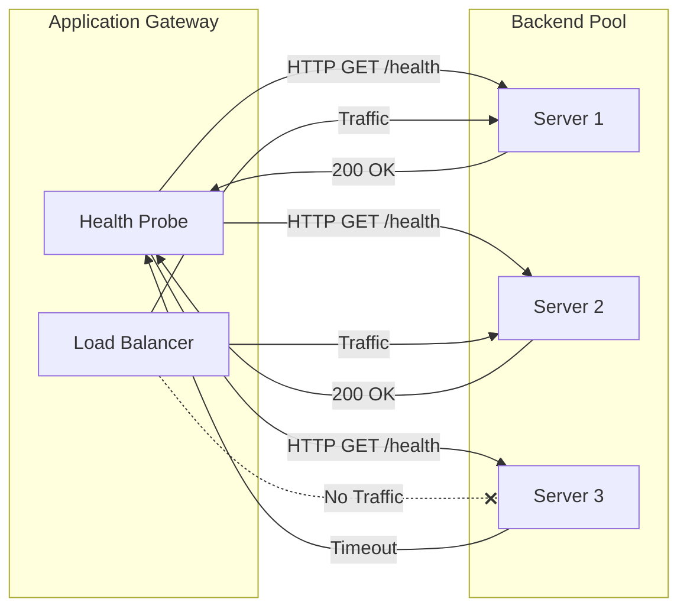
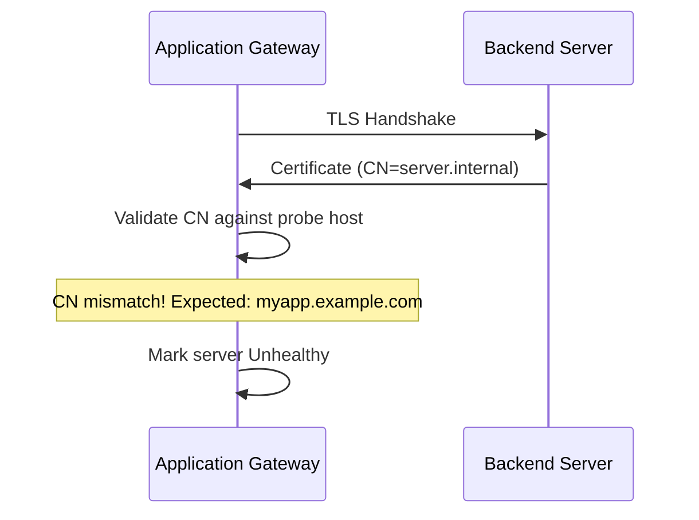
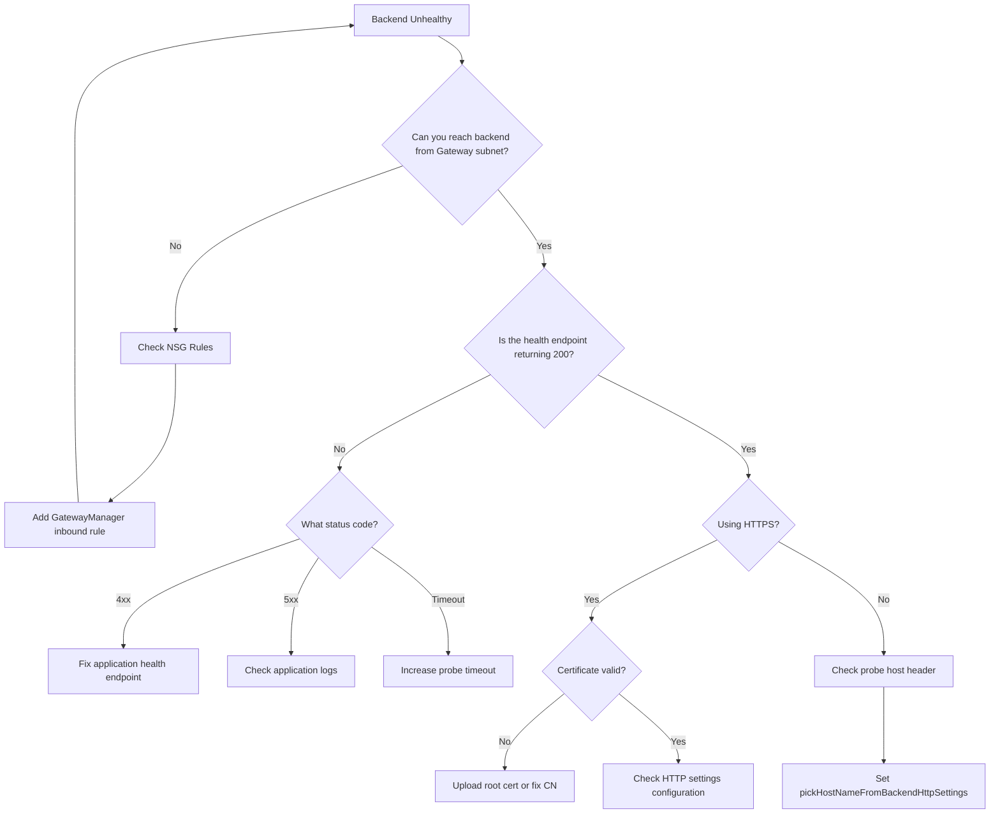

# How to Fix "Application Gateway" Health Probe Errors

Author: [nawazdhandala](https://www.github.com/nawazdhandala)

Tags: Azure, Application Gateway, Health Probes, Load Balancing, Networking, Troubleshooting

Description: A practical guide to diagnosing and fixing Azure Application Gateway health probe failures that cause backend pool unhealthy states.

---

Azure Application Gateway health probes are your first line of defense against routing traffic to unhealthy backends. When these probes fail, your entire application can go down even though the backend services might be running fine. Let's dig into why health probes fail and how to fix them.

## Understanding Health Probe Architecture

Application Gateway uses health probes to determine which backend servers can receive traffic. When a probe fails, the gateway marks that server as unhealthy and stops routing requests to it.



## Common Health Probe Errors

### Error 1: Backend Health Shows "Unhealthy"

This is the most common error you will see in the Azure portal. The backend pool shows all servers as unhealthy.

**Check the health status using Azure CLI:**

```bash
# Get the health status of your Application Gateway backend pool
az network application-gateway show-backend-health \
    --resource-group myResourceGroup \
    --name myAppGateway \
    --query 'backendAddressPools[].backendHttpSettingsCollection[].servers[]'
```

**Sample output showing unhealthy backend:**

```json
{
    "address": "10.0.1.4",
    "health": "Unhealthy",
    "healthProbeLog": "Failed to connect to backend server. Timeout exceeded."
}
```

### Error 2: Probe Timeout Exceeded

The backend server is not responding within the configured timeout period.

**Fix: Adjust probe timeout settings**

```bash
# Update the health probe timeout (increase from default 30s to 60s)
az network application-gateway probe update \
    --resource-group myResourceGroup \
    --gateway-name myAppGateway \
    --name myHealthProbe \
    --timeout 60 \
    --interval 30
```

**Or using ARM template:**

```json
{
    "type": "Microsoft.Network/applicationGateways",
    "apiVersion": "2023-05-01",
    "name": "myAppGateway",
    "properties": {
        "probes": [
            {
                "name": "myHealthProbe",
                "properties": {
                    "protocol": "Http",
                    "host": "myapp.example.com",
                    "path": "/health",
                    "interval": 30,
                    "timeout": 60,
                    "unhealthyThreshold": 3,
                    "pickHostNameFromBackendHttpSettings": false,
                    "minServers": 0,
                    "match": {
                        "statusCodes": ["200-399"]
                    }
                }
            }
        ]
    }
}
```

### Error 3: Certificate Mismatch (HTTPS Probes)

When using HTTPS probes, certificate validation failures are a frequent cause of probe failures.



**Fix: Configure proper certificate handling**

```bash
# Create an HTTP settings that trusts the backend certificate
az network application-gateway http-settings create \
    --resource-group myResourceGroup \
    --gateway-name myAppGateway \
    --name myHttpsSettings \
    --port 443 \
    --protocol Https \
    --cookie-based-affinity Disabled \
    --host-name-from-backend-pool false \
    --host-name "myapp.example.com" \
    --root-certs "/subscriptions/xxx/resourceGroups/myRG/providers/Microsoft.Network/applicationGateways/myAppGW/trustedRootCertificates/myRootCert"
```

**Upload a trusted root certificate:**

```bash
# First, upload the root CA certificate
az network application-gateway root-cert create \
    --resource-group myResourceGroup \
    --gateway-name myAppGateway \
    --name myRootCert \
    --cert-file /path/to/root-ca.cer
```

### Error 4: NSG Blocking Probe Traffic

Network Security Groups can block health probe traffic from the Application Gateway subnet.

**Application Gateway health probes originate from:**
- Source IP: GatewayManager service tag or 168.63.129.16
- Source port: Random
- Destination port: Your backend port

**Fix: Add NSG rule to allow probe traffic**

```bash
# Allow Application Gateway health probes
az network nsg rule create \
    --resource-group myResourceGroup \
    --nsg-name myBackendNSG \
    --name AllowAppGatewayProbes \
    --priority 100 \
    --source-address-prefixes GatewayManager \
    --source-port-ranges '*' \
    --destination-port-ranges 80 443 \
    --destination-address-prefixes '*' \
    --access Allow \
    --protocol Tcp \
    --direction Inbound
```

### Error 5: Probe Path Returns Non-200 Status

The health endpoint exists but returns an error status code.

**Check what status codes your probe accepts:**

```bash
# View current probe configuration
az network application-gateway probe show \
    --resource-group myResourceGroup \
    --gateway-name myAppGateway \
    --name myHealthProbe \
    --query 'match.statusCodes'
```

**Fix: Update acceptable status codes**

```bash
# Allow additional status codes (e.g., 200-399)
az network application-gateway probe update \
    --resource-group myResourceGroup \
    --gateway-name myAppGateway \
    --name myHealthProbe \
    --match-status-codes "200-399"
```

## Creating a Proper Health Endpoint

Your backend application needs a dedicated health endpoint that Application Gateway can probe.

**Node.js example:**

```javascript
// healthcheck.js - Express.js health endpoint
const express = require('express');
const app = express();

// Simple health check
app.get('/health', (req, res) => {
    res.status(200).json({
        status: 'healthy',
        timestamp: new Date().toISOString()
    });
});

// Comprehensive health check with dependency verification
app.get('/health/ready', async (req, res) => {
    try {
        // Check database connection
        await db.query('SELECT 1');

        // Check cache connection
        await redis.ping();

        res.status(200).json({
            status: 'ready',
            checks: {
                database: 'connected',
                cache: 'connected'
            }
        });
    } catch (error) {
        // Return 503 so Application Gateway routes to other servers
        res.status(503).json({
            status: 'unhealthy',
            error: error.message
        });
    }
});

app.listen(8080);
```

**ASP.NET Core example:**

```csharp
// Program.cs - Health check configuration
var builder = WebApplication.CreateBuilder(args);

// Add health checks
builder.Services.AddHealthChecks()
    .AddCheck("self", () => HealthCheckResult.Healthy())
    .AddSqlServer(connectionString, name: "database")
    .AddRedis(redisConnection, name: "cache");

var app = builder.Build();

// Map health endpoint for Application Gateway
app.MapHealthChecks("/health", new HealthCheckOptions
{
    // Return 200 for healthy, 503 for unhealthy
    ResultStatusCodes =
    {
        [HealthStatus.Healthy] = StatusCodes.Status200OK,
        [HealthStatus.Degraded] = StatusCodes.Status200OK,
        [HealthStatus.Unhealthy] = StatusCodes.Status503ServiceUnavailable
    },
    // Simple response for load balancer probes
    ResponseWriter = async (context, report) =>
    {
        context.Response.ContentType = "application/json";
        await context.Response.WriteAsync(
            JsonSerializer.Serialize(new { status = report.Status.ToString() }));
    }
});

app.Run();
```

## Debugging Health Probe Failures

### Step 1: Test Connectivity from Gateway Subnet

```bash
# Deploy a test VM in the Application Gateway subnet
# Then test connectivity to your backend

# Test HTTP connectivity
curl -v http://10.0.1.4:80/health

# Test HTTPS with certificate details
curl -v --insecure https://10.0.1.4:443/health
```

### Step 2: Check Application Gateway Diagnostic Logs

```bash
# Enable diagnostic logging
az monitor diagnostic-settings create \
    --name appgw-diagnostics \
    --resource "/subscriptions/xxx/resourceGroups/myRG/providers/Microsoft.Network/applicationGateways/myAppGW" \
    --logs '[{"category": "ApplicationGatewayAccessLog", "enabled": true}, {"category": "ApplicationGatewayPerformanceLog", "enabled": true}]' \
    --workspace "/subscriptions/xxx/resourceGroups/myRG/providers/Microsoft.OperationalInsights/workspaces/myWorkspace"
```

**Query logs for probe failures:**

```kusto
// Kusto query for health probe failures
AzureDiagnostics
| where ResourceType == "APPLICATIONGATEWAYS"
| where Category == "ApplicationGatewayAccessLog"
| where httpStatus_d >= 500 or httpStatus_d == 0
| project TimeGenerated, requestUri_s, httpStatus_d, serverRouted_s, timeTaken_d
| order by TimeGenerated desc
```

### Step 3: Verify Backend Pool Configuration

```bash
# List all backend addresses
az network application-gateway address-pool show \
    --resource-group myResourceGroup \
    --gateway-name myAppGateway \
    --name myBackendPool \
    --query 'backendAddresses'
```

## Complete Troubleshooting Flow



## Best Practices

1. **Use dedicated health endpoints** - Do not use your homepage. Create a lightweight `/health` endpoint.

2. **Keep health checks fast** - The endpoint should respond within 5 seconds. Do not perform expensive database queries.

3. **Return proper status codes** - Use 200 for healthy, 503 for unhealthy. Application Gateway understands HTTP semantics.

4. **Configure appropriate thresholds** - Set `unhealthyThreshold` to at least 3 to avoid flapping during brief network issues.

5. **Monitor probe failures** - Set up Azure Monitor alerts for backend health to catch issues before they impact users.

6. **Test after changes** - After modifying probes, HTTP settings, or backend pools, always verify health status.

---

Application Gateway health probes are straightforward once you understand the flow. The probe needs network connectivity, a valid health endpoint, and proper certificate configuration for HTTPS. When something breaks, start with network connectivity and work your way up to the application layer.
