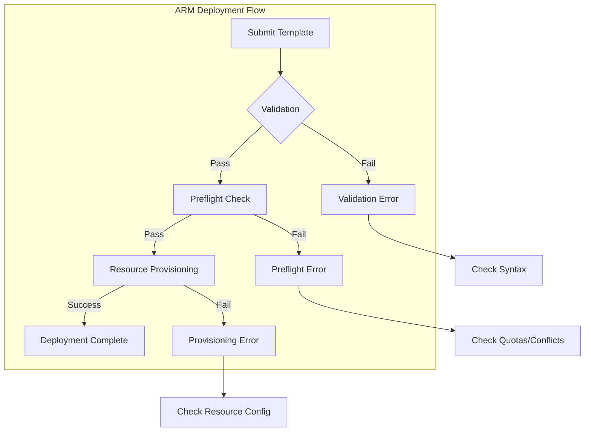

# How to Fix "Deployment Failed" ARM Template Errors

Author: [nawazdhandala](https://www.github.com/nawazdhandala)

Tags: Azure, ARM Templates, Deployment, Troubleshooting, Infrastructure as Code, DevOps

Description: A practical guide to diagnosing and fixing common ARM template deployment failures with real error examples and solutions.

---

ARM template deployments fail for many reasons: syntax errors, resource conflicts, quota limits, or dependency issues. This guide covers the most common "Deployment Failed" errors you will encounter and shows you how to fix them quickly.

## Understanding ARM Deployment Errors

When an ARM deployment fails, Azure provides error codes and messages. The trick is knowing where to look and what they mean.



### Getting Detailed Error Information

```bash
# Get deployment status
az deployment group show \
  --name my-deployment \
  --resource-group rg-myapp \
  --query properties.error

# Get deployment operations for detailed errors
az deployment operation group list \
  --name my-deployment \
  --resource-group rg-myapp \
  --query "[?properties.provisioningState=='Failed'].{Resource:properties.targetResource.resourceName, Error:properties.statusMessage.error}"

# Show full error details
az deployment group show \
  --name my-deployment \
  --resource-group rg-myapp \
  --query "properties.error.details[].{Code:code, Message:message}"
```

## Error: InvalidTemplate

This error means your template has syntax issues or invalid references.

### Missing Required Parameters

**Error Message:**
```
InvalidTemplate - Deployment template validation failed: 'The template parameters 'storageAccountName' in the parameters file are not valid; they are not present in the original template'
```

**Fix:** Ensure parameter names match exactly between template and parameters file.

```json
// template.json - parameter definition
{
  "$schema": "https://schema.management.azure.com/schemas/2019-04-01/deploymentTemplate.json#",
  "parameters": {
    "storageAccountName": {  // Note: camelCase
      "type": "string",
      "metadata": {
        "description": "Name of the storage account"
      }
    }
  }
}

// parameters.json - must match exactly
{
  "$schema": "https://schema.management.azure.com/schemas/2019-04-01/deploymentParameters.json#",
  "contentVersion": "1.0.0.0",
  "parameters": {
    "storageAccountName": {  // Must match template parameter name
      "value": "mystorageaccount"
    }
  }
}
```

### Invalid Resource Reference

**Error Message:**
```
InvalidTemplate - Deployment template validation failed: 'The template reference 'storageAccount' is not valid'
```

**Fix:** Use the correct reference function syntax.

```json
{
  "resources": [
    {
      "type": "Microsoft.Storage/storageAccounts",
      "apiVersion": "2023-01-01",
      "name": "[parameters('storageAccountName')]",
      "location": "[resourceGroup().location]",
      "sku": {
        "name": "Standard_LRS"
      },
      "kind": "StorageV2"
    },
    {
      "type": "Microsoft.Web/sites",
      "apiVersion": "2022-09-01",
      "name": "[parameters('webAppName')]",
      "location": "[resourceGroup().location]",
      "dependsOn": [
        "[resourceId('Microsoft.Storage/storageAccounts', parameters('storageAccountName'))]"
      ],
      "properties": {
        "siteConfig": {
          "appSettings": [
            {
              "name": "STORAGE_CONNECTION",
              // Correct reference syntax
              "value": "[concat('DefaultEndpointsProtocol=https;AccountName=', parameters('storageAccountName'), ';AccountKey=', listKeys(resourceId('Microsoft.Storage/storageAccounts', parameters('storageAccountName')), '2023-01-01').keys[0].value)]"
            }
          ]
        }
      }
    }
  ]
}
```

## Error: ResourceNotFound

This happens when referencing resources that do not exist yet or are in different scopes.

### Missing Dependency

**Error Message:**
```
ResourceNotFound - The Resource 'Microsoft.Storage/storageAccounts/mystorageaccount' under resource group 'rg-myapp' was not found.
```

**Fix:** Add explicit dependsOn or use nested deployments.

```json
{
  "resources": [
    {
      "type": "Microsoft.Storage/storageAccounts",
      "apiVersion": "2023-01-01",
      "name": "[parameters('storageAccountName')]",
      "location": "[resourceGroup().location]",
      "sku": {
        "name": "Standard_LRS"
      },
      "kind": "StorageV2"
    },
    {
      "type": "Microsoft.Storage/storageAccounts/blobServices/containers",
      "apiVersion": "2023-01-01",
      "name": "[concat(parameters('storageAccountName'), '/default/uploads')]",
      // Add dependency to ensure storage account exists first
      "dependsOn": [
        "[resourceId('Microsoft.Storage/storageAccounts', parameters('storageAccountName'))]"
      ],
      "properties": {
        "publicAccess": "None"
      }
    }
  ]
}
```

### Cross Resource Group Reference

**Fix:** Use full resource ID for cross-resource-group references.

```json
{
  "variables": {
    "vnetResourceGroup": "rg-networking",
    "vnetName": "vnet-shared"
  },
  "resources": [
    {
      "type": "Microsoft.Web/sites",
      "apiVersion": "2022-09-01",
      "name": "[parameters('webAppName')]",
      "properties": {
        "virtualNetworkSubnetId": "[resourceId(variables('vnetResourceGroup'), 'Microsoft.Network/virtualNetworks/subnets', variables('vnetName'), 'subnet-webapp')]"
      }
    }
  ]
}
```

## Error: Conflict / ResourceExists

This occurs when creating resources that already exist or have conflicting settings.

### Resource Already Exists

**Error Message:**
```
Conflict - The resource write operation failed to complete successfully, because it reached terminal provisioning state 'Failed'. Resource 'mystorageaccount' already exists.
```

**Fix:** Use conditions or incremental deployment mode.

```json
{
  "parameters": {
    "createNewStorage": {
      "type": "bool",
      "defaultValue": true
    }
  },
  "resources": [
    {
      // Only create if parameter is true
      "condition": "[parameters('createNewStorage')]",
      "type": "Microsoft.Storage/storageAccounts",
      "apiVersion": "2023-01-01",
      "name": "[parameters('storageAccountName')]",
      "location": "[resourceGroup().location]",
      "sku": {
        "name": "Standard_LRS"
      },
      "kind": "StorageV2"
    }
  ]
}
```

Or use deployment mode to handle existing resources:

```bash
# Incremental mode (default) - adds/updates resources, does not delete
az deployment group create \
  --resource-group rg-myapp \
  --template-file template.json \
  --mode Incremental

# Complete mode - deletes resources not in template (use carefully!)
az deployment group create \
  --resource-group rg-myapp \
  --template-file template.json \
  --mode Complete
```

## Error: QuotaExceeded

Your subscription hit resource limits.

### VM Quota Exceeded

**Error Message:**
```
QuotaExceeded - Operation could not be completed as it results in exceeding approved standardDSv3Family Cores quota.
```

**Fix:** Request quota increase or use different VM size.

```bash
# Check current quota
az vm list-usage --location eastus --output table

# Request quota increase via Azure Portal or
az support tickets create \
  --ticket-name "VM Quota Increase" \
  --description "Need to increase standardDSv3Family cores from 20 to 50 in East US" \
  --problem-classification "/providers/Microsoft.Support/services/xxx/problemClassifications/yyy" \
  --severity "minimal"
```

Alternatively, modify template to use available VM sizes:

```json
{
  "parameters": {
    "vmSize": {
      "type": "string",
      "defaultValue": "Standard_D2s_v3",
      "allowedValues": [
        "Standard_D2s_v3",
        "Standard_D4s_v3",
        "Standard_B2ms"  // Add alternative that has quota
      ]
    }
  }
}
```

## Error: LinkedAuthorizationFailed

Permission issues when accessing resources across subscriptions or tenants.

**Error Message:**
```
LinkedAuthorizationFailed - The client 'xxx' with object id 'yyy' does not have authorization to perform action 'Microsoft.Network/virtualNetworks/subnets/join/action'
```

**Fix:** Grant appropriate RBAC roles.

```bash
# Grant Network Contributor on the subnet
az role assignment create \
  --assignee <service-principal-id> \
  --role "Network Contributor" \
  --scope "/subscriptions/<sub-id>/resourceGroups/rg-networking/providers/Microsoft.Network/virtualNetworks/vnet-shared/subnets/subnet-webapp"

# Or use custom role with minimal permissions
az role definition create --role-definition '{
  "Name": "Subnet Joiner",
  "IsCustom": true,
  "Description": "Can join resources to subnets",
  "Actions": [
    "Microsoft.Network/virtualNetworks/subnets/join/action",
    "Microsoft.Network/virtualNetworks/subnets/read"
  ],
  "AssignableScopes": ["/subscriptions/<sub-id>"]
}'
```

## Error: DeploymentFailed with Nested Errors

Complex deployments often have cascading failures.

### Debugging Nested Deployments

```bash
# List all deployment operations including nested
az deployment operation group list \
  --name my-deployment \
  --resource-group rg-myapp \
  --query "[].{Resource:properties.targetResource.resourceType, State:properties.provisioningState, Error:properties.statusMessage.error.message}" \
  --output table

# Get specific failed operation details
az deployment operation group show \
  --name my-deployment \
  --resource-group rg-myapp \
  --operation-id <operation-id>
```

### Template with Better Error Handling

```json
{
  "$schema": "https://schema.management.azure.com/schemas/2019-04-01/deploymentTemplate.json#",
  "contentVersion": "1.0.0.0",
  "parameters": {
    "environment": {
      "type": "string",
      "allowedValues": ["dev", "staging", "prod"],
      "metadata": {
        "description": "Environment name"
      }
    }
  },
  "variables": {
    // Use variables to avoid repeated expressions
    "storageAccountName": "[concat('st', parameters('environment'), uniqueString(resourceGroup().id))]",
    "appServicePlanName": "[concat('asp-', parameters('environment'))]"
  },
  "resources": [
    {
      "type": "Microsoft.Storage/storageAccounts",
      "apiVersion": "2023-01-01",
      "name": "[variables('storageAccountName')]",
      "location": "[resourceGroup().location]",
      "tags": {
        "environment": "[parameters('environment')]",
        "deployedBy": "ARM Template"
      },
      "sku": {
        "name": "Standard_LRS"
      },
      "kind": "StorageV2"
    }
  ],
  "outputs": {
    // Outputs help debug what was actually created
    "storageAccountName": {
      "type": "string",
      "value": "[variables('storageAccountName')]"
    },
    "storageAccountId": {
      "type": "string",
      "value": "[resourceId('Microsoft.Storage/storageAccounts', variables('storageAccountName'))]"
    }
  }
}
```

## Validation Before Deployment

Always validate templates before deploying.

```bash
# Validate template syntax
az deployment group validate \
  --resource-group rg-myapp \
  --template-file template.json \
  --parameters @parameters.json

# What-if deployment to preview changes
az deployment group what-if \
  --resource-group rg-myapp \
  --template-file template.json \
  --parameters @parameters.json

# Use Bicep for better error messages (compiles to ARM)
az bicep build --file main.bicep
az deployment group validate \
  --resource-group rg-myapp \
  --template-file main.json
```

## Common Debugging Checklist

- [ ] Check error code and message in deployment operations
- [ ] Validate template syntax before deployment
- [ ] Verify parameter names match exactly
- [ ] Check resource dependencies with dependsOn
- [ ] Confirm API versions are valid for your region
- [ ] Verify quotas and limits
- [ ] Check RBAC permissions for cross-resource access
- [ ] Use what-if to preview changes
- [ ] Review Activity Log for additional details

---

ARM template errors can be cryptic, but they follow patterns. Start with the error code, check the specific resource that failed, and work backward through dependencies. Using validation and what-if deployments before actual deployment saves time and prevents partial failures.
