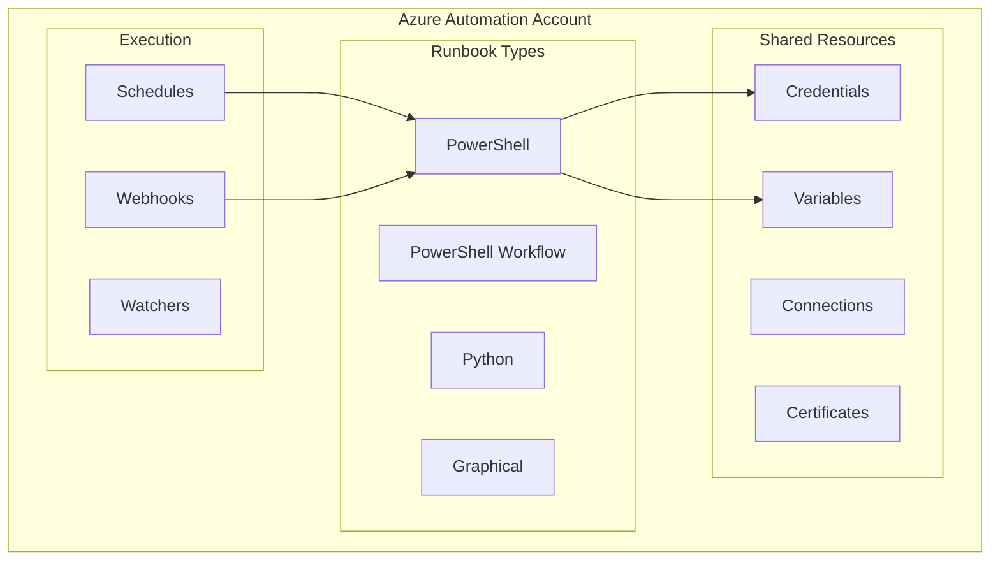

# How to Handle Azure Automation Runbooks

Author: [nawazdhandala](https://www.github.com/nawazdhandala)

Tags: Azure, Automation, Runbooks, PowerShell, Python, DevOps, Scheduling

Description: A hands-on guide to creating, managing, and troubleshooting Azure Automation Runbooks for automating cloud operations.

---

Azure Automation Runbooks allow you to automate repetitive tasks, manage Azure resources, and orchestrate complex workflows. Whether you need to start and stop VMs on a schedule, clean up unused resources, or deploy configurations, runbooks provide a reliable way to automate these operations.

## Understanding Azure Automation

Azure Automation provides several types of runbooks, each suited for different scenarios.



## Setting Up an Automation Account

First, create an Automation Account with a system-assigned managed identity:

```bash
# Create resource group
az group create \
    --name rg-automation \
    --location eastus

# Create automation account
az automation account create \
    --name myAutomationAccount \
    --resource-group rg-automation \
    --location eastus \
    --sku Free

# Enable system-assigned managed identity
az automation account update \
    --name myAutomationAccount \
    --resource-group rg-automation \
    --assign-identity
```

Grant the managed identity appropriate permissions:

```bash
# Get the principal ID
PRINCIPAL_ID=$(az automation account show \
    --name myAutomationAccount \
    --resource-group rg-automation \
    --query identity.principalId \
    --output tsv)

# Assign Contributor role to the subscription
az role assignment create \
    --assignee $PRINCIPAL_ID \
    --role "Contributor" \
    --scope "/subscriptions/$(az account show --query id -o tsv)"
```

## Creating a PowerShell Runbook

Let's create a runbook that starts and stops VMs based on tags.

### The Runbook Script

```powershell
<#
.SYNOPSIS
    Start or stop Azure VMs based on tags.

.DESCRIPTION
    This runbook starts or stops VMs that have a specific tag.
    It uses the automation account's managed identity for authentication.

.PARAMETER Action
    The action to perform: "Start" or "Stop"

.PARAMETER TagName
    The tag name to filter VMs

.PARAMETER TagValue
    The tag value to match
#>

param(
    [Parameter(Mandatory=$true)]
    [ValidateSet("Start", "Stop")]
    [string]$Action,

    [Parameter(Mandatory=$true)]
    [string]$TagName,

    [Parameter(Mandatory=$true)]
    [string]$TagValue
)

# Connect using managed identity
try {
    Write-Output "Connecting to Azure using managed identity..."
    Connect-AzAccount -Identity
    Write-Output "Successfully connected to Azure."
}
catch {
    Write-Error "Failed to connect to Azure: $_"
    throw
}

# Get all VMs with the specified tag
Write-Output "Finding VMs with tag $TagName = $TagValue..."
$vms = Get-AzVM | Where-Object {
    $_.Tags[$TagName] -eq $TagValue
}

if ($vms.Count -eq 0) {
    Write-Output "No VMs found with tag $TagName = $TagValue"
    return
}

Write-Output "Found $($vms.Count) VMs to $Action"

# Process each VM
foreach ($vm in $vms) {
    $vmName = $vm.Name
    $resourceGroup = $vm.ResourceGroupName

    try {
        if ($Action -eq "Start") {
            Write-Output "Starting VM: $vmName in $resourceGroup"
            Start-AzVM -Name $vmName -ResourceGroupName $resourceGroup -NoWait
        }
        else {
            Write-Output "Stopping VM: $vmName in $resourceGroup"
            Stop-AzVM -Name $vmName -ResourceGroupName $resourceGroup -NoWait -Force
        }
        Write-Output "Successfully initiated $Action for $vmName"
    }
    catch {
        Write-Error "Failed to $Action VM $vmName : $_"
    }
}

Write-Output "Runbook completed. All $Action operations initiated."
```

### Import and Publish the Runbook

```bash
# Create the runbook
az automation runbook create \
    --automation-account-name myAutomationAccount \
    --resource-group rg-automation \
    --name "Start-Stop-VMs" \
    --type PowerShell \
    --description "Start or stop VMs based on tags"

# Import the runbook content (from local file)
az automation runbook replace-content \
    --automation-account-name myAutomationAccount \
    --resource-group rg-automation \
    --name "Start-Stop-VMs" \
    --content @start-stop-vms.ps1

# Publish the runbook
az automation runbook publish \
    --automation-account-name myAutomationAccount \
    --resource-group rg-automation \
    --name "Start-Stop-VMs"
```

## Creating a Python Runbook

Python runbooks are great for integrating with APIs and data processing.

```python
#!/usr/bin/env python3
"""
Azure Automation Runbook: Clean up unattached managed disks

This runbook finds and deletes managed disks that are not attached
to any VM. It can run in dry-run mode to preview changes.
"""

import os
import sys
import automationassets
from azure.identity import ManagedIdentityCredential
from azure.mgmt.compute import ComputeManagementClient
from azure.mgmt.resource import SubscriptionClient

def get_automation_variable(name):
    """Get an automation variable value."""
    try:
        return automationassets.get_automation_variable(name)
    except Exception as e:
        print(f"Warning: Could not get variable {name}: {e}")
        return None

def main():
    # Get parameters from automation variables
    dry_run = get_automation_variable("DiskCleanup_DryRun")
    if dry_run is None:
        dry_run = True  # Default to dry run for safety

    retention_days = get_automation_variable("DiskCleanup_RetentionDays")
    if retention_days is None:
        retention_days = 30

    print(f"Running in {'dry-run' if dry_run else 'live'} mode")
    print(f"Looking for disks unattached for more than {retention_days} days")

    # Authenticate using managed identity
    credential = ManagedIdentityCredential()

    # Get all subscriptions
    sub_client = SubscriptionClient(credential)
    subscriptions = list(sub_client.subscriptions.list())

    total_disks_found = 0
    total_size_gb = 0

    for subscription in subscriptions:
        sub_id = subscription.subscription_id
        print(f"\nProcessing subscription: {subscription.display_name}")

        # Create compute client for this subscription
        compute_client = ComputeManagementClient(credential, sub_id)

        # Get all managed disks
        disks = compute_client.disks.list()

        for disk in disks:
            # Check if disk is unattached
            if disk.disk_state == "Unattached":
                disk_size = disk.disk_size_gb or 0

                print(f"  Found unattached disk: {disk.name}")
                print(f"    Resource Group: {disk.id.split('/')[4]}")
                print(f"    Size: {disk_size} GB")
                print(f"    SKU: {disk.sku.name if disk.sku else 'Unknown'}")

                total_disks_found += 1
                total_size_gb += disk_size

                if not dry_run:
                    try:
                        # Extract resource group from disk ID
                        rg_name = disk.id.split('/')[4]

                        print(f"    Deleting disk {disk.name}...")
                        compute_client.disks.begin_delete(rg_name, disk.name)
                        print(f"    Successfully deleted {disk.name}")
                    except Exception as e:
                        print(f"    Error deleting disk: {e}")

    # Summary
    print("\n" + "="*50)
    print("SUMMARY")
    print("="*50)
    print(f"Total unattached disks found: {total_disks_found}")
    print(f"Total storage: {total_size_gb} GB")

    if dry_run:
        print("\nThis was a DRY RUN. No disks were deleted.")
        print("Set DiskCleanup_DryRun variable to False to delete disks.")

if __name__ == "__main__":
    main()
```

## Scheduling Runbooks

Create schedules to run runbooks automatically:

```bash
# Create a schedule for stopping VMs at 7 PM on weekdays
az automation schedule create \
    --automation-account-name myAutomationAccount \
    --resource-group rg-automation \
    --name "WeekdayEvening" \
    --description "Run at 7 PM on weekdays" \
    --start-time "2026-01-25T19:00:00Z" \
    --frequency Week \
    --interval 1 \
    --time-zone "Eastern Standard Time"

# Link the schedule to a runbook with parameters
az automation job-schedule create \
    --automation-account-name myAutomationAccount \
    --resource-group rg-automation \
    --runbook-name "Start-Stop-VMs" \
    --schedule-name "WeekdayEvening" \
    --parameters Action=Stop TagName=AutoShutdown TagValue=true
```

## Creating Webhooks for External Triggers

Webhooks allow external systems to trigger runbooks:

```bash
# Create a webhook (note: the URI is only shown once!)
az automation webhook create \
    --automation-account-name myAutomationAccount \
    --resource-group rg-automation \
    --name "TriggerVMStart" \
    --runbook-name "Start-Stop-VMs" \
    --expiry-time "2027-01-24T00:00:00Z" \
    --parameters Action=Start TagName=Environment TagValue=Development
```

Call the webhook from external systems:

```bash
# Example: Trigger from curl
curl -X POST "https://webhook-uri-from-above" \
    -H "Content-Type: application/json" \
    -d '{"TagName": "Environment", "TagValue": "Production"}'
```

## Monitoring and Troubleshooting

### View Job History

```bash
# List recent jobs
az automation job list \
    --automation-account-name myAutomationAccount \
    --resource-group rg-automation \
    --output table

# Get job details
az automation job show \
    --automation-account-name myAutomationAccount \
    --resource-group rg-automation \
    --name "job-id-here"

# Get job output
az automation job-output \
    --automation-account-name myAutomationAccount \
    --resource-group rg-automation \
    --job-name "job-id-here"
```

### Common Issues and Solutions

**Issue: Runbook fails with authentication error**

```powershell
# Check if managed identity is enabled
# Ensure Az modules are imported in the automation account

# Test authentication at the start of runbook
try {
    $connection = Connect-AzAccount -Identity -ErrorAction Stop
    Write-Output "Connected to tenant: $($connection.Context.Tenant.Id)"
}
catch {
    Write-Error "Authentication failed. Ensure managed identity is enabled and has proper permissions."
    throw
}
```

**Issue: Module not found**

```bash
# Import required modules
az automation module create \
    --automation-account-name myAutomationAccount \
    --resource-group rg-automation \
    --name Az.Accounts \
    --content-link "https://www.powershellgallery.com/api/v2/package/Az.Accounts"

az automation module create \
    --automation-account-name myAutomationAccount \
    --resource-group rg-automation \
    --name Az.Compute \
    --content-link "https://www.powershellgallery.com/api/v2/package/Az.Compute"
```

**Issue: Runbook timeout**

```powershell
# Long-running operations should use -NoWait and separate monitoring
# Default timeout is 3 hours for cloud jobs

# Start operation without waiting
$job = Start-AzVM -Name $vmName -ResourceGroupName $rg -NoWait

# If you need to wait, use a separate monitoring runbook
# or use child runbooks for parallel execution
```

## Advanced Pattern: Runbook with Error Handling and Notifications

```powershell
<#
.SYNOPSIS
    Production-ready runbook with comprehensive error handling
#>

param(
    [Parameter(Mandatory=$true)]
    [string]$ResourceGroupName
)

# Import required modules
Import-Module Az.Accounts
Import-Module Az.Resources

# Initialize error tracking
$errors = @()
$warnings = @()

function Send-Notification {
    param(
        [string]$Subject,
        [string]$Body,
        [string]$Priority = "Normal"
    )

    # Get webhook URL from automation variable
    $webhookUrl = Get-AutomationVariable -Name "NotificationWebhook"

    if ($webhookUrl) {
        $payload = @{
            subject = $Subject
            body = $Body
            priority = $Priority
        } | ConvertTo-Json

        try {
            Invoke-RestMethod -Uri $webhookUrl -Method Post -Body $payload -ContentType "application/json"
        }
        catch {
            Write-Warning "Failed to send notification: $_"
        }
    }
}

# Main execution
try {
    # Connect to Azure
    Connect-AzAccount -Identity -ErrorAction Stop

    # Your automation logic here
    $resources = Get-AzResource -ResourceGroupName $ResourceGroupName

    foreach ($resource in $resources) {
        try {
            # Process each resource
            Write-Output "Processing: $($resource.Name)"
            # ... your logic ...
        }
        catch {
            $errors += "Failed to process $($resource.Name): $_"
            Write-Warning $errors[-1]
        }
    }
}
catch {
    $errors += "Critical failure: $_"
    Write-Error $errors[-1]
}
finally {
    # Generate summary
    $summary = @"
Runbook Execution Summary
========================
Resources processed: $($resources.Count)
Errors: $($errors.Count)
Warnings: $($warnings.Count)

$(if ($errors.Count -gt 0) { "Errors:`n" + ($errors -join "`n") })
"@

    Write-Output $summary

    # Send notification if there were errors
    if ($errors.Count -gt 0) {
        Send-Notification -Subject "Runbook Completed with Errors" -Body $summary -Priority "High"
    }
}
```

## Best Practices

1. **Use Managed Identities**: Avoid storing credentials; use system-assigned managed identities
2. **Implement Idempotency**: Runbooks should be safe to run multiple times
3. **Add Comprehensive Logging**: Use Write-Output for tracking execution flow
4. **Handle Errors Gracefully**: Use try-catch blocks and continue processing when possible
5. **Use Variables for Configuration**: Store configuration in automation variables, not hardcoded
6. **Test in Draft Mode**: Test runbooks before publishing to production
7. **Set Appropriate Timeouts**: Configure job timeouts based on expected execution time
8. **Version Control**: Store runbook code in Git and deploy through CI/CD

---

Azure Automation Runbooks provide a powerful way to automate cloud operations. By following the patterns in this guide, you can create reliable, maintainable automation that handles errors gracefully and integrates with your existing workflows. Start with simple runbooks and gradually add complexity as you become more comfortable with the platform.
