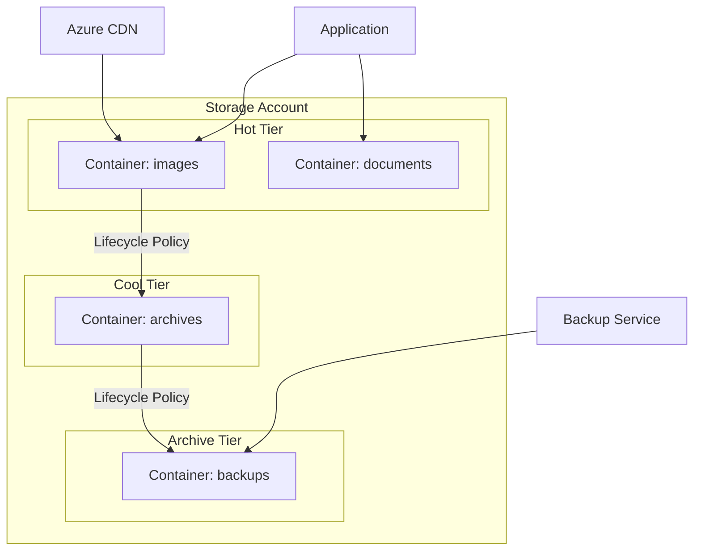

# How to Handle Azure Blob Storage

Author: [nawazdhandala](https://www.github.com/nawazdhandala)

Tags: Azure, Storage, Blob, Cloud, Data, DevOps, Security

Description: A comprehensive guide to managing Azure Blob Storage including container configuration, access control, lifecycle policies, and performance optimization.

---

Azure Blob Storage is the backbone of data storage in Azure. From serving static websites to storing application data and backups, Blob Storage handles it all. This guide covers practical operations for managing blob storage effectively, from basic setup to advanced configurations.

## Blob Storage Architecture



### Access Tiers

| Tier | Use Case | Access Cost | Storage Cost |
|------|----------|-------------|--------------|
| Hot | Frequently accessed data | Low | High |
| Cool | Infrequent access (30+ days) | Medium | Medium |
| Cold | Rare access (90+ days) | Higher | Lower |
| Archive | Long-term retention | Highest | Lowest |

## Creating Storage Account and Containers

### Using Azure CLI

```bash
# Set variables
RESOURCE_GROUP="storage-rg"
STORAGE_ACCOUNT="myappstorage2026"
LOCATION="eastus"

# Create resource group
az group create \
    --name $RESOURCE_GROUP \
    --location $LOCATION

# Create storage account with recommended settings
az storage account create \
    --name $STORAGE_ACCOUNT \
    --resource-group $RESOURCE_GROUP \
    --location $LOCATION \
    --sku Standard_LRS \
    --kind StorageV2 \
    --access-tier Hot \
    --min-tls-version TLS1_2 \
    --allow-blob-public-access false \
    --https-only true

# Get storage account key
STORAGE_KEY=$(az storage account keys list \
    --resource-group $RESOURCE_GROUP \
    --account-name $STORAGE_ACCOUNT \
    --query "[0].value" -o tsv)

# Create containers
az storage container create \
    --name images \
    --account-name $STORAGE_ACCOUNT \
    --account-key $STORAGE_KEY

az storage container create \
    --name documents \
    --account-name $STORAGE_ACCOUNT \
    --account-key $STORAGE_KEY

az storage container create \
    --name backups \
    --account-name $STORAGE_ACCOUNT \
    --account-key $STORAGE_KEY
```

### Using Terraform

```hcl
# storage.tf - Complete blob storage configuration
resource "azurerm_storage_account" "main" {
  name                     = "myappstorage2026"
  resource_group_name      = azurerm_resource_group.main.name
  location                 = azurerm_resource_group.main.location
  account_tier             = "Standard"
  account_replication_type = "GRS"
  account_kind             = "StorageV2"
  access_tier              = "Hot"
  min_tls_version          = "TLS1_2"

  # Security settings
  allow_nested_items_to_be_public = false
  enable_https_traffic_only       = true
  shared_access_key_enabled       = true

  blob_properties {
    versioning_enabled = true

    delete_retention_policy {
      days = 30
    }

    container_delete_retention_policy {
      days = 30
    }
  }

  network_rules {
    default_action             = "Deny"
    ip_rules                   = ["203.0.113.0/24"]
    virtual_network_subnet_ids = [azurerm_subnet.app.id]
    bypass                     = ["AzureServices"]
  }

  tags = {
    Environment = "Production"
  }
}

resource "azurerm_storage_container" "images" {
  name                  = "images"
  storage_account_name  = azurerm_storage_account.main.name
  container_access_type = "private"
}

resource "azurerm_storage_container" "backups" {
  name                  = "backups"
  storage_account_name  = azurerm_storage_account.main.name
  container_access_type = "private"
}
```

## Uploading and Downloading Blobs

### Using Azure CLI

```bash
# Upload single file
az storage blob upload \
    --account-name $STORAGE_ACCOUNT \
    --account-key $STORAGE_KEY \
    --container-name images \
    --name photo.jpg \
    --file ./photo.jpg

# Upload entire directory
az storage blob upload-batch \
    --account-name $STORAGE_ACCOUNT \
    --account-key $STORAGE_KEY \
    --destination images \
    --source ./local-images/ \
    --pattern "*.jpg"

# Download blob
az storage blob download \
    --account-name $STORAGE_ACCOUNT \
    --account-key $STORAGE_KEY \
    --container-name images \
    --name photo.jpg \
    --file ./downloaded-photo.jpg

# Download all blobs in container
az storage blob download-batch \
    --account-name $STORAGE_ACCOUNT \
    --account-key $STORAGE_KEY \
    --source images \
    --destination ./local-download/
```

### Using Python SDK

```python
# blob_operations.py - Common blob operations
from azure.storage.blob import BlobServiceClient, BlobClient, ContainerClient
from azure.identity import DefaultAzureCredential
import os

# Using managed identity (recommended for production)
account_url = "https://myappstorage2026.blob.core.windows.net"
credential = DefaultAzureCredential()
blob_service_client = BlobServiceClient(account_url, credential=credential)

# Or using connection string (for development)
# connection_string = os.getenv("AZURE_STORAGE_CONNECTION_STRING")
# blob_service_client = BlobServiceClient.from_connection_string(connection_string)

def upload_blob(container_name: str, blob_name: str, data: bytes) -> str:
    """Upload data to blob storage and return URL."""
    blob_client = blob_service_client.get_blob_client(
        container=container_name,
        blob=blob_name
    )

    blob_client.upload_blob(data, overwrite=True)
    return blob_client.url

def download_blob(container_name: str, blob_name: str) -> bytes:
    """Download blob and return content."""
    blob_client = blob_service_client.get_blob_client(
        container=container_name,
        blob=blob_name
    )

    return blob_client.download_blob().readall()

def list_blobs(container_name: str, prefix: str = None) -> list:
    """List all blobs in container with optional prefix filter."""
    container_client = blob_service_client.get_container_client(container_name)

    blobs = []
    for blob in container_client.list_blobs(name_starts_with=prefix):
        blobs.append({
            'name': blob.name,
            'size': blob.size,
            'last_modified': blob.last_modified,
            'tier': blob.blob_tier
        })

    return blobs

def delete_blob(container_name: str, blob_name: str) -> None:
    """Delete a blob."""
    blob_client = blob_service_client.get_blob_client(
        container=container_name,
        blob=blob_name
    )
    blob_client.delete_blob()

# Example usage
if __name__ == "__main__":
    # Upload a file
    with open("document.pdf", "rb") as f:
        url = upload_blob("documents", "reports/2026/q1-report.pdf", f.read())
        print(f"Uploaded to: {url}")

    # List blobs with prefix
    blobs = list_blobs("documents", prefix="reports/2026/")
    for blob in blobs:
        print(f"{blob['name']}: {blob['size']} bytes")
```

## Access Control

### Shared Access Signatures (SAS)

```bash
# Generate SAS token for container (read access, 1 hour)
END_DATE=$(date -u -d "+1 hour" '+%Y-%m-%dT%H:%MZ')

SAS_TOKEN=$(az storage container generate-sas \
    --account-name $STORAGE_ACCOUNT \
    --account-key $STORAGE_KEY \
    --name images \
    --permissions r \
    --expiry $END_DATE \
    --output tsv)

echo "Container URL with SAS: https://$STORAGE_ACCOUNT.blob.core.windows.net/images?$SAS_TOKEN"

# Generate SAS for specific blob (read/write, 24 hours)
END_DATE=$(date -u -d "+24 hours" '+%Y-%m-%dT%H:%MZ')

BLOB_SAS=$(az storage blob generate-sas \
    --account-name $STORAGE_ACCOUNT \
    --account-key $STORAGE_KEY \
    --container-name documents \
    --name report.pdf \
    --permissions rw \
    --expiry $END_DATE \
    --output tsv)
```

### Python SAS Generation

```python
from azure.storage.blob import generate_blob_sas, BlobSasPermissions
from datetime import datetime, timedelta

def generate_upload_sas(container_name: str, blob_name: str, hours: int = 1) -> str:
    """Generate a SAS token for uploading a specific blob."""
    sas_token = generate_blob_sas(
        account_name="myappstorage2026",
        container_name=container_name,
        blob_name=blob_name,
        account_key=os.getenv("STORAGE_ACCOUNT_KEY"),
        permission=BlobSasPermissions(write=True, create=True),
        expiry=datetime.utcnow() + timedelta(hours=hours)
    )

    return f"https://myappstorage2026.blob.core.windows.net/{container_name}/{blob_name}?{sas_token}"
```

### Managed Identity Access

```bash
# Grant storage blob data contributor role to managed identity
IDENTITY_ID=$(az identity show \
    --name myapp-identity \
    --resource-group $RESOURCE_GROUP \
    --query principalId -o tsv)

az role assignment create \
    --assignee $IDENTITY_ID \
    --role "Storage Blob Data Contributor" \
    --scope "/subscriptions/<sub-id>/resourceGroups/$RESOURCE_GROUP/providers/Microsoft.Storage/storageAccounts/$STORAGE_ACCOUNT"
```

## Lifecycle Management

Automatically move or delete blobs based on age.

```bash
# Create lifecycle policy
az storage account management-policy create \
    --account-name $STORAGE_ACCOUNT \
    --resource-group $RESOURCE_GROUP \
    --policy @lifecycle-policy.json
```

```json
{
  "rules": [
    {
      "name": "moveToCooltier",
      "enabled": true,
      "type": "Lifecycle",
      "definition": {
        "filters": {
          "blobTypes": ["blockBlob"],
          "prefixMatch": ["images/", "documents/"]
        },
        "actions": {
          "baseBlob": {
            "tierToCool": {
              "daysAfterModificationGreaterThan": 30
            },
            "tierToArchive": {
              "daysAfterModificationGreaterThan": 90
            },
            "delete": {
              "daysAfterModificationGreaterThan": 365
            }
          },
          "snapshot": {
            "delete": {
              "daysAfterCreationGreaterThan": 90
            }
          }
        }
      }
    },
    {
      "name": "deleteOldVersions",
      "enabled": true,
      "type": "Lifecycle",
      "definition": {
        "filters": {
          "blobTypes": ["blockBlob"]
        },
        "actions": {
          "version": {
            "delete": {
              "daysAfterCreationGreaterThan": 30
            }
          }
        }
      }
    }
  ]
}
```

## Static Website Hosting

```bash
# Enable static website
az storage blob service-properties update \
    --account-name $STORAGE_ACCOUNT \
    --static-website \
    --index-document index.html \
    --404-document 404.html

# Upload website files
az storage blob upload-batch \
    --account-name $STORAGE_ACCOUNT \
    --account-key $STORAGE_KEY \
    --destination '$web' \
    --source ./website-build/

# Get website URL
az storage account show \
    --name $STORAGE_ACCOUNT \
    --resource-group $RESOURCE_GROUP \
    --query "primaryEndpoints.web" -o tsv
```

## Performance Optimization

### Parallel Upload for Large Files

```python
from azure.storage.blob import BlobClient
from concurrent.futures import ThreadPoolExecutor
import os

def upload_large_file(container_name: str, blob_name: str, file_path: str):
    """Upload large file with parallel transfer."""
    blob_client = blob_service_client.get_blob_client(
        container=container_name,
        blob=blob_name
    )

    # Configure for large files
    # max_single_put_size: Files larger than this use block upload
    # max_block_size: Size of each block
    # max_concurrency: Parallel upload threads

    with open(file_path, "rb") as data:
        blob_client.upload_blob(
            data,
            overwrite=True,
            max_concurrency=8,
            max_single_put_size=64 * 1024 * 1024,  # 64 MB
            max_block_size=4 * 1024 * 1024  # 4 MB blocks
        )
```

### Using AzCopy for Bulk Operations

```bash
# Install AzCopy
wget https://aka.ms/downloadazcopy-v10-linux
tar -xvf downloadazcopy-v10-linux
sudo cp ./azcopy_linux_amd64_*/azcopy /usr/bin/

# Login with Azure AD
azcopy login

# Sync local directory to blob (like rsync)
azcopy sync ./local-data "https://$STORAGE_ACCOUNT.blob.core.windows.net/data" --recursive

# Copy between storage accounts
azcopy copy \
    "https://source.blob.core.windows.net/container/*" \
    "https://dest.blob.core.windows.net/container/" \
    --recursive

# Copy with specific concurrency
azcopy copy ./large-files/* \
    "https://$STORAGE_ACCOUNT.blob.core.windows.net/uploads/" \
    --cap-mbps 500 \
    --block-size-mb 8
```

## Monitoring and Troubleshooting

### Enable Diagnostic Logging

```bash
# Enable blob logging
az storage logging update \
    --account-name $STORAGE_ACCOUNT \
    --account-key $STORAGE_KEY \
    --services b \
    --log rwd \
    --retention 30

# Check metrics
az storage metrics show \
    --account-name $STORAGE_ACCOUNT \
    --account-key $STORAGE_KEY \
    --services b
```

### Query Storage Analytics Logs

```kusto
// KQL query for storage access patterns
StorageBlobLogs
| where TimeGenerated > ago(24h)
| where OperationName == "GetBlob"
| summarize RequestCount = count() by bin(TimeGenerated, 1h), AccountName
| render timechart

// Find failed requests
StorageBlobLogs
| where TimeGenerated > ago(1h)
| where StatusCode >= 400
| project TimeGenerated, OperationName, StatusCode, StatusText, Uri
| order by TimeGenerated desc
```

## Best Practices Checklist

- Disable public blob access unless specifically needed
- Use managed identity instead of storage keys when possible
- Enable soft delete for blobs and containers
- Configure lifecycle policies to optimize costs
- Use private endpoints for production workloads
- Enable versioning for critical data
- Set up Azure Monitor alerts for storage metrics
- Use appropriate access tiers based on access patterns
- Implement proper error handling for transient failures

---

Azure Blob Storage is deceptively simple to start with but has depth for complex scenarios. Start with secure defaults, implement lifecycle policies early, and monitor your storage patterns. Your storage costs and security posture will benefit from the investment in proper configuration.
