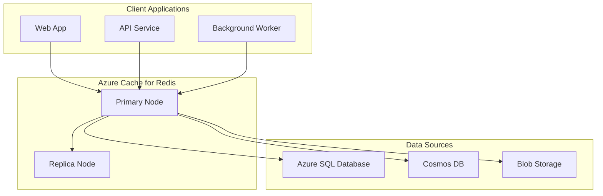
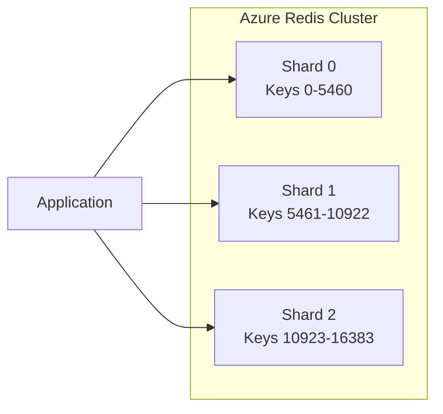

# How to Handle Azure Cache for Redis

Author: [nawazdhandala](https://www.github.com/nawazdhandala)

Tags: Azure, Redis, Cache, Performance, Cloud, Microsoft Azure, Caching

Description: Learn how to configure, manage, and troubleshoot Azure Cache for Redis including connection handling, clustering, and performance optimization.

---

## Introduction

Azure Cache for Redis provides an in-memory data store based on the Redis software. It offers high throughput and low-latency access to data for applications, making it ideal for caching, session management, and real-time analytics. This guide covers essential techniques for handling Azure Cache for Redis effectively in production environments.

## Understanding Azure Cache for Redis Tiers

Before diving into implementation, it is important to understand the available tiers:

- **Basic**: Single node, no SLA, suitable for development and testing
- **Standard**: Two-node replicated cache with SLA
- **Premium**: Enterprise features including clustering, persistence, and virtual network support
- **Enterprise**: Redis Enterprise with active geo-replication and RediSearch modules

## Architecture Overview

Here is a typical architecture for applications using Azure Cache for Redis:



## Setting Up the Connection

### Connection String Configuration

Store your Redis connection string securely in Azure Key Vault or application settings:

```csharp
// appsettings.json configuration
{
  "Redis": {
    "ConnectionString": "your-cache.redis.cache.windows.net:6380,password=your-access-key,ssl=True,abortConnect=False",
    "InstanceName": "myapp:"
  }
}
```

### Implementing a Resilient Connection

The connection to Redis should be configured to handle transient failures. Here is a robust implementation in C#:

```csharp
using StackExchange.Redis;
using Microsoft.Extensions.Options;

public class RedisConnectionManager : IDisposable
{
    private readonly Lazy<ConnectionMultiplexer> _connection;
    private readonly RedisOptions _options;
    private bool _disposed;

    public RedisConnectionManager(IOptions<RedisOptions> options)
    {
        _options = options.Value;

        // Use Lazy initialization to ensure thread-safe singleton connection
        _connection = new Lazy<ConnectionMultiplexer>(() =>
        {
            var configOptions = ConfigurationOptions.Parse(_options.ConnectionString);

            // Configure retry logic for transient failures
            configOptions.AbortOnConnectFail = false;
            configOptions.ConnectRetry = 3;
            configOptions.ConnectTimeout = 5000;
            configOptions.SyncTimeout = 5000;
            configOptions.AsyncTimeout = 5000;

            // Enable SSL for secure connections
            configOptions.Ssl = true;
            configOptions.SslProtocols = System.Security.Authentication.SslProtocols.Tls12;

            // Set reasonable defaults for connection pooling
            configOptions.PoolSize = 10;

            var connection = ConnectionMultiplexer.Connect(configOptions);

            // Subscribe to connection events for monitoring
            connection.ConnectionFailed += (sender, args) =>
            {
                Console.WriteLine($"Redis connection failed: {args.Exception?.Message}");
            };

            connection.ConnectionRestored += (sender, args) =>
            {
                Console.WriteLine("Redis connection restored");
            };

            return connection;
        });
    }

    public IDatabase GetDatabase(int db = -1)
    {
        return _connection.Value.GetDatabase(db);
    }

    public IServer GetServer()
    {
        var endpoints = _connection.Value.GetEndPoints();
        return _connection.Value.GetServer(endpoints[0]);
    }

    public void Dispose()
    {
        if (!_disposed)
        {
            _connection.Value?.Dispose();
            _disposed = true;
        }
    }
}

public class RedisOptions
{
    public string ConnectionString { get; set; }
    public string InstanceName { get; set; }
}
```

### Node.js Connection with Retry Logic

For Node.js applications, use the ioredis library with built-in retry:

```javascript
const Redis = require('ioredis');

// Create Redis client with retry configuration
const redis = new Redis({
    host: 'your-cache.redis.cache.windows.net',
    port: 6380,
    password: process.env.REDIS_PASSWORD,
    tls: {
        servername: 'your-cache.redis.cache.windows.net'
    },
    // Retry strategy for connection failures
    retryStrategy: (times) => {
        if (times > 10) {
            // Stop retrying after 10 attempts
            console.error('Redis connection failed after 10 retries');
            return null;
        }
        // Exponential backoff with max 30 seconds
        const delay = Math.min(times * 500, 30000);
        console.log(`Retrying Redis connection in ${delay}ms`);
        return delay;
    },
    // Reconnect on specific errors
    reconnectOnError: (err) => {
        const targetErrors = ['READONLY', 'ECONNRESET', 'ETIMEDOUT'];
        return targetErrors.some(e => err.message.includes(e));
    },
    // Connection pool settings
    maxRetriesPerRequest: 3,
    enableReadyCheck: true,
    lazyConnect: false
});

// Event handlers for monitoring
redis.on('connect', () => {
    console.log('Connected to Azure Redis');
});

redis.on('error', (err) => {
    console.error('Redis error:', err.message);
});

redis.on('close', () => {
    console.log('Redis connection closed');
});

module.exports = redis;
```

## Implementing Caching Patterns

### Cache-Aside Pattern

The cache-aside pattern is the most common approach. The application checks the cache first, and if the data is not found, it retrieves from the source and populates the cache:

```csharp
public class ProductService
{
    private readonly IDatabase _cache;
    private readonly IProductRepository _repository;
    private readonly TimeSpan _cacheExpiry = TimeSpan.FromMinutes(30);

    public ProductService(RedisConnectionManager redis, IProductRepository repository)
    {
        _cache = redis.GetDatabase();
        _repository = repository;
    }

    public async Task<Product> GetProductAsync(string productId)
    {
        string cacheKey = $"product:{productId}";

        // Try to get from cache first
        var cachedData = await _cache.StringGetAsync(cacheKey);

        if (cachedData.HasValue)
        {
            // Cache hit - deserialize and return
            return JsonSerializer.Deserialize<Product>(cachedData);
        }

        // Cache miss - fetch from database
        var product = await _repository.GetByIdAsync(productId);

        if (product != null)
        {
            // Store in cache with expiration
            var serialized = JsonSerializer.Serialize(product);
            await _cache.StringSetAsync(
                cacheKey,
                serialized,
                _cacheExpiry,
                When.NotExists  // Only set if key does not exist
            );
        }

        return product;
    }

    public async Task InvalidateProductCacheAsync(string productId)
    {
        string cacheKey = $"product:{productId}";
        await _cache.KeyDeleteAsync(cacheKey);
    }
}
```

### Write-Through Pattern with Transactions

For scenarios where cache consistency is critical:

```csharp
public async Task UpdateProductAsync(Product product)
{
    string cacheKey = $"product:{product.Id}";

    // Use Redis transaction to ensure atomicity
    var transaction = _cache.CreateTransaction();

    // Condition: only proceed if key exists in cache
    transaction.AddCondition(Condition.KeyExists(cacheKey));

    // Queue the cache update
    var serialized = JsonSerializer.Serialize(product);
    _ = transaction.StringSetAsync(cacheKey, serialized, _cacheExpiry);

    // Execute transaction
    bool committed = await transaction.ExecuteAsync();

    // Always update the database
    await _repository.UpdateAsync(product);

    // If transaction failed (key did not exist), that is fine
    // The cache-aside pattern will populate it on next read
    if (!committed)
    {
        Console.WriteLine($"Cache update skipped for product {product.Id}");
    }
}
```

## Handling Clustering

For Premium tier with clustering enabled, your application needs to handle multiple shards:



### Cluster-Aware Operations

When using clustering, ensure your operations are cluster-compatible:

```csharp
public class ClusterAwareCacheService
{
    private readonly IDatabase _cache;

    // Use hash tags to ensure related keys are on the same shard
    // Keys with the same {hashtag} will be on the same shard
    public async Task SetUserSessionAsync(string userId, UserSession session)
    {
        // Using hash tag {user:userId} ensures all user data is colocated
        string sessionKey = $"{{user:{userId}}}:session";
        string prefsKey = $"{{user:{userId}}}:preferences";

        var serializedSession = JsonSerializer.Serialize(session);
        var serializedPrefs = JsonSerializer.Serialize(session.Preferences);

        // These operations can be batched since keys are on same shard
        var batch = _cache.CreateBatch();
        batch.StringSetAsync(sessionKey, serializedSession, TimeSpan.FromHours(1));
        batch.StringSetAsync(prefsKey, serializedPrefs, TimeSpan.FromHours(24));
        batch.Execute();
    }

    // Avoid cross-slot operations in transactions
    public async Task<Dictionary<string, string>> GetMultipleKeysAsync(string[] keys)
    {
        var results = new Dictionary<string, string>();

        // Group keys by slot for efficient retrieval
        var keysBySlot = keys.GroupBy(k => HashSlot(k));

        foreach (var group in keysBySlot)
        {
            var redisKeys = group.Select(k => (RedisKey)k).ToArray();
            var values = await _cache.StringGetAsync(redisKeys);

            for (int i = 0; i < redisKeys.Length; i++)
            {
                if (values[i].HasValue)
                {
                    results[redisKeys[i]] = values[i];
                }
            }
        }

        return results;
    }

    private int HashSlot(string key)
    {
        // Extract hash tag if present
        int start = key.IndexOf('{');
        int end = key.IndexOf('}');

        if (start >= 0 && end > start + 1)
        {
            key = key.Substring(start + 1, end - start - 1);
        }

        // CRC16 implementation for slot calculation
        return Crc16(key) % 16384;
    }
}
```

## Monitoring and Diagnostics

### Implementing Health Checks

Add Redis health checks to your application:

```csharp
public class RedisHealthCheck : IHealthCheck
{
    private readonly RedisConnectionManager _redis;

    public RedisHealthCheck(RedisConnectionManager redis)
    {
        _redis = redis;
    }

    public async Task<HealthCheckResult> CheckHealthAsync(
        HealthCheckContext context,
        CancellationToken cancellationToken = default)
    {
        try
        {
            var db = _redis.GetDatabase();
            var latency = await db.PingAsync();

            var data = new Dictionary<string, object>
            {
                { "latency_ms", latency.TotalMilliseconds }
            };

            if (latency.TotalMilliseconds > 100)
            {
                return HealthCheckResult.Degraded(
                    $"Redis latency is high: {latency.TotalMilliseconds}ms",
                    data: data);
            }

            return HealthCheckResult.Healthy(
                $"Redis is healthy. Latency: {latency.TotalMilliseconds}ms",
                data: data);
        }
        catch (Exception ex)
        {
            return HealthCheckResult.Unhealthy(
                "Redis connection failed",
                exception: ex);
        }
    }
}
```

### Collecting Metrics

Track cache performance metrics:

```csharp
public class RedisCacheMetrics
{
    private readonly IDatabase _cache;
    private readonly ILogger<RedisCacheMetrics> _logger;

    public async Task<CacheStatistics> GetStatisticsAsync()
    {
        var server = _redis.GetServer();
        var info = await server.InfoAsync();

        var stats = new CacheStatistics
        {
            ConnectedClients = GetInfoValue(info, "connected_clients"),
            UsedMemoryBytes = GetInfoValue(info, "used_memory"),
            TotalKeysCount = GetInfoValue(info, "db0", "keys"),
            CacheHits = GetInfoValue(info, "keyspace_hits"),
            CacheMisses = GetInfoValue(info, "keyspace_misses"),
            EvictedKeys = GetInfoValue(info, "evicted_keys")
        };

        // Calculate hit rate
        var totalRequests = stats.CacheHits + stats.CacheMisses;
        stats.HitRate = totalRequests > 0
            ? (double)stats.CacheHits / totalRequests * 100
            : 0;

        _logger.LogInformation(
            "Redis Stats - Hit Rate: {HitRate:F2}%, Memory: {Memory}MB, Keys: {Keys}",
            stats.HitRate,
            stats.UsedMemoryBytes / 1024 / 1024,
            stats.TotalKeysCount);

        return stats;
    }
}
```

## Troubleshooting Common Issues

### Connection Timeouts

If you experience frequent timeouts:

```csharp
// Increase timeout values for high-latency scenarios
var config = ConfigurationOptions.Parse(connectionString);
config.SyncTimeout = 10000;      // 10 seconds for sync operations
config.AsyncTimeout = 10000;     // 10 seconds for async operations
config.ConnectTimeout = 10000;   // 10 seconds for initial connection
config.ResponseTimeout = 10000;  // 10 seconds for command response

// Enable connection keep-alive
config.KeepAlive = 60;  // Send keepalive every 60 seconds
```

### Memory Pressure

When Redis is running low on memory:

```csharp
// Implement key expiration policies
public async Task SetWithSlidingExpirationAsync<T>(
    string key,
    T value,
    TimeSpan slidingExpiration)
{
    var serialized = JsonSerializer.Serialize(value);

    // Use sliding expiration to remove inactive keys
    await _cache.StringSetAsync(key, serialized);
    await _cache.KeyExpireAsync(key, slidingExpiration);
}

// Implement LRU eviction by setting maxmemory-policy
// Configure in Azure Portal: maxmemory-policy = allkeys-lru
```

## Best Practices

1. **Use connection pooling**: Never create a new connection per request
2. **Set appropriate TTLs**: Always set expiration on cached items
3. **Use hash tags for related data**: Ensure related keys are on the same shard
4. **Implement circuit breaker**: Fail fast when Redis is unavailable
5. **Monitor memory usage**: Set alerts for memory thresholds
6. **Use pipelining for bulk operations**: Reduce network round trips
7. **Serialize efficiently**: Use binary serialization for large objects

## Conclusion

Azure Cache for Redis is a powerful tool for improving application performance. By following the patterns and practices outlined in this guide, you can build resilient, high-performance caching solutions. Remember to monitor your cache metrics regularly, implement proper error handling, and choose the right tier based on your requirements. With proper configuration and maintenance, Azure Cache for Redis will significantly reduce database load and improve response times for your applications.
