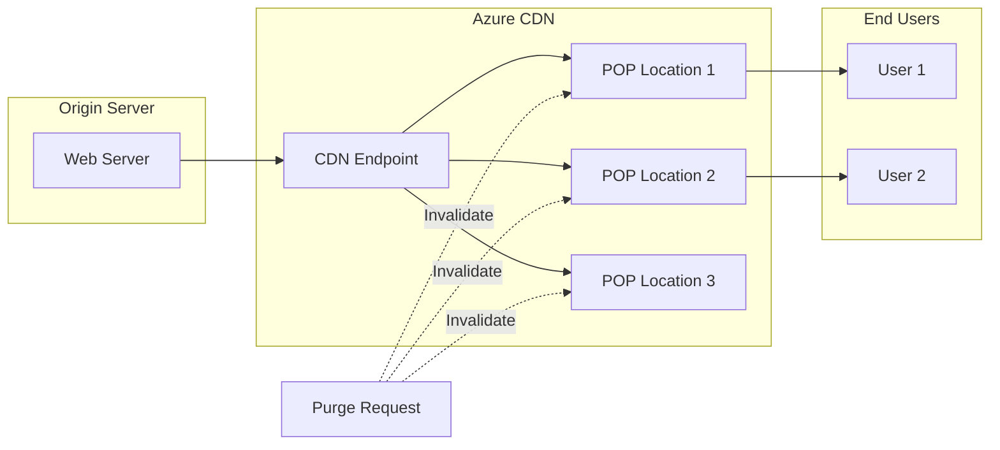

# How to Fix 'CDN Endpoint' Purge Errors

Author: [nawazdhandala](https://www.github.com/nawazdhandala)

Tags: Azure, CDN, Caching, Purge, Troubleshooting, Performance, DevOps

Description: A practical guide to diagnosing and resolving Azure CDN endpoint purge errors with solutions for common failure scenarios.

---

Azure CDN purging allows you to remove cached content from edge servers before it expires naturally. However, purge operations can fail for various reasons, leaving stale content on your CDN. This guide covers common purge errors and how to resolve them.

## Understanding CDN Purge Operations

Before diving into errors, let's understand how CDN purging works.



### Purge Types

Azure CDN supports different purge methods depending on your CDN provider:

- **Single URL Purge**: Remove a specific file from cache
- **Wildcard Purge**: Remove files matching a pattern (e.g., `/images/*`)
- **Root Purge**: Remove all cached content (`/*`)

## Common Error 1: Rate Limit Exceeded

The most frequent purge error is hitting rate limits.

### Error Message

```
{
  "error": {
    "code": "TooManyRequests",
    "message": "Rate limit is exceeded. Please retry after 60 seconds."
  }
}
```

### Solution

Implement rate limiting and batching in your purge logic:

```bash
# Check current purge limits for your CDN profile
az cdn endpoint show \
    --resource-group myResourceGroup \
    --profile-name myCDNProfile \
    --name myEndpoint \
    --query "deliveryPolicy"
```

Implement a purge script with rate limiting:

```python
#!/usr/bin/env python3
"""
Azure CDN Purge Script with Rate Limiting and Retry Logic
"""

import time
from azure.identity import DefaultAzureCredential
from azure.mgmt.cdn import CdnManagementClient

class CDNPurger:
    def __init__(self, subscription_id, resource_group, profile_name, endpoint_name):
        self.credential = DefaultAzureCredential()
        self.client = CdnManagementClient(self.credential, subscription_id)
        self.resource_group = resource_group
        self.profile_name = profile_name
        self.endpoint_name = endpoint_name

        # Rate limiting settings
        self.max_paths_per_request = 50  # Azure limit
        self.requests_per_minute = 10
        self.last_request_time = 0

    def _wait_for_rate_limit(self):
        """Ensure we don't exceed rate limits."""
        elapsed = time.time() - self.last_request_time
        min_interval = 60 / self.requests_per_minute

        if elapsed < min_interval:
            sleep_time = min_interval - elapsed
            print(f"Rate limiting: waiting {sleep_time:.1f} seconds...")
            time.sleep(sleep_time)

        self.last_request_time = time.time()

    def purge_paths(self, paths, max_retries=3):
        """Purge a list of paths with retry logic."""
        # Split into batches
        batches = [
            paths[i:i + self.max_paths_per_request]
            for i in range(0, len(paths), self.max_paths_per_request)
        ]

        results = []

        for batch_num, batch in enumerate(batches, 1):
            print(f"Processing batch {batch_num}/{len(batches)} ({len(batch)} paths)")

            for attempt in range(max_retries):
                try:
                    self._wait_for_rate_limit()

                    # Execute purge
                    poller = self.client.endpoints.begin_purge_content(
                        resource_group_name=self.resource_group,
                        profile_name=self.profile_name,
                        endpoint_name=self.endpoint_name,
                        content_file_paths={"content_paths": batch}
                    )

                    # Wait for completion
                    result = poller.result()
                    results.append({"batch": batch_num, "status": "success", "paths": batch})
                    print(f"Batch {batch_num} purged successfully")
                    break

                except Exception as e:
                    error_msg = str(e)

                    if "TooManyRequests" in error_msg:
                        wait_time = 60 * (attempt + 1)  # Exponential backoff
                        print(f"Rate limited. Waiting {wait_time} seconds...")
                        time.sleep(wait_time)
                    elif attempt == max_retries - 1:
                        results.append({"batch": batch_num, "status": "failed", "error": error_msg})
                        print(f"Batch {batch_num} failed after {max_retries} attempts: {error_msg}")
                    else:
                        print(f"Attempt {attempt + 1} failed, retrying...")
                        time.sleep(5)

        return results

# Usage
if __name__ == "__main__":
    purger = CDNPurger(
        subscription_id="your-subscription-id",
        resource_group="myResourceGroup",
        profile_name="myCDNProfile",
        endpoint_name="myEndpoint"
    )

    paths_to_purge = [
        "/css/styles.css",
        "/js/app.js",
        "/images/*",  # Wildcard purge
    ]

    results = purger.purge_paths(paths_to_purge)
    print(f"\nPurge completed. Results: {results}")
```

## Common Error 2: Invalid Path Format

Purge requests fail when paths are not formatted correctly.

### Error Message

```
{
  "error": {
    "code": "BadRequest",
    "message": "The content path '/images/logo.png?' is invalid."
  }
}
```

### Solution

Validate and sanitize paths before purging:

```python
import re
from urllib.parse import urlparse, quote

def sanitize_purge_path(path):
    """
    Sanitize a path for CDN purge.

    Rules:
    - Must start with /
    - No query strings
    - No fragments
    - URL encode special characters
    """
    # Parse the path
    if path.startswith("http"):
        parsed = urlparse(path)
        path = parsed.path

    # Ensure leading slash
    if not path.startswith("/"):
        path = "/" + path

    # Remove query string and fragment
    path = path.split("?")[0].split("#")[0]

    # URL encode special characters (except / and *)
    # Split by / and *, encode each segment, then rejoin
    segments = re.split(r'([/*])', path)
    encoded_segments = []

    for segment in segments:
        if segment in ['/', '*']:
            encoded_segments.append(segment)
        else:
            encoded_segments.append(quote(segment, safe=''))

    return ''.join(encoded_segments)

def validate_purge_paths(paths):
    """Validate a list of purge paths."""
    valid_paths = []
    invalid_paths = []

    for path in paths:
        sanitized = sanitize_purge_path(path)

        # Validate the sanitized path
        if not sanitized or sanitized == "/":
            # Root purge needs special handling
            valid_paths.append("/*")
        elif re.match(r'^/[a-zA-Z0-9._\-/%*]+$', sanitized):
            valid_paths.append(sanitized)
        else:
            invalid_paths.append({"original": path, "sanitized": sanitized})

    return valid_paths, invalid_paths

# Example usage
paths = [
    "/images/logo.png?v=123",  # Has query string
    "css/styles.css",          # Missing leading slash
    "/js/app.js#section",      # Has fragment
    "/path with spaces/file.txt",  # Has spaces
]

valid, invalid = validate_purge_paths(paths)
print(f"Valid paths: {valid}")
print(f"Invalid paths: {invalid}")
```

## Common Error 3: Endpoint Not Running

Purge fails if the CDN endpoint is stopped or in a failed state.

### Error Message

```
{
  "error": {
    "code": "EndpointNotRunning",
    "message": "The endpoint is not in a running state."
  }
}
```

### Solution

Check and start the endpoint before purging:

```bash
# Check endpoint state
az cdn endpoint show \
    --resource-group myResourceGroup \
    --profile-name myCDNProfile \
    --name myEndpoint \
    --query "resourceState"

# Start the endpoint if stopped
az cdn endpoint start \
    --resource-group myResourceGroup \
    --profile-name myCDNProfile \
    --name myEndpoint

# Wait for endpoint to be running
while true; do
    STATE=$(az cdn endpoint show \
        --resource-group myResourceGroup \
        --profile-name myCDNProfile \
        --name myEndpoint \
        --query "resourceState" -o tsv)

    if [ "$STATE" == "Running" ]; then
        echo "Endpoint is running"
        break
    fi

    echo "Endpoint state: $STATE. Waiting..."
    sleep 10
done
```

## Common Error 4: Authentication Failure

Purge requests fail due to insufficient permissions.

### Error Message

```
{
  "error": {
    "code": "AuthorizationFailed",
    "message": "The client does not have authorization to perform action
    'Microsoft.Cdn/profiles/endpoints/purge/action'."
  }
}
```

### Solution

Ensure the identity has the correct role:

```bash
# Check current role assignments
az role assignment list \
    --assignee "your-principal-id" \
    --scope "/subscriptions/{sub}/resourceGroups/{rg}/providers/Microsoft.Cdn/profiles/{profile}" \
    --output table

# Assign CDN Endpoint Contributor role
az role assignment create \
    --assignee "your-principal-id" \
    --role "CDN Endpoint Contributor" \
    --scope "/subscriptions/{sub}/resourceGroups/{rg}/providers/Microsoft.Cdn/profiles/{profile}/endpoints/{endpoint}"
```

Or create a custom role for purge-only access:

```json
{
  "Name": "CDN Purge Operator",
  "Description": "Can purge CDN content but not modify endpoints",
  "Actions": [
    "Microsoft.Cdn/profiles/endpoints/purge/action",
    "Microsoft.Cdn/profiles/endpoints/read"
  ],
  "NotActions": [],
  "AssignableScopes": [
    "/subscriptions/{subscription-id}"
  ]
}
```

## Common Error 5: Timeout During Large Purges

Wildcard purges on large sites can timeout.

### Error Message

```
{
  "error": {
    "code": "GatewayTimeout",
    "message": "The request timed out."
  }
}
```

### Solution

Use asynchronous purge and monitor status:

```bash
#!/bin/bash
# Async purge with status monitoring

RESOURCE_GROUP="myResourceGroup"
PROFILE_NAME="myCDNProfile"
ENDPOINT_NAME="myEndpoint"

# Start the purge (async)
echo "Starting purge..."
OPERATION_URL=$(az cdn endpoint purge \
    --resource-group $RESOURCE_GROUP \
    --profile-name $PROFILE_NAME \
    --name $ENDPOINT_NAME \
    --content-paths "/*" \
    --no-wait \
    --query "id" -o tsv 2>&1)

echo "Purge operation started"

# Monitor purge status
MAX_WAIT=600  # 10 minutes
ELAPSED=0
INTERVAL=30

while [ $ELAPSED -lt $MAX_WAIT ]; do
    # Check endpoint for recent purge activity
    STATUS=$(az cdn endpoint show \
        --resource-group $RESOURCE_GROUP \
        --profile-name $PROFILE_NAME \
        --name $ENDPOINT_NAME \
        --query "provisioningState" -o tsv)

    echo "Status after ${ELAPSED}s: $STATUS"

    if [ "$STATUS" == "Succeeded" ]; then
        echo "Purge completed successfully!"
        exit 0
    fi

    sleep $INTERVAL
    ELAPSED=$((ELAPSED + INTERVAL))
done

echo "Purge timed out after ${MAX_WAIT} seconds"
exit 1
```

## Implementing a Robust Purge Pipeline

Here's a complete CI/CD integration for CDN purging:

```yaml
# azure-pipelines.yml
trigger:
  branches:
    include:
      - main
  paths:
    include:
      - 'static/*'

variables:
  resourceGroup: 'myResourceGroup'
  cdnProfile: 'myCDNProfile'
  cdnEndpoint: 'myEndpoint'

stages:
  - stage: Deploy
    jobs:
      - job: DeployAndPurge
        pool:
          vmImage: 'ubuntu-latest'
        steps:
          - task: AzureCLI@2
            displayName: 'Deploy static files'
            inputs:
              azureSubscription: 'MyAzureConnection'
              scriptType: 'bash'
              scriptLocation: 'inlineScript'
              inlineScript: |
                az storage blob upload-batch \
                  --destination '$web' \
                  --source './static' \
                  --account-name mystorageaccount \
                  --overwrite

          - task: AzureCLI@2
            displayName: 'Purge CDN cache'
            inputs:
              azureSubscription: 'MyAzureConnection'
              scriptType: 'bash'
              scriptLocation: 'inlineScript'
              inlineScript: |
                # Get list of changed files
                CHANGED_FILES=$(git diff --name-only HEAD~1 HEAD -- static/ | sed 's|static/|/|')

                if [ -z "$CHANGED_FILES" ]; then
                  echo "No static files changed, skipping purge"
                  exit 0
                fi

                # Convert to JSON array
                PATHS_JSON=$(echo "$CHANGED_FILES" | jq -R -s -c 'split("\n") | map(select(length > 0))')

                echo "Purging paths: $PATHS_JSON"

                # Purge with retry
                for i in {1..3}; do
                  az cdn endpoint purge \
                    --resource-group $(resourceGroup) \
                    --profile-name $(cdnProfile) \
                    --name $(cdnEndpoint) \
                    --content-paths $PATHS_JSON && break

                  echo "Purge attempt $i failed, retrying in 30s..."
                  sleep 30
                done
```

## Best Practices for CDN Purging

1. **Use Versioned URLs**: Instead of purging, use versioned URLs like `/styles.css?v=123` to bypass cache

2. **Purge Specific Paths**: Avoid wildcard purges when possible; they are slower and more resource-intensive

3. **Implement Cache Tags**: Use cache tags (if supported) for more granular invalidation

4. **Monitor Purge Operations**: Set up alerts for failed purges

5. **Consider TTL Settings**: Set appropriate TTL values to reduce purge frequency

```bash
# Set caching rules on endpoint
az cdn endpoint rule add \
    --resource-group myResourceGroup \
    --profile-name myCDNProfile \
    --name myEndpoint \
    --order 1 \
    --rule-name "CacheImages" \
    --action-name "CacheExpiration" \
    --cache-behavior "Override" \
    --cache-duration "7.00:00:00" \
    --match-variable "UrlFileExtension" \
    --operator "Equal" \
    --match-values "jpg" "png" "gif" "webp"
```

---

CDN purge errors are usually caused by rate limits, invalid paths, or permission issues. By implementing proper error handling, rate limiting, and path validation, you can build reliable purge automation that keeps your CDN content fresh without manual intervention. Remember that purging should be a last resort; using versioned URLs and appropriate TTL settings can often eliminate the need for purging entirely.
