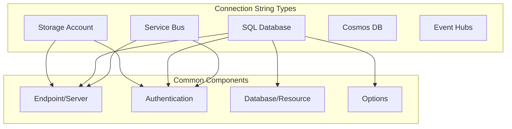

# How to Fix "Connection String" Errors in Azure

Author: [nawazdhandala](https://www.github.com/nawazdhandala)

Tags: Azure, Connection Strings, Troubleshooting, Storage, SQL, Service Bus, DevOps

Description: A practical guide to diagnosing and fixing common Azure connection string errors across storage accounts, SQL databases, and messaging services.

---

Connection string errors are among the most frustrating Azure issues. They often produce vague error messages while the actual problem is a typo, missing component, or network configuration issue. This guide covers the most common connection string problems and their solutions.

## Understanding Azure Connection Strings

Different Azure services use different connection string formats. Getting these right is crucial for your applications.



## Storage Account Connection String Errors

### Error: AuthenticationFailed

**Error Message:**
```
AuthenticationFailed: Server failed to authenticate the request. Make sure the value of Authorization header is formed correctly including the signature.
```

**Causes and Fixes:**

1. **Invalid or rotated access key**

```bash
# Get current storage account keys
az storage account keys list \
  --account-name mystorageaccount \
  --resource-group rg-myapp \
  --query "[].{KeyName:keyName, Value:value}" -o table

# Regenerate key if compromised
az storage account keys renew \
  --account-name mystorageaccount \
  --resource-group rg-myapp \
  --key primary
```

2. **Incorrect connection string format**

```python
# Correct format for storage account
connection_string = (
    "DefaultEndpointsProtocol=https;"
    "AccountName=mystorageaccount;"
    "AccountKey=<your-key-here>;"
    "EndpointSuffix=core.windows.net"
)

# Common mistakes:
# - Missing semicolons between parts
# - Extra spaces around equals signs
# - Using account name instead of key
# - Missing EndpointSuffix for non-public clouds
```

3. **Using SAS token incorrectly**

```python
# SAS token connection string
sas_connection = (
    "BlobEndpoint=https://mystorageaccount.blob.core.windows.net/;"
    "SharedAccessSignature=sv=2022-11-02&ss=b&srt=sco&sp=rwdlacyx&se=2024-12-31..."
)

# Do NOT include the leading '?' from the SAS token
# Wrong: SharedAccessSignature=?sv=2022...
# Right: SharedAccessSignature=sv=2022...
```

### Error: The specified container does not exist

**Fix:** Create the container or check the name.

```python
from azure.storage.blob import BlobServiceClient

def ensure_container_exists(connection_string, container_name):
    """Create container if it doesn't exist."""
    blob_service = BlobServiceClient.from_connection_string(connection_string)
    container_client = blob_service.get_container_client(container_name)

    try:
        container_client.get_container_properties()
    except Exception:
        container_client.create_container()
        print(f"Created container: {container_name}")


# Container names must be:
# - 3-63 characters
# - Lowercase letters, numbers, hyphens only
# - Start with letter or number
# - No consecutive hyphens
```

### Error: The specified resource does not exist (403)

This often means firewall rules are blocking access.

```bash
# Check storage account network rules
az storage account show \
  --name mystorageaccount \
  --resource-group rg-myapp \
  --query networkRuleSet

# Add your IP to allowed list
az storage account network-rule add \
  --account-name mystorageaccount \
  --resource-group rg-myapp \
  --ip-address $(curl -s ifconfig.me)

# Or allow Azure services
az storage account update \
  --name mystorageaccount \
  --resource-group rg-myapp \
  --bypass AzureServices
```

## SQL Database Connection String Errors

### Error: Login failed for user

**Error Message:**
```
Login failed for user 'myuser'. Reason: Password did not match that for the login provided.
```

**Fixes:**

```bash
# Reset SQL admin password
az sql server update \
  --name mysqlserver \
  --resource-group rg-myapp \
  --admin-password "NewSecurePassword123!"

# Or create new user with proper permissions
az sql db execute \
  --name mydb \
  --server mysqlserver \
  --resource-group rg-myapp \
  --query "CREATE USER [appuser] WITH PASSWORD = 'SecurePass123!'; ALTER ROLE db_datareader ADD MEMBER [appuser]; ALTER ROLE db_datawriter ADD MEMBER [appuser];"
```

**Correct Connection String Format:**

```python
# ADO.NET format (most common)
connection_string = (
    "Server=tcp:mysqlserver.database.windows.net,1433;"
    "Initial Catalog=mydb;"
    "User ID=myuser;"
    "Password=MyPassword123!;"
    "Encrypt=True;"
    "TrustServerCertificate=False;"
    "Connection Timeout=30;"
)

# For Azure AD authentication
aad_connection = (
    "Server=tcp:mysqlserver.database.windows.net,1433;"
    "Initial Catalog=mydb;"
    "Authentication=Active Directory Default;"
    "Encrypt=True;"
)

# Common mistakes:
# - Using 'Database' instead of 'Initial Catalog'
# - Missing 'tcp:' prefix
# - Wrong port (default is 1433)
# - Missing 'Encrypt=True' (required for Azure SQL)
```

### Error: Cannot open server requested by the login

**Fix:** Check firewall rules and virtual network settings.

```bash
# Check current firewall rules
az sql server firewall-rule list \
  --server mysqlserver \
  --resource-group rg-myapp

# Add your current IP
az sql server firewall-rule create \
  --server mysqlserver \
  --resource-group rg-myapp \
  --name "MyIP" \
  --start-ip-address $(curl -s ifconfig.me) \
  --end-ip-address $(curl -s ifconfig.me)

# Allow Azure services
az sql server firewall-rule create \
  --server mysqlserver \
  --resource-group rg-myapp \
  --name "AllowAzureServices" \
  --start-ip-address 0.0.0.0 \
  --end-ip-address 0.0.0.0
```

### Error: Connection timeout

```python
# Increase timeout and add retry logic
import pyodbc
from tenacity import retry, stop_after_attempt, wait_exponential

@retry(stop=stop_after_attempt(3), wait=wait_exponential(multiplier=1, min=4, max=10))
def get_connection():
    connection_string = (
        "Driver={ODBC Driver 18 for SQL Server};"
        "Server=tcp:mysqlserver.database.windows.net,1433;"
        "Database=mydb;"
        "Uid=myuser;"
        "Pwd=MyPassword123!;"
        "Encrypt=yes;"
        "TrustServerCertificate=no;"
        "Connection Timeout=60;"  # Increase from default 30
    )
    return pyodbc.connect(connection_string)
```

## Service Bus Connection String Errors

### Error: Put token failed. Status-code: 401

**Error Message:**
```
Put token failed. status-code: 401, status-description: InvalidSignature: The token has an invalid signature.
```

**Fixes:**

```bash
# Get connection string with correct policy
az servicebus namespace authorization-rule keys list \
  --namespace-name sb-myapp \
  --resource-group rg-messaging \
  --name RootManageSharedAccessKey \
  --query primaryConnectionString -o tsv

# Create policy with limited permissions
az servicebus queue authorization-rule create \
  --name SendOnly \
  --namespace-name sb-myapp \
  --queue-name myqueue \
  --resource-group rg-messaging \
  --rights Send
```

**Correct Format:**

```python
# Full namespace connection string
namespace_connection = (
    "Endpoint=sb://sb-myapp.servicebus.windows.net/;"
    "SharedAccessKeyName=RootManageSharedAccessKey;"
    "SharedAccessKey=<your-key>"
)

# Entity-specific connection string
queue_connection = (
    "Endpoint=sb://sb-myapp.servicebus.windows.net/;"
    "SharedAccessKeyName=SendOnly;"
    "SharedAccessKey=<your-key>;"
    "EntityPath=myqueue"
)

# Common mistakes:
# - Using 'https://' instead of 'sb://'
# - Missing trailing slash after namespace
# - Wrong SharedAccessKeyName
# - Missing EntityPath for entity-specific connections
```

### Error: The messaging entity could not be found

```python
from azure.servicebus import ServiceBusClient
from azure.servicebus.exceptions import ServiceBusError

def validate_queue_exists(connection_string, queue_name):
    """Check if queue exists before sending."""
    try:
        with ServiceBusClient.from_connection_string(connection_string) as client:
            with client.get_queue_sender(queue_name) as sender:
                # Try to get queue properties
                sender._handler.message_handler  # Triggers connection
                print(f"Queue {queue_name} exists")
                return True
    except ServiceBusError as e:
        if "could not be found" in str(e):
            print(f"Queue {queue_name} does not exist")
            return False
        raise
```

## Cosmos DB Connection String Errors

### Error: Request blocked by network rules

```bash
# Check Cosmos DB firewall settings
az cosmosdb show \
  --name mycosmosdb \
  --resource-group rg-myapp \
  --query "ipRules"

# Add IP to allowed list
az cosmosdb update \
  --name mycosmosdb \
  --resource-group rg-myapp \
  --ip-range-filter "$(curl -s ifconfig.me)"
```

**Correct Format:**

```python
# Cosmos DB connection string
cosmos_connection = (
    "AccountEndpoint=https://mycosmosdb.documents.azure.com:443/;"
    "AccountKey=<your-key>"
)

# Using the SDK
from azure.cosmos import CosmosClient

client = CosmosClient.from_connection_string(cosmos_connection)
# Or with explicit parameters
client = CosmosClient(
    url="https://mycosmosdb.documents.azure.com:443/",
    credential="<your-key>"
)
```

## Best Practices for Connection String Management

### Use Managed Identity When Possible

```python
# Storage with managed identity (no connection string needed)
from azure.identity import DefaultAzureCredential
from azure.storage.blob import BlobServiceClient

credential = DefaultAzureCredential()
blob_service = BlobServiceClient(
    account_url="https://mystorageaccount.blob.core.windows.net",
    credential=credential
)

# SQL with managed identity
import pyodbc

connection_string = (
    "Driver={ODBC Driver 18 for SQL Server};"
    "Server=tcp:mysqlserver.database.windows.net,1433;"
    "Database=mydb;"
    "Authentication=ActiveDirectoryMsi;"
    "Encrypt=yes;"
)
```

### Store Connection Strings Securely

```bash
# Store in Key Vault
az keyvault secret set \
  --vault-name kv-myapp \
  --name "StorageConnectionString" \
  --value "DefaultEndpointsProtocol=https;AccountName=..."

# Reference in App Service
az webapp config appsettings set \
  --name mywebapp \
  --resource-group rg-myapp \
  --settings "STORAGE_CONNECTION=@Microsoft.KeyVault(VaultName=kv-myapp;SecretName=StorageConnectionString)"
```

### Validate Connection Strings at Startup

```python
import os
from dataclasses import dataclass

@dataclass
class ConnectionStrings:
    storage: str
    sql: str
    servicebus: str

    @classmethod
    def from_environment(cls):
        """Load and validate connection strings from environment."""
        storage = os.environ.get("STORAGE_CONNECTION_STRING")
        sql = os.environ.get("SQL_CONNECTION_STRING")
        servicebus = os.environ.get("SERVICEBUS_CONNECTION_STRING")

        # Validate required strings
        missing = []
        if not storage:
            missing.append("STORAGE_CONNECTION_STRING")
        if not sql:
            missing.append("SQL_CONNECTION_STRING")
        if not servicebus:
            missing.append("SERVICEBUS_CONNECTION_STRING")

        if missing:
            raise ValueError(f"Missing connection strings: {', '.join(missing)}")

        # Validate format
        if "AccountName=" not in storage:
            raise ValueError("Invalid storage connection string format")

        return cls(storage=storage, sql=sql, servicebus=servicebus)


# Use at application startup
try:
    connections = ConnectionStrings.from_environment()
except ValueError as e:
    print(f"Configuration error: {e}")
    exit(1)
```

## Debugging Connection String Issues

```python
def debug_connection_string(connection_string: str, service_type: str):
    """Parse and validate connection string components."""
    parts = {}

    for part in connection_string.split(";"):
        if "=" in part:
            key, value = part.split("=", 1)
            parts[key.strip()] = value.strip()

    print(f"Connection string parts for {service_type}:")
    for key, value in parts.items():
        # Mask sensitive values
        if "key" in key.lower() or "password" in key.lower():
            print(f"  {key}: {'*' * 10}")
        else:
            print(f"  {key}: {value}")

    return parts


# Usage
debug_connection_string(os.environ["STORAGE_CONNECTION_STRING"], "Storage")
```

---

Connection string errors usually come down to format issues, authentication problems, or network restrictions. Always validate connection strings at startup, use managed identity when possible, and store secrets in Key Vault. When debugging, parse the connection string components and verify each part individually.
