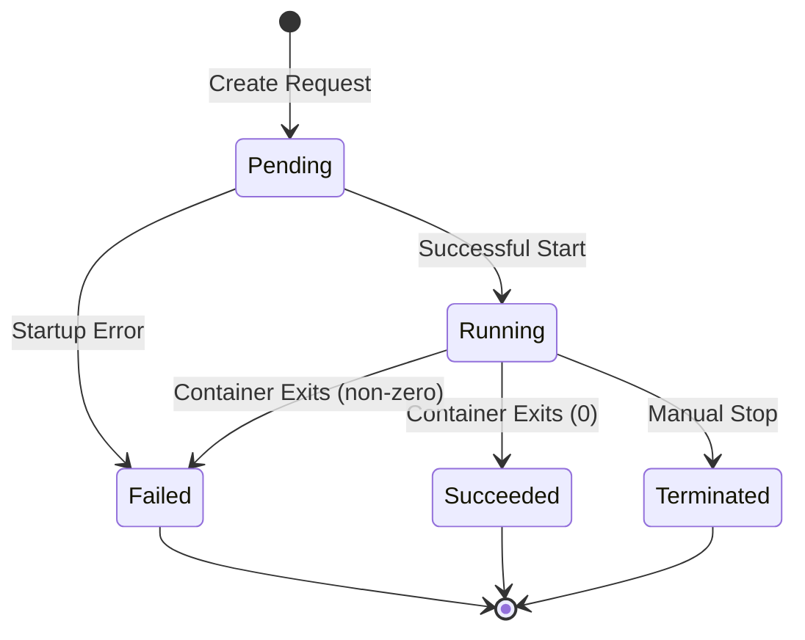
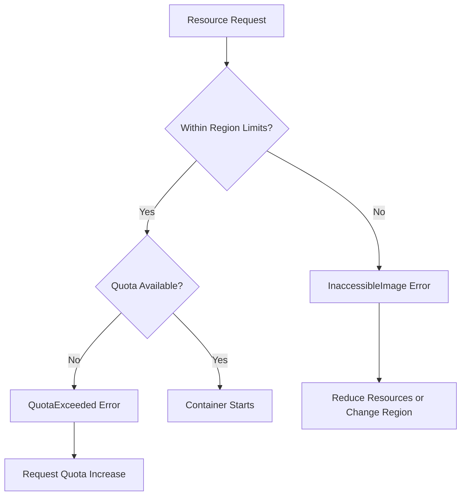
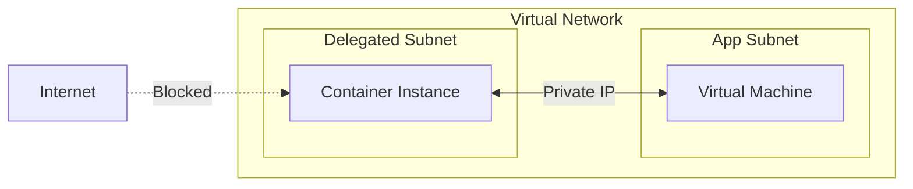
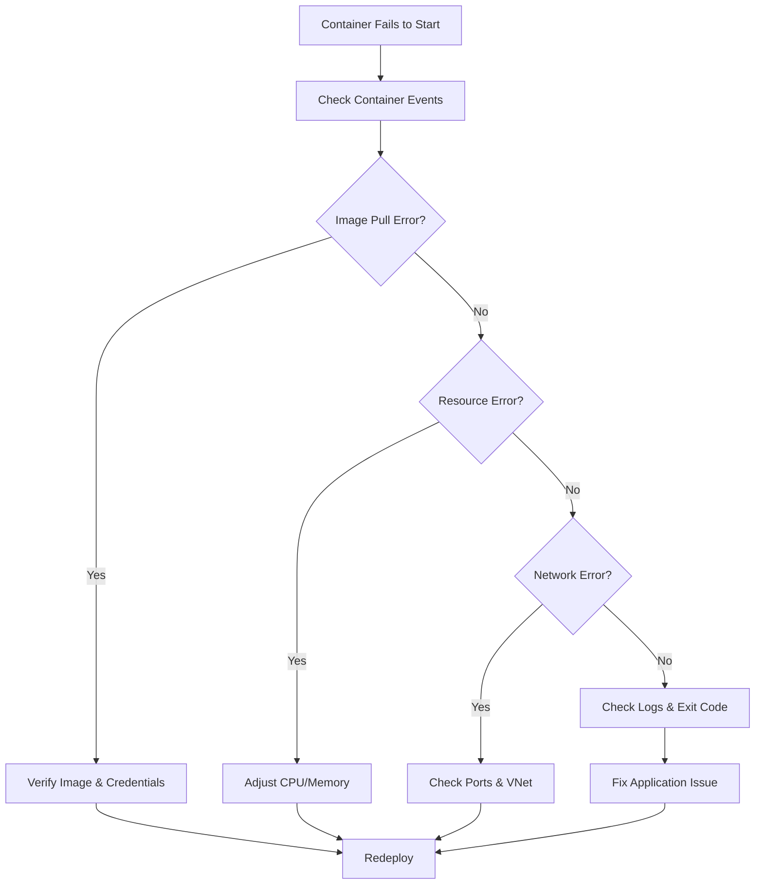

# How to Fix "Container Instance" Startup Errors

Author: [nawazdhandala](https://www.github.com/nawazdhandala)

Tags: Azure, Container Instances, ACI, Docker, DevOps, Troubleshooting, Cloud

Description: Learn how to diagnose and fix common Azure Container Instance startup errors including image pull failures, resource constraints, and networking issues.

---

Azure Container Instances (ACI) provides a fast way to run containers without managing virtual machines. However, startup errors can be frustrating when your container fails to launch. This guide covers the most common ACI startup errors and provides practical solutions to get your containers running.

## Understanding Container Instance States

Before diving into specific errors, it is helpful to understand the container lifecycle states in ACI.



When a container fails to start, Azure reports the state as "Waiting" or "Failed" with an associated error message. Let's examine how to retrieve and interpret these messages.

## Retrieving Container Instance Logs and Events

The first step in debugging any startup error is getting detailed information about what went wrong.

```bash
# Get container instance details including state and events
# The --query parameter filters to show only relevant debugging info
az container show \
  --resource-group myResourceGroup \
  --name myContainer \
  --query "{state:instanceView.state, events:instanceView.events}" \
  --output table

# Get container logs (if the container started at all)
# This shows stdout/stderr from your application
az container logs \
  --resource-group myResourceGroup \
  --name myContainer

# Get previous container logs if the container restarted
# Useful when the container is in a restart loop
az container logs \
  --resource-group myResourceGroup \
  --name myContainer \
  --previous
```

## Error 1: Image Pull Failures

Image pull errors are the most common startup issues. They occur when ACI cannot download your container image from the registry.

### Symptoms

```json
{
  "code": "ImagePullFailure",
  "message": "The image 'myregistry.azurecr.io/myapp:latest' could not be pulled"
}
```

### Common Causes and Solutions

**Invalid image name or tag:**

```bash
# Verify the image exists in your registry
# List all repositories in your Azure Container Registry
az acr repository list --name myregistry --output table

# Show tags for a specific image
# Make sure the tag you are using actually exists
az acr repository show-tags --name myregistry --repository myapp --output table
```

**Missing registry credentials:**

When using a private Azure Container Registry, you must provide credentials.

```bash
# Create container with ACR credentials
# The registry-login-server must match your ACR URL exactly
az container create \
  --resource-group myResourceGroup \
  --name myContainer \
  --image myregistry.azurecr.io/myapp:v1.0.0 \
  --registry-login-server myregistry.azurecr.io \
  --registry-username myregistry \
  --registry-password $(az acr credential show --name myregistry --query passwords[0].value -o tsv)
```

**Using Managed Identity for ACR access:**

A cleaner approach uses managed identity instead of storing credentials.

```bash
# Enable admin user on ACR (not recommended for production)
# Better to use managed identity as shown below
az acr update --name myregistry --admin-enabled true

# Create container with managed identity for ACR access
# This is the recommended approach for production workloads
az container create \
  --resource-group myResourceGroup \
  --name myContainer \
  --image myregistry.azurecr.io/myapp:v1.0.0 \
  --acr-identity [system] \
  --assign-identity
```

## Error 2: Resource Constraint Errors

Resource errors occur when your container requests more CPU or memory than available, or when the requested resources exceed ACI limits.

### Symptoms

```json
{
  "code": "InaccessibleImage",
  "message": "The requested resource of '8' CPUs is not available in the location 'eastus'"
}
```

### Understanding ACI Resource Limits



**Check and adjust resource allocation:**

```bash
# Create container with specific resource limits
# Standard ACI supports up to 4 CPUs and 16 GB memory per container
az container create \
  --resource-group myResourceGroup \
  --name myContainer \
  --image myregistry.azurecr.io/myapp:v1.0.0 \
  --cpu 2 \
  --memory 4

# For GPU workloads, use dedicated SKU
# GPU containers require specific regions that support GPU instances
az container create \
  --resource-group myResourceGroup \
  --name myGpuContainer \
  --image myregistry.azurecr.io/ml-model:v1.0.0 \
  --cpu 4 \
  --memory 14 \
  --sku Dedicated \
  --gpu-count 1 \
  --gpu-sku K80
```

**Check quota in your subscription:**

```bash
# List ACI usage in a specific location
# This helps identify if you are hitting quota limits
az container list-usage --location eastus --output table
```

## Error 3: Container Exit Codes

When a container starts but immediately exits, the exit code provides crucial debugging information.

### Common Exit Codes

| Exit Code | Meaning | Typical Cause |
|-----------|---------|---------------|
| 0 | Success | Container completed its task |
| 1 | General error | Application error or misconfiguration |
| 126 | Permission denied | Cannot execute the command |
| 127 | Command not found | Missing binary or wrong entrypoint |
| 137 | Out of memory (SIGKILL) | Container exceeded memory limit |
| 139 | Segmentation fault | Application crash |

**Debugging exit code issues:**

```bash
# Check the exit code and termination message
az container show \
  --resource-group myResourceGroup \
  --name myContainer \
  --query "containers[0].instanceView.currentState" \
  --output json

# Example output:
# {
#   "state": "Terminated",
#   "exitCode": 137,
#   "detailStatus": "OOM Killed"
# }
```

**Fixing OOM (exit code 137):**

```bash
# Increase memory allocation to prevent OOM kills
# Monitor your application's actual memory usage to size appropriately
az container create \
  --resource-group myResourceGroup \
  --name myContainer \
  --image myregistry.azurecr.io/myapp:v1.0.0 \
  --cpu 2 \
  --memory 8
```

## Error 4: Networking and Port Configuration Errors

Networking errors prevent your container from being accessible or from connecting to other resources.

### Symptoms

```json
{
  "code": "ContainerGroupDeploymentFailed",
  "message": "Port 8080 is already in use"
}
```

**Proper port configuration:**

```bash
# Create container with correct port mappings
# The ports parameter exposes the container port publicly
az container create \
  --resource-group myResourceGroup \
  --name myContainer \
  --image myregistry.azurecr.io/myapp:v1.0.0 \
  --ports 80 443 \
  --dns-name-label myapp-unique-name \
  --ip-address Public

# For internal-only access using VNet integration
# This creates a container accessible only within the virtual network
az container create \
  --resource-group myResourceGroup \
  --name myContainer \
  --image myregistry.azurecr.io/myapp:v1.0.0 \
  --ports 80 \
  --ip-address Private \
  --vnet myVnet \
  --subnet mySubnet
```

### VNet Integration Troubleshooting



**Verify subnet delegation:**

```bash
# The subnet must be delegated to Microsoft.ContainerInstance/containerGroups
# Check current subnet configuration
az network vnet subnet show \
  --resource-group myResourceGroup \
  --vnet-name myVnet \
  --name mySubnet \
  --query delegations

# Add delegation if missing
az network vnet subnet update \
  --resource-group myResourceGroup \
  --vnet-name myVnet \
  --name mySubnet \
  --delegations Microsoft.ContainerInstance/containerGroups
```

## Error 5: Environment Variable and Secret Errors

Misconfigured environment variables or secrets cause containers to fail during startup.

**Secure environment variable configuration:**

```bash
# Create container with environment variables
# Use --secure-environment-variables for sensitive data
az container create \
  --resource-group myResourceGroup \
  --name myContainer \
  --image myregistry.azurecr.io/myapp:v1.0.0 \
  --environment-variables \
    APP_ENV=production \
    LOG_LEVEL=info \
  --secure-environment-variables \
    DATABASE_PASSWORD=secretpassword \
    API_KEY=myapikey
```

**Using Azure Key Vault for secrets:**

```yaml
# deploy.yaml - Container group with Key Vault integration
apiVersion: 2021-09-01
location: eastus
name: myContainerGroup
properties:
  containers:
  - name: myapp
    properties:
      image: myregistry.azurecr.io/myapp:v1.0.0
      resources:
        requests:
          cpu: 1.0
          memoryInGB: 1.5
      environmentVariables:
      - name: DATABASE_URL
        secureValue: ${DATABASE_URL}
      volumeMounts:
      - name: secrets
        mountPath: /secrets
        readOnly: true
  volumes:
  - name: secrets
    secret:
      mysecret: $(az keyvault secret show --vault-name myVault --name mySecret --query value -o tsv | base64)
  osType: Linux
type: Microsoft.ContainerInstance/containerGroups
```

## Error 6: Volume Mount Failures

Volume mount errors prevent containers from accessing required file shares or configuration.

```bash
# Create container with Azure Files volume mount
# The storage account key must have access to the file share
az container create \
  --resource-group myResourceGroup \
  --name myContainer \
  --image myregistry.azurecr.io/myapp:v1.0.0 \
  --azure-file-volume-account-name mystorageaccount \
  --azure-file-volume-account-key $(az storage account keys list --resource-group myResourceGroup --account-name mystorageaccount --query [0].value -o tsv) \
  --azure-file-volume-share-name myshare \
  --azure-file-volume-mount-path /mnt/data
```

## Debugging Workflow

When facing startup errors, follow this systematic approach:



## Best Practices for Reliable Container Startup

1. **Always specify image tags** - Avoid using `latest` as it can cause unexpected behavior when images are updated.

2. **Set appropriate resource limits** - Start with conservative values and adjust based on actual usage.

3. **Implement health probes** - Use liveness and readiness probes to detect and recover from failures.

```bash
# Create container with health probes
az container create \
  --resource-group myResourceGroup \
  --name myContainer \
  --image myregistry.azurecr.io/myapp:v1.0.0 \
  --cpu 1 \
  --memory 1.5 \
  --restart-policy OnFailure
```

4. **Use restart policies** - Configure appropriate restart behavior for your workload type.

5. **Test locally first** - Always verify your container runs correctly with Docker locally before deploying to ACI.

```bash
# Test container locally before deploying to ACI
docker run -it --rm \
  -e APP_ENV=production \
  -p 8080:80 \
  myregistry.azurecr.io/myapp:v1.0.0
```

## Summary

Azure Container Instance startup errors typically fall into a few categories: image pull failures, resource constraints, networking issues, and application errors. By systematically checking container events, logs, and exit codes, you can quickly identify the root cause and apply the appropriate fix. Remember to test containers locally before deploying and implement proper health checks for production workloads.
