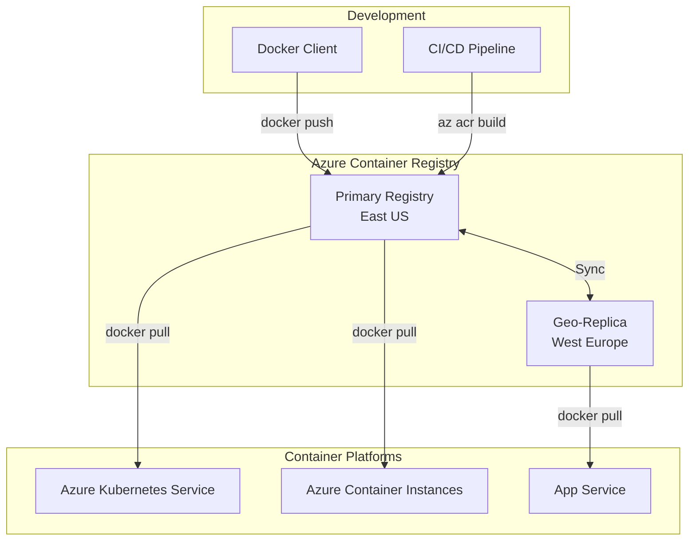
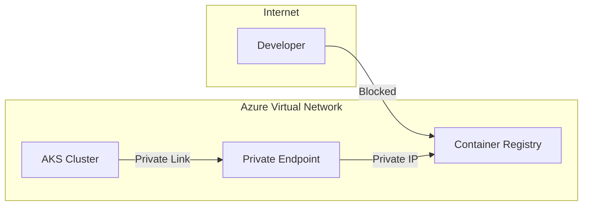

# How to Configure Azure Container Registry

Author: [nawazdhandala](https://www.github.com/nawazdhandala)

Tags: Azure, ACR, Container Registry, Docker, Kubernetes, DevOps, CI/CD

Description: A complete guide to setting up and configuring Azure Container Registry for secure container image management with authentication, replication, and CI/CD integration.

---

Azure Container Registry (ACR) is Microsoft's managed Docker registry service. It stores and manages your container images close to your Azure deployments. This guide walks you through setting up ACR from scratch, configuring authentication, and integrating it with your workflows.

## ACR Architecture Overview



## Creating an Azure Container Registry

### Using Azure CLI

```bash
# Create a resource group
az group create \
    --name myContainerResources \
    --location eastus

# Create a Basic tier ACR (good for development)
az acr create \
    --resource-group myContainerResources \
    --name mycompanyregistry \
    --sku Basic \
    --location eastus

# For production, use Standard or Premium tier
az acr create \
    --resource-group myContainerResources \
    --name mycompanyregistry \
    --sku Premium \
    --location eastus \
    --admin-enabled false
```

### Using Terraform

```hcl
# main.tf - Azure Container Registry configuration
resource "azurerm_resource_group" "acr" {
  name     = "rg-container-registry"
  location = "eastus"
}

resource "azurerm_container_registry" "main" {
  name                = "mycompanyregistry"
  resource_group_name = azurerm_resource_group.acr.name
  location            = azurerm_resource_group.acr.location
  sku                 = "Premium"
  admin_enabled       = false

  # Enable geo-replication for Premium tier
  georeplications {
    location                = "westeurope"
    zone_redundancy_enabled = true
    tags                    = {}
  }

  georeplications {
    location                = "southeastasia"
    zone_redundancy_enabled = true
    tags                    = {}
  }

  # Retention policy for untagged manifests
  retention_policy {
    days    = 7
    enabled = true
  }

  # Enable content trust (image signing)
  trust_policy {
    enabled = true
  }

  tags = {
    environment = "production"
  }
}

# Output the login server
output "acr_login_server" {
  value = azurerm_container_registry.main.login_server
}
```

## Authentication Methods

### Method 1: Azure AD Authentication (Recommended)

This is the most secure approach for production environments.

```bash
# Login using Azure AD credentials
az acr login --name mycompanyregistry

# The above command automatically configures Docker to use your Azure credentials
# Now you can push/pull images
docker push mycompanyregistry.azurecr.io/myapp:v1.0
```

**For CI/CD pipelines, use a service principal:**

```bash
# Create a service principal with AcrPush role
ACR_ID=$(az acr show --name mycompanyregistry --query id --output tsv)

SP_PASSWORD=$(az ad sp create-for-rbac \
    --name acr-service-principal \
    --scopes $ACR_ID \
    --role AcrPush \
    --query password \
    --output tsv)

SP_APP_ID=$(az ad sp list \
    --display-name acr-service-principal \
    --query '[0].appId' \
    --output tsv)

echo "Service Principal ID: $SP_APP_ID"
echo "Service Principal Password: $SP_PASSWORD"
```

**Use in Docker login:**

```bash
# Login with service principal
docker login mycompanyregistry.azurecr.io \
    --username $SP_APP_ID \
    --password $SP_PASSWORD
```

### Method 2: Admin Account (Development Only)

Not recommended for production but useful for quick testing.

```bash
# Enable admin account
az acr update --name mycompanyregistry --admin-enabled true

# Get credentials
az acr credential show --name mycompanyregistry

# Login with admin credentials
docker login mycompanyregistry.azurecr.io \
    --username mycompanyregistry \
    --password <admin-password>
```

### Method 3: Managed Identity for Azure Services

For AKS and other Azure services, use managed identity.

```bash
# Attach ACR to AKS using managed identity
az aks update \
    --name myAKSCluster \
    --resource-group myResourceGroup \
    --attach-acr mycompanyregistry
```

**Or using Terraform:**

```hcl
# Attach ACR to AKS
resource "azurerm_role_assignment" "aks_acr" {
  scope                = azurerm_container_registry.main.id
  role_definition_name = "AcrPull"
  principal_id         = azurerm_kubernetes_cluster.main.kubelet_identity[0].object_id
}
```

## Building Images with ACR Tasks

ACR Tasks let you build images directly in Azure without a local Docker daemon.

### Quick Build

```bash
# Build from local Dockerfile
az acr build \
    --registry mycompanyregistry \
    --image myapp:v1.0 \
    --file Dockerfile \
    .

# Build from Git repository
az acr build \
    --registry mycompanyregistry \
    --image myapp:v1.0 \
    https://github.com/myorg/myapp.git#main:src
```

### Multi-Step Task

Create a task file for complex builds:

```yaml
# acr-task.yaml - Multi-step ACR task
version: v1.1.0
steps:
  # Build the application image
  - build: -t {{.Run.Registry}}/myapp:{{.Run.ID}} -f Dockerfile .

  # Run unit tests
  - cmd: {{.Run.Registry}}/myapp:{{.Run.ID}} npm test

  # Push if tests pass
  - push:
      - {{.Run.Registry}}/myapp:{{.Run.ID}}
      - {{.Run.Registry}}/myapp:latest
```

**Run the task:**

```bash
az acr run \
    --registry mycompanyregistry \
    --file acr-task.yaml \
    .
```

### Scheduled Tasks

```bash
# Create a task that runs on a schedule
az acr task create \
    --registry mycompanyregistry \
    --name nightly-build \
    --image myapp:nightly \
    --context https://github.com/myorg/myapp.git \
    --file Dockerfile \
    --schedule "0 0 * * *"

# Create a task triggered by base image updates
az acr task create \
    --registry mycompanyregistry \
    --name base-image-update \
    --image myapp:latest \
    --context https://github.com/myorg/myapp.git \
    --file Dockerfile \
    --base-image-trigger-enabled true
```

## Network Security Configuration

### Private Endpoint

```bash
# Create a private endpoint for ACR
az network private-endpoint create \
    --name acr-private-endpoint \
    --resource-group myResourceGroup \
    --vnet-name myVNet \
    --subnet PrivateEndpointSubnet \
    --private-connection-resource-id $(az acr show --name mycompanyregistry --query id -o tsv) \
    --group-id registry \
    --connection-name acrConnection
```

### Firewall Rules

```bash
# Disable public access
az acr update \
    --name mycompanyregistry \
    --public-network-enabled false

# Allow specific IP ranges
az acr update \
    --name mycompanyregistry \
    --public-network-enabled true

az acr network-rule add \
    --name mycompanyregistry \
    --ip-address 203.0.113.0/24
```



## GitHub Actions Integration

```yaml
# .github/workflows/build-push.yaml
name: Build and Push to ACR

on:
  push:
    branches: [main]

env:
  REGISTRY: mycompanyregistry.azurecr.io
  IMAGE_NAME: myapp

jobs:
  build:
    runs-on: ubuntu-latest

    steps:
      - name: Checkout code
        uses: actions/checkout@v4

      - name: Login to Azure
        uses: azure/login@v1
        with:
          creds: ${{ secrets.AZURE_CREDENTIALS }}

      - name: Login to ACR
        run: az acr login --name mycompanyregistry

      - name: Build and push image
        run: |
          # Build with Git SHA tag
          docker build -t $REGISTRY/$IMAGE_NAME:${{ github.sha }} .
          docker push $REGISTRY/$IMAGE_NAME:${{ github.sha }}

          # Also tag as latest for main branch
          docker tag $REGISTRY/$IMAGE_NAME:${{ github.sha }} $REGISTRY/$IMAGE_NAME:latest
          docker push $REGISTRY/$IMAGE_NAME:latest

      - name: Scan image for vulnerabilities
        run: |
          az acr security-assessment show \
            --registry mycompanyregistry \
            --repository $IMAGE_NAME \
            --tag ${{ github.sha }}
```

## Image Management

### Listing Images and Tags

```bash
# List all repositories
az acr repository list --name mycompanyregistry --output table

# List tags for a specific repository
az acr repository show-tags \
    --name mycompanyregistry \
    --repository myapp \
    --orderby time_desc \
    --output table

# Get image manifest details
az acr repository show-manifests \
    --name mycompanyregistry \
    --repository myapp \
    --detail
```

### Cleanup Old Images

```bash
# Delete images older than 30 days (keep last 5)
az acr run \
    --registry mycompanyregistry \
    --cmd "acr purge --filter 'myapp:.*' --ago 30d --keep 5 --untagged" \
    /dev/null

# Create a scheduled purge task
az acr task create \
    --name purge-old-images \
    --registry mycompanyregistry \
    --cmd "acr purge --filter '.*:.*' --ago 90d --keep 10" \
    --schedule "0 1 * * *" \
    --context /dev/null
```

### Import Images from Other Registries

```bash
# Import from Docker Hub
az acr import \
    --name mycompanyregistry \
    --source docker.io/library/nginx:1.25 \
    --image nginx:1.25

# Import from another ACR
az acr import \
    --name mycompanyregistry \
    --source sourceregistry.azurecr.io/myapp:v1.0 \
    --image myapp:v1.0
```

## Monitoring and Diagnostics

```bash
# Enable diagnostic logging
az monitor diagnostic-settings create \
    --name acr-diagnostics \
    --resource $(az acr show --name mycompanyregistry --query id -o tsv) \
    --logs '[
        {"category": "ContainerRegistryRepositoryEvents", "enabled": true},
        {"category": "ContainerRegistryLoginEvents", "enabled": true}
    ]' \
    --metrics '[{"category": "AllMetrics", "enabled": true}]' \
    --workspace $(az monitor log-analytics workspace show --name myWorkspace --resource-group myRG --query id -o tsv)
```

**Query logs for pull events:**

```kusto
// Kusto query for image pull events
ContainerRegistryRepositoryEvents
| where OperationName == "Pull"
| project TimeGenerated, Repository, Tag, CallerIpAddress, Identity
| order by TimeGenerated desc
```

## Best Practices

1. **Use Premium tier for production** - Gives you geo-replication, private endpoints, and content trust.

2. **Never enable admin account in production** - Use Azure AD authentication or managed identities instead.

3. **Implement image scanning** - Enable Microsoft Defender for container registries to scan images for vulnerabilities.

4. **Use immutable tags** - Tag images with Git SHA or build number, not just "latest".

5. **Set up retention policies** - Automatically clean up old untagged manifests to save storage costs.

6. **Geo-replicate for global deployments** - Put replicas close to your deployment regions for faster pulls.

---

Azure Container Registry is straightforward to set up but has many features you should configure for production use. Start with the basics, then layer on security features like private endpoints and content trust as your needs grow.
