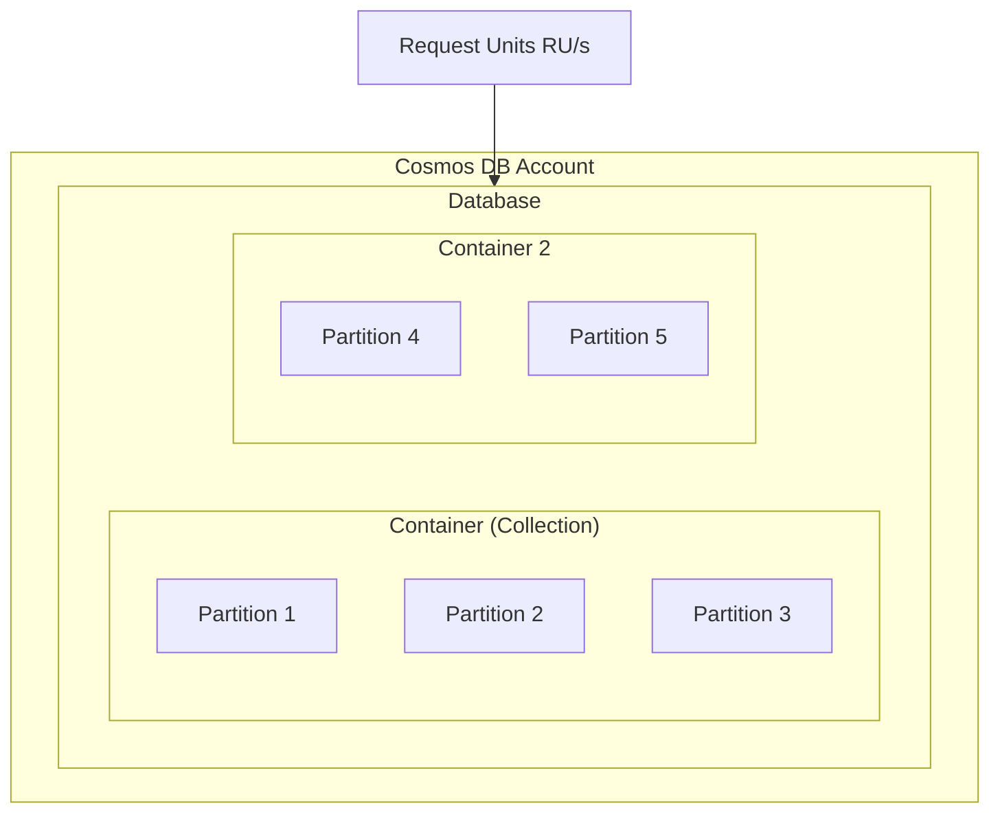
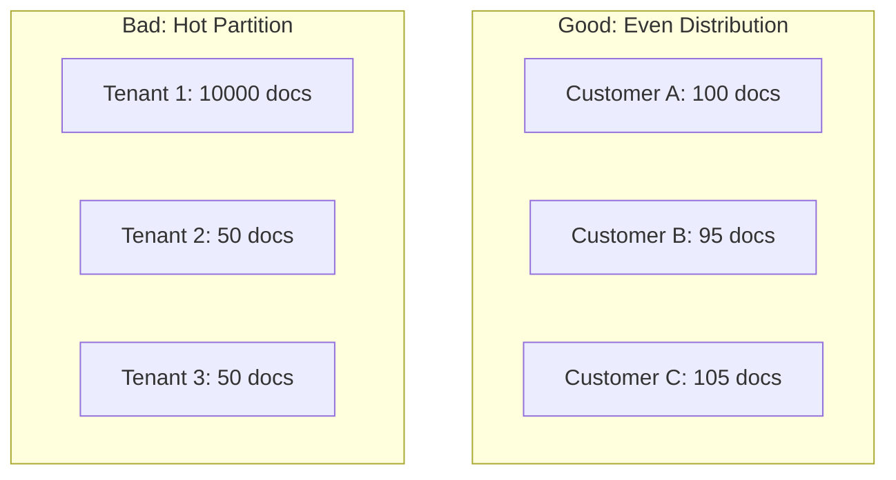
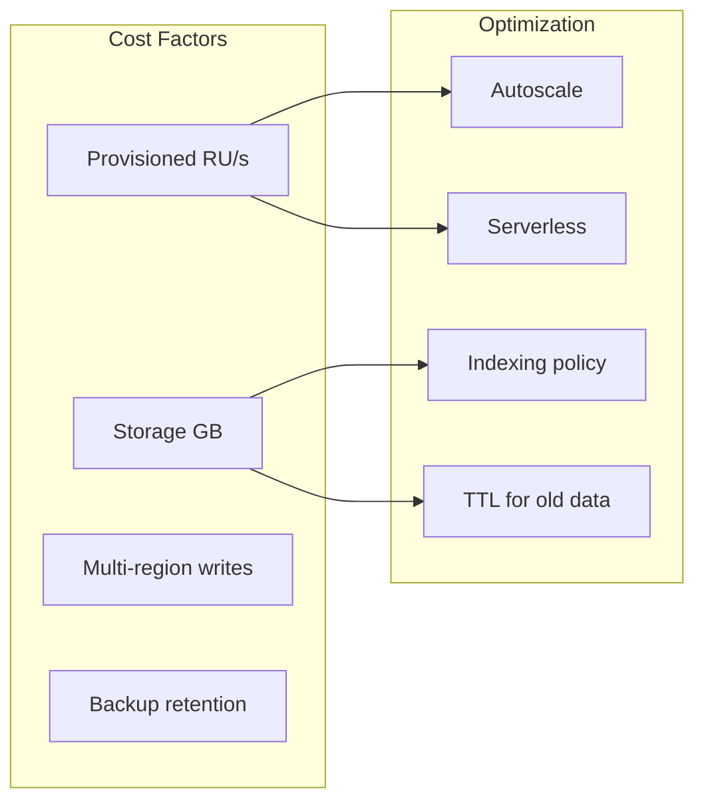

# How to Handle Azure Cosmos DB

Author: [nawazdhandala](https://www.github.com/nawazdhandala)

Tags: Azure, Cosmos DB, NoSQL, Database, Performance, Scaling, Cloud

Description: A practical guide to working with Azure Cosmos DB including data modeling, partitioning, queries, performance optimization, and cost management.

---

Azure Cosmos DB is Microsoft's globally distributed NoSQL database. It offers multiple APIs (SQL, MongoDB, Cassandra, Gremlin, Table), guaranteed low latency, and automatic scaling. But it can also drain your budget quickly if you do not understand how it works. This guide covers practical patterns for using Cosmos DB effectively.

## Understanding Cosmos DB Architecture

Before writing code, understand how Cosmos DB organizes and charges for data.



### Key Concepts

| Concept | Description |
|---------|-------------|
| Container | Like a table - holds your documents |
| Partition Key | Determines data distribution |
| Request Unit (RU) | Currency for operations |
| Throughput | RU/s provisioned or autoscaled |

## Setting Up Cosmos DB

### Create Account and Database

```bash
# Create Cosmos DB account
az cosmosdb create \
    --name mycosmosaccount \
    --resource-group myresourcegroup \
    --default-consistency-level Session \
    --locations regionName=eastus failoverPriority=0 \
    --locations regionName=westus failoverPriority=1

# Create database with shared throughput
az cosmosdb sql database create \
    --account-name mycosmosaccount \
    --resource-group myresourcegroup \
    --name mydatabase \
    --throughput 400

# Create container with partition key
az cosmosdb sql container create \
    --account-name mycosmosaccount \
    --resource-group myresourcegroup \
    --database-name mydatabase \
    --name orders \
    --partition-key-path "/customerId" \
    --throughput 400
```

### Connection Setup

```javascript
// Node.js SDK setup
const { CosmosClient } = require("@azure/cosmos");

const client = new CosmosClient({
    endpoint: process.env.COSMOS_ENDPOINT,
    key: process.env.COSMOS_KEY
});

const database = client.database("mydatabase");
const container = database.container("orders");
```

```csharp
// C# SDK setup
using Microsoft.Azure.Cosmos;

var client = new CosmosClient(
    Environment.GetEnvironmentVariable("COSMOS_ENDPOINT"),
    Environment.GetEnvironmentVariable("COSMOS_KEY"),
    new CosmosClientOptions
    {
        ApplicationName = "MyApp",
        ConnectionMode = ConnectionMode.Direct
    }
);

var database = client.GetDatabase("mydatabase");
var container = database.GetContainer("orders");
```

## Choosing the Right Partition Key

The partition key is the most important decision you make. Get it wrong, and you face hot partitions, poor performance, and expensive queries.



### Partition Key Selection Rules

1. **High cardinality** - Many distinct values
2. **Even distribution** - Similar document counts per partition
3. **Query friendly** - Most queries include partition key

```javascript
// Good partition key examples

// E-commerce orders - partition by customerId
{
    "id": "order-123",
    "customerId": "cust-456",  // Partition key
    "items": [...],
    "total": 99.99
}

// IoT telemetry - partition by deviceId
{
    "id": "reading-789",
    "deviceId": "device-001",  // Partition key
    "temperature": 72.5,
    "timestamp": "2026-01-24T10:00:00Z"
}

// Multi-tenant SaaS - partition by tenantId
{
    "id": "doc-abc",
    "tenantId": "tenant-xyz",  // Partition key
    "data": {...}
}
```

### Synthetic Partition Keys

When no single field works well, create a synthetic key:

```javascript
// Combine multiple fields for better distribution
const order = {
    id: "order-123",
    customerId: "cust-456",
    orderDate: "2026-01-24",
    // Synthetic partition key: customerId + year-month
    partitionKey: `cust-456-2026-01`,
    items: [...]
};
```

## CRUD Operations

### Create Documents

```javascript
// Node.js - Create document
async function createOrder(order) {
    const { resource } = await container.items.create({
        id: `order-${Date.now()}`,
        customerId: order.customerId,
        items: order.items,
        total: order.total,
        createdAt: new Date().toISOString()
    });
    return resource;
}
```

```csharp
// C# - Create document
public async Task<Order> CreateOrderAsync(Order order)
{
    order.Id = $"order-{Guid.NewGuid()}";
    order.CreatedAt = DateTime.UtcNow;

    var response = await container.CreateItemAsync(
        order,
        new PartitionKey(order.CustomerId)
    );

    Console.WriteLine($"RU charge: {response.RequestCharge}");
    return response.Resource;
}
```

### Read Documents

```javascript
// Point read - fastest and cheapest (1 RU for 1KB document)
async function getOrder(orderId, customerId) {
    const { resource, requestCharge } = await container.item(orderId, customerId).read();
    console.log(`RU charge: ${requestCharge}`);
    return resource;
}
```

```csharp
// C# Point read
public async Task<Order> GetOrderAsync(string orderId, string customerId)
{
    var response = await container.ReadItemAsync<Order>(
        orderId,
        new PartitionKey(customerId)
    );

    Console.WriteLine($"RU charge: {response.RequestCharge}");
    return response.Resource;
}
```

### Query Documents

```javascript
// Query within a partition (efficient)
async function getCustomerOrders(customerId) {
    const query = {
        query: "SELECT * FROM c WHERE c.customerId = @customerId ORDER BY c.createdAt DESC",
        parameters: [{ name: "@customerId", value: customerId }]
    };

    const { resources, requestCharge } = await container.items
        .query(query)
        .fetchAll();

    console.log(`RU charge: ${requestCharge}`);
    return resources;
}

// Cross-partition query (expensive - avoid if possible)
async function searchOrders(searchTerm) {
    const query = {
        query: "SELECT * FROM c WHERE CONTAINS(c.productName, @search)",
        parameters: [{ name: "@search", value: searchTerm }]
    };

    const { resources } = await container.items
        .query(query, { enableCrossPartitionQuery: true })
        .fetchAll();

    return resources;
}
```

### Update Documents

```javascript
// Replace entire document
async function updateOrder(order) {
    const { resource } = await container
        .item(order.id, order.customerId)
        .replace(order);
    return resource;
}

// Partial update with patch (more efficient)
async function updateOrderStatus(orderId, customerId, newStatus) {
    const operations = [
        { op: "replace", path: "/status", value: newStatus },
        { op: "add", path: "/updatedAt", value: new Date().toISOString() }
    ];

    const { resource } = await container
        .item(orderId, customerId)
        .patch(operations);

    return resource;
}
```

### Delete Documents

```javascript
// Delete single document
async function deleteOrder(orderId, customerId) {
    await container.item(orderId, customerId).delete();
}

// Bulk delete with TTL (for expiring data)
// Set TTL on container or document
const order = {
    id: "temp-order",
    customerId: "cust-123",
    ttl: 86400  // Expires in 24 hours (seconds)
};
```

## Performance Optimization

### Indexing Strategy

By default, Cosmos DB indexes everything. Customize for better write performance and lower RU costs.

```javascript
// Custom indexing policy
const indexingPolicy = {
    indexingMode: "consistent",
    automatic: true,
    includedPaths: [
        { path: "/customerId/?" },
        { path: "/createdAt/?" },
        { path: "/status/?" }
    ],
    excludedPaths: [
        { path: "/largePayload/*" },  // Don't index large nested objects
        { path: "/_etag/?" }
    ],
    compositeIndexes: [
        [
            { path: "/customerId", order: "ascending" },
            { path: "/createdAt", order: "descending" }
        ]
    ]
};
```

### Optimize Queries

```javascript
// Bad: Returns entire document when you only need a few fields
const bad = await container.items.query("SELECT * FROM c").fetchAll();

// Good: Project only needed fields
const good = await container.items
    .query("SELECT c.id, c.status, c.total FROM c")
    .fetchAll();

// Bad: Cross-partition aggregation
const badAgg = await container.items
    .query("SELECT COUNT(1) FROM c", { enableCrossPartitionQuery: true })
    .fetchAll();

// Good: Aggregate within partition
const goodAgg = await container.items
    .query({
        query: "SELECT COUNT(1) FROM c WHERE c.customerId = @id",
        parameters: [{ name: "@id", value: "cust-123" }]
    })
    .fetchAll();
```

### Bulk Operations

```javascript
// Bulk insert for high throughput
async function bulkInsertOrders(orders) {
    const operations = orders.map(order => ({
        operationType: "Create",
        resourceBody: order
    }));

    const response = await container.items.bulk(operations);

    const totalRU = response.reduce((sum, r) => sum + r.requestCharge, 0);
    console.log(`Total RU for ${orders.length} documents: ${totalRU}`);

    return response;
}
```

## Cost Management

Cosmos DB charges for throughput (RU/s) and storage. Here is how to control costs.



### Use Autoscale

```bash
# Convert to autoscale - scales between 10% and 100% of max
az cosmosdb sql container throughput migrate \
    --account-name mycosmosaccount \
    --resource-group myresourcegroup \
    --database-name mydatabase \
    --name orders \
    --throughput-type autoscale

# Set max autoscale throughput
az cosmosdb sql container throughput update \
    --account-name mycosmosaccount \
    --resource-group myresourcegroup \
    --database-name mydatabase \
    --name orders \
    --max-throughput 4000
```

### Use Serverless for Dev/Test

```bash
# Create serverless account (pay per request)
az cosmosdb create \
    --name myserverlessaccount \
    --resource-group myresourcegroup \
    --capabilities EnableServerless \
    --default-consistency-level Session
```

### Monitor RU Consumption

```javascript
// Track RU usage in your application
const stats = { totalRU: 0, operations: 0 };

async function trackedQuery(query) {
    const { resources, requestCharge } = await container.items
        .query(query)
        .fetchAll();

    stats.totalRU += requestCharge;
    stats.operations++;

    console.log(`Query RU: ${requestCharge}, Avg: ${stats.totalRU / stats.operations}`);
    return resources;
}
```

```kusto
// Azure Monitor query for RU consumption
AzureDiagnostics
| where ResourceProvider == "MICROSOFT.DOCUMENTDB"
| where Category == "DataPlaneRequests"
| summarize TotalRU = sum(todouble(requestCharge_s)) by bin(TimeGenerated, 1h), OperationName
| render timechart
```

## Change Feed for Real-Time Processing

The change feed lets you react to document changes in real-time.

```javascript
// Process changes as they happen
const changeFeedIterator = container.items.changeFeed({
    startFromBeginning: false
});

async function processChanges() {
    while (changeFeedIterator.hasMoreResults) {
        const { resources } = await changeFeedIterator.fetchNext();

        for (const change of resources) {
            console.log(`Document changed: ${change.id}`);
            await handleChange(change);
        }

        // Save continuation token for restart
        await saveContinuationToken(changeFeedIterator.continuationToken);

        // Wait before next poll
        await new Promise(r => setTimeout(r, 1000));
    }
}
```

```csharp
// C# Change Feed Processor
var processor = container
    .GetChangeFeedProcessorBuilder<Order>("myProcessor", HandleChangesAsync)
    .WithInstanceName("instance1")
    .WithLeaseContainer(leaseContainer)
    .Build();

await processor.StartAsync();

async Task HandleChangesAsync(
    IReadOnlyCollection<Order> changes,
    CancellationToken cancellationToken)
{
    foreach (var order in changes)
    {
        Console.WriteLine($"Order changed: {order.Id}");
        await ProcessOrderChangeAsync(order);
    }
}
```

## Common Patterns

### Pattern 1: Denormalization

Unlike SQL, duplicate data to avoid joins.

```javascript
// Instead of separate order and customer tables
// Embed customer info in order document
const order = {
    id: "order-123",
    customerId: "cust-456",
    customer: {
        name: "John Doe",
        email: "john@example.com"
    },
    items: [...]
};
```

### Pattern 2: Reference Pattern

For large or frequently changing data, store references.

```javascript
// Order references product IDs
const order = {
    id: "order-123",
    customerId: "cust-456",
    items: [
        { productId: "prod-1", quantity: 2 },
        { productId: "prod-2", quantity: 1 }
    ]
};

// Fetch product details separately when needed
async function getOrderWithProducts(order) {
    const productIds = order.items.map(i => i.productId);
    const products = await fetchProducts(productIds);
    return { ...order, products };
}
```

## Cosmos DB Checklist

- [ ] Choose partition key with high cardinality
- [ ] Use point reads when possible (cheapest)
- [ ] Always include partition key in queries
- [ ] Customize indexing policy for your workload
- [ ] Use autoscale or serverless for variable workloads
- [ ] Monitor RU consumption regularly
- [ ] Set TTL for data that expires
- [ ] Use bulk operations for batch inserts
- [ ] Enable change feed for event-driven processing

---

Cosmos DB is powerful but requires careful design. The partition key decision affects everything: performance, cost, and scalability. Start with a clear understanding of your query patterns, choose the right partition key, and monitor your RU consumption. With proper setup, Cosmos DB can handle millions of operations per second at single-digit millisecond latency.
