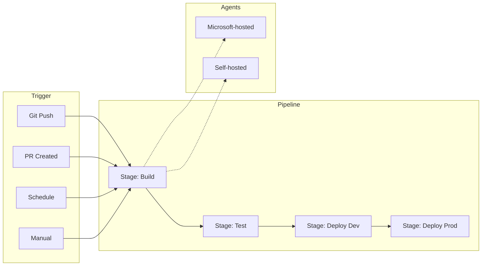
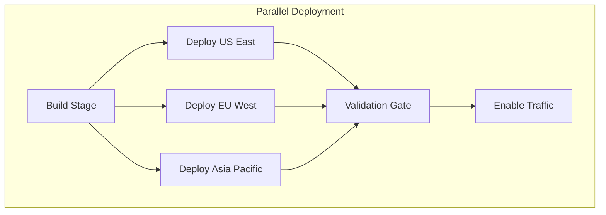

# How to Handle Azure DevOps Pipelines

Author: [nawazdhandala](https://www.github.com/nawazdhandala)

Tags: Azure DevOps, CI/CD, Pipelines, DevOps, Automation, YAML, Build, Deploy

Description: Learn how to create, configure, and troubleshoot Azure DevOps Pipelines for continuous integration and deployment with practical examples and best practices.

---

## Introduction

Azure DevOps Pipelines provides cloud-hosted build and release automation for any language, platform, and cloud. Whether you are building a simple web application or a complex microservices architecture, understanding how to configure and troubleshoot pipelines is essential. This guide covers pipeline configuration, common patterns, troubleshooting, and best practices.

## Pipeline Architecture Overview



## Creating Your First Pipeline

### Basic YAML Pipeline Structure

```yaml
# azure-pipelines.yml
trigger:
  branches:
    include:
      - main
      - develop
  paths:
    exclude:
      - README.md
      - docs/*

# Run PR validation
pr:
  branches:
    include:
      - main

pool:
  vmImage: 'ubuntu-latest'

variables:
  buildConfiguration: 'Release'
  dotnetVersion: '8.0.x'

stages:
  - stage: Build
    displayName: 'Build Application'
    jobs:
      - job: BuildJob
        displayName: 'Build and Test'
        steps:
          - task: UseDotNet@2
            displayName: 'Install .NET SDK'
            inputs:
              version: $(dotnetVersion)
              includePreviewVersions: false

          - task: DotNetCoreCLI@2
            displayName: 'Restore packages'
            inputs:
              command: 'restore'
              projects: '**/*.csproj'
              feedsToUse: 'select'

          - task: DotNetCoreCLI@2
            displayName: 'Build solution'
            inputs:
              command: 'build'
              projects: '**/*.csproj'
              arguments: '--configuration $(buildConfiguration) --no-restore'

          - task: DotNetCoreCLI@2
            displayName: 'Run tests'
            inputs:
              command: 'test'
              projects: '**/*Tests.csproj'
              arguments: '--configuration $(buildConfiguration) --collect:"XPlat Code Coverage"'

          - task: PublishCodeCoverageResults@1
            displayName: 'Publish code coverage'
            inputs:
              codeCoverageTool: 'Cobertura'
              summaryFileLocation: '$(Agent.TempDirectory)/**/coverage.cobertura.xml'

          - task: DotNetCoreCLI@2
            displayName: 'Publish artifact'
            inputs:
              command: 'publish'
              publishWebProjects: true
              arguments: '--configuration $(buildConfiguration) --output $(Build.ArtifactStagingDirectory)'
              zipAfterPublish: true

          - task: PublishBuildArtifacts@1
            displayName: 'Upload artifact'
            inputs:
              pathtoPublish: '$(Build.ArtifactStagingDirectory)'
              artifactName: 'webapp'
```

## Multi-Stage Pipeline with Environments

### Complete CI/CD Pipeline

```yaml
# azure-pipelines.yml
trigger:
  - main

variables:
  - group: 'production-secrets'
  - name: azureSubscription
    value: 'MyAzureServiceConnection'
  - name: webAppName
    value: 'mywebapp'

stages:
  # Build Stage
  - stage: Build
    displayName: 'Build'
    jobs:
      - job: Build
        pool:
          vmImage: 'ubuntu-latest'
        steps:
          - task: NodeTool@0
            inputs:
              versionSpec: '20.x'
            displayName: 'Install Node.js'

          - script: |
              npm ci
              npm run build
              npm test
            displayName: 'Install, build, and test'

          - task: ArchiveFiles@2
            inputs:
              rootFolderOrFile: '$(System.DefaultWorkingDirectory)/dist'
              includeRootFolder: false
              archiveType: 'zip'
              archiveFile: '$(Build.ArtifactStagingDirectory)/$(Build.BuildId).zip'

          - publish: $(Build.ArtifactStagingDirectory)
            artifact: drop

  # Deploy to Development
  - stage: DeployDev
    displayName: 'Deploy to Development'
    dependsOn: Build
    condition: succeeded()
    jobs:
      - deployment: DeployDev
        displayName: 'Deploy to Dev Environment'
        pool:
          vmImage: 'ubuntu-latest'
        environment: 'development'
        strategy:
          runOnce:
            deploy:
              steps:
                - download: current
                  artifact: drop

                - task: AzureWebApp@1
                  inputs:
                    azureSubscription: $(azureSubscription)
                    appType: 'webAppLinux'
                    appName: '$(webAppName)-dev'
                    package: '$(Pipeline.Workspace)/drop/$(Build.BuildId).zip'

  # Deploy to Staging with Approval
  - stage: DeployStaging
    displayName: 'Deploy to Staging'
    dependsOn: DeployDev
    condition: succeeded()
    jobs:
      - deployment: DeployStaging
        displayName: 'Deploy to Staging Environment'
        pool:
          vmImage: 'ubuntu-latest'
        environment: 'staging'
        strategy:
          runOnce:
            deploy:
              steps:
                - download: current
                  artifact: drop

                - task: AzureWebApp@1
                  inputs:
                    azureSubscription: $(azureSubscription)
                    appType: 'webAppLinux'
                    appName: '$(webAppName)-staging'
                    package: '$(Pipeline.Workspace)/drop/$(Build.BuildId).zip'

                # Run smoke tests
                - script: |
                    curl -f https://$(webAppName)-staging.azurewebsites.net/health || exit 1
                  displayName: 'Smoke test'

  # Deploy to Production with Approval Gate
  - stage: DeployProd
    displayName: 'Deploy to Production'
    dependsOn: DeployStaging
    condition: and(succeeded(), eq(variables['Build.SourceBranch'], 'refs/heads/main'))
    jobs:
      - deployment: DeployProd
        displayName: 'Deploy to Production Environment'
        pool:
          vmImage: 'ubuntu-latest'
        environment: 'production'
        strategy:
          runOnce:
            preDeploy:
              steps:
                - script: echo "Pre-deployment checks"
            deploy:
              steps:
                - download: current
                  artifact: drop

                - task: AzureWebApp@1
                  inputs:
                    azureSubscription: $(azureSubscription)
                    appType: 'webAppLinux'
                    appName: '$(webAppName)'
                    package: '$(Pipeline.Workspace)/drop/$(Build.BuildId).zip'
                    deploymentMethod: 'zipDeploy'
            routeTraffic:
              steps:
                - script: echo "Traffic routing - canary deployment"
            postRouteTraffic:
              steps:
                - script: |
                    curl -f https://$(webAppName).azurewebsites.net/health || exit 1
                  displayName: 'Production smoke test'
            on:
              failure:
                steps:
                  - script: echo "Deployment failed - triggering rollback"
              success:
                steps:
                  - script: echo "Deployment successful"
```

## Pipeline Templates for Reusability

### Creating a Template

```yaml
# templates/dotnet-build.yml
parameters:
  - name: buildConfiguration
    type: string
    default: 'Release'
  - name: dotnetVersion
    type: string
    default: '8.0.x'
  - name: projectPath
    type: string
    default: '**/*.csproj'
  - name: runTests
    type: boolean
    default: true

steps:
  - task: UseDotNet@2
    displayName: 'Install .NET SDK'
    inputs:
      version: ${{ parameters.dotnetVersion }}

  - task: DotNetCoreCLI@2
    displayName: 'Restore packages'
    inputs:
      command: 'restore'
      projects: ${{ parameters.projectPath }}

  - task: DotNetCoreCLI@2
    displayName: 'Build'
    inputs:
      command: 'build'
      projects: ${{ parameters.projectPath }}
      arguments: '--configuration ${{ parameters.buildConfiguration }} --no-restore'

  - ${{ if eq(parameters.runTests, true) }}:
    - task: DotNetCoreCLI@2
      displayName: 'Run tests'
      inputs:
        command: 'test'
        projects: '**/*Tests.csproj'
        arguments: '--configuration ${{ parameters.buildConfiguration }}'
```

### Using Templates

```yaml
# azure-pipelines.yml
trigger:
  - main

pool:
  vmImage: 'ubuntu-latest'

stages:
  - stage: Build
    jobs:
      - job: BuildAPI
        displayName: 'Build API'
        steps:
          - template: templates/dotnet-build.yml
            parameters:
              buildConfiguration: 'Release'
              projectPath: 'src/API/**/*.csproj'
              runTests: true

      - job: BuildWorker
        displayName: 'Build Worker'
        steps:
          - template: templates/dotnet-build.yml
            parameters:
              buildConfiguration: 'Release'
              projectPath: 'src/Worker/**/*.csproj'
              runTests: false
```

## Handling Secrets and Variables

### Using Variable Groups

```yaml
# Reference variable group from Azure DevOps Library
variables:
  - group: 'my-variable-group'
  - name: localVariable
    value: 'local-value'

steps:
  - script: |
      echo "Using secret: $(mySecret)"
      echo "Using local: $(localVariable)"
    displayName: 'Use variables'
    env:
      # Map secret variables to environment variables
      MY_SECRET: $(mySecret)
```

### Azure Key Vault Integration

```yaml
variables:
  - group: 'keyvault-secrets'

steps:
  - task: AzureKeyVault@2
    inputs:
      azureSubscription: 'MyAzureConnection'
      KeyVaultName: 'my-keyvault'
      SecretsFilter: '*'
      RunAsPreJob: true

  - script: |
      # Secrets are now available as pipeline variables
      echo "Database connection available"
    displayName: 'Use Key Vault secrets'
    env:
      DB_CONNECTION: $(database-connection-string)
```

## Troubleshooting Common Issues

### Pipeline Debugging Techniques

```yaml
# Enable system diagnostics
steps:
  - script: |
      echo "##[debug]Debug message"
      echo "##[warning]Warning message"
      echo "##[error]Error message"
    displayName: 'Logging examples'

  # Print all environment variables for debugging
  - script: |
      echo "=== Environment Variables ==="
      env | sort
      echo "=== Pipeline Variables ==="
      echo "Build.SourceBranch: $(Build.SourceBranch)"
      echo "Build.BuildId: $(Build.BuildId)"
      echo "Agent.OS: $(Agent.OS)"
    displayName: 'Debug: Print environment'
    condition: always()

  # Capture logs on failure
  - task: PublishPipelineArtifact@1
    inputs:
      targetPath: '$(System.DefaultWorkingDirectory)/logs'
      artifact: 'failure-logs'
    condition: failed()
    displayName: 'Upload logs on failure'
```

### Common Error: Agent Pool Not Found

```yaml
# Specify correct pool configuration
pool:
  # Option 1: Microsoft-hosted agent
  vmImage: 'ubuntu-latest'

  # Option 2: Named pool with demands
  # name: 'MyAgentPool'
  # demands:
  #   - npm
  #   - docker
```

### Common Error: Permission Denied

```yaml
# Fix file permission issues
steps:
  - script: |
      chmod +x ./scripts/deploy.sh
      ./scripts/deploy.sh
    displayName: 'Run deployment script'
```

## Parallel Jobs and Matrix Builds

### Matrix Strategy for Cross-Platform Testing

```yaml
strategy:
  matrix:
    linux:
      imageName: 'ubuntu-latest'
      platform: 'linux'
    mac:
      imageName: 'macOS-latest'
      platform: 'mac'
    windows:
      imageName: 'windows-latest'
      platform: 'windows'
  maxParallel: 3

pool:
  vmImage: $(imageName)

steps:
  - script: |
      echo "Running on $(platform)"
      npm ci
      npm test
    displayName: 'Build and test on $(platform)'
```

### Parallel Deployment Pattern



```yaml
stages:
  - stage: Build
    jobs:
      - job: Build
        steps:
          - script: echo "Building..."

  - stage: DeployRegions
    dependsOn: Build
    jobs:
      - deployment: DeployUSEast
        environment: 'production-useast'
        strategy:
          runOnce:
            deploy:
              steps:
                - script: echo "Deploying to US East"

      - deployment: DeployEUWest
        environment: 'production-euwest'
        strategy:
          runOnce:
            deploy:
              steps:
                - script: echo "Deploying to EU West"

      - deployment: DeployAPAC
        environment: 'production-apac'
        strategy:
          runOnce:
            deploy:
              steps:
                - script: echo "Deploying to APAC"

  - stage: EnableTraffic
    dependsOn: DeployRegions
    jobs:
      - job: EnableGlobalTraffic
        steps:
          - script: echo "Enabling traffic to all regions"
```

## Caching for Faster Builds

```yaml
variables:
  npm_config_cache: $(Pipeline.Workspace)/.npm
  NUGET_PACKAGES: $(Pipeline.Workspace)/.nuget/packages

steps:
  # Cache npm packages
  - task: Cache@2
    inputs:
      key: 'npm | "$(Agent.OS)" | package-lock.json'
      restoreKeys: |
        npm | "$(Agent.OS)"
      path: $(npm_config_cache)
    displayName: 'Cache npm packages'

  # Cache NuGet packages
  - task: Cache@2
    inputs:
      key: 'nuget | "$(Agent.OS)" | **/packages.lock.json'
      restoreKeys: |
        nuget | "$(Agent.OS)"
      path: $(NUGET_PACKAGES)
    displayName: 'Cache NuGet packages'

  - script: npm ci
    displayName: 'Install npm packages'
```

## Pipeline Triggers and Schedules

### Scheduled Builds

```yaml
# Run nightly builds
schedules:
  - cron: '0 2 * * *'
    displayName: 'Nightly build'
    branches:
      include:
        - main
    always: true  # Run even if no changes

  - cron: '0 14 * * 0'
    displayName: 'Weekly security scan'
    branches:
      include:
        - main
    always: true
```

### Branch Filters and Path Triggers

```yaml
trigger:
  branches:
    include:
      - main
      - release/*
    exclude:
      - feature/experimental/*
  paths:
    include:
      - src/*
      - tests/*
    exclude:
      - src/docs/*
      - '**/*.md'
  tags:
    include:
      - v*

# PR triggers
pr:
  branches:
    include:
      - main
  paths:
    exclude:
      - docs/*
  drafts: false  # Don't trigger on draft PRs
```

## Best Practices Summary

1. **Use YAML pipelines**: Store pipeline definitions in source control
2. **Implement templates**: Reuse common build patterns across projects
3. **Secure secrets**: Use variable groups and Key Vault for sensitive data
4. **Enable caching**: Reduce build times by caching dependencies
5. **Use environments**: Define deployment targets with approval gates
6. **Implement staged deployments**: Deploy to dev, staging, then production
7. **Add health checks**: Validate deployments with smoke tests
8. **Monitor pipeline metrics**: Track build times and failure rates
9. **Use matrix builds**: Test across multiple platforms efficiently
10. **Document your pipelines**: Add comments and clear display names

## Conclusion

Azure DevOps Pipelines provides a powerful platform for automating your build and deployment workflows. By leveraging YAML-based pipelines, templates, and environments, you can create maintainable and scalable CI/CD processes. Remember to implement proper security practices for secrets management, use caching to optimize build times, and always include validation steps before production deployments. Regular monitoring and optimization of your pipelines will ensure they remain efficient as your project grows.
