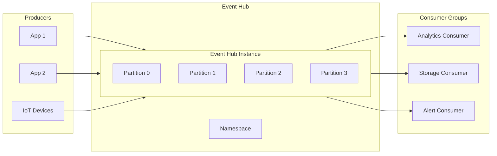
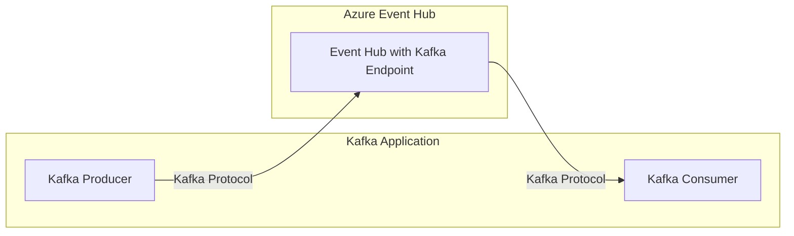

# How to Handle Azure Event Hub

Author: [nawazdhandala](https://www.github.com/nawazdhandala)

Tags: Azure, Event Hub, Streaming, Kafka, Event-Driven, Cloud, Messaging

Description: Learn how to set up, configure, and handle Azure Event Hub for high-throughput event streaming with practical examples in multiple languages.

---

Azure Event Hub is a fully managed, real-time data ingestion service capable of receiving millions of events per second. Whether you are building IoT solutions, log aggregation pipelines, or real-time analytics systems, Event Hub provides the scalability and reliability you need. This guide covers everything from initial setup to production best practices.

## Understanding Event Hub Architecture

Before diving into implementation, it is essential to understand how Event Hub organizes and processes events.



Key concepts:
- **Namespace**: A container for one or more Event Hubs
- **Event Hub**: The actual message broker (similar to a Kafka topic)
- **Partition**: An ordered sequence of events for parallel processing
- **Consumer Group**: A view of the entire Event Hub for independent consumers

## Creating an Event Hub Namespace

Start by creating the Event Hub infrastructure using Azure CLI.

```bash
# Create a resource group for Event Hub resources
az group create \
  --name myEventHubRG \
  --location eastus

# Create an Event Hub namespace
# The SKU determines throughput units and features
# Standard tier supports up to 40 throughput units
az eventhubs namespace create \
  --name myEventHubNamespace \
  --resource-group myEventHubRG \
  --location eastus \
  --sku Standard \
  --enable-auto-inflate true \
  --maximum-throughput-units 20

# Create an Event Hub within the namespace
# Partitions determine parallelism - cannot be changed after creation
# Message retention can be 1-7 days on Standard, up to 90 on Premium
az eventhubs eventhub create \
  --name myEventHub \
  --resource-group myEventHubRG \
  --namespace-name myEventHubNamespace \
  --partition-count 4 \
  --message-retention 7
```

## Authentication and Authorization

Event Hub supports multiple authentication methods. The recommended approach uses Azure AD with managed identities.

```bash
# Create a shared access policy for producers
# Send permission allows publishing events
az eventhubs eventhub authorization-rule create \
  --name ProducerPolicy \
  --resource-group myEventHubRG \
  --namespace-name myEventHubNamespace \
  --eventhub-name myEventHub \
  --rights Send

# Create a shared access policy for consumers
# Listen permission allows reading events
az eventhubs eventhub authorization-rule create \
  --name ConsumerPolicy \
  --resource-group myEventHubRG \
  --namespace-name myEventHubNamespace \
  --eventhub-name myEventHub \
  --rights Listen

# Get the connection string for a specific policy
az eventhubs eventhub authorization-rule keys list \
  --name ProducerPolicy \
  --resource-group myEventHubRG \
  --namespace-name myEventHubNamespace \
  --eventhub-name myEventHub \
  --query primaryConnectionString \
  --output tsv
```

## Sending Events with Python

The Azure Event Hub SDK provides a straightforward way to publish events.

```python
# producer.py - Event Hub producer example
import asyncio
import json
from datetime import datetime
from azure.eventhub.aio import EventHubProducerClient
from azure.eventhub import EventData

# Connection string from Azure portal or CLI
CONNECTION_STRING = "Endpoint=sb://myeventhubnamespace.servicebus.windows.net/;SharedAccessKeyName=ProducerPolicy;SharedAccessKey=..."
EVENT_HUB_NAME = "myEventHub"

async def send_events():
    """Send a batch of events to Event Hub."""
    # Create producer client with connection string
    producer = EventHubProducerClient.from_connection_string(
        conn_str=CONNECTION_STRING,
        eventhub_name=EVENT_HUB_NAME
    )

    async with producer:
        # Create a batch - Event Hub optimizes network usage with batching
        event_data_batch = await producer.create_batch()

        # Add events to the batch
        for i in range(100):
            event = {
                "id": i,
                "timestamp": datetime.utcnow().isoformat(),
                "sensor_id": f"sensor-{i % 10}",
                "temperature": 20.5 + (i * 0.1),
                "humidity": 45 + (i % 20)
            }

            try:
                # Attempt to add event to current batch
                event_data_batch.add(EventData(json.dumps(event)))
            except ValueError:
                # Batch is full, send it and create a new one
                await producer.send_batch(event_data_batch)
                event_data_batch = await producer.create_batch()
                event_data_batch.add(EventData(json.dumps(event)))

        # Send any remaining events in the batch
        if len(event_data_batch) > 0:
            await producer.send_batch(event_data_batch)
            print(f"Sent batch of {len(event_data_batch)} events")

if __name__ == "__main__":
    asyncio.run(send_events())
```

### Sending to Specific Partitions

When you need to guarantee ordering, send events with the same partition key.

```python
# producer_partitioned.py - Sending events with partition keys
async def send_partitioned_events():
    """Send events with partition keys for ordered processing."""
    producer = EventHubProducerClient.from_connection_string(
        conn_str=CONNECTION_STRING,
        eventhub_name=EVENT_HUB_NAME
    )

    async with producer:
        # Create batch with partition key
        # All events with the same partition key go to the same partition
        # This guarantees ordering for events from the same device
        event_data_batch = await producer.create_batch(
            partition_key="device-001"
        )

        for i in range(10):
            event = {
                "device_id": "device-001",
                "sequence": i,
                "reading": 42.5 + i
            }
            event_data_batch.add(EventData(json.dumps(event)))

        await producer.send_batch(event_data_batch)
        print("Sent partitioned events for device-001")

asyncio.run(send_partitioned_events())
```

## Consuming Events with Python

Event Hub consumers can read events from specific partitions or use the EventProcessorClient for automatic load balancing.

```python
# consumer.py - Event Hub consumer with checkpointing
import asyncio
import json
from azure.eventhub.aio import EventHubConsumerClient
from azure.eventhub.extensions.checkpointstoresblobaio import BlobCheckpointStore

# Connection strings for Event Hub and Blob Storage
EVENTHUB_CONNECTION_STRING = "Endpoint=sb://myeventhubnamespace.servicebus.windows.net/;SharedAccessKeyName=ConsumerPolicy;SharedAccessKey=..."
EVENT_HUB_NAME = "myEventHub"
STORAGE_CONNECTION_STRING = "DefaultEndpointsProtocol=https;AccountName=..."
BLOB_CONTAINER_NAME = "eventhub-checkpoints"

async def on_event(partition_context, event):
    """Process a single event from Event Hub."""
    # Parse the event body
    body = event.body_as_str()
    data = json.loads(body)

    print(f"Partition: {partition_context.partition_id}")
    print(f"Offset: {event.offset}")
    print(f"Sequence: {event.sequence_number}")
    print(f"Data: {data}")

    # Update checkpoint after processing
    # This ensures we don't reprocess events after restart
    await partition_context.update_checkpoint(event)

async def on_error(partition_context, error):
    """Handle errors during event processing."""
    if partition_context:
        print(f"Error in partition {partition_context.partition_id}: {error}")
    else:
        print(f"Error: {error}")

async def consume_events():
    """Consume events with automatic checkpointing."""
    # Checkpoint store persists consumer position in Blob Storage
    checkpoint_store = BlobCheckpointStore.from_connection_string(
        STORAGE_CONNECTION_STRING,
        BLOB_CONTAINER_NAME
    )

    # Consumer client with checkpoint store for reliable processing
    consumer = EventHubConsumerClient.from_connection_string(
        conn_str=EVENTHUB_CONNECTION_STRING,
        consumer_group="$Default",  # Use default or create custom group
        eventhub_name=EVENT_HUB_NAME,
        checkpoint_store=checkpoint_store
    )

    async with consumer:
        # Receive events indefinitely
        # The client automatically balances partitions across consumers
        await consumer.receive(
            on_event=on_event,
            on_error=on_error,
            starting_position="-1"  # Start from beginning
        )

if __name__ == "__main__":
    asyncio.run(consume_events())
```

## Event Hub with Node.js

For Node.js applications, the Azure SDK provides similar functionality.

```javascript
// producer.js - Event Hub producer in Node.js
const { EventHubProducerClient } = require("@azure/event-hubs");

const connectionString = "Endpoint=sb://myeventhubnamespace.servicebus.windows.net/;SharedAccessKeyName=ProducerPolicy;SharedAccessKey=...";
const eventHubName = "myEventHub";

async function sendEvents() {
    // Create producer client
    const producer = new EventHubProducerClient(connectionString, eventHubName);

    try {
        // Create a batch of events
        const batch = await producer.createBatch();

        // Add events to the batch
        for (let i = 0; i < 100; i++) {
            const event = {
                id: i,
                timestamp: new Date().toISOString(),
                metric: "cpu_usage",
                value: Math.random() * 100
            };

            // Try to add event, send batch if full
            if (!batch.tryAdd({ body: JSON.stringify(event) })) {
                await producer.sendBatch(batch);
                batch = await producer.createBatch();
                batch.tryAdd({ body: JSON.stringify(event) });
            }
        }

        // Send remaining events
        await producer.sendBatch(batch);
        console.log(`Sent ${batch.count} events`);

    } finally {
        // Always close the producer
        await producer.close();
    }
}

sendEvents().catch(console.error);
```

```javascript
// consumer.js - Event Hub consumer in Node.js
const { EventHubConsumerClient } = require("@azure/event-hubs");
const { ContainerClient } = require("@azure/storage-blob");
const { BlobCheckpointStore } = require("@azure/eventhubs-checkpointstore-blob");

const connectionString = "Endpoint=sb://myeventhubnamespace.servicebus.windows.net/;SharedAccessKeyName=ConsumerPolicy;SharedAccessKey=...";
const eventHubName = "myEventHub";
const storageConnectionString = "DefaultEndpointsProtocol=https;AccountName=...";
const containerName = "eventhub-checkpoints";

async function consumeEvents() {
    // Create checkpoint store using Blob Storage
    const containerClient = new ContainerClient(
        storageConnectionString,
        containerName
    );
    const checkpointStore = new BlobCheckpointStore(containerClient);

    // Create consumer with checkpoint store
    const consumer = new EventHubConsumerClient(
        "$Default",  // Consumer group
        connectionString,
        eventHubName,
        checkpointStore
    );

    // Subscribe to events from all partitions
    const subscription = consumer.subscribe({
        processEvents: async (events, context) => {
            for (const event of events) {
                console.log(`Partition: ${context.partitionId}`);
                console.log(`Event: ${event.body}`);
            }
            // Checkpoint after processing batch
            await context.updateCheckpoint(events[events.length - 1]);
        },
        processError: async (error, context) => {
            console.error(`Error: ${error.message}`);
        }
    });

    // Keep consuming until interrupted
    await new Promise((resolve) => {
        process.on("SIGINT", async () => {
            await subscription.close();
            await consumer.close();
            resolve();
        });
    });
}

consumeEvents().catch(console.error);
```

## Using Kafka Protocol with Event Hub

Event Hub supports the Kafka protocol, allowing existing Kafka applications to work with minimal changes.



**Configure Kafka client for Event Hub:**

```python
# kafka_producer.py - Using Kafka protocol with Event Hub
from kafka import KafkaProducer
import json

# Kafka configuration for Event Hub
# The bootstrap server uses the Event Hub namespace FQDN
config = {
    "bootstrap_servers": "myeventhubnamespace.servicebus.windows.net:9093",
    "security_protocol": "SASL_SSL",
    "sasl_mechanism": "PLAIN",
    "sasl_plain_username": "$ConnectionString",
    "sasl_plain_password": "Endpoint=sb://myeventhubnamespace.servicebus.windows.net/;SharedAccessKeyName=RootManageSharedAccessKey;SharedAccessKey=..."
}

# Create Kafka producer
producer = KafkaProducer(
    **config,
    value_serializer=lambda v: json.dumps(v).encode("utf-8")
)

# Send events using Kafka API
# The topic name maps to Event Hub name
for i in range(100):
    event = {"id": i, "value": f"message-{i}"}
    producer.send("myEventHub", value=event)

producer.flush()
producer.close()
print("Sent events via Kafka protocol")
```

## Monitoring and Diagnostics

Proper monitoring helps identify bottlenecks and issues before they impact production.

```bash
# View Event Hub metrics
az monitor metrics list \
  --resource /subscriptions/{sub-id}/resourceGroups/myEventHubRG/providers/Microsoft.EventHub/namespaces/myEventHubNamespace/eventhubs/myEventHub \
  --metric IncomingMessages,OutgoingMessages,ThrottledRequests \
  --interval PT1H

# Enable diagnostic logging
az monitor diagnostic-settings create \
  --name myDiagnostics \
  --resource /subscriptions/{sub-id}/resourceGroups/myEventHubRG/providers/Microsoft.EventHub/namespaces/myEventHubNamespace \
  --logs '[{"category": "OperationalLogs", "enabled": true}]' \
  --metrics '[{"category": "AllMetrics", "enabled": true}]' \
  --workspace myLogAnalyticsWorkspace
```

## Best Practices

1. **Choose the right partition count** - More partitions enable higher parallelism but cannot be changed later. Start with 4-8 for most workloads.

2. **Use partition keys wisely** - Events with the same partition key are ordered, but avoid hot partitions by distributing keys evenly.

3. **Implement checkpointing** - Always checkpoint after processing to avoid reprocessing events after failures.

4. **Handle throttling gracefully** - Implement exponential backoff when encountering throttling errors.

```python
# Retry logic with exponential backoff
import time
from azure.core.exceptions import ServiceBusyError

async def send_with_retry(producer, batch, max_retries=5):
    """Send batch with exponential backoff on throttling."""
    for attempt in range(max_retries):
        try:
            await producer.send_batch(batch)
            return
        except ServiceBusyError:
            wait_time = 2 ** attempt  # 1, 2, 4, 8, 16 seconds
            print(f"Throttled, waiting {wait_time}s before retry")
            time.sleep(wait_time)
    raise Exception("Max retries exceeded")
```

5. **Use consumer groups** - Create separate consumer groups for different processing pipelines to enable independent consumption.

## Summary

Azure Event Hub provides a scalable platform for high-throughput event streaming. By understanding partitions, consumer groups, and checkpointing, you can build reliable event-driven architectures. Whether using the native SDK or Kafka protocol, Event Hub handles millions of events per second while maintaining ordering guarantees within partitions. Implement proper monitoring and follow best practices to ensure your event streaming pipeline runs smoothly in production.
