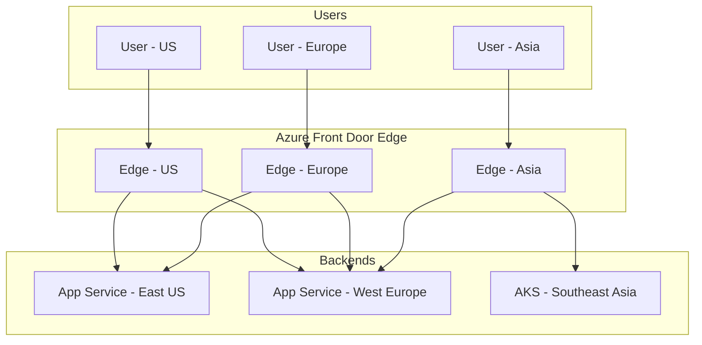

# How to Configure Azure Front Door

Author: [nawazdhandala](https://www.github.com/nawazdhandala)

Tags: Azure, Front Door, CDN, Load Balancing, WAF, Global Routing, DevOps

Description: A practical guide to configuring Azure Front Door for global load balancing, CDN capabilities, and WAF protection with step-by-step examples.

---

Azure Front Door is Microsoft's global entry point for web applications. It combines content delivery, global load balancing, and application security into one service. This guide walks through practical configuration scenarios you will encounter in production environments.

## Understanding Azure Front Door Architecture

Azure Front Door operates at Layer 7 (HTTP/HTTPS) and sits at Microsoft's global edge network with over 100 points of presence worldwide. Traffic enters the nearest edge location and gets routed to your backend using smart routing algorithms.



## Setting Up Azure Front Door with Azure CLI

### Create the Front Door Profile

Start by creating a Front Door profile. The Standard tier works for most use cases, while Premium adds private link support and advanced WAF rules.

```bash
# Create resource group
az group create \
  --name rg-frontdoor-prod \
  --location eastus

# Create Front Door profile (Standard_AzureFrontDoor or Premium_AzureFrontDoor)
az afd profile create \
  --profile-name fd-myapp-prod \
  --resource-group rg-frontdoor-prod \
  --sku Standard_AzureFrontDoor
```

### Add an Endpoint

Endpoints are the entry points for your traffic. Each endpoint gets a unique hostname.

```bash
# Create endpoint
az afd endpoint create \
  --endpoint-name myapp-endpoint \
  --profile-name fd-myapp-prod \
  --resource-group rg-frontdoor-prod \
  --enabled-state Enabled

# Get the endpoint hostname
az afd endpoint show \
  --endpoint-name myapp-endpoint \
  --profile-name fd-myapp-prod \
  --resource-group rg-frontdoor-prod \
  --query hostName -o tsv
```

### Configure Origin Groups and Origins

Origin groups contain your backend servers. Configure health probes and load balancing settings here.

```bash
# Create origin group with health probe settings
az afd origin-group create \
  --origin-group-name og-webapp \
  --profile-name fd-myapp-prod \
  --resource-group rg-frontdoor-prod \
  --probe-request-type GET \
  --probe-protocol Https \
  --probe-path /health \
  --probe-interval-in-seconds 30 \
  --sample-size 4 \
  --successful-samples-required 3 \
  --additional-latency-in-milliseconds 50

# Add primary origin (App Service)
az afd origin create \
  --origin-name origin-eastus \
  --origin-group-name og-webapp \
  --profile-name fd-myapp-prod \
  --resource-group rg-frontdoor-prod \
  --host-name myapp-eastus.azurewebsites.net \
  --origin-host-header myapp-eastus.azurewebsites.net \
  --http-port 80 \
  --https-port 443 \
  --priority 1 \
  --weight 1000 \
  --enabled-state Enabled

# Add secondary origin for failover
az afd origin create \
  --origin-name origin-westeurope \
  --origin-group-name og-webapp \
  --profile-name fd-myapp-prod \
  --resource-group rg-frontdoor-prod \
  --host-name myapp-westeurope.azurewebsites.net \
  --origin-host-header myapp-westeurope.azurewebsites.net \
  --http-port 80 \
  --https-port 443 \
  --priority 2 \
  --weight 1000 \
  --enabled-state Enabled
```

### Create Routes

Routes define how traffic flows from endpoints to origin groups based on patterns.

```bash
# Create route for all traffic
az afd route create \
  --route-name route-default \
  --endpoint-name myapp-endpoint \
  --profile-name fd-myapp-prod \
  --resource-group rg-frontdoor-prod \
  --origin-group og-webapp \
  --supported-protocols Https \
  --patterns-to-match "/*" \
  --forwarding-protocol HttpsOnly \
  --https-redirect Enabled \
  --link-to-default-domain Enabled
```

## Configuring Custom Domains

### Add Custom Domain with Managed Certificate

Azure Front Door can automatically provision and renew SSL certificates for your custom domains.

```bash
# Add custom domain
az afd custom-domain create \
  --custom-domain-name cdn-myapp-com \
  --profile-name fd-myapp-prod \
  --resource-group rg-frontdoor-prod \
  --host-name cdn.myapp.com \
  --certificate-type ManagedCertificate \
  --minimum-tls-version TLS12

# Get the validation token for DNS
az afd custom-domain show \
  --custom-domain-name cdn-myapp-com \
  --profile-name fd-myapp-prod \
  --resource-group rg-frontdoor-prod \
  --query validationProperties
```

Add the DNS records to validate domain ownership:

```bash
# Add CNAME record pointing to Front Door endpoint
# Name: cdn
# Value: myapp-endpoint-xxxxxxxx.z01.azurefd.net

# Add TXT record for validation
# Name: _dnsauth.cdn
# Value: <validation-token-from-above>
```

### Update Route to Use Custom Domain

```bash
# Associate custom domain with route
az afd route update \
  --route-name route-default \
  --endpoint-name myapp-endpoint \
  --profile-name fd-myapp-prod \
  --resource-group rg-frontdoor-prod \
  --custom-domains cdn-myapp-com
```

## Configuring Web Application Firewall (WAF)

### Create WAF Policy

```bash
# Create WAF policy
az network front-door waf-policy create \
  --name wafpolicy-myapp \
  --resource-group rg-frontdoor-prod \
  --sku Standard_AzureFrontDoor \
  --mode Prevention

# Enable managed rule sets (OWASP)
az network front-door waf-policy managed-rules add \
  --policy-name wafpolicy-myapp \
  --resource-group rg-frontdoor-prod \
  --type DefaultRuleSet \
  --version 1.0

# Add bot protection rules
az network front-door waf-policy managed-rules add \
  --policy-name wafpolicy-myapp \
  --resource-group rg-frontdoor-prod \
  --type Microsoft_BotManagerRuleSet \
  --version 1.0
```

### Add Custom WAF Rules

Block specific IP ranges or patterns:

```bash
# Block specific IP addresses
az network front-door waf-policy rule create \
  --policy-name wafpolicy-myapp \
  --resource-group rg-frontdoor-prod \
  --name BlockBadIPs \
  --priority 100 \
  --rule-type MatchRule \
  --action Block \
  --match-variable RemoteAddr \
  --operator IPMatch \
  --values "203.0.113.0/24" "198.51.100.0/24"

# Rate limiting rule
az network front-door waf-policy rule create \
  --policy-name wafpolicy-myapp \
  --resource-group rg-frontdoor-prod \
  --name RateLimitRule \
  --priority 200 \
  --rule-type RateLimitRule \
  --action Block \
  --rate-limit-threshold 1000 \
  --rate-limit-duration-in-minutes 1 \
  --match-variable RequestUri \
  --operator Contains \
  --values "/api/"
```

### Associate WAF Policy with Endpoint

```bash
# Link WAF policy to security policy
az afd security-policy create \
  --security-policy-name secpol-waf \
  --profile-name fd-myapp-prod \
  --resource-group rg-frontdoor-prod \
  --waf-policy "/subscriptions/<sub-id>/resourceGroups/rg-frontdoor-prod/providers/Microsoft.Network/FrontDoorWebApplicationFirewallPolicies/wafpolicy-myapp" \
  --domains "/subscriptions/<sub-id>/resourceGroups/rg-frontdoor-prod/providers/Microsoft.Cdn/profiles/fd-myapp-prod/afdEndpoints/myapp-endpoint"
```

## Caching Configuration

Configure caching rules to reduce origin load and improve performance.

```bash
# Create rule set for caching
az afd rule-set create \
  --rule-set-name CachingRules \
  --profile-name fd-myapp-prod \
  --resource-group rg-frontdoor-prod

# Cache static assets for 7 days
az afd rule create \
  --rule-name CacheStaticAssets \
  --rule-set-name CachingRules \
  --profile-name fd-myapp-prod \
  --resource-group rg-frontdoor-prod \
  --order 1 \
  --match-variable RequestPath \
  --operator RegEx \
  --match-values ".*\.(css|js|png|jpg|gif|ico|woff|woff2)$" \
  --action-name CacheExpiration \
  --cache-behavior Override \
  --cache-duration "7.00:00:00"

# Bypass cache for API endpoints
az afd rule create \
  --rule-name BypassAPICache \
  --rule-set-name CachingRules \
  --profile-name fd-myapp-prod \
  --resource-group rg-frontdoor-prod \
  --order 2 \
  --match-variable RequestPath \
  --operator BeginsWith \
  --match-values "/api/" \
  --action-name CacheExpiration \
  --cache-behavior BypassCache
```

## Monitoring and Diagnostics

### Enable Diagnostic Logs

```bash
# Create Log Analytics workspace
az monitor log-analytics workspace create \
  --workspace-name law-frontdoor \
  --resource-group rg-frontdoor-prod \
  --location eastus

# Enable diagnostic settings
az monitor diagnostic-settings create \
  --name diag-frontdoor \
  --resource "/subscriptions/<sub-id>/resourceGroups/rg-frontdoor-prod/providers/Microsoft.Cdn/profiles/fd-myapp-prod" \
  --workspace "/subscriptions/<sub-id>/resourceGroups/rg-frontdoor-prod/providers/Microsoft.OperationalInsights/workspaces/law-frontdoor" \
  --logs '[{"category":"FrontDoorAccessLog","enabled":true},{"category":"FrontDoorHealthProbeLog","enabled":true},{"category":"FrontDoorWebApplicationFirewallLog","enabled":true}]' \
  --metrics '[{"category":"AllMetrics","enabled":true}]'
```

### Query Logs for Troubleshooting

```kusto
// Find failed requests
AzureDiagnostics
| where ResourceType == "FRONTDOORS"
| where httpStatusCode_s >= 400
| summarize count() by httpStatusCode_s, requestUri_s, bin(TimeGenerated, 5m)
| order by TimeGenerated desc

// Check origin health
AzureDiagnostics
| where ResourceType == "FRONTDOORS"
| where Category == "FrontDoorHealthProbeLog"
| where result_s != "Passed"
| summarize count() by originName_s, result_s, bin(TimeGenerated, 5m)

// WAF blocked requests
AzureDiagnostics
| where ResourceType == "FRONTDOORS"
| where Category == "FrontDoorWebApplicationFirewallLog"
| where action_s == "Block"
| summarize count() by ruleName_s, clientIp_s, bin(TimeGenerated, 1h)
```

## Best Practices

**Health Probes**: Always configure meaningful health probe endpoints. Return 200 only when your application is truly healthy and can serve traffic.

**Origin Priority**: Use priority settings for active-passive failover and weights for active-active load distribution.

**Session Affinity**: Enable session affinity only when necessary. It reduces the effectiveness of load balancing.

**Compression**: Enable compression for text-based content to reduce bandwidth and improve load times.

**HTTPS Enforcement**: Always redirect HTTP to HTTPS and use TLS 1.2 or higher.

**WAF Tuning**: Start WAF in Detection mode, analyze logs, tune rules, then switch to Prevention mode.

---

Azure Front Door simplifies global application delivery by combining CDN, load balancing, and security into a single service. Start with basic routing, add custom domains, enable WAF, and iterate based on your traffic patterns and security requirements.
