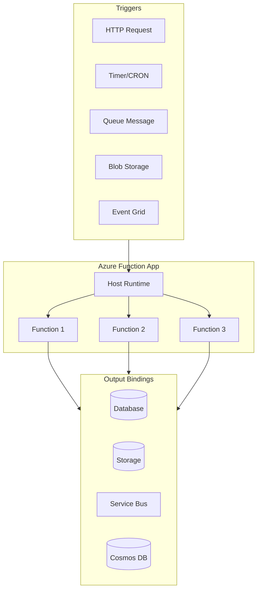
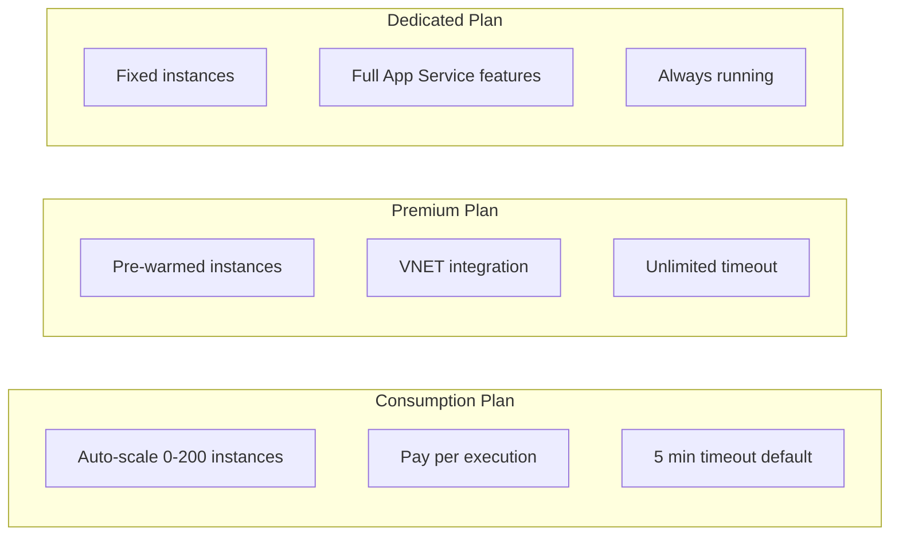

# How to Configure Azure Functions

Author: [nawazdhandala](https://www.github.com/nawazdhandala)

Tags: Azure, Azure Functions, Serverless, Configuration, DevOps, Cloud, FaaS

Description: A comprehensive guide to configuring Azure Functions, covering host settings, bindings, scaling, security, and monitoring for production workloads.

---

Azure Functions is Microsoft's serverless compute platform that lets you run event-driven code without managing infrastructure. Getting the configuration right is essential for performance, cost, and reliability. This guide covers everything you need to configure Azure Functions for production use.

## Azure Functions Architecture



## Creating a Function App

```bash
# Create a resource group
az group create --name myfunction-rg --location eastus

# Create a storage account (required for Functions)
az storage account create \
  --name myfunctionstorage \
  --resource-group myfunction-rg \
  --location eastus \
  --sku Standard_LRS

# Create the Function App (Consumption plan)
az functionapp create \
  --name myfunctionapp \
  --resource-group myfunction-rg \
  --storage-account myfunctionstorage \
  --consumption-plan-location eastus \
  --runtime node \
  --runtime-version 20 \
  --functions-version 4

# Or create with Premium plan for more control
az functionapp plan create \
  --name myfunctionplan \
  --resource-group myfunction-rg \
  --location eastus \
  --sku EP1 \
  --is-linux

az functionapp create \
  --name myfunctionapp \
  --resource-group myfunction-rg \
  --storage-account myfunctionstorage \
  --plan myfunctionplan \
  --runtime node \
  --runtime-version 20 \
  --functions-version 4
```

## Host Configuration (host.json)

The `host.json` file controls runtime behavior for all functions in the app.

```json
{
  "version": "2.0",
  "logging": {
    "applicationInsights": {
      "samplingSettings": {
        "isEnabled": true,
        "maxTelemetryItemsPerSecond": 20,
        "excludedTypes": "Request"
      }
    },
    "logLevel": {
      "default": "Information",
      "Host.Results": "Error",
      "Function": "Information",
      "Host.Aggregator": "Trace"
    }
  },
  "extensions": {
    "http": {
      "routePrefix": "api",
      "maxOutstandingRequests": 200,
      "maxConcurrentRequests": 100,
      "dynamicThrottlesEnabled": true
    },
    "queues": {
      "maxPollingInterval": "00:00:02",
      "visibilityTimeout": "00:00:30",
      "batchSize": 16,
      "maxDequeueCount": 5,
      "newBatchThreshold": 8
    },
    "serviceBus": {
      "prefetchCount": 100,
      "messageHandlerOptions": {
        "autoComplete": true,
        "maxConcurrentCalls": 32,
        "maxAutoRenewDuration": "00:05:00"
      }
    },
    "cosmosDB": {
      "connectionMode": "Direct",
      "protocol": "Tcp"
    }
  },
  "functionTimeout": "00:10:00",
  "healthMonitor": {
    "enabled": true,
    "healthCheckInterval": "00:00:10",
    "healthCheckWindow": "00:02:00",
    "healthCheckThreshold": 6,
    "counterThreshold": 0.80
  },
  "singleton": {
    "lockPeriod": "00:00:15",
    "listenerLockPeriod": "00:01:00",
    "listenerLockRecoveryPollingInterval": "00:01:00",
    "lockAcquisitionTimeout": "00:01:00",
    "lockAcquisitionPollingInterval": "00:00:03"
  }
}
```

## Function Configuration (function.json)

Each function has its own configuration defining triggers and bindings.

### HTTP Trigger Function

```json
{
  "bindings": [
    {
      "authLevel": "function",
      "type": "httpTrigger",
      "direction": "in",
      "name": "req",
      "methods": ["get", "post"],
      "route": "users/{id:int?}"
    },
    {
      "type": "http",
      "direction": "out",
      "name": "res"
    }
  ]
}
```

### Timer Trigger Function

```json
{
  "bindings": [
    {
      "name": "myTimer",
      "type": "timerTrigger",
      "direction": "in",
      "schedule": "0 */5 * * * *",
      "runOnStartup": false,
      "useMonitor": true
    }
  ]
}
```

### Queue Trigger with Cosmos DB Output

```json
{
  "bindings": [
    {
      "name": "queueMessage",
      "type": "queueTrigger",
      "direction": "in",
      "queueName": "myqueue",
      "connection": "AzureWebJobsStorage"
    },
    {
      "name": "document",
      "type": "cosmosDB",
      "direction": "out",
      "databaseName": "mydb",
      "containerName": "items",
      "createIfNotExists": true,
      "connection": "CosmosDBConnection"
    }
  ]
}
```

## Application Settings

```bash
# Set application settings
az functionapp config appsettings set \
  --name myfunctionapp \
  --resource-group myfunction-rg \
  --settings \
    FUNCTIONS_WORKER_RUNTIME=node \
    WEBSITE_NODE_DEFAULT_VERSION=~20 \
    MyApiKey=secret-value \
    DatabaseConnection="Server=myserver.database.windows.net;..."

# Use Key Vault references (recommended for secrets)
az functionapp config appsettings set \
  --name myfunctionapp \
  --resource-group myfunction-rg \
  --settings \
    MySecret="@Microsoft.KeyVault(SecretUri=https://myvault.vault.azure.net/secrets/MySecret/)"
```

### Essential Settings Reference

```bash
# Core runtime settings
FUNCTIONS_WORKER_RUNTIME=node|python|dotnet|java|powershell
FUNCTIONS_EXTENSION_VERSION=~4
WEBSITE_RUN_FROM_PACKAGE=1

# Scaling settings (Consumption/Premium)
WEBSITE_MAX_DYNAMIC_APPLICATION_SCALE_OUT=10
FUNCTIONS_WORKER_PROCESS_COUNT=4

# Node.js specific
WEBSITE_NODE_DEFAULT_VERSION=~20
NODE_ENV=production

# Python specific
PYTHON_ISOLATE_WORKER_DEPENDENCIES=1

# .NET specific
DOTNET_ENVIRONMENT=Production
```

## Scaling Configuration



### Configure Scaling Rules

```bash
# Set maximum scale-out for Premium plan
az functionapp config set \
  --name myfunctionapp \
  --resource-group myfunction-rg \
  --number-of-workers 10

# Configure pre-warmed instances (Premium only)
az resource update \
  --resource-group myfunction-rg \
  --name myfunctionapp \
  --resource-type Microsoft.Web/sites \
  --set properties.siteConfig.minimumElasticInstanceCount=2
```

### host.json Scaling Settings

```json
{
  "version": "2.0",
  "extensions": {
    "http": {
      "maxConcurrentRequests": 100
    },
    "queues": {
      "batchSize": 16,
      "newBatchThreshold": 8
    }
  },
  "concurrency": {
    "dynamicConcurrencyEnabled": true,
    "snapshotPersistenceEnabled": true
  }
}
```

## Security Configuration

### Authentication Setup

```bash
# Enable Azure AD authentication
az webapp auth update \
  --name myfunctionapp \
  --resource-group myfunction-rg \
  --enabled true \
  --action LoginWithAzureActiveDirectory \
  --aad-client-id <client-id> \
  --aad-client-secret <client-secret>
```

### Network Security

```bash
# Enable VNET integration (Premium/Dedicated only)
az functionapp vnet-integration add \
  --name myfunctionapp \
  --resource-group myfunction-rg \
  --vnet myvnet \
  --subnet mysubnet

# Restrict inbound access
az functionapp config access-restriction add \
  --name myfunctionapp \
  --resource-group myfunction-rg \
  --rule-name "AllowVNET" \
  --priority 100 \
  --vnet-name myvnet \
  --subnet mysubnet

# Enable private endpoints
az network private-endpoint create \
  --name myfunctionapp-pe \
  --resource-group myfunction-rg \
  --vnet-name myvnet \
  --subnet private-endpoints \
  --private-connection-resource-id $(az functionapp show --name myfunctionapp --resource-group myfunction-rg --query id -o tsv) \
  --group-id sites \
  --connection-name myfunctionapp-connection
```

### Managed Identity

```bash
# Enable system-assigned managed identity
az functionapp identity assign \
  --name myfunctionapp \
  --resource-group myfunction-rg

# Get the principal ID
PRINCIPAL_ID=$(az functionapp identity show \
  --name myfunctionapp \
  --resource-group myfunction-rg \
  --query principalId -o tsv)

# Grant access to Key Vault
az keyvault set-policy \
  --name myvault \
  --object-id $PRINCIPAL_ID \
  --secret-permissions get list
```

## Monitoring Configuration

### Application Insights Integration

```bash
# Create Application Insights
az monitor app-insights component create \
  --app myfunction-insights \
  --location eastus \
  --resource-group myfunction-rg

# Get instrumentation key
APPINSIGHTS_KEY=$(az monitor app-insights component show \
  --app myfunction-insights \
  --resource-group myfunction-rg \
  --query instrumentationKey -o tsv)

# Configure Function App
az functionapp config appsettings set \
  --name myfunctionapp \
  --resource-group myfunction-rg \
  --settings \
    APPINSIGHTS_INSTRUMENTATIONKEY=$APPINSIGHTS_KEY \
    APPLICATIONINSIGHTS_CONNECTION_STRING="InstrumentationKey=$APPINSIGHTS_KEY"
```

### Custom Metrics and Logging

```javascript
// Node.js function with custom telemetry
const appInsights = require("applicationinsights");
appInsights.setup().start();
const client = appInsights.defaultClient;

module.exports = async function (context, req) {
    // Track custom event
    client.trackEvent({
        name: "OrderProcessed",
        properties: {
            orderId: req.body.orderId,
            amount: req.body.amount
        }
    });

    // Track custom metric
    client.trackMetric({
        name: "OrderValue",
        value: req.body.amount
    });

    // Structured logging
    context.log.info("Processing order", {
        orderId: req.body.orderId,
        customerId: req.body.customerId
    });

    context.res = { status: 200 };
};
```

## Deployment Configuration

### local.settings.json (Development)

```json
{
  "IsEncrypted": false,
  "Values": {
    "AzureWebJobsStorage": "UseDevelopmentStorage=true",
    "FUNCTIONS_WORKER_RUNTIME": "node",
    "MyApiKey": "dev-api-key",
    "DatabaseConnection": "Server=localhost;Database=mydb;..."
  },
  "Host": {
    "LocalHttpPort": 7071,
    "CORS": "*",
    "CORSCredentials": false
  }
}
```

### GitHub Actions Deployment

```yaml
name: Deploy Azure Functions

on:
  push:
    branches: [main]

env:
  AZURE_FUNCTIONAPP_NAME: myfunctionapp
  NODE_VERSION: '20.x'

jobs:
  build-and-deploy:
    runs-on: ubuntu-latest
    steps:
      - uses: actions/checkout@v4

      - name: Setup Node.js
        uses: actions/setup-node@v4
        with:
          node-version: ${{ env.NODE_VERSION }}

      - name: Install dependencies
        run: npm ci

      - name: Run tests
        run: npm test

      - name: Azure Login
        uses: azure/login@v2
        with:
          creds: ${{ secrets.AZURE_CREDENTIALS }}

      - name: Deploy to Azure Functions
        uses: azure/functions-action@v1
        with:
          app-name: ${{ env.AZURE_FUNCTIONAPP_NAME }}
          package: .
```

## Durable Functions Configuration

```json
{
  "version": "2.0",
  "extensions": {
    "durableTask": {
      "hubName": "MyTaskHub",
      "storageProvider": {
        "connectionStringName": "AzureWebJobsStorage",
        "controlQueueBatchSize": 32,
        "controlQueueBufferThreshold": 256,
        "controlQueueVisibilityTimeout": "00:05:00",
        "maxQueuePollingInterval": "00:00:30",
        "partitionCount": 4,
        "trackingStoreConnectionStringName": "AzureWebJobsStorage",
        "trackingStoreNamePrefix": "DurableTask",
        "useLegacyPartitionManagement": false,
        "workItemQueueVisibilityTimeout": "00:05:00"
      },
      "tracing": {
        "traceInputsAndOutputs": false,
        "traceReplayEvents": false
      },
      "notifications": {
        "eventGrid": {
          "topicEndpoint": "https://mytopic.eastus-1.eventgrid.azure.net/api/events",
          "keySettingName": "EventGridKey",
          "publishRetryCount": 3,
          "publishRetryInterval": "00:00:30"
        }
      },
      "maxConcurrentActivityFunctions": 10,
      "maxConcurrentOrchestratorFunctions": 10
    }
  }
}
```

## Best Practices Summary

1. **Use host.json** to configure runtime behavior globally
2. **Store secrets in Key Vault** with managed identity access
3. **Enable Application Insights** for monitoring and diagnostics
4. **Configure appropriate timeouts** based on your plan
5. **Use VNET integration** for secure backend connectivity
6. **Set scaling limits** to control costs
7. **Enable health monitoring** for reliability
8. **Use deployment slots** for zero-downtime deployments

---

Proper configuration is the foundation of reliable Azure Functions. Start with the basics like host.json and application settings, then layer on security with managed identities and VNET integration. Monitor everything with Application Insights, and automate deployments with GitHub Actions. These configurations will help you build production-ready serverless applications.
