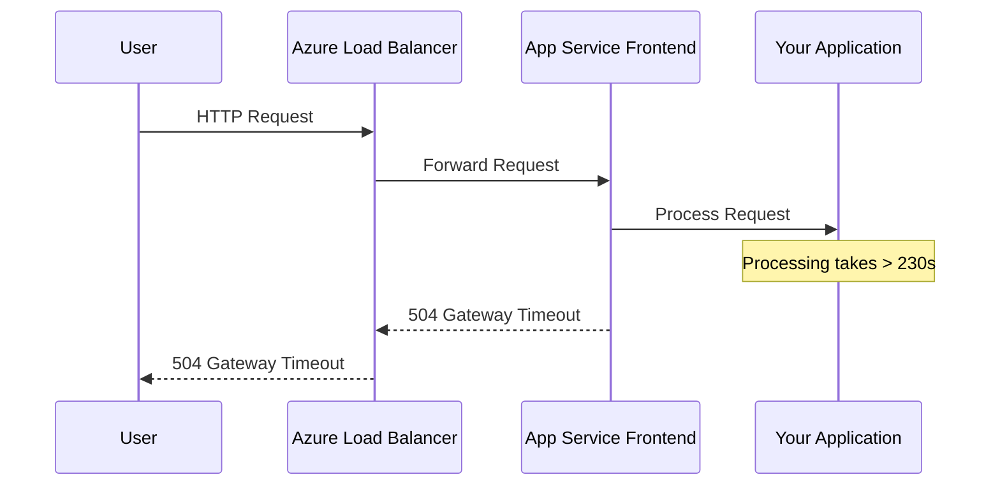
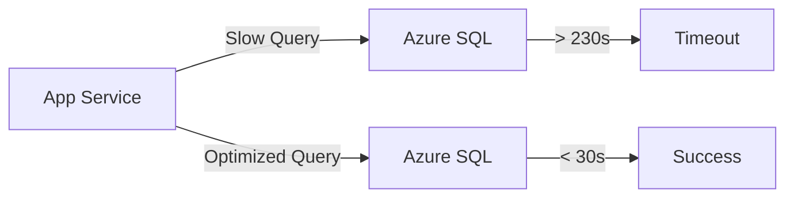
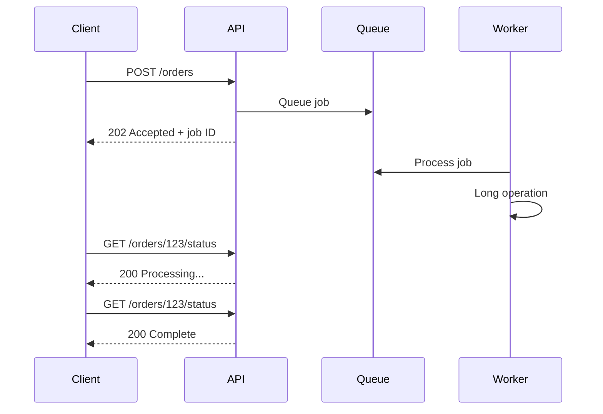

# How to Fix 'Gateway Timeout' App Service Errors

Author: [nawazdhandala](https://www.github.com/nawazdhandala)

Tags: Azure, App Service, Gateway Timeout, Troubleshooting, Performance, DevOps, Cloud

Description: A practical guide to diagnosing and resolving HTTP 502 and 504 Gateway Timeout errors in Azure App Service, with real solutions and code examples.

---

Gateway Timeout errors in Azure App Service are frustrating. You see a 502 Bad Gateway or 504 Gateway Timeout, and your users see a broken application. These errors happen when the App Service front-end cannot get a response from your application within the allowed time. Let's fix them.

## Understanding Gateway Timeouts

Azure App Service uses a load balancer that sits in front of your application. When this load balancer cannot reach your app or your app takes too long to respond, you get a gateway timeout.



### Key Timeout Values

Azure App Service has a fixed request timeout of 230 seconds. You cannot change this. If your application does not respond within 230 seconds, you get a 504.

| Error Code | Meaning | Common Cause |
|------------|---------|--------------|
| 502 Bad Gateway | App crashed or unavailable | Application errors, out of memory |
| 504 Gateway Timeout | Request took too long | Slow database queries, external API calls |

## Quick Diagnostic Steps

First, determine if this is happening on all requests or specific endpoints.

### Check Application Logs

```bash
# Stream live logs from your App Service
az webapp log tail --name myapp --resource-group myresourcegroup

# Download logs for analysis
az webapp log download --name myapp --resource-group myresourcegroup --log-file logs.zip
```

### Enable Application Insights

If you have not already, enable Application Insights to see where requests are failing.

```bash
# Create Application Insights resource
az monitor app-insights component create \
    --app myapp-insights \
    --location eastus \
    --resource-group myresourcegroup

# Link to App Service
az webapp config appsettings set \
    --name myapp \
    --resource-group myresourcegroup \
    --settings APPINSIGHTS_INSTRUMENTATIONKEY=<your-key>
```

### Query Failed Requests

```kusto
// Find slow requests in Application Insights
requests
| where timestamp > ago(1h)
| where success == false or duration > 30000
| project timestamp, name, duration, resultCode, operation_Name
| order by duration desc
| take 50
```

## Common Causes and Solutions

### Cause 1: Slow Database Queries

The most common cause of gateway timeouts is database queries that take too long.



**Solution: Add query timeouts and optimize queries**

```csharp
// C# - Set command timeout shorter than 230 seconds
using var connection = new SqlConnection(connectionString);
using var command = new SqlCommand(query, connection);
command.CommandTimeout = 120; // 120 seconds max

await connection.OpenAsync();
var result = await command.ExecuteReaderAsync();
```

```javascript
// Node.js - Set request timeout for database calls
const pool = new sql.ConnectionPool({
    server: 'myserver.database.windows.net',
    database: 'mydb',
    requestTimeout: 120000, // 120 seconds
    connectionTimeout: 30000 // 30 seconds for connection
});
```

### Cause 2: External API Calls Without Timeout

If your app calls external APIs without proper timeouts, one slow API can bring down your whole application.

**Solution: Always set HTTP client timeouts**

```csharp
// C# - HttpClient with timeout
var client = new HttpClient
{
    Timeout = TimeSpan.FromSeconds(30)
};

try
{
    var response = await client.GetAsync("https://external-api.com/data");
}
catch (TaskCanceledException)
{
    // Handle timeout gracefully
    _logger.LogWarning("External API call timed out");
    return GetCachedData();
}
```

```python
# Python - requests with timeout
import requests

try:
    response = requests.get(
        'https://external-api.com/data',
        timeout=(5, 30)  # (connect timeout, read timeout)
    )
except requests.Timeout:
    # Handle timeout
    return get_cached_data()
```

### Cause 3: Application Startup Taking Too Long

If your application takes longer than the health check timeout to start, the load balancer marks it as unhealthy.

**Solution: Configure health check and startup settings**

```bash
# Increase startup time limit
az webapp config set \
    --name myapp \
    --resource-group myresourcegroup \
    --startup-time-limit 300

# Configure health check path
az webapp config set \
    --name myapp \
    --resource-group myresourcegroup \
    --health-check-path /health
```

Create a lightweight health endpoint:

```csharp
// ASP.NET Core health check
app.MapHealthChecks("/health", new HealthCheckOptions
{
    Predicate = _ => false, // Quick health check, skip detailed checks
    ResponseWriter = async (context, report) =>
    {
        context.Response.ContentType = "text/plain";
        await context.Response.WriteAsync("Healthy");
    }
});
```

### Cause 4: Synchronous Long-Running Operations

Never run long operations synchronously in a web request.

**Solution: Use background jobs**

```csharp
// Instead of this (bad)
[HttpPost("process")]
public async Task<IActionResult> ProcessData()
{
    await LongRunningProcess(); // This will timeout!
    return Ok();
}

// Do this (good)
[HttpPost("process")]
public async Task<IActionResult> ProcessData()
{
    var jobId = await _backgroundQueue.QueueAsync(data);
    return Accepted(new { jobId, statusUrl = $"/jobs/{jobId}" });
}

[HttpGet("jobs/{id}")]
public async Task<IActionResult> GetJobStatus(string id)
{
    var status = await _jobStore.GetStatusAsync(id);
    return Ok(status);
}
```

### Cause 5: Memory Pressure Causing GC Pauses

If your app is using too much memory, garbage collection can cause long pauses.

**Solution: Scale up or optimize memory usage**

```bash
# Scale to a higher tier with more memory
az webapp update \
    --name myapp \
    --resource-group myresourcegroup \
    --plan P2V3

# Check current memory usage
az webapp show \
    --name myapp \
    --resource-group myresourcegroup \
    --query "usageState"
```

Monitor memory in Application Insights:

```kusto
// Memory usage over time
performanceCounters
| where timestamp > ago(1h)
| where counter == "Private Bytes"
| summarize avg(value) by bin(timestamp, 5m)
| render timechart
```

## Implementing Retry Logic

For transient gateway timeouts, implement retry with exponential backoff on the client side.

```javascript
// JavaScript - Retry with exponential backoff
async function fetchWithRetry(url, options = {}, maxRetries = 3) {
    for (let i = 0; i < maxRetries; i++) {
        try {
            const response = await fetch(url, {
                ...options,
                signal: AbortSignal.timeout(30000) // 30 second timeout
            });

            if (response.ok) return response;

            // Retry on 502, 503, 504
            if ([502, 503, 504].includes(response.status) && i < maxRetries - 1) {
                const delay = Math.pow(2, i) * 1000; // 1s, 2s, 4s
                await new Promise(r => setTimeout(r, delay));
                continue;
            }

            return response;
        } catch (error) {
            if (i === maxRetries - 1) throw error;
            const delay = Math.pow(2, i) * 1000;
            await new Promise(r => setTimeout(r, delay));
        }
    }
}
```

## Architecture Patterns to Prevent Timeouts

### Pattern 1: Async Request-Reply

For operations that might take longer than 230 seconds, use async patterns.



### Pattern 2: Distributed Caching

Reduce database load with Azure Cache for Redis.

```csharp
// Check cache first, then database
public async Task<Product> GetProductAsync(int id)
{
    var cacheKey = $"product:{id}";

    // Try cache first
    var cached = await _cache.GetStringAsync(cacheKey);
    if (cached != null)
    {
        return JsonSerializer.Deserialize<Product>(cached);
    }

    // Cache miss - get from database
    var product = await _db.Products.FindAsync(id);

    // Store in cache for 5 minutes
    await _cache.SetStringAsync(
        cacheKey,
        JsonSerializer.Serialize(product),
        new DistributedCacheEntryOptions
        {
            AbsoluteExpirationRelativeToNow = TimeSpan.FromMinutes(5)
        }
    );

    return product;
}
```

## Monitoring and Alerting

Set up alerts to catch gateway timeouts before users report them.

```bash
# Create alert for 5xx errors
az monitor metrics alert create \
    --name "HighErrorRate" \
    --resource-group myresourcegroup \
    --scopes "/subscriptions/{sub}/resourceGroups/{rg}/providers/Microsoft.Web/sites/myapp" \
    --condition "avg Http5xx > 10" \
    --window-size 5m \
    --evaluation-frequency 1m \
    --action-group myactiongroup
```

## Checklist for Gateway Timeout Prevention

- [ ] Set command timeouts on all database queries (< 120s)
- [ ] Set HTTP client timeouts on all external API calls (< 30s)
- [ ] Configure health check endpoint
- [ ] Enable Application Insights
- [ ] Use async patterns for long operations
- [ ] Implement caching for frequently accessed data
- [ ] Set up monitoring alerts
- [ ] Test under load before deploying
- [ ] Scale to appropriate tier for your workload

---

Gateway timeouts are almost always caused by something in your application taking too long. Start with Application Insights to find the slow operations, then apply timeouts and async patterns to fix them. The 230 second limit is not going away, so design your application to complete requests quickly or use async patterns for longer operations.
