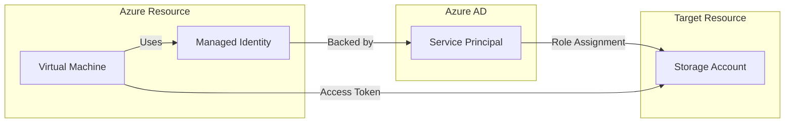
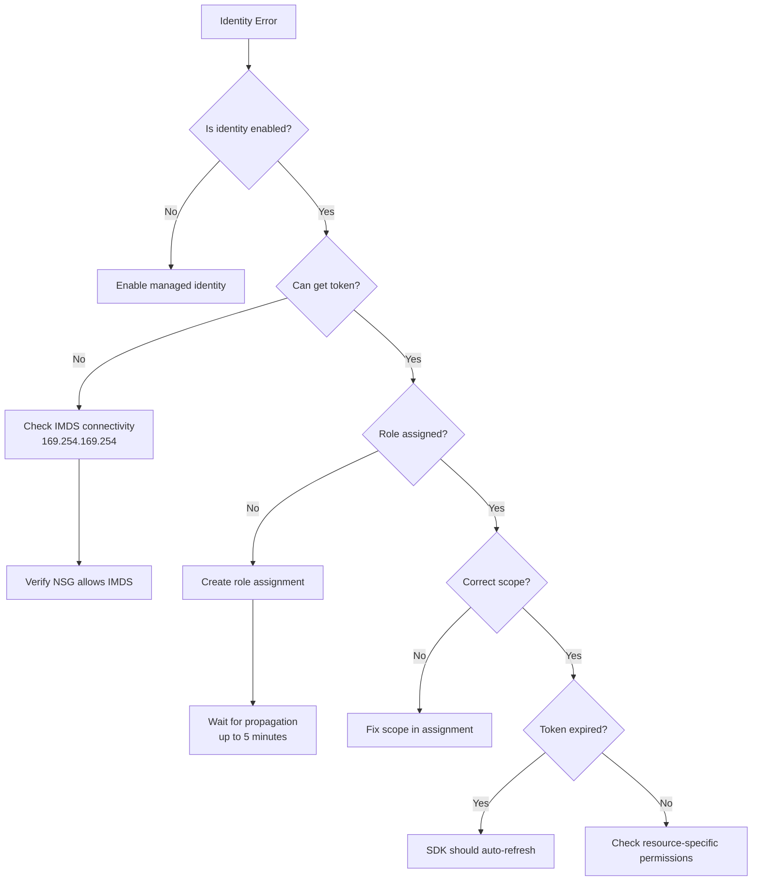

# How to Fix "Identity" Assignment Errors in Azure

Author: [nawazdhandala](https://www.github.com/nawazdhandala)

Tags: Azure, Managed Identity, IAM, RBAC, Security, Troubleshooting

Description: A practical guide to diagnosing and resolving Azure managed identity assignment errors including role assignment failures, identity propagation delays, and permission issues.

---

Azure Managed Identities provide automatic credential management for your Azure resources. But when identity assignments fail, your applications cannot access the resources they need. This guide covers the most common identity errors and how to fix them.

## Understanding Managed Identities



There are two types of managed identities:

- **System-assigned**: Created with the resource, deleted when the resource is deleted
- **User-assigned**: Created independently, can be shared across multiple resources

## Common Identity Assignment Errors

### Error 1: "The role assignment already exists"

This happens when you try to create a duplicate role assignment.

```
ERROR: The role assignment already exists.
```

**Check existing assignments:**

```bash
# List all role assignments for a managed identity
PRINCIPAL_ID=$(az vm identity show \
    --resource-group myResourceGroup \
    --name myVM \
    --query principalId \
    --output tsv)

az role assignment list \
    --assignee $PRINCIPAL_ID \
    --all \
    --output table
```

**Fix: Use create-or-update pattern in scripts**

```bash
# Check if assignment exists before creating
EXISTING=$(az role assignment list \
    --assignee $PRINCIPAL_ID \
    --role "Storage Blob Data Contributor" \
    --scope "/subscriptions/xxx/resourceGroups/myRG/providers/Microsoft.Storage/storageAccounts/mystorageaccount" \
    --query "[0].id" \
    --output tsv)

if [ -z "$EXISTING" ]; then
    az role assignment create \
        --assignee $PRINCIPAL_ID \
        --role "Storage Blob Data Contributor" \
        --scope "/subscriptions/xxx/resourceGroups/myRG/providers/Microsoft.Storage/storageAccounts/mystorageaccount"
    echo "Role assignment created"
else
    echo "Role assignment already exists"
fi
```

### Error 2: "PrincipalNotFound" or "Principal does not exist"

This error occurs when the identity has not fully propagated through Azure AD.

```
ERROR: Principals of type Application cannot validly be used in role assignments.
```

**Or:**

```
ERROR: The principal with id 'xxxxxxxx-xxxx-xxxx-xxxx-xxxxxxxxxxxx' does not exist in the directory.
```

**Fix: Add retry logic with delay**

```bash
#!/bin/bash
# enable-identity-with-retry.sh

RESOURCE_GROUP="myResourceGroup"
VM_NAME="myVM"
MAX_RETRIES=10
RETRY_DELAY=30

# Enable system-assigned identity
az vm identity assign \
    --resource-group $RESOURCE_GROUP \
    --name $VM_NAME

# Get the principal ID
PRINCIPAL_ID=$(az vm identity show \
    --resource-group $RESOURCE_GROUP \
    --name $VM_NAME \
    --query principalId \
    --output tsv)

echo "Principal ID: $PRINCIPAL_ID"
echo "Waiting for identity to propagate..."

# Retry loop for role assignment
for i in $(seq 1 $MAX_RETRIES); do
    echo "Attempt $i of $MAX_RETRIES..."

    if az role assignment create \
        --assignee $PRINCIPAL_ID \
        --role "Storage Blob Data Contributor" \
        --scope "/subscriptions/xxx/resourceGroups/myRG/providers/Microsoft.Storage/storageAccounts/mystorageaccount" \
        2>/dev/null; then
        echo "Role assignment succeeded!"
        exit 0
    fi

    if [ $i -lt $MAX_RETRIES ]; then
        echo "Failed, waiting ${RETRY_DELAY}s before retry..."
        sleep $RETRY_DELAY
    fi
done

echo "Failed to create role assignment after $MAX_RETRIES attempts"
exit 1
```

**Using Terraform with retry:**

```hcl
# main.tf - Identity with propagation delay handling
resource "azurerm_linux_virtual_machine" "main" {
  name                = "myVM"
  resource_group_name = azurerm_resource_group.main.name
  location            = azurerm_resource_group.main.location
  size                = "Standard_B2s"

  identity {
    type = "SystemAssigned"
  }

  # ... other configuration
}

# Add a delay for identity propagation
resource "time_sleep" "wait_for_identity" {
  depends_on = [azurerm_linux_virtual_machine.main]

  create_duration = "60s"
}

# Role assignment with dependency on delay
resource "azurerm_role_assignment" "vm_storage" {
  depends_on = [time_sleep.wait_for_identity]

  scope                = azurerm_storage_account.main.id
  role_definition_name = "Storage Blob Data Contributor"
  principal_id         = azurerm_linux_virtual_machine.main.identity[0].principal_id
}
```

### Error 3: "AuthorizationFailed" when using the identity

The identity exists but does not have the required permissions.

```
ERROR: AuthorizationFailed: The client 'xxx' with object id 'xxx' does not have authorization
to perform action 'Microsoft.Storage/storageAccounts/blobServices/containers/blobs/read'
over scope '/subscriptions/xxx/...'
```

**Diagnose the issue:**

```bash
# Get the identity's current role assignments
PRINCIPAL_ID=$(az vm identity show \
    --resource-group myResourceGroup \
    --name myVM \
    --query principalId \
    --output tsv)

# List all assignments
az role assignment list \
    --assignee $PRINCIPAL_ID \
    --all \
    --include-inherited \
    --output table

# Check what permissions a specific role provides
az role definition list \
    --name "Storage Blob Data Reader" \
    --query "[0].permissions[0].actions"
```

**Fix: Assign the correct role**

```bash
# Common roles and their purposes
# Storage Blob Data Reader - Read blob data
# Storage Blob Data Contributor - Read/write/delete blob data
# Storage Blob Data Owner - Full control including RBAC

az role assignment create \
    --assignee $PRINCIPAL_ID \
    --role "Storage Blob Data Contributor" \
    --scope "/subscriptions/xxx/resourceGroups/myRG/providers/Microsoft.Storage/storageAccounts/mystorageaccount"
```

### Error 4: "CannotAssignRoleToSelf"

This occurs when trying to assign a role to the identity that is running the script.

```bash
# This will fail if run from a VM with managed identity
# trying to give itself more permissions
az role assignment create \
    --assignee $(az vm identity show --name myVM --resource-group myRG --query principalId -o tsv) \
    --role "Owner" \
    --scope "/subscriptions/xxx"
```

**Fix: Use a higher-privileged identity or user account for initial setup**

```bash
# Login as a user with Owner/User Access Administrator role
az login

# Then create the role assignment
az role assignment create \
    --assignee $MANAGED_IDENTITY_PRINCIPAL_ID \
    --role "Contributor" \
    --scope "/subscriptions/xxx/resourceGroups/myRG"
```

### Error 5: User-Assigned Identity Not Found

When attaching a user-assigned identity that does not exist or is in a different subscription.

```
ERROR: The resource Microsoft.ManagedIdentity/userAssignedIdentities/myIdentity
under resource group myResourceGroup was not found.
```

**Verify the identity exists:**

```bash
# List user-assigned identities in the resource group
az identity list \
    --resource-group myResourceGroup \
    --output table

# Get the full resource ID
az identity show \
    --name myIdentity \
    --resource-group myResourceGroup \
    --query id \
    --output tsv
```

**Fix: Create the identity first or use correct resource ID**

```bash
# Create user-assigned identity
az identity create \
    --name myIdentity \
    --resource-group myResourceGroup \
    --location eastus

# Get the resource ID
IDENTITY_ID=$(az identity show \
    --name myIdentity \
    --resource-group myResourceGroup \
    --query id \
    --output tsv)

# Assign to VM using full resource ID
az vm identity assign \
    --resource-group myResourceGroup \
    --name myVM \
    --identities $IDENTITY_ID
```

## Using Managed Identity in Code

### Python Example

```python
# app.py - Using managed identity with Azure SDK
from azure.identity import DefaultAzureCredential
from azure.storage.blob import BlobServiceClient

# DefaultAzureCredential automatically uses managed identity in Azure
# Falls back to other methods (Azure CLI, VS Code) during development
credential = DefaultAzureCredential()

# Connect to storage using the identity
blob_service = BlobServiceClient(
    account_url="https://mystorageaccount.blob.core.windows.net",
    credential=credential
)

# List containers
for container in blob_service.list_containers():
    print(f"Container: {container.name}")
```

### Node.js Example

```javascript
// app.js - Using managed identity with Azure SDK
const { DefaultAzureCredential } = require("@azure/identity");
const { BlobServiceClient } = require("@azure/storage-blob");

async function main() {
    // Automatically uses managed identity in Azure
    const credential = new DefaultAzureCredential();

    const blobService = new BlobServiceClient(
        "https://mystorageaccount.blob.core.windows.net",
        credential
    );

    // List containers
    for await (const container of blobService.listContainers()) {
        console.log(`Container: ${container.name}`);
    }
}

main().catch(console.error);
```

## Debugging Identity Issues

### Check if Identity Token is Available

```bash
# On an Azure VM, get a token from the metadata service
curl -s -H "Metadata: true" \
    "http://169.254.169.254/metadata/identity/oauth2/token?api-version=2018-02-01&resource=https://storage.azure.com/" \
    | jq .

# Expected output includes access_token, expires_on, etc.
# Error output indicates identity is not configured
```

### Decode the Token to See Claims

```bash
# Get token and decode it (requires jq)
TOKEN=$(curl -s -H "Metadata: true" \
    "http://169.254.169.254/metadata/identity/oauth2/token?api-version=2018-02-01&resource=https://storage.azure.com/" \
    | jq -r .access_token)

# Decode JWT payload (base64)
echo $TOKEN | cut -d'.' -f2 | base64 -d 2>/dev/null | jq .
```

### Troubleshooting Flow



## Best Practices

1. **Prefer system-assigned identities** - They are automatically cleaned up when the resource is deleted.

2. **Use user-assigned for shared access** - When multiple resources need the same permissions, use a user-assigned identity.

3. **Follow least privilege** - Assign the minimum required role, not Contributor or Owner.

4. **Handle propagation delays** - Always include retry logic when creating identities and role assignments in automation.

5. **Test locally with Azure CLI** - DefaultAzureCredential falls back to CLI auth, making local development easy.

6. **Monitor identity usage** - Enable Azure AD sign-in logs to track identity authentication events.

---

Managed Identity errors usually come down to three things: the identity not existing, permissions not being assigned, or propagation delays. Build retry logic into your automation, use the correct roles, and always verify the identity is working before deploying applications that depend on it.
