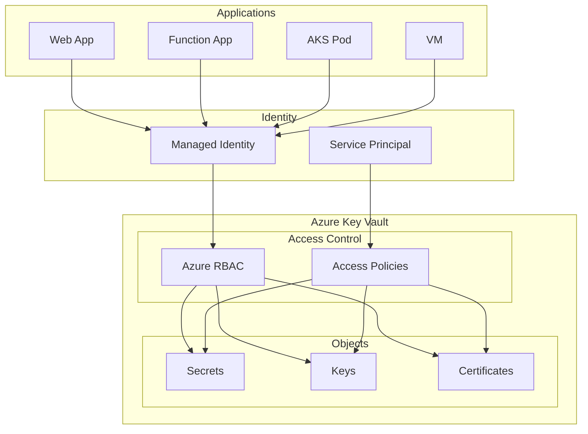

# How to Configure Azure Key Vault

Author: [nawazdhandala](https://www.github.com/nawazdhandala)

Tags: Azure, Key Vault, Secrets Management, Security, Certificates, DevOps

Description: A practical guide to configuring Azure Key Vault for secrets management, including access policies, managed identities, and integration with applications.

---

Azure Key Vault is the central place to store secrets, keys, and certificates in Azure. Proper configuration is critical for security. This guide covers practical setup scenarios from basic secret storage to advanced patterns with managed identities and private endpoints.

## Key Vault Architecture

Key Vault stores three types of objects: secrets (strings), keys (cryptographic), and certificates (SSL/TLS). Access is controlled through RBAC or access policies.



## Creating Key Vault

### Basic Setup with Azure CLI

```bash
# Create resource group
az group create --name rg-security --location eastus

# Create Key Vault with RBAC authorization (recommended)
az keyvault create \
  --name kv-myapp-prod \
  --resource-group rg-security \
  --location eastus \
  --enable-rbac-authorization true \
  --enable-purge-protection true \
  --retention-days 90 \
  --sku standard

# Create Key Vault with access policies (legacy)
az keyvault create \
  --name kv-myapp-legacy \
  --resource-group rg-security \
  --location eastus \
  --enable-rbac-authorization false \
  --enable-soft-delete true
```

### Enable Diagnostic Logging

```bash
# Create Log Analytics workspace
az monitor log-analytics workspace create \
  --workspace-name law-security \
  --resource-group rg-security \
  --location eastus

# Enable diagnostics on Key Vault
az monitor diagnostic-settings create \
  --name diag-keyvault \
  --resource "/subscriptions/<sub-id>/resourceGroups/rg-security/providers/Microsoft.KeyVault/vaults/kv-myapp-prod" \
  --workspace "/subscriptions/<sub-id>/resourceGroups/rg-security/providers/Microsoft.OperationalInsights/workspaces/law-security" \
  --logs '[{"category":"AuditEvent","enabled":true}]' \
  --metrics '[{"category":"AllMetrics","enabled":true}]'
```

## Managing Secrets

### Add Secrets via CLI

```bash
# Add a simple secret
az keyvault secret set \
  --vault-name kv-myapp-prod \
  --name "DatabasePassword" \
  --value "SuperSecretPassword123!"

# Add secret with expiration
az keyvault secret set \
  --vault-name kv-myapp-prod \
  --name "ApiKey" \
  --value "sk-abc123xyz789" \
  --expires "2025-12-31T23:59:59Z"

# Add secret with tags
az keyvault secret set \
  --vault-name kv-myapp-prod \
  --name "StorageConnectionString" \
  --value "DefaultEndpointsProtocol=https;AccountName=..." \
  --tags environment=production owner=team-backend

# Add secret from file
az keyvault secret set \
  --vault-name kv-myapp-prod \
  --name "ServiceAccountKey" \
  --file ./service-account.json \
  --encoding utf-8
```

### List and Retrieve Secrets

```bash
# List all secrets (names only)
az keyvault secret list \
  --vault-name kv-myapp-prod \
  --query "[].{Name:name, Enabled:attributes.enabled}" \
  --output table

# Get specific secret value
az keyvault secret show \
  --vault-name kv-myapp-prod \
  --name "DatabasePassword" \
  --query value -o tsv

# Get secret versions
az keyvault secret list-versions \
  --vault-name kv-myapp-prod \
  --name "DatabasePassword" \
  --query "[].{Version:id, Created:attributes.created, Enabled:attributes.enabled}"
```

## Configuring Access with RBAC

### Grant Access to Managed Identity

```bash
# Get the managed identity principal ID
IDENTITY_ID=$(az webapp identity show \
  --name mywebapp \
  --resource-group rg-myapp \
  --query principalId -o tsv)

# Grant "Key Vault Secrets User" role (read secrets)
az role assignment create \
  --role "Key Vault Secrets User" \
  --assignee $IDENTITY_ID \
  --scope "/subscriptions/<sub-id>/resourceGroups/rg-security/providers/Microsoft.KeyVault/vaults/kv-myapp-prod"

# For full secret management (read/write/delete)
az role assignment create \
  --role "Key Vault Secrets Officer" \
  --assignee $IDENTITY_ID \
  --scope "/subscriptions/<sub-id>/resourceGroups/rg-security/providers/Microsoft.KeyVault/vaults/kv-myapp-prod"

# For keys
az role assignment create \
  --role "Key Vault Crypto User" \
  --assignee $IDENTITY_ID \
  --scope "/subscriptions/<sub-id>/resourceGroups/rg-security/providers/Microsoft.KeyVault/vaults/kv-myapp-prod"

# For certificates
az role assignment create \
  --role "Key Vault Certificates Officer" \
  --assignee $IDENTITY_ID \
  --scope "/subscriptions/<sub-id>/resourceGroups/rg-security/providers/Microsoft.KeyVault/vaults/kv-myapp-prod"
```

### Available RBAC Roles

| Role | Secrets | Keys | Certificates |
|------|---------|------|--------------|
| Key Vault Administrator | Full | Full | Full |
| Key Vault Secrets Officer | Full | None | None |
| Key Vault Secrets User | Read | None | None |
| Key Vault Crypto Officer | None | Full | None |
| Key Vault Crypto User | None | Use | None |
| Key Vault Certificates Officer | None | None | Full |

## Access Policies (Legacy Method)

If using access policies instead of RBAC:

```bash
# Grant access to managed identity
az keyvault set-policy \
  --name kv-myapp-legacy \
  --object-id $IDENTITY_ID \
  --secret-permissions get list \
  --key-permissions get unwrapKey wrapKey \
  --certificate-permissions get list

# Grant access to user
az keyvault set-policy \
  --name kv-myapp-legacy \
  --upn "developer@company.com" \
  --secret-permissions get list set delete \
  --key-permissions get list create delete

# Grant access to service principal
az keyvault set-policy \
  --name kv-myapp-legacy \
  --spn "http://my-service-principal" \
  --secret-permissions get list
```

## Accessing Secrets from Applications

### Python with Managed Identity

```python
from azure.identity import DefaultAzureCredential
from azure.keyvault.secrets import SecretClient

def get_secrets():
    """Retrieve secrets using managed identity."""
    vault_url = "https://kv-myapp-prod.vault.azure.net/"

    # DefaultAzureCredential works with:
    # - Managed Identity (in Azure)
    # - Azure CLI credentials (locally)
    # - Environment variables
    credential = DefaultAzureCredential()
    client = SecretClient(vault_url=vault_url, credential=credential)

    # Get a secret
    db_password = client.get_secret("DatabasePassword")
    print(f"Secret value: {db_password.value}")
    print(f"Secret version: {db_password.properties.version}")
    print(f"Expires: {db_password.properties.expires_on}")

    return db_password.value


def list_secrets():
    """List all secrets in the vault."""
    vault_url = "https://kv-myapp-prod.vault.azure.net/"
    credential = DefaultAzureCredential()
    client = SecretClient(vault_url=vault_url, credential=credential)

    secrets = client.list_properties_of_secrets()
    for secret in secrets:
        print(f"Secret: {secret.name}, Enabled: {secret.enabled}")
```

### .NET Core with Managed Identity

```csharp
// Program.cs
using Azure.Identity;
using Azure.Security.KeyVault.Secrets;

var builder = WebApplication.CreateBuilder(args);

// Add Key Vault configuration
var vaultUri = new Uri("https://kv-myapp-prod.vault.azure.net/");
builder.Configuration.AddAzureKeyVault(vaultUri, new DefaultAzureCredential());

// Or access secrets directly
var client = new SecretClient(vaultUri, new DefaultAzureCredential());
KeyVaultSecret secret = await client.GetSecretAsync("DatabasePassword");
string dbPassword = secret.Value;
```

### Node.js with Managed Identity

```javascript
const { DefaultAzureCredential } = require("@azure/identity");
const { SecretClient } = require("@azure/keyvault-secrets");

async function getSecrets() {
    const vaultUrl = "https://kv-myapp-prod.vault.azure.net/";
    const credential = new DefaultAzureCredential();
    const client = new SecretClient(vaultUrl, credential);

    // Get secret
    const dbPassword = await client.getSecret("DatabasePassword");
    console.log(`Secret value: ${dbPassword.value}`);

    // List secrets
    for await (const secretProperties of client.listPropertiesOfSecrets()) {
        console.log(`Secret: ${secretProperties.name}`);
    }
}

getSecrets().catch(console.error);
```

## App Service Integration

### Reference Secrets in App Settings

```bash
# Enable managed identity on App Service
az webapp identity assign \
  --name mywebapp \
  --resource-group rg-myapp

# Reference Key Vault secret in app settings
az webapp config appsettings set \
  --name mywebapp \
  --resource-group rg-myapp \
  --settings "DB_PASSWORD=@Microsoft.KeyVault(VaultName=kv-myapp-prod;SecretName=DatabasePassword)"

# Reference specific version
az webapp config appsettings set \
  --name mywebapp \
  --resource-group rg-myapp \
  --settings "API_KEY=@Microsoft.KeyVault(VaultName=kv-myapp-prod;SecretName=ApiKey;SecretVersion=abc123)"
```

## Network Security

### Configure Private Endpoint

```bash
# Create virtual network
az network vnet create \
  --name vnet-security \
  --resource-group rg-security \
  --location eastus \
  --address-prefix 10.0.0.0/16

# Create subnet for private endpoints
az network vnet subnet create \
  --name subnet-privateendpoints \
  --vnet-name vnet-security \
  --resource-group rg-security \
  --address-prefix 10.0.1.0/24 \
  --disable-private-endpoint-network-policies true

# Create private endpoint for Key Vault
az network private-endpoint create \
  --name pe-keyvault \
  --resource-group rg-security \
  --vnet-name vnet-security \
  --subnet subnet-privateendpoints \
  --private-connection-resource-id "/subscriptions/<sub-id>/resourceGroups/rg-security/providers/Microsoft.KeyVault/vaults/kv-myapp-prod" \
  --group-id vault \
  --connection-name connection-keyvault

# Create private DNS zone
az network private-dns zone create \
  --name privatelink.vaultcore.azure.net \
  --resource-group rg-security

# Link DNS zone to VNet
az network private-dns link vnet create \
  --name link-keyvault \
  --resource-group rg-security \
  --zone-name privatelink.vaultcore.azure.net \
  --virtual-network vnet-security \
  --registration-enabled false

# Create DNS record
az network private-endpoint dns-zone-group create \
  --name dnsgroup-keyvault \
  --endpoint-name pe-keyvault \
  --resource-group rg-security \
  --private-dns-zone privatelink.vaultcore.azure.net \
  --zone-name vault
```

### Disable Public Access

```bash
# Disable public network access
az keyvault update \
  --name kv-myapp-prod \
  --resource-group rg-security \
  --public-network-access Disabled

# Or allow specific IPs only
az keyvault network-rule add \
  --name kv-myapp-prod \
  --resource-group rg-security \
  --ip-address "203.0.113.0/24"

# Allow specific VNet subnet
az keyvault network-rule add \
  --name kv-myapp-prod \
  --resource-group rg-security \
  --vnet-name vnet-security \
  --subnet subnet-apps
```

## Secret Rotation

### Manual Rotation

```bash
# Create new version of secret
az keyvault secret set \
  --vault-name kv-myapp-prod \
  --name "DatabasePassword" \
  --value "NewSuperSecretPassword456!"

# Old version is preserved, new version becomes current
# Applications using latest version automatically get new value
```

### Event Grid Integration for Rotation Alerts

```bash
# Create Event Grid subscription for expiring secrets
az eventgrid event-subscription create \
  --name sub-secret-expiring \
  --source-resource-id "/subscriptions/<sub-id>/resourceGroups/rg-security/providers/Microsoft.KeyVault/vaults/kv-myapp-prod" \
  --endpoint "https://myfunction.azurewebsites.net/api/HandleSecretExpiring" \
  --included-event-types Microsoft.KeyVault.SecretNearExpiry
```

## Best Practices

**Use RBAC**: Prefer RBAC over access policies. It provides finer-grained control and integrates with Azure AD.

**Enable Soft Delete**: Always enable soft delete and purge protection. Accidental deletions can be recovered.

**Use Managed Identities**: Avoid storing Key Vault credentials in code. Let Azure handle authentication.

**Set Expiration Dates**: All secrets should have expiration dates. Set up alerts for upcoming expirations.

**Audit Access**: Enable diagnostic logging and regularly review who accessed what secrets.

**Separate Vaults**: Use separate Key Vaults for different environments (dev, staging, prod) and different applications.

---

Azure Key Vault provides a secure, centralized place for secrets. Start with RBAC authorization, use managed identities for access, and enable private endpoints for production workloads. The key is treating Key Vault as the single source of truth for all secrets in your infrastructure.
