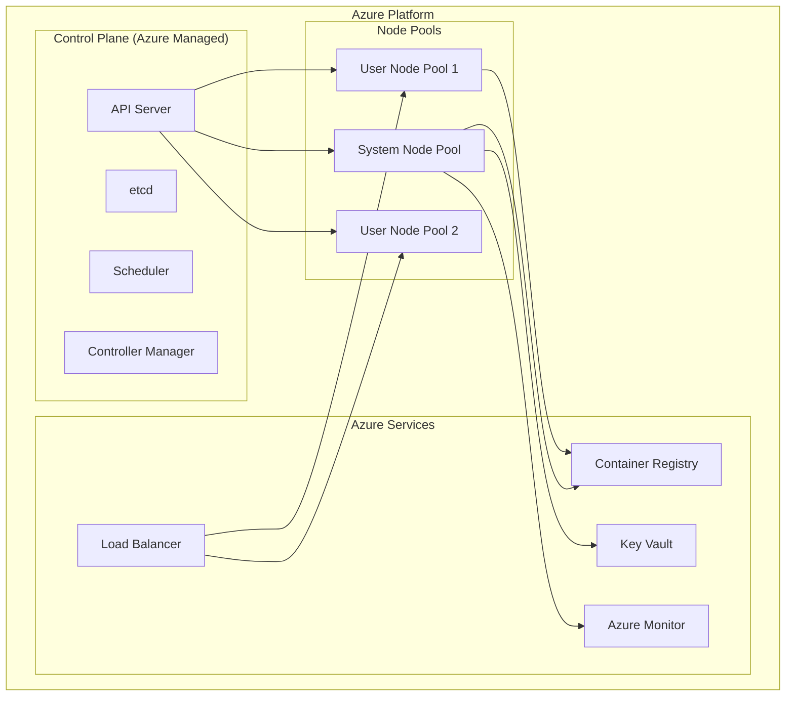

# How to Handle Azure Kubernetes Service (AKS)

Author: [nawazdhandala](https://www.github.com/nawazdhandala)

Tags: Azure, Kubernetes, AKS, Cloud, DevOps, Containers, Orchestration

Description: A comprehensive guide to managing Azure Kubernetes Service clusters, from deployment and scaling to monitoring and troubleshooting.

---

Azure Kubernetes Service (AKS) simplifies deploying and managing containerized applications on Azure. However, running production workloads requires understanding cluster management, scaling strategies, and troubleshooting techniques. This guide covers practical approaches to handling AKS effectively.

## Understanding AKS Architecture

Before diving into operations, let's understand how AKS components work together.



## Creating an AKS Cluster

### Using Azure CLI

```bash
# Set variables
RESOURCE_GROUP="myapp-rg"
CLUSTER_NAME="myapp-aks"
LOCATION="eastus"

# Create resource group
az group create \
    --name $RESOURCE_GROUP \
    --location $LOCATION

# Create AKS cluster with best practices
az aks create \
    --resource-group $RESOURCE_GROUP \
    --name $CLUSTER_NAME \
    --node-count 3 \
    --node-vm-size Standard_D4s_v3 \
    --enable-managed-identity \
    --enable-cluster-autoscaler \
    --min-count 2 \
    --max-count 10 \
    --network-plugin azure \
    --network-policy azure \
    --enable-addons monitoring \
    --generate-ssh-keys \
    --zones 1 2 3

# Get credentials for kubectl
az aks get-credentials \
    --resource-group $RESOURCE_GROUP \
    --name $CLUSTER_NAME
```

### Using Terraform

```hcl
# main.tf - AKS cluster with node pools
resource "azurerm_kubernetes_cluster" "aks" {
  name                = "myapp-aks"
  location            = azurerm_resource_group.rg.location
  resource_group_name = azurerm_resource_group.rg.name
  dns_prefix          = "myapp"
  kubernetes_version  = "1.28"

  # System node pool for critical components
  default_node_pool {
    name                = "system"
    node_count          = 3
    vm_size             = "Standard_D4s_v3"
    zones               = ["1", "2", "3"]
    enable_auto_scaling = true
    min_count           = 2
    max_count           = 5

    # Taint system pool to prevent workload scheduling
    only_critical_addons_enabled = true
  }

  identity {
    type = "SystemAssigned"
  }

  network_profile {
    network_plugin    = "azure"
    network_policy    = "azure"
    load_balancer_sku = "standard"
  }

  oms_agent {
    log_analytics_workspace_id = azurerm_log_analytics_workspace.law.id
  }
}

# User node pool for application workloads
resource "azurerm_kubernetes_cluster_node_pool" "user" {
  name                  = "user"
  kubernetes_cluster_id = azurerm_kubernetes_cluster.aks.id
  vm_size               = "Standard_D8s_v3"
  node_count            = 3
  zones                 = ["1", "2", "3"]
  enable_auto_scaling   = true
  min_count             = 2
  max_count             = 20

  node_labels = {
    "workload" = "user-apps"
  }
}
```

## Managing Node Pools

Node pools let you run different workloads on different VM types.

### Add a GPU Node Pool

```bash
# Add GPU node pool for ML workloads
az aks nodepool add \
    --resource-group $RESOURCE_GROUP \
    --cluster-name $CLUSTER_NAME \
    --name gpupool \
    --node-count 2 \
    --node-vm-size Standard_NC6s_v3 \
    --node-taints sku=gpu:NoSchedule \
    --labels workload=ml-training
```

### Scale Node Pools

```bash
# Manual scaling
az aks nodepool scale \
    --resource-group $RESOURCE_GROUP \
    --cluster-name $CLUSTER_NAME \
    --name user \
    --node-count 5

# Update autoscaler settings
az aks nodepool update \
    --resource-group $RESOURCE_GROUP \
    --cluster-name $CLUSTER_NAME \
    --name user \
    --enable-cluster-autoscaler \
    --min-count 3 \
    --max-count 15
```

### Use Spot Instances for Cost Savings

```bash
# Add spot instance node pool (up to 90% cost savings)
az aks nodepool add \
    --resource-group $RESOURCE_GROUP \
    --cluster-name $CLUSTER_NAME \
    --name spotpool \
    --priority Spot \
    --eviction-policy Delete \
    --spot-max-price -1 \
    --node-count 3 \
    --enable-cluster-autoscaler \
    --min-count 0 \
    --max-count 10 \
    --node-taints kubernetes.azure.com/scalesetpriority=spot:NoSchedule
```

## Connecting to Azure Container Registry

```bash
# Create ACR
az acr create \
    --resource-group $RESOURCE_GROUP \
    --name myappacr \
    --sku Standard

# Attach ACR to AKS (grants pull permissions)
az aks update \
    --resource-group $RESOURCE_GROUP \
    --name $CLUSTER_NAME \
    --attach-acr myappacr
```

## Configuring Ingress

### Install NGINX Ingress Controller

```bash
# Add ingress-nginx helm repo
helm repo add ingress-nginx https://kubernetes.github.io/ingress-nginx
helm repo update

# Install with Azure Load Balancer
helm install ingress-nginx ingress-nginx/ingress-nginx \
    --namespace ingress-nginx \
    --create-namespace \
    --set controller.service.annotations."service\.beta\.kubernetes\.io/azure-load-balancer-health-probe-request-path"=/healthz \
    --set controller.service.externalTrafficPolicy=Local
```

### Sample Ingress Resource

```yaml
apiVersion: networking.k8s.io/v1
kind: Ingress
metadata:
  name: myapp-ingress
  annotations:
    nginx.ingress.kubernetes.io/ssl-redirect: "true"
    nginx.ingress.kubernetes.io/proxy-body-size: "50m"
spec:
  ingressClassName: nginx
  tls:
    - hosts:
        - myapp.example.com
      secretName: myapp-tls
  rules:
    - host: myapp.example.com
      http:
        paths:
          - path: /api
            pathType: Prefix
            backend:
              service:
                name: api-service
                port:
                  number: 80
          - path: /
            pathType: Prefix
            backend:
              service:
                name: frontend-service
                port:
                  number: 80
```

## Monitoring and Logging

### Enable Container Insights

```bash
# Enable monitoring addon if not already enabled
az aks enable-addons \
    --resource-group $RESOURCE_GROUP \
    --name $CLUSTER_NAME \
    --addons monitoring \
    --workspace-resource-id /subscriptions/<sub-id>/resourcegroups/<rg>/providers/microsoft.operationalinsights/workspaces/<workspace>
```

### Query Logs with KQL

```kusto
// Find pods with high restart counts
KubePodInventory
| where TimeGenerated > ago(1h)
| where RestartCount > 5
| project TimeGenerated, Namespace, Name, RestartCount, ContainerStatus
| order by RestartCount desc

// CPU usage by node
Perf
| where ObjectName == "K8SNode"
| where CounterName == "cpuUsageNanoCores"
| summarize AvgCPU = avg(CounterValue) by Computer, bin(TimeGenerated, 5m)
| render timechart

// Memory pressure alerts
KubeNodeInventory
| where TimeGenerated > ago(1h)
| where Status contains "MemoryPressure"
| project TimeGenerated, Computer, Status
```

## Common Troubleshooting

### Cluster Connectivity Issues

```bash
# Check cluster health
az aks show \
    --resource-group $RESOURCE_GROUP \
    --name $CLUSTER_NAME \
    --query "powerState"

# Verify API server connectivity
kubectl cluster-info

# Check node status
kubectl get nodes -o wide
kubectl describe node <node-name>

# View system pod status
kubectl get pods -n kube-system
```

### Pod Scheduling Failures

```bash
# Check pending pods
kubectl get pods --all-namespaces --field-selector=status.phase=Pending

# Describe pod for scheduling issues
kubectl describe pod <pod-name> -n <namespace>

# Check resource availability
kubectl describe nodes | grep -A 5 "Allocated resources"

# View cluster autoscaler status
kubectl get configmap cluster-autoscaler-status -n kube-system -o yaml
```

### Network Troubleshooting

```bash
# Test DNS resolution
kubectl run test-dns --image=busybox:1.28 --rm -it --restart=Never -- nslookup kubernetes.default

# Test service connectivity
kubectl run test-curl --image=curlimages/curl --rm -it --restart=Never -- curl -v http://my-service.default.svc.cluster.local

# Check network policies
kubectl get networkpolicies --all-namespaces
```

## Upgrading AKS

```bash
# Check available upgrades
az aks get-upgrades \
    --resource-group $RESOURCE_GROUP \
    --name $CLUSTER_NAME \
    --output table

# Upgrade control plane first
az aks upgrade \
    --resource-group $RESOURCE_GROUP \
    --name $CLUSTER_NAME \
    --kubernetes-version 1.29.0 \
    --control-plane-only

# Upgrade node pools individually
az aks nodepool upgrade \
    --resource-group $RESOURCE_GROUP \
    --cluster-name $CLUSTER_NAME \
    --name user \
    --kubernetes-version 1.29.0
```

## Best Practices Checklist

- Use multiple availability zones for high availability
- Enable cluster autoscaler with appropriate min/max limits
- Separate system and user workloads into different node pools
- Use managed identities instead of service principals
- Enable Azure Policy for Kubernetes for compliance
- Configure pod disruption budgets for critical workloads
- Use Azure Key Vault for secrets management
- Set resource requests and limits on all pods
- Enable network policies for pod-to-pod traffic control
- Regularly upgrade Kubernetes versions (stay within N-2)

---

AKS provides a powerful platform for running containerized workloads, but success depends on proper configuration and ongoing management. Start with the fundamentals, implement monitoring early, and build automation for common operations. Your future self will appreciate the investment in solid cluster foundations.
