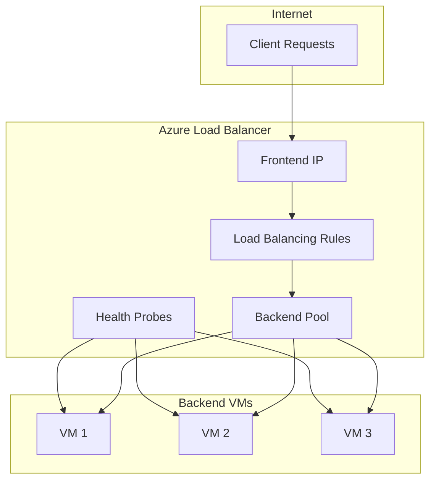
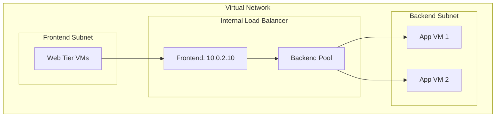

# How to Configure Azure Load Balancer

Author: [nawazdhandala](https://www.github.com/nawazdhandala)

Tags: Azure, Load Balancer, Networking, High Availability, Cloud, DevOps, Infrastructure

Description: Learn how to configure Azure Load Balancer for high availability including health probes, load balancing rules, and backend pool management.

---

Azure Load Balancer distributes incoming traffic across multiple backend instances to ensure high availability and scalability. Whether you are running web applications, APIs, or internal services, proper load balancer configuration is essential for production workloads. This guide covers both public and internal load balancers with practical configuration examples.

## Understanding Azure Load Balancer Components

Azure Load Balancer consists of several interconnected components that work together to distribute traffic.



Key components:
- **Frontend IP**: The IP address that receives incoming traffic
- **Backend Pool**: Collection of VMs or instances that handle requests
- **Health Probes**: Monitor backend instance health
- **Load Balancing Rules**: Define how traffic is distributed

## Creating a Public Load Balancer

A public load balancer distributes internet traffic across your backend VMs.

```bash
# Create a resource group
az group create \
  --name myLBResourceGroup \
  --location eastus

# Create a public IP address for the load balancer frontend
# Standard SKU is required for zone-redundant high availability
az network public-ip create \
  --resource-group myLBResourceGroup \
  --name myPublicIP \
  --sku Standard \
  --zone 1 2 3 \
  --allocation-method Static

# Create the load balancer with frontend IP configuration
az network lb create \
  --resource-group myLBResourceGroup \
  --name myLoadBalancer \
  --sku Standard \
  --public-ip-address myPublicIP \
  --frontend-ip-name myFrontEnd \
  --backend-pool-name myBackEndPool
```

## Configuring Health Probes

Health probes continuously check backend instance health. Unhealthy instances are automatically removed from rotation.

### HTTP Health Probe

```bash
# Create an HTTP health probe
# The probe checks /health endpoint every 15 seconds
# An instance is marked unhealthy after 2 consecutive failures
az network lb probe create \
  --resource-group myLBResourceGroup \
  --lb-name myLoadBalancer \
  --name myHealthProbe \
  --protocol Http \
  --port 80 \
  --path /health \
  --interval 15 \
  --threshold 2
```

### TCP Health Probe

For non-HTTP services, use TCP probes that check if a port is accepting connections.

```bash
# Create a TCP health probe for database or custom services
az network lb probe create \
  --resource-group myLBResourceGroup \
  --lb-name myLoadBalancer \
  --name myTcpProbe \
  --protocol Tcp \
  --port 3306 \
  --interval 10 \
  --threshold 3
```

### HTTPS Health Probe

```bash
# Create an HTTPS health probe for secure endpoints
az network lb probe create \
  --resource-group myLBResourceGroup \
  --lb-name myLoadBalancer \
  --name myHttpsProbe \
  --protocol Https \
  --port 443 \
  --path /api/health \
  --interval 15 \
  --threshold 2
```

## Creating Load Balancing Rules

Load balancing rules define how traffic flows from the frontend to the backend pool.

```bash
# Create a load balancing rule for HTTP traffic
# This rule distributes port 80 traffic using the health probe
az network lb rule create \
  --resource-group myLBResourceGroup \
  --lb-name myLoadBalancer \
  --name myHTTPRule \
  --protocol Tcp \
  --frontend-port 80 \
  --backend-port 80 \
  --frontend-ip-name myFrontEnd \
  --backend-pool-name myBackEndPool \
  --probe-name myHealthProbe \
  --idle-timeout 15 \
  --enable-tcp-reset true

# Create a load balancing rule for HTTPS traffic
az network lb rule create \
  --resource-group myLBResourceGroup \
  --lb-name myLoadBalancer \
  --name myHTTPSRule \
  --protocol Tcp \
  --frontend-port 443 \
  --backend-port 443 \
  --frontend-ip-name myFrontEnd \
  --backend-pool-name myBackEndPool \
  --probe-name myHttpsProbe \
  --idle-timeout 15 \
  --enable-tcp-reset true
```

### Session Persistence

For applications that require sticky sessions, configure session persistence.

```bash
# Create rule with client IP affinity (sticky sessions)
# All requests from the same client IP go to the same backend
az network lb rule create \
  --resource-group myLBResourceGroup \
  --lb-name myLoadBalancer \
  --name myStickyRule \
  --protocol Tcp \
  --frontend-port 8080 \
  --backend-port 8080 \
  --frontend-ip-name myFrontEnd \
  --backend-pool-name myBackEndPool \
  --probe-name myHealthProbe \
  --load-distribution SourceIP
```

Session persistence options:
- **Default**: Five-tuple hash (source IP, source port, dest IP, dest port, protocol)
- **SourceIP**: Two-tuple hash (source IP, dest IP)
- **SourceIPProtocol**: Three-tuple hash (source IP, dest IP, protocol)

## Adding Backend Pool Members

Backend pool members can be VMs, VM scale sets, or IP addresses.

```bash
# Create a virtual network and subnet for backend VMs
az network vnet create \
  --resource-group myLBResourceGroup \
  --name myVNet \
  --address-prefix 10.0.0.0/16 \
  --subnet-name mySubnet \
  --subnet-prefix 10.0.1.0/24

# Create network interfaces for backend VMs
# Each NIC is associated with the load balancer backend pool
for i in 1 2 3; do
  az network nic create \
    --resource-group myLBResourceGroup \
    --name myNic$i \
    --vnet-name myVNet \
    --subnet mySubnet \
    --lb-name myLoadBalancer \
    --lb-address-pools myBackEndPool
done

# Create backend VMs
for i in 1 2 3; do
  az vm create \
    --resource-group myLBResourceGroup \
    --name myVM$i \
    --nics myNic$i \
    --image Ubuntu2204 \
    --admin-username azureuser \
    --generate-ssh-keys \
    --zone $i \
    --no-wait
done
```

## Configuring Inbound NAT Rules

NAT rules allow direct access to specific backend instances, useful for management or debugging.

```bash
# Create NAT rule to access VM1 on SSH via port 50001
az network lb inbound-nat-rule create \
  --resource-group myLBResourceGroup \
  --lb-name myLoadBalancer \
  --name myNatRuleSSH1 \
  --protocol Tcp \
  --frontend-port 50001 \
  --backend-port 22 \
  --frontend-ip-name myFrontEnd

# Create NAT rule to access VM2 on SSH via port 50002
az network lb inbound-nat-rule create \
  --resource-group myLBResourceGroup \
  --lb-name myLoadBalancer \
  --name myNatRuleSSH2 \
  --protocol Tcp \
  --frontend-port 50002 \
  --backend-port 22 \
  --frontend-ip-name myFrontEnd

# Associate NAT rules with specific NICs
az network nic ip-config inbound-nat-rule add \
  --resource-group myLBResourceGroup \
  --nic-name myNic1 \
  --ip-config-name ipconfig1 \
  --lb-name myLoadBalancer \
  --inbound-nat-rule myNatRuleSSH1
```

## Creating an Internal Load Balancer

Internal load balancers distribute traffic within a virtual network, perfect for multi-tier applications.



```bash
# Create subnet for internal load balancer
az network vnet subnet create \
  --resource-group myLBResourceGroup \
  --vnet-name myVNet \
  --name myBackendSubnet \
  --address-prefix 10.0.2.0/24

# Create internal load balancer with private frontend IP
az network lb create \
  --resource-group myLBResourceGroup \
  --name myInternalLB \
  --sku Standard \
  --vnet-name myVNet \
  --subnet myBackendSubnet \
  --frontend-ip-name myInternalFrontEnd \
  --private-ip-address 10.0.2.10 \
  --backend-pool-name myInternalBackEndPool

# Create health probe for internal services
az network lb probe create \
  --resource-group myLBResourceGroup \
  --lb-name myInternalLB \
  --name myInternalProbe \
  --protocol Tcp \
  --port 5000 \
  --interval 10 \
  --threshold 2

# Create load balancing rule for internal traffic
az network lb rule create \
  --resource-group myLBResourceGroup \
  --lb-name myInternalLB \
  --name myInternalRule \
  --protocol Tcp \
  --frontend-port 5000 \
  --backend-port 5000 \
  --frontend-ip-name myInternalFrontEnd \
  --backend-pool-name myInternalBackEndPool \
  --probe-name myInternalProbe
```

## Outbound Rules Configuration

Standard Load Balancer requires explicit outbound rules for backend instances to access the internet.

```bash
# Create a public IP for outbound traffic
az network public-ip create \
  --resource-group myLBResourceGroup \
  --name myOutboundIP \
  --sku Standard \
  --allocation-method Static

# Add outbound frontend IP configuration
az network lb frontend-ip create \
  --resource-group myLBResourceGroup \
  --lb-name myLoadBalancer \
  --name myOutboundFrontEnd \
  --public-ip-address myOutboundIP

# Create outbound rule
# This allows backend VMs to initiate outbound connections
az network lb outbound-rule create \
  --resource-group myLBResourceGroup \
  --lb-name myLoadBalancer \
  --name myOutboundRule \
  --frontend-ip-configs myOutboundFrontEnd \
  --address-pool myBackEndPool \
  --protocol All \
  --idle-timeout 15 \
  --outbound-ports 10000
```

## Monitoring and Diagnostics

Enable monitoring to track load balancer health and performance.

```bash
# Enable diagnostic logging
az monitor diagnostic-settings create \
  --name myLBDiagnostics \
  --resource /subscriptions/{sub-id}/resourceGroups/myLBResourceGroup/providers/Microsoft.Network/loadBalancers/myLoadBalancer \
  --logs '[{"category": "LoadBalancerAlertEvent", "enabled": true}, {"category": "LoadBalancerProbeHealthStatus", "enabled": true}]' \
  --metrics '[{"category": "AllMetrics", "enabled": true}]' \
  --workspace myLogAnalyticsWorkspace

# Query health probe status
az monitor metrics list \
  --resource /subscriptions/{sub-id}/resourceGroups/myLBResourceGroup/providers/Microsoft.Network/loadBalancers/myLoadBalancer \
  --metric "HealthProbeStatus" \
  --interval PT1M
```

### Key Metrics to Monitor

| Metric | Description | Alert Threshold |
|--------|-------------|-----------------|
| HealthProbeStatus | Percentage of healthy probes | < 100% |
| ByteCount | Total bytes processed | Baseline + 50% |
| PacketCount | Total packets processed | Baseline + 50% |
| SYNCount | SYN packets (new connections) | Baseline + 100% |
| UsedSNATPorts | SNAT ports in use | > 80% of allocated |

## High Availability Configuration

For production workloads, configure zone-redundant load balancing.

```bash
# Create zone-redundant public IP
az network public-ip create \
  --resource-group myLBResourceGroup \
  --name myZoneRedundantIP \
  --sku Standard \
  --zone 1 2 3

# Create zone-redundant load balancer
az network lb create \
  --resource-group myLBResourceGroup \
  --name myZoneRedundantLB \
  --sku Standard \
  --public-ip-address myZoneRedundantIP \
  --frontend-ip-name myFrontEnd \
  --backend-pool-name myBackEndPool

# Deploy VMs across availability zones
for zone in 1 2 3; do
  az vm create \
    --resource-group myLBResourceGroup \
    --name myZoneVM$zone \
    --image Ubuntu2204 \
    --zone $zone \
    --vnet-name myVNet \
    --subnet mySubnet \
    --admin-username azureuser \
    --generate-ssh-keys \
    --no-wait
done
```

## Best Practices

1. **Use Standard SKU** for production workloads - it provides zone redundancy, better SLA, and more features.

2. **Configure appropriate health probe intervals** - Too frequent probes waste resources, too infrequent delays failure detection.

3. **Enable TCP reset on idle** - This helps applications detect and recover from dropped connections.

4. **Plan SNAT ports carefully** - Each backend instance gets a limited number of SNAT ports for outbound connections.

5. **Use multiple frontend IPs** - Separate inbound and outbound traffic for better control and monitoring.

```bash
# View current SNAT port allocation
az network lb show \
  --resource-group myLBResourceGroup \
  --name myLoadBalancer \
  --query "outboundRules[].allocatedOutboundPorts"
```

6. **Implement proper health endpoints** - Health probes should check application health, not just port availability.

```python
# Example health endpoint that checks dependencies
from flask import Flask, jsonify
import psycopg2

app = Flask(__name__)

@app.route('/health')
def health():
    try:
        # Check database connectivity
        conn = psycopg2.connect(DATABASE_URL)
        conn.close()
        return jsonify({"status": "healthy"}), 200
    except Exception as e:
        return jsonify({"status": "unhealthy", "error": str(e)}), 503
```

## Summary

Azure Load Balancer provides robust traffic distribution for both public-facing and internal applications. By properly configuring health probes, load balancing rules, and backend pools, you can achieve high availability and scalability for your workloads. Remember to use Standard SKU for production, implement zone-redundant configurations, and monitor key metrics to ensure optimal performance. With proper outbound rules and SNAT port management, your backend instances can reliably communicate with external services while handling incoming traffic efficiently.
