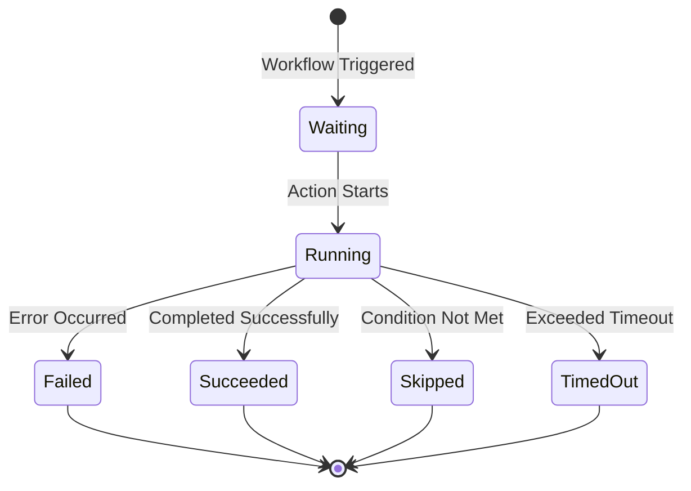
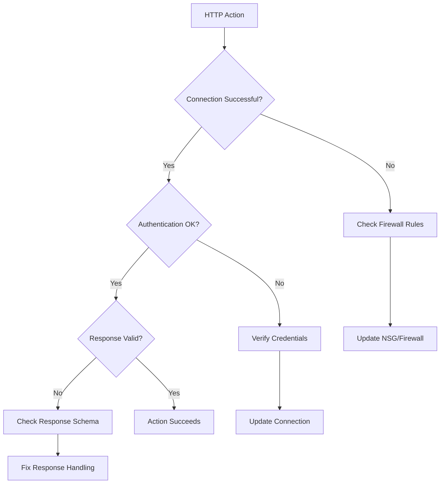
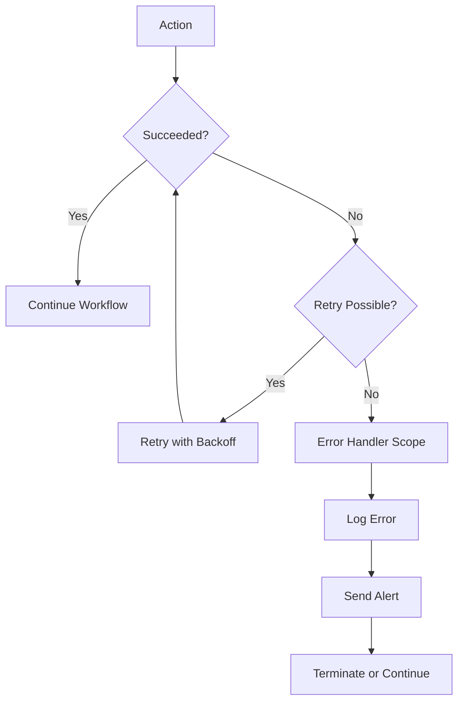

# How to Fix 'Logic App' Workflow Errors

Author: [nawazdhandala](https://www.github.com/nawazdhandala)

Tags: Azure, Logic Apps, Workflows, Automation, Integration, Troubleshooting, Cloud

Description: Learn how to diagnose and fix common Azure Logic App workflow errors including trigger failures, action errors, and expression issues.

---

Azure Logic Apps provides a powerful platform for building automated workflows that integrate with hundreds of services. However, workflow errors can disrupt your business processes. This guide covers the most common Logic App errors and provides practical solutions to get your workflows running smoothly.

## Understanding Logic App Error Structure

Logic App errors follow a predictable structure that makes debugging systematic. Each action in a workflow can be in one of these states.



Every error includes:
- **Error Code**: A machine-readable identifier
- **Error Message**: Human-readable description
- **Tracking ID**: Unique identifier for support requests

## Viewing Workflow Run History

The first step in debugging is examining the run history to identify exactly where the failure occurred.

```bash
# List recent workflow runs
# This shows trigger status and overall run result
az logic workflow run list \
  --resource-group myResourceGroup \
  --workflow-name myLogicApp \
  --query "[].{name:name, status:status, startTime:startTime}" \
  --output table

# Get details for a specific run
# Replace RUN_NAME with the actual run identifier
az logic workflow run show \
  --resource-group myResourceGroup \
  --workflow-name myLogicApp \
  --name RUN_NAME

# List actions within a failed run
# This helps identify which specific action failed
az logic workflow run action list \
  --resource-group myResourceGroup \
  --workflow-name myLogicApp \
  --run-name RUN_NAME \
  --query "[].{name:name, status:status}" \
  --output table
```

## Error 1: Trigger Failures

Triggers are the starting point of every workflow. When triggers fail, no workflow runs are created.

### HTTP Trigger Authentication Errors

```json
{
  "error": {
    "code": "AuthorizationFailed",
    "message": "The client does not have authorization to perform action"
  }
}
```

**Fix: Configure proper authentication for HTTP triggers**

```json
{
  "definition": {
    "$schema": "https://schema.management.azure.com/providers/Microsoft.Logic/schemas/2016-06-01/workflowdefinition.json#",
    "triggers": {
      "manual": {
        "type": "Request",
        "kind": "Http",
        "inputs": {
          "schema": {
            "type": "object",
            "properties": {
              "orderId": { "type": "string" },
              "amount": { "type": "number" }
            },
            "required": ["orderId"]
          }
        },
        "operationOptions": "EnableSchemaValidation"
      }
    }
  }
}
```

**Configure SAS authentication for HTTP triggers:**

```bash
# Get the callback URL with SAS token for HTTP trigger
# This URL includes the authentication token
az logic workflow show \
  --resource-group myResourceGroup \
  --workflow-name myLogicApp \
  --query "accessEndpoint" \
  --output tsv

# Generate a new SAS key if the current one is compromised
az logic workflow regenerate-access-key \
  --resource-group myResourceGroup \
  --workflow-name myLogicApp \
  --key-type Primary
```

### Recurrence Trigger Not Firing

Recurrence triggers that stop firing typically have configuration issues.

```json
{
  "triggers": {
    "Recurrence": {
      "type": "Recurrence",
      "recurrence": {
        "frequency": "Hour",
        "interval": 1,
        "startTime": "2024-01-01T00:00:00Z",
        "timeZone": "Eastern Standard Time"
      }
    }
  }
}
```

Common issues:
- **startTime in the past**: The trigger will fire immediately once then follow the schedule
- **Invalid timeZone**: Use exact timezone names from the Windows time zone database
- **Logic App disabled**: Check if the workflow is enabled

```bash
# Check if Logic App is enabled
az logic workflow show \
  --resource-group myResourceGroup \
  --workflow-name myLogicApp \
  --query "state" \
  --output tsv

# Enable a disabled Logic App
az logic workflow update \
  --resource-group myResourceGroup \
  --workflow-name myLogicApp \
  --state Enabled
```

## Error 2: HTTP Action Failures

HTTP actions fail due to connectivity issues, authentication problems, or invalid responses.

### Timeout Errors

```json
{
  "code": "GatewayTimeout",
  "message": "The gateway did not receive a response from the backend service within the timeout period"
}
```

**Fix: Increase timeout and implement retry policies**

```json
{
  "actions": {
    "HTTP_Call_External_API": {
      "type": "Http",
      "inputs": {
        "method": "POST",
        "uri": "https://api.example.com/process",
        "body": "@triggerBody()",
        "headers": {
          "Content-Type": "application/json"
        },
        "retryPolicy": {
          "type": "exponential",
          "count": 4,
          "interval": "PT20S",
          "minimumInterval": "PT10S",
          "maximumInterval": "PT1H"
        }
      },
      "limit": {
        "timeout": "PT3M"
      },
      "operationOptions": "DisableAsyncPattern"
    }
  }
}
```

### Connection Errors



**Fix: Configure managed identity for secure connections**

```json
{
  "actions": {
    "Call_Azure_Function": {
      "type": "Http",
      "inputs": {
        "method": "POST",
        "uri": "https://myfunctionapp.azurewebsites.net/api/ProcessOrder",
        "body": "@triggerBody()",
        "authentication": {
          "type": "ManagedServiceIdentity",
          "audience": "https://myfunctionapp.azurewebsites.net"
        }
      }
    }
  }
}
```

## Error 3: Expression and Function Errors

Logic Apps uses the Workflow Definition Language for expressions. Syntax errors here are common.

### Invalid Template Function

```json
{
  "code": "InvalidTemplate",
  "message": "Unable to process template language expressions in action 'Parse_JSON' inputs"
}
```

**Common expression mistakes and fixes:**

```json
{
  "actions": {
    "Set_Variable_Correct": {
      "type": "SetVariable",
      "inputs": {
        "name": "fullName",
        "value": "@{concat(triggerBody()?['firstName'], ' ', triggerBody()?['lastName'])}"
      }
    },
    "Conditional_Expression": {
      "type": "SetVariable",
      "inputs": {
        "name": "status",
        "value": "@{if(equals(triggerBody()?['amount'], 0), 'Zero', 'NonZero')}"
      }
    },
    "Safe_Property_Access": {
      "type": "SetVariable",
      "inputs": {
        "name": "optionalField",
        "value": "@{coalesce(triggerBody()?['optional']?['nested'], 'default')}"
      }
    }
  }
}
```

### Array and Object Access Errors

```json
{
  "actions": {
    "Process_Array_Item": {
      "type": "Compose",
      "inputs": {
        "firstItem": "@first(body('Get_Items'))",
        "lastItem": "@last(body('Get_Items'))",
        "itemCount": "@length(body('Get_Items'))",
        "specificItem": "@body('Get_Items')[0]",
        "safeAccess": "@body('Get_Items')?[0]?['name']"
      }
    }
  }
}
```

## Error 4: Connector Authentication Failures

Managed connectors require proper authentication configuration.

### OAuth Connection Expired

```json
{
  "code": "ConnectionAuthorizationFailed",
  "message": "The connection authorization was not successful"
}
```

**Fix: Reauthorize the connection**

```bash
# List all API connections for a Logic App
az resource list \
  --resource-group myResourceGroup \
  --resource-type Microsoft.Web/connections \
  --query "[].{name:name, status:properties.statuses[0].status}" \
  --output table

# Check connection status
az resource show \
  --resource-group myResourceGroup \
  --resource-type Microsoft.Web/connections \
  --name office365-connection \
  --query "properties.statuses" \
  --output json
```

To reauthorize, navigate to the Azure Portal:
1. Go to API Connections
2. Select the connection
3. Click "Edit API connection"
4. Click "Authorize" and complete OAuth flow

### Service Principal Connection

For automated deployments, use service principal authentication instead of user OAuth.

```json
{
  "$connections": {
    "value": {
      "azureblob": {
        "connectionId": "/subscriptions/{sub}/resourceGroups/{rg}/providers/Microsoft.Web/connections/azureblob",
        "connectionName": "azureblob",
        "connectionProperties": {
          "authentication": {
            "type": "ManagedServiceIdentity"
          }
        },
        "id": "/subscriptions/{sub}/providers/Microsoft.Web/locations/{location}/managedApis/azureblob"
      }
    }
  }
}
```

## Error 5: Loop and Control Flow Errors

Loops and parallel branches can introduce complex error scenarios.

### For Each Timeout or Memory Errors

```json
{
  "code": "ActionFailed",
  "message": "The operation was timed out. Exceeded the maximum allowed concurrency limit"
}
```

**Fix: Control concurrency and implement pagination**

```json
{
  "actions": {
    "For_Each_With_Control": {
      "type": "Foreach",
      "foreach": "@body('Get_Items')",
      "actions": {
        "Process_Item": {
          "type": "Http",
          "inputs": {
            "method": "POST",
            "uri": "https://api.example.com/process",
            "body": "@items('For_Each_With_Control')"
          }
        }
      },
      "runtimeConfiguration": {
        "concurrency": {
          "repetitions": 20
        }
      },
      "operationOptions": "Sequential"
    }
  }
}
```

### Until Loop Not Terminating

```json
{
  "actions": {
    "Poll_Until_Complete": {
      "type": "Until",
      "expression": "@equals(body('Check_Status')?['status'], 'Complete')",
      "limit": {
        "count": 60,
        "timeout": "PT1H"
      },
      "actions": {
        "Check_Status": {
          "type": "Http",
          "inputs": {
            "method": "GET",
            "uri": "https://api.example.com/status/@{variables('jobId')}"
          }
        },
        "Wait_Before_Retry": {
          "type": "Wait",
          "inputs": {
            "interval": {
              "count": 30,
              "unit": "Second"
            }
          },
          "runAfter": {
            "Check_Status": ["Succeeded"]
          }
        }
      }
    }
  }
}
```

## Error 6: Parse JSON Failures

Parse JSON actions fail when the actual data does not match the expected schema.

```json
{
  "code": "ActionFailed",
  "message": "Invalid type. Expected Object but got Null"
}
```

**Fix: Use flexible schema with null handling**

```json
{
  "actions": {
    "Parse_JSON_Flexible": {
      "type": "ParseJson",
      "inputs": {
        "content": "@body('Get_Response')",
        "schema": {
          "type": "object",
          "properties": {
            "id": { "type": ["string", "null"] },
            "name": { "type": "string" },
            "data": {
              "type": ["object", "null"],
              "properties": {
                "value": { "type": ["number", "null"] }
              }
            }
          }
        }
      }
    }
  }
}
```

**Alternative: Use Compose for dynamic data**

```json
{
  "actions": {
    "Parse_With_Compose": {
      "type": "Compose",
      "inputs": "@json(body('Get_Response'))"
    },
    "Extract_Field": {
      "type": "Compose",
      "inputs": "@outputs('Parse_With_Compose')?['data']?['value']",
      "runAfter": {
        "Parse_With_Compose": ["Succeeded"]
      }
    }
  }
}
```

## Error Handling Patterns

Implement proper error handling to make workflows resilient.



**Implement try-catch pattern with scopes:**

```json
{
  "actions": {
    "Try_Scope": {
      "type": "Scope",
      "actions": {
        "Risky_Operation": {
          "type": "Http",
          "inputs": {
            "method": "POST",
            "uri": "https://api.example.com/process",
            "body": "@triggerBody()"
          }
        }
      }
    },
    "Catch_Scope": {
      "type": "Scope",
      "runAfter": {
        "Try_Scope": ["Failed", "TimedOut"]
      },
      "actions": {
        "Log_Error": {
          "type": "Compose",
          "inputs": {
            "error": "@result('Try_Scope')",
            "timestamp": "@utcNow()",
            "workflowRunId": "@workflow().run.name"
          }
        },
        "Send_Alert": {
          "type": "Http",
          "inputs": {
            "method": "POST",
            "uri": "https://hooks.slack.com/services/...",
            "body": {
              "text": "Logic App failed: @{result('Try_Scope')[0]['error']['message']}"
            }
          },
          "runAfter": {
            "Log_Error": ["Succeeded"]
          }
        }
      }
    },
    "Finally_Action": {
      "type": "Compose",
      "inputs": "Workflow completed",
      "runAfter": {
        "Try_Scope": ["Succeeded", "Skipped"],
        "Catch_Scope": ["Succeeded", "Skipped"]
      }
    }
  }
}
```

## Debugging Best Practices

1. **Enable run history retention** for production workflows

```bash
# Configure 90-day run history retention
az logic workflow update \
  --resource-group myResourceGroup \
  --workflow-name myLogicApp \
  --set "properties.runtimeConfiguration.runHistoryRetentionDays=90"
```

2. **Use tracked properties** to add custom data to run history

```json
{
  "actions": {
    "Process_Order": {
      "type": "Http",
      "inputs": {
        "method": "POST",
        "uri": "https://api.example.com/orders"
      },
      "trackedProperties": {
        "orderId": "@triggerBody()?['orderId']",
        "customerEmail": "@triggerBody()?['email']"
      }
    }
  }
}
```

3. **Implement diagnostic logging** to Log Analytics

```bash
# Enable diagnostic logging
az monitor diagnostic-settings create \
  --name logicapp-diagnostics \
  --resource /subscriptions/{sub}/resourceGroups/{rg}/providers/Microsoft.Logic/workflows/myLogicApp \
  --workspace myLogAnalyticsWorkspace \
  --logs '[{"category": "WorkflowRuntime", "enabled": true}]'
```

## Summary

Azure Logic App workflow errors fall into predictable categories: trigger failures, HTTP action issues, expression errors, authentication problems, and control flow issues. By examining run history, understanding error codes, and implementing proper error handling with scopes, you can build resilient workflows that handle failures gracefully. Always test workflows with representative data and implement monitoring to catch issues before they impact business processes.
