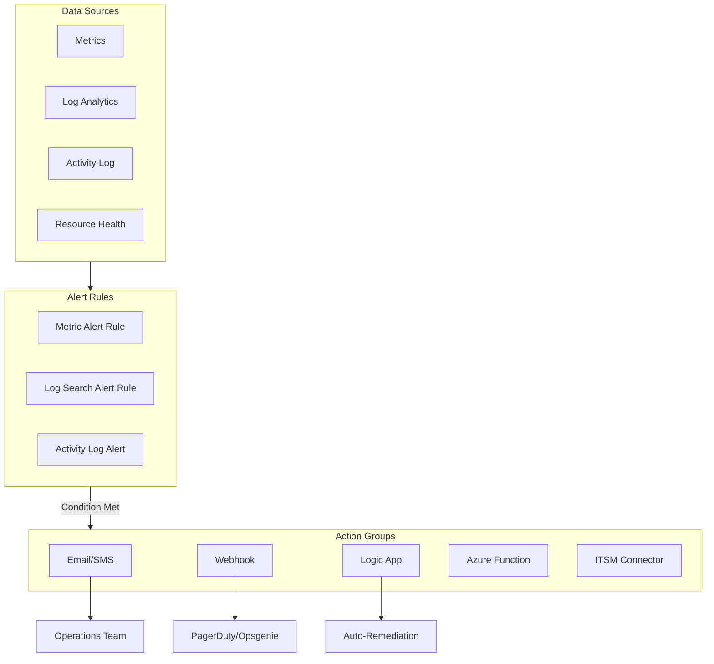
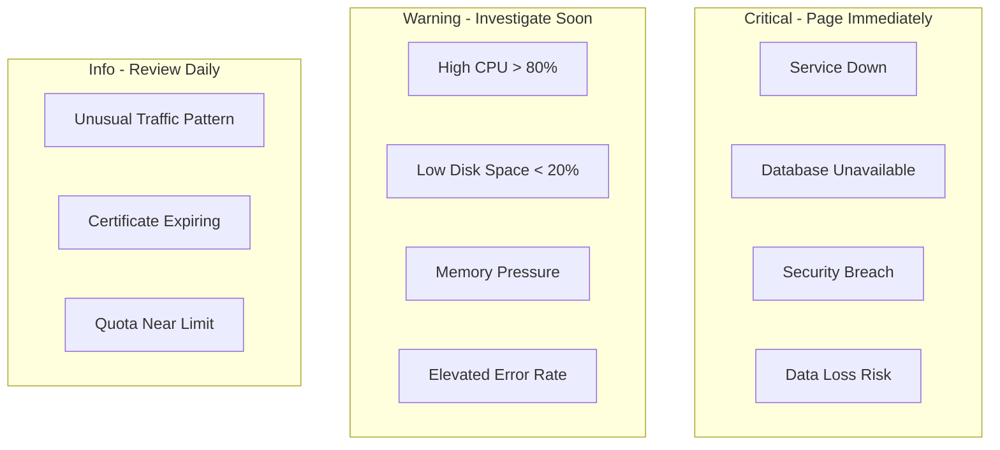

# How to Handle Azure Monitor Alerts

Author: [nawazdhandala](https://www.github.com/nawazdhandala)

Tags: Azure, Monitoring, Alerts, DevOps, Observability, Automation, Azure Monitor

Description: A comprehensive guide to configuring, managing, and automating Azure Monitor alerts for effective incident response and system reliability.

---

Azure Monitor alerts notify you when something important happens in your infrastructure. But poorly configured alerts lead to alert fatigue, while missing alerts leave you blind to real issues. This guide shows you how to set up alerts that actually help your team respond to incidents effectively.

## Alert Architecture in Azure Monitor



## Creating Alert Rules

### Metric Alerts

Metric alerts trigger when a metric crosses a threshold.

```bash
# Create an alert for high CPU usage
az monitor metrics alert create \
    --name "High CPU Alert" \
    --resource-group myResourceGroup \
    --scopes "/subscriptions/xxx/resourceGroups/myRG/providers/Microsoft.Compute/virtualMachines/myVM" \
    --condition "avg Percentage CPU > 80" \
    --window-size 5m \
    --evaluation-frequency 1m \
    --severity 2 \
    --action-group "/subscriptions/xxx/resourceGroups/myRG/providers/Microsoft.Insights/actionGroups/myActionGroup" \
    --description "Alert when CPU exceeds 80% for 5 minutes"
```

**Multi-condition alert:**

```bash
# Alert on high CPU AND high memory
az monitor metrics alert create \
    --name "Resource Pressure Alert" \
    --resource-group myResourceGroup \
    --scopes "/subscriptions/xxx/resourceGroups/myRG/providers/Microsoft.Compute/virtualMachines/myVM" \
    --condition "avg Percentage CPU > 80" \
    --condition "avg Available Memory Bytes < 1073741824" \
    --window-size 5m \
    --evaluation-frequency 1m \
    --severity 1 \
    --action-group $ACTION_GROUP_ID
```

### Log Search Alerts

Log alerts query Log Analytics and trigger based on results.

```bash
# Create a log alert for application errors
az monitor scheduled-query create \
    --name "Application Errors Alert" \
    --resource-group myResourceGroup \
    --scopes "/subscriptions/xxx/resourceGroups/myRG/providers/Microsoft.OperationalInsights/workspaces/myWorkspace" \
    --condition "count 'Heartbeat | where Computer == \"myVM\"' > 0" \
    --condition-query "AppExceptions | where severityLevel >= 3 | summarize count() by bin(TimeGenerated, 5m)" \
    --evaluation-frequency 5m \
    --window-size 5m \
    --severity 2 \
    --action-groups $ACTION_GROUP_ID
```

**Using ARM template for complex log alerts:**

```json
{
    "$schema": "https://schema.management.azure.com/schemas/2019-04-01/deploymentTemplate.json#",
    "contentVersion": "1.0.0.0",
    "resources": [
        {
            "type": "Microsoft.Insights/scheduledQueryRules",
            "apiVersion": "2023-03-15-preview",
            "name": "Failed-Login-Attempts",
            "location": "eastus",
            "properties": {
                "displayName": "Failed Login Attempts Alert",
                "description": "Alert when there are more than 10 failed logins in 5 minutes",
                "severity": 1,
                "enabled": true,
                "evaluationFrequency": "PT5M",
                "scopes": [
                    "/subscriptions/xxx/resourceGroups/myRG/providers/Microsoft.OperationalInsights/workspaces/myWorkspace"
                ],
                "windowSize": "PT5M",
                "criteria": {
                    "allOf": [
                        {
                            "query": "SigninLogs | where ResultType != 0 | summarize FailedCount = count() by UserPrincipalName, bin(TimeGenerated, 5m)",
                            "timeAggregation": "Count",
                            "operator": "GreaterThan",
                            "threshold": 10,
                            "failingPeriods": {
                                "numberOfEvaluationPeriods": 1,
                                "minFailingPeriodsToAlert": 1
                            }
                        }
                    ]
                },
                "actions": {
                    "actionGroups": [
                        "/subscriptions/xxx/resourceGroups/myRG/providers/Microsoft.Insights/actionGroups/SecurityTeam"
                    ]
                }
            }
        }
    ]
}
```

### Activity Log Alerts

Alert on control plane operations like resource deletions.

```bash
# Alert when a resource is deleted
az monitor activity-log alert create \
    --name "Resource Deletion Alert" \
    --resource-group myResourceGroup \
    --scope "/subscriptions/xxx" \
    --condition category=Administrative and operationName=Microsoft.Resources/subscriptions/resourceGroups/delete \
    --action-group $ACTION_GROUP_ID
```

## Configuring Action Groups

Action groups define what happens when an alert fires.

```bash
# Create an action group with multiple actions
az monitor action-group create \
    --name "OnCallTeam" \
    --resource-group myResourceGroup \
    --short-name "OnCall" \
    --email-receiver name="TeamLead" email-address="lead@company.com" \
    --email-receiver name="Backup" email-address="backup@company.com" \
    --sms-receiver name="Primary" country-code="1" phone-number="5551234567" \
    --webhook-receiver name="PagerDuty" uri="https://events.pagerduty.com/integration/xxx/enqueue"
```

**Using Terraform:**

```hcl
# action_groups.tf
resource "azurerm_monitor_action_group" "critical" {
  name                = "critical-alerts"
  resource_group_name = azurerm_resource_group.main.name
  short_name          = "critical"

  email_receiver {
    name          = "oncall-primary"
    email_address = "oncall@company.com"
  }

  sms_receiver {
    name         = "oncall-sms"
    country_code = "1"
    phone_number = "5551234567"
  }

  webhook_receiver {
    name        = "pagerduty"
    uri         = "https://events.pagerduty.com/integration/${var.pagerduty_key}/enqueue"
  }

  azure_function_receiver {
    name                     = "auto-remediation"
    function_app_resource_id = azurerm_function_app.remediation.id
    function_name            = "HandleAlert"
    http_trigger_url         = "https://myfunction.azurewebsites.net/api/HandleAlert"
  }
}

resource "azurerm_monitor_action_group" "warning" {
  name                = "warning-alerts"
  resource_group_name = azurerm_resource_group.main.name
  short_name          = "warning"

  email_receiver {
    name          = "team-channel"
    email_address = "alerts-channel@company.com"
  }
}
```

## Alert Processing with Webhooks

### PagerDuty Integration

```json
{
    "routing_key": "YOUR_ROUTING_KEY",
    "event_action": "trigger",
    "dedup_key": "{{data.essentials.alertId}}",
    "payload": {
        "summary": "{{data.essentials.alertRule}} - {{data.essentials.monitorCondition}}",
        "severity": "{{data.essentials.severity}}",
        "source": "{{data.essentials.firedDateTime}}",
        "custom_details": {
            "alert_context": "{{data.alertContext}}"
        }
    }
}
```

### Auto-Remediation with Azure Functions

```python
# function_app.py - Azure Function for alert handling
import azure.functions as func
import json
import logging
from azure.identity import DefaultAzureCredential
from azure.mgmt.compute import ComputeManagementClient

app = func.FunctionApp()

@app.route(route="HandleAlert", methods=["POST"])
def handle_alert(req: func.HttpRequest) -> func.HttpResponse:
    """Process Azure Monitor alert webhook and take action."""

    try:
        alert_data = req.get_json()
        logging.info(f"Received alert: {json.dumps(alert_data)}")

        essentials = alert_data.get("data", {}).get("essentials", {})
        alert_rule = essentials.get("alertRule", "")
        severity = essentials.get("severity", "")

        # Route based on alert type
        if "High CPU" in alert_rule:
            return handle_high_cpu(alert_data)
        elif "Disk Space" in alert_rule:
            return handle_disk_space(alert_data)
        else:
            logging.info(f"No handler for alert: {alert_rule}")
            return func.HttpResponse("Alert received, no action taken", status_code=200)

    except Exception as e:
        logging.error(f"Error processing alert: {str(e)}")
        return func.HttpResponse(f"Error: {str(e)}", status_code=500)


def handle_high_cpu(alert_data):
    """Scale up VM when CPU is high."""

    context = alert_data.get("data", {}).get("alertContext", {})
    resource_id = alert_data.get("data", {}).get("essentials", {}).get("alertTargetIDs", [None])[0]

    if not resource_id:
        return func.HttpResponse("No resource ID in alert", status_code=400)

    # Parse resource ID
    parts = resource_id.split("/")
    subscription_id = parts[2]
    resource_group = parts[4]
    vm_name = parts[8]

    credential = DefaultAzureCredential()
    compute_client = ComputeManagementClient(credential, subscription_id)

    # Get current VM size
    vm = compute_client.virtual_machines.get(resource_group, vm_name)
    current_size = vm.hardware_profile.vm_size

    # Define scale-up mapping
    size_upgrade = {
        "Standard_B2s": "Standard_B4ms",
        "Standard_B4ms": "Standard_B8ms",
        "Standard_D2s_v3": "Standard_D4s_v3"
    }

    new_size = size_upgrade.get(current_size)
    if new_size:
        vm.hardware_profile.vm_size = new_size
        compute_client.virtual_machines.begin_create_or_update(resource_group, vm_name, vm)
        logging.info(f"Scaled VM {vm_name} from {current_size} to {new_size}")
        return func.HttpResponse(f"Scaled VM to {new_size}", status_code=200)

    return func.HttpResponse(f"VM already at maximum size: {current_size}", status_code=200)
```

## Alert Suppression and Maintenance Windows

### Suppress Alerts During Maintenance

```bash
# Create an alert processing rule to suppress alerts
az monitor alert-processing-rule create \
    --name "MaintenanceWindow" \
    --resource-group myResourceGroup \
    --scopes "/subscriptions/xxx/resourceGroups/myRG" \
    --rule-type RemoveAllActionGroups \
    --schedule-recurrence-type Daily \
    --schedule-start-time "2024-01-15T02:00:00" \
    --schedule-end-time "2024-01-15T04:00:00" \
    --schedule-time-zone "America/New_York"
```

**Using Terraform:**

```hcl
resource "azurerm_monitor_alert_processing_rule_suppression" "maintenance" {
  name                = "weekend-maintenance"
  resource_group_name = azurerm_resource_group.main.name
  scopes              = [azurerm_resource_group.main.id]

  condition {
    target_resource_type {
      operator = "Equals"
      values   = ["Microsoft.Compute/virtualMachines"]
    }
  }

  schedule {
    effective_from  = "2024-01-01T00:00:00"
    effective_until = "2024-12-31T23:59:59"
    time_zone       = "America/New_York"

    recurrence {
      weekly {
        days_of_week = ["Saturday", "Sunday"]
        start_time   = "00:00:00"
        end_time     = "06:00:00"
      }
    }
  }
}
```

## Essential Alert Rules for Production



### Infrastructure Alerts Template

```hcl
# alerts.tf - Common infrastructure alerts

locals {
  vm_ids = [for vm in azurerm_linux_virtual_machine.main : vm.id]
}

# CPU Alert
resource "azurerm_monitor_metric_alert" "cpu" {
  name                = "high-cpu-alert"
  resource_group_name = azurerm_resource_group.main.name
  scopes              = local.vm_ids
  severity            = 2
  frequency           = "PT1M"
  window_size         = "PT5M"

  criteria {
    metric_namespace = "Microsoft.Compute/virtualMachines"
    metric_name      = "Percentage CPU"
    aggregation      = "Average"
    operator         = "GreaterThan"
    threshold        = 80
  }

  action {
    action_group_id = azurerm_monitor_action_group.warning.id
  }
}

# Memory Alert
resource "azurerm_monitor_metric_alert" "memory" {
  name                = "low-memory-alert"
  resource_group_name = azurerm_resource_group.main.name
  scopes              = local.vm_ids
  severity            = 2
  frequency           = "PT1M"
  window_size         = "PT5M"

  criteria {
    metric_namespace = "Microsoft.Compute/virtualMachines"
    metric_name      = "Available Memory Bytes"
    aggregation      = "Average"
    operator         = "LessThan"
    threshold        = 1073741824  # 1GB
  }

  action {
    action_group_id = azurerm_monitor_action_group.warning.id
  }
}

# Disk Space Alert
resource "azurerm_monitor_metric_alert" "disk" {
  name                = "low-disk-alert"
  resource_group_name = azurerm_resource_group.main.name
  scopes              = local.vm_ids
  severity            = 1
  frequency           = "PT5M"
  window_size         = "PT15M"

  criteria {
    metric_namespace = "Microsoft.Compute/virtualMachines"
    metric_name      = "OS Disk Used Percentage"
    aggregation      = "Average"
    operator         = "GreaterThan"
    threshold        = 90
  }

  action {
    action_group_id = azurerm_monitor_action_group.critical.id
  }
}
```

## Querying Alert History

```bash
# List fired alerts in the last 24 hours
az monitor activity-log alert list-fired \
    --start-time $(date -u -d '24 hours ago' '+%Y-%m-%dT%H:%M:%SZ') \
    --output table

# Get alert history from Log Analytics
az monitor log-analytics query \
    --workspace $WORKSPACE_ID \
    --analytics-query "AlertsManagementResources | where properties.essentials.monitorCondition == 'Fired' | project TimeGenerated, AlertName=properties.essentials.alertRule, Severity=properties.essentials.severity"
```

## Best Practices

1. **Set appropriate severity levels** - Sev 0/1 for pages, Sev 2/3 for tickets, Sev 4 for logging.

2. **Use dynamic thresholds** - Let Azure learn normal patterns instead of static thresholds.

3. **Group related alerts** - Use action rules to consolidate noisy alerts into single notifications.

4. **Test your alerts** - Periodically verify alerts fire and notifications reach the right people.

5. **Document runbooks** - Link alerts to runbooks so on-call knows what to do.

6. **Review and tune regularly** - Alerts that never fire or always fire need adjustment.

---

Good alerting is about signal, not noise. Start with critical alerts on service availability, add warning alerts for resource pressure, and resist the urge to alert on everything. Your on-call team will thank you.
