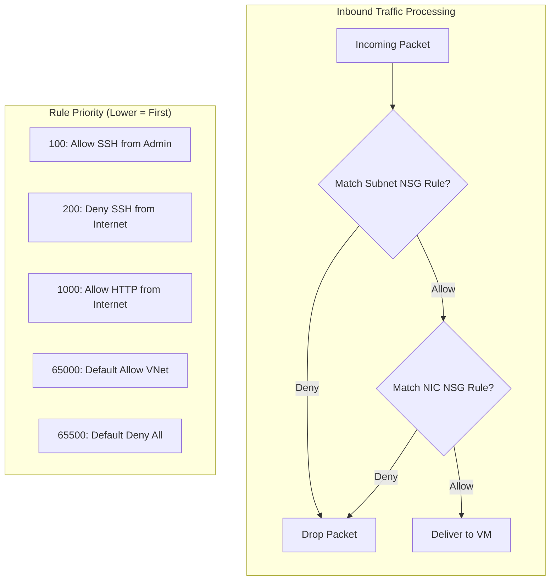
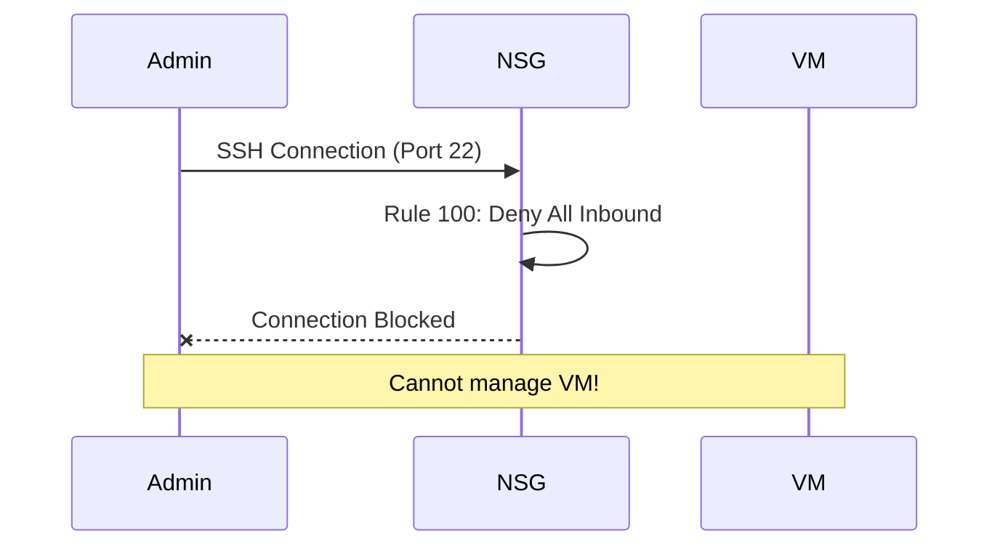
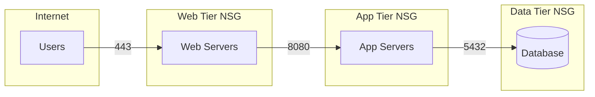
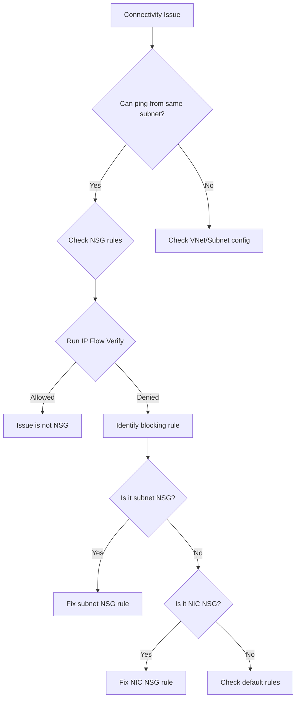

# How to Fix 'Network Security Group' Rule Errors

Author: [nawazdhandala](https://www.github.com/nawazdhandala)

Tags: Azure, NSG, Network Security, Firewall, Networking, Troubleshooting

Description: A practical guide to diagnosing and fixing Azure Network Security Group rule errors including priority conflicts, rule ordering issues, and connectivity problems.

---

Network Security Groups (NSGs) are Azure's built-in firewall for controlling traffic to and from your virtual machines. When NSG rules are misconfigured, you can lock yourself out of VMs, break application connectivity, or inadvertently expose services to the internet. This guide covers common NSG errors and how to fix them.

## Understanding NSG Rule Processing



Key concepts:
- Rules are processed in priority order (lowest number first)
- First matching rule wins
- Both subnet and NIC NSGs must allow traffic
- Default rules exist at priority 65000+

## Common NSG Rule Errors

### Error 1: Priority Conflict

```
ERROR: Network security rule priority '100' is already in use.
```

Every rule in an NSG must have a unique priority number.

**Check existing priorities:**

```bash
# List all rules with their priorities
az network nsg rule list \
    --nsg-name myNSG \
    --resource-group myResourceGroup \
    --query "[].{Name:name, Priority:priority, Access:access, Direction:direction}" \
    --output table
```

**Fix: Use an available priority number**

```bash
# Find the next available priority
NEXT_PRIORITY=$(az network nsg rule list \
    --nsg-name myNSG \
    --resource-group myResourceGroup \
    --query "max([].priority)" \
    --output tsv)

# Add 10 to get next available
NEW_PRIORITY=$((NEXT_PRIORITY + 10))

az network nsg rule create \
    --nsg-name myNSG \
    --resource-group myResourceGroup \
    --name AllowHTTPS \
    --priority $NEW_PRIORITY \
    --direction Inbound \
    --access Allow \
    --protocol Tcp \
    --destination-port-range 443
```

### Error 2: Locked Out of VM (SSH/RDP Blocked)

You created a deny rule that blocks your access to the VM.



**Fix using Azure Serial Console (no network required):**

```bash
# Access VM through Azure portal Serial Console
# Or use Run Command feature
az vm run-command invoke \
    --resource-group myResourceGroup \
    --name myVM \
    --command-id RunShellScript \
    --scripts "echo 'VM is accessible via Run Command'"
```

**Fix the NSG rule:**

```bash
# Add allow rule with higher priority (lower number)
az network nsg rule create \
    --nsg-name myNSG \
    --resource-group myResourceGroup \
    --name AllowSSHFromMyIP \
    --priority 100 \
    --direction Inbound \
    --access Allow \
    --protocol Tcp \
    --source-address-prefix "203.0.113.50" \
    --destination-port-range 22
```

### Error 3: Rule Order Causing Unexpected Behavior

Traffic is being allowed or denied unexpectedly due to rule ordering.

**Example problem:**

```bash
# These rules are in the wrong order
# Priority 100: Deny all from Internet
# Priority 200: Allow HTTP from Internet  <-- This never matches!
```

**Diagnose with NSG flow logs:**

```bash
# Enable flow logs
az network watcher flow-log create \
    --name myFlowLog \
    --resource-group myResourceGroup \
    --nsg myNSG \
    --storage-account mystorageaccount \
    --enabled true \
    --retention 7
```

**Analyze flow log data:**

```kusto
// Kusto query for blocked traffic
AzureNetworkAnalytics_CL
| where FlowStatus_s == "D"  // Denied
| project TimeGenerated, SrcIP_s, DestPort_d, NSGRule_s
| summarize Count=count() by NSGRule_s
| order by Count desc
```

**Fix: Reorder rules by updating priorities**

```bash
# Update the allow rule to have higher priority
az network nsg rule update \
    --nsg-name myNSG \
    --resource-group myResourceGroup \
    --name AllowHTTP \
    --priority 100

# Update the deny rule to have lower priority
az network nsg rule update \
    --nsg-name myNSG \
    --resource-group myResourceGroup \
    --name DenyAllInternet \
    --priority 200
```

### Error 4: Service Tag Not Recognized

```
ERROR: The value 'InvalidServiceTag' is not a valid service tag.
```

**List available service tags:**

```bash
# Get all service tags for your region
az network list-service-tags \
    --location eastus \
    --query "values[].{Name:name, AddressCount:properties.addressPrefixes | length(@)}" \
    --output table
```

**Common service tags:**

| Service Tag | Description |
|------------|-------------|
| Internet | All public IP addresses |
| VirtualNetwork | VNet address space + peered VNets |
| AzureLoadBalancer | Azure health probes |
| AzureCloud | All Azure datacenter IPs |
| Storage | Azure Storage service |
| Sql | Azure SQL Database |
| AzureMonitor | Monitoring services |

**Fix: Use correct service tag**

```bash
# Allow Azure Monitor to reach your VM
az network nsg rule create \
    --nsg-name myNSG \
    --resource-group myResourceGroup \
    --name AllowAzureMonitor \
    --priority 110 \
    --direction Inbound \
    --access Allow \
    --protocol Tcp \
    --source-address-prefix AzureMonitor \
    --destination-port-ranges 443 9440
```

### Error 5: Application Security Group Errors

```
ERROR: Application security group '/subscriptions/.../applicationSecurityGroups/myASG'
is not in the same location as network security group.
```

ASGs must be in the same region as the NSG.

**Check ASG locations:**

```bash
# List ASGs and their locations
az network asg list \
    --query "[].{Name:name, Location:location, ResourceGroup:resourceGroup}" \
    --output table
```

**Fix: Create ASG in correct region**

```bash
# Create ASG in same region as NSG
az network asg create \
    --name webServers \
    --resource-group myResourceGroup \
    --location eastus

# Use ASG in NSG rule
az network nsg rule create \
    --nsg-name myNSG \
    --resource-group myResourceGroup \
    --name AllowWebTraffic \
    --priority 120 \
    --direction Inbound \
    --access Allow \
    --protocol Tcp \
    --source-address-prefix Internet \
    --destination-asgs webServers \
    --destination-port-ranges 80 443
```

## NSG Design Patterns

### Pattern 1: Tiered Application Security



**Implementation:**

```bash
# Web tier NSG - Allow HTTPS from Internet
az network nsg rule create \
    --nsg-name webNSG \
    --resource-group myResourceGroup \
    --name AllowHTTPS \
    --priority 100 \
    --direction Inbound \
    --access Allow \
    --protocol Tcp \
    --source-address-prefix Internet \
    --destination-port-range 443

# App tier NSG - Allow only from web tier
az network nsg rule create \
    --nsg-name appNSG \
    --resource-group myResourceGroup \
    --name AllowFromWebTier \
    --priority 100 \
    --direction Inbound \
    --access Allow \
    --protocol Tcp \
    --source-address-prefix 10.0.1.0/24 \
    --destination-port-range 8080

# Data tier NSG - Allow only from app tier
az network nsg rule create \
    --nsg-name dataNSG \
    --resource-group myResourceGroup \
    --name AllowFromAppTier \
    --priority 100 \
    --direction Inbound \
    --access Allow \
    --protocol Tcp \
    --source-address-prefix 10.0.2.0/24 \
    --destination-port-range 5432
```

### Pattern 2: Bastion Host Access

```bash
# Allow SSH only from bastion host subnet
az network nsg rule create \
    --nsg-name productionNSG \
    --resource-group myResourceGroup \
    --name AllowSSHFromBastion \
    --priority 100 \
    --direction Inbound \
    --access Allow \
    --protocol Tcp \
    --source-address-prefix 10.0.255.0/24 \
    --destination-port-range 22

# Deny SSH from everywhere else
az network nsg rule create \
    --nsg-name productionNSG \
    --resource-group myResourceGroup \
    --name DenySSHFromInternet \
    --priority 110 \
    --direction Inbound \
    --access Deny \
    --protocol Tcp \
    --source-address-prefix Internet \
    --destination-port-range 22
```

## Debugging NSG Issues

### Use IP Flow Verify

```bash
# Test if traffic would be allowed
az network watcher test-ip-flow \
    --resource-group myResourceGroup \
    --vm myVM \
    --direction Inbound \
    --protocol Tcp \
    --local 10.0.1.4:22 \
    --remote 203.0.113.50:50000
```

**Output:**

```json
{
    "access": "Deny",
    "ruleName": "DenyAllInbound"
}
```

### Check Effective Security Rules

```bash
# Get the effective rules after all NSGs are combined
az network nic show-effective-nsg \
    --resource-group myResourceGroup \
    --name myVMNic \
    --output table
```

### Troubleshooting Flow



## Terraform Configuration

```hcl
# nsg.tf - Complete NSG configuration
resource "azurerm_network_security_group" "web" {
  name                = "web-tier-nsg"
  location            = azurerm_resource_group.main.location
  resource_group_name = azurerm_resource_group.main.name

  # Allow HTTPS from Internet
  security_rule {
    name                       = "AllowHTTPS"
    priority                   = 100
    direction                  = "Inbound"
    access                     = "Allow"
    protocol                   = "Tcp"
    source_port_range          = "*"
    destination_port_range     = "443"
    source_address_prefix      = "Internet"
    destination_address_prefix = "*"
  }

  # Allow health probes from Azure Load Balancer
  security_rule {
    name                       = "AllowAzureLB"
    priority                   = 110
    direction                  = "Inbound"
    access                     = "Allow"
    protocol                   = "*"
    source_port_range          = "*"
    destination_port_range     = "*"
    source_address_prefix      = "AzureLoadBalancer"
    destination_address_prefix = "*"
  }

  # Allow SSH from bastion only
  security_rule {
    name                       = "AllowSSHFromBastion"
    priority                   = 120
    direction                  = "Inbound"
    access                     = "Allow"
    protocol                   = "Tcp"
    source_port_range          = "*"
    destination_port_range     = "22"
    source_address_prefix      = "10.0.255.0/24"
    destination_address_prefix = "*"
  }

  # Deny all other inbound
  security_rule {
    name                       = "DenyAllInbound"
    priority                   = 4096
    direction                  = "Inbound"
    access                     = "Deny"
    protocol                   = "*"
    source_port_range          = "*"
    destination_port_range     = "*"
    source_address_prefix      = "*"
    destination_address_prefix = "*"
  }

  tags = {
    environment = "production"
  }
}

# Associate NSG with subnet
resource "azurerm_subnet_network_security_group_association" "web" {
  subnet_id                 = azurerm_subnet.web.id
  network_security_group_id = azurerm_network_security_group.web.id
}
```

## Best Practices

1. **Apply NSGs at subnet level** - Easier to manage than per-NIC rules.

2. **Use Application Security Groups** - Group VMs logically instead of by IP address.

3. **Start restrictive, then allow** - Begin with deny-all and add specific allows.

4. **Leave gaps in priority numbers** - Use 100, 110, 120 instead of 100, 101, 102 for easier insertion later.

5. **Document your rules** - Use meaningful names and add descriptions.

6. **Enable flow logs** - You cannot troubleshoot what you cannot see.

7. **Test before deploying** - Use IP Flow Verify to validate rules before applying.

---

NSG errors usually come down to rule ordering, priority conflicts, or not understanding that both subnet and NIC NSGs must allow traffic. Use IP Flow Verify and flow logs to debug issues, and always maintain a bastion or serial console access path so you do not lock yourself out.
