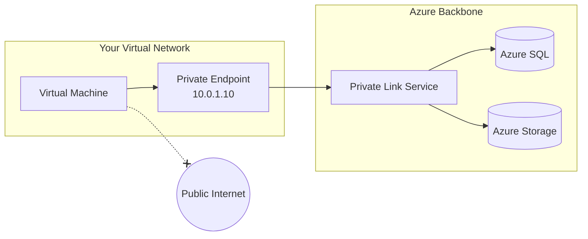
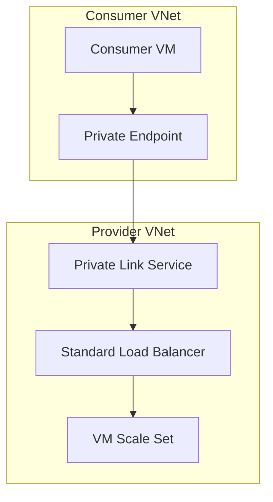

# How to Configure Azure Private Link

Author: [nawazdhandala](https://www.github.com/nawazdhandala)

Tags: Azure, Private Link, Networking, Security, VNet, Private Endpoint

Description: A comprehensive guide to configuring Azure Private Link for secure, private connectivity to Azure services and your own services.

---

Azure Private Link allows you to access Azure PaaS services (like Azure Storage, SQL Database, and Cosmos DB) and your own services over a private endpoint in your virtual network. This eliminates exposure to the public internet and provides a secure way to connect to services.

## Understanding Azure Private Link

Private Link works by creating a private endpoint in your VNet that maps to a specific Azure resource. Traffic between your VNet and the service travels over the Microsoft backbone network, never touching the public internet.



### Key Components

- **Private Endpoint**: A network interface with a private IP that connects you to a service
- **Private Link Service**: Enables you to expose your own services via Private Link
- **Private DNS Zone**: Resolves service names to private endpoint IPs

## Prerequisites

Before configuring Private Link, ensure you have:

1. An Azure subscription with appropriate permissions
2. A Virtual Network with at least one subnet
3. The Azure CLI installed or access to Azure Portal

```bash
# Verify Azure CLI is installed and logged in
az --version
az account show

# Set your subscription
az account set --subscription "your-subscription-id"
```

## Creating a Private Endpoint for Azure Storage

Let's walk through creating a private endpoint for an Azure Storage account.

### Step 1: Create the Storage Account

```bash
# Set variables
RESOURCE_GROUP="rg-privatelink-demo"
LOCATION="eastus"
STORAGE_ACCOUNT="stprivatelinkdemo$(date +%s)"
VNET_NAME="vnet-privatelink"
SUBNET_NAME="subnet-endpoints"

# Create resource group
az group create \
    --name $RESOURCE_GROUP \
    --location $LOCATION

# Create storage account with public access disabled
az storage account create \
    --name $STORAGE_ACCOUNT \
    --resource-group $RESOURCE_GROUP \
    --location $LOCATION \
    --sku Standard_LRS \
    --public-network-access Disabled
```

### Step 2: Create the Virtual Network and Subnet

```bash
# Create VNet
az network vnet create \
    --name $VNET_NAME \
    --resource-group $RESOURCE_GROUP \
    --location $LOCATION \
    --address-prefix 10.0.0.0/16 \
    --subnet-name $SUBNET_NAME \
    --subnet-prefix 10.0.1.0/24

# Disable private endpoint network policies on the subnet
az network vnet subnet update \
    --name $SUBNET_NAME \
    --resource-group $RESOURCE_GROUP \
    --vnet-name $VNET_NAME \
    --disable-private-endpoint-network-policies true
```

### Step 3: Create the Private Endpoint

```bash
# Get the storage account resource ID
STORAGE_ID=$(az storage account show \
    --name $STORAGE_ACCOUNT \
    --resource-group $RESOURCE_GROUP \
    --query id \
    --output tsv)

# Create private endpoint for blob storage
az network private-endpoint create \
    --name "pe-storage-blob" \
    --resource-group $RESOURCE_GROUP \
    --vnet-name $VNET_NAME \
    --subnet $SUBNET_NAME \
    --private-connection-resource-id $STORAGE_ID \
    --group-id blob \
    --connection-name "storage-blob-connection"
```

### Step 4: Configure Private DNS

For name resolution to work correctly, you need to set up a Private DNS Zone.

```bash
# Create private DNS zone for blob storage
az network private-dns zone create \
    --resource-group $RESOURCE_GROUP \
    --name "privatelink.blob.core.windows.net"

# Link the DNS zone to your VNet
az network private-dns link vnet create \
    --resource-group $RESOURCE_GROUP \
    --zone-name "privatelink.blob.core.windows.net" \
    --name "dns-link-storage" \
    --virtual-network $VNET_NAME \
    --registration-enabled false

# Create DNS records for the private endpoint
az network private-endpoint dns-zone-group create \
    --resource-group $RESOURCE_GROUP \
    --endpoint-name "pe-storage-blob" \
    --name "storage-dns-zone-group" \
    --private-dns-zone "privatelink.blob.core.windows.net" \
    --zone-name "blob"
```

## Creating a Private Endpoint Using Terraform

For infrastructure as code deployments, here's how to configure Private Link with Terraform:

```hcl
# Configure the Azure Provider
terraform {
  required_providers {
    azurerm = {
      source  = "hashicorp/azurerm"
      version = "~> 3.0"
    }
  }
}

provider "azurerm" {
  features {}
}

# Resource Group
resource "azurerm_resource_group" "main" {
  name     = "rg-privatelink-demo"
  location = "eastus"
}

# Virtual Network
resource "azurerm_virtual_network" "main" {
  name                = "vnet-privatelink"
  address_space       = ["10.0.0.0/16"]
  location            = azurerm_resource_group.main.location
  resource_group_name = azurerm_resource_group.main.name
}

# Subnet for Private Endpoints
resource "azurerm_subnet" "endpoints" {
  name                 = "subnet-endpoints"
  resource_group_name  = azurerm_resource_group.main.name
  virtual_network_name = azurerm_virtual_network.main.name
  address_prefixes     = ["10.0.1.0/24"]

  # Required for private endpoints
  private_endpoint_network_policies_enabled = false
}

# Storage Account
resource "azurerm_storage_account" "main" {
  name                     = "stprivatelinkdemo"
  resource_group_name      = azurerm_resource_group.main.name
  location                 = azurerm_resource_group.main.location
  account_tier             = "Standard"
  account_replication_type = "LRS"

  # Disable public access
  public_network_access_enabled = false
}

# Private DNS Zone
resource "azurerm_private_dns_zone" "blob" {
  name                = "privatelink.blob.core.windows.net"
  resource_group_name = azurerm_resource_group.main.name
}

# DNS Zone VNet Link
resource "azurerm_private_dns_zone_virtual_network_link" "blob" {
  name                  = "blob-dns-link"
  resource_group_name   = azurerm_resource_group.main.name
  private_dns_zone_name = azurerm_private_dns_zone.blob.name
  virtual_network_id    = azurerm_virtual_network.main.id
}

# Private Endpoint
resource "azurerm_private_endpoint" "storage" {
  name                = "pe-storage-blob"
  location            = azurerm_resource_group.main.location
  resource_group_name = azurerm_resource_group.main.name
  subnet_id           = azurerm_subnet.endpoints.id

  private_service_connection {
    name                           = "storage-blob-connection"
    private_connection_resource_id = azurerm_storage_account.main.id
    subresource_names              = ["blob"]
    is_manual_connection           = false
  }

  private_dns_zone_group {
    name                 = "storage-dns-group"
    private_dns_zone_ids = [azurerm_private_dns_zone.blob.id]
  }
}

# Output the private IP
output "private_endpoint_ip" {
  value = azurerm_private_endpoint.storage.private_service_connection[0].private_ip_address
}
```

## Exposing Your Own Service via Private Link Service

You can also expose your own services to other VNets or subscriptions using Private Link Service.



### Create a Private Link Service

```bash
# First, create a Standard Load Balancer with your backend pool
# Then create the Private Link Service

az network private-link-service create \
    --name "pls-myservice" \
    --resource-group $RESOURCE_GROUP \
    --vnet-name $VNET_NAME \
    --subnet "subnet-pls" \
    --lb-name "lb-myservice" \
    --lb-frontend-ip-configs "frontend-ip" \
    --location $LOCATION
```

## Verifying Private Link Connectivity

After setting up Private Link, verify that everything works correctly.

```bash
# Check the private endpoint status
az network private-endpoint show \
    --name "pe-storage-blob" \
    --resource-group $RESOURCE_GROUP \
    --query "privateLinkServiceConnections[0].privateLinkServiceConnectionState"

# Verify DNS resolution from a VM in the VNet
# SSH into your VM and run:
nslookup stprivatelinkdemo.blob.core.windows.net

# Expected output should show private IP like 10.0.1.x
# instead of public IP
```

## Common Issues and Solutions

### Connection State Shows "Pending"

If your private endpoint connection is pending, the service owner needs to approve it:

```bash
# List pending connections on the storage account
az storage account private-endpoint-connection list \
    --account-name $STORAGE_ACCOUNT \
    --resource-group $RESOURCE_GROUP

# Approve a pending connection
az storage account private-endpoint-connection approve \
    --account-name $STORAGE_ACCOUNT \
    --resource-group $RESOURCE_GROUP \
    --name "connection-name"
```

### DNS Resolution Returns Public IP

If DNS still resolves to a public IP:

1. Verify the private DNS zone is linked to your VNet
2. Check that DNS zone group is configured on the private endpoint
3. Ensure your VM is using Azure-provided DNS (168.63.129.16)

```bash
# Check DNS zone link status
az network private-dns link vnet show \
    --resource-group $RESOURCE_GROUP \
    --zone-name "privatelink.blob.core.windows.net" \
    --name "dns-link-storage"
```

### Network Policies Blocking Traffic

Make sure network policies are disabled on the subnet:

```bash
az network vnet subnet show \
    --name $SUBNET_NAME \
    --resource-group $RESOURCE_GROUP \
    --vnet-name $VNET_NAME \
    --query privateEndpointNetworkPolicies
```

## Best Practices

1. **Use Private DNS Zones**: Always configure private DNS for automatic name resolution
2. **Plan Your IP Addressing**: Each private endpoint consumes an IP from your subnet
3. **Centralize DNS Management**: Use a hub-spoke model with centralized private DNS zones
4. **Monitor Connections**: Set up alerts for connection state changes
5. **Disable Public Access**: When using Private Link, disable public network access to your services
6. **Use Service Tags**: Leverage Azure service tags for NSG rules when needed

## Cost Considerations

Private Link pricing includes:
- Hourly charge for each private endpoint (approximately $0.01/hour)
- Data processing charges (approximately $0.01/GB)

For high-throughput scenarios, factor these costs into your architecture decisions.

---

Azure Private Link provides a secure, private way to access Azure services and your own applications. By following this guide, you can set up private endpoints, configure DNS properly, and troubleshoot common issues. This approach significantly improves your security posture by eliminating public internet exposure for sensitive workloads.
