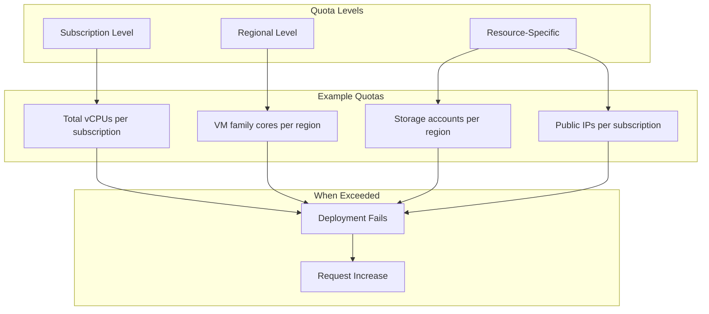

# How to Fix "Quota Exceeded" Errors in Azure

Author: [nawazdhandala](https://www.github.com/nawazdhandala)

Tags: Azure, Troubleshooting, Quota, Limits, Cloud, DevOps, Resource Management

Description: Learn how to diagnose, resolve, and prevent Azure quota exceeded errors with practical examples and automation strategies.

---

You're deploying a new cluster or scaling up your infrastructure when suddenly Azure throws a "QuotaExceeded" error. These errors can halt deployments, break CI/CD pipelines, and frustrate teams. This guide covers how to identify quota issues, request increases, and build proactive monitoring.

## Understanding Azure Quotas

Azure enforces quotas (also called limits) at multiple levels to ensure fair resource distribution and prevent runaway costs.



## Common Quota Error Messages

```
Operation could not be completed as it results in exceeding approved
standardDSv3Family Cores quota. Additional details - Deployment Model:
Resource Manager, Location: eastus, Current Limit: 100, Current Usage:
98, Additional Required: 8, (Minimum) New Limit Required: 106.
```

```
The subscription policy limit for resource type 'cores count' was exceeded.
The limit for resource type 'Regional vCPUs' is 350 per region.
```

## Checking Current Quota Usage

### Using Azure CLI

```bash
# Check VM compute quotas for a region
az vm list-usage \
    --location eastus \
    --output table

# Filter for specific VM family
az vm list-usage \
    --location eastus \
    --query "[?contains(name.value, 'DSv3')]" \
    --output table

# Check network quotas
az network list-usages \
    --location eastus \
    --output table

# Check storage quotas
az storage account list \
    --query "length([?location=='eastus'])"
```

### Using Azure Portal

Navigate to your subscription and select "Usage + quotas" to see a visual breakdown of all quotas and current usage.

### Using PowerShell

```powershell
# Get compute usage for a location
Get-AzVMUsage -Location "eastus" |
    Where-Object { $_.CurrentValue -gt 0 } |
    Format-Table Name, CurrentValue, Limit

# Calculate percentage used
Get-AzVMUsage -Location "eastus" |
    Select-Object @{N='Resource';E={$_.Name.LocalizedValue}},
                  @{N='Used';E={$_.CurrentValue}},
                  @{N='Limit';E={$_.Limit}},
                  @{N='Percent';E={[math]::Round(($_.CurrentValue/$_.Limit)*100,1)}} |
    Where-Object { $_.Used -gt 0 } |
    Sort-Object Percent -Descending
```

## Requesting Quota Increases

### Via Azure CLI

```bash
# Create a quota increase request for vCPUs
az quota create \
    --resource-name "standardDSv3Family" \
    --scope "/subscriptions/<subscription-id>/providers/Microsoft.Compute/locations/eastus" \
    --limit-object value=200 \
    --resource-type "dedicated"

# Check request status
az quota request list \
    --scope "/subscriptions/<subscription-id>/providers/Microsoft.Compute/locations/eastus" \
    --output table
```

### Via Azure Portal

1. Go to "Subscriptions" then select your subscription
2. Click "Usage + quotas" in the left menu
3. Find the quota you need to increase
4. Click "Request increase"
5. Fill in the justification and new limit
6. Submit the request

### Automated Quota Request Script

```bash
#!/bin/bash
# quota-request.sh - Automate quota increase requests

SUBSCRIPTION_ID="your-subscription-id"
LOCATION="eastus"
VM_FAMILY="standardDSv3Family"
NEW_LIMIT=200

# Get current usage
CURRENT=$(az vm list-usage \
    --location $LOCATION \
    --query "[?name.value=='$VM_FAMILY'].currentValue" \
    --output tsv)

LIMIT=$(az vm list-usage \
    --location $LOCATION \
    --query "[?name.value=='$VM_FAMILY'].limit" \
    --output tsv)

PERCENT=$((CURRENT * 100 / LIMIT))

echo "Current: $CURRENT / $LIMIT ($PERCENT%)"

if [ $PERCENT -gt 80 ]; then
    echo "Usage above 80%, requesting increase to $NEW_LIMIT"

    az quota create \
        --resource-name "$VM_FAMILY" \
        --scope "/subscriptions/$SUBSCRIPTION_ID/providers/Microsoft.Compute/locations/$LOCATION" \
        --limit-object value=$NEW_LIMIT \
        --resource-type "dedicated"

    echo "Quota increase request submitted"
else
    echo "Usage within acceptable limits"
fi
```

## Handling Specific Quota Types

### VM Core Quotas

```bash
# Check all VM family quotas
az vm list-usage --location eastus --output table

# Common VM families and their codes
# standardDSv3Family - General purpose
# standardDSv4Family - Latest general purpose
# standardESv3Family - Memory optimized
# standardNCSv3Family - GPU compute
# standardLSv2Family - Storage optimized

# Check regional vCPU limit
az vm list-usage \
    --location eastus \
    --query "[?name.value=='cores']" \
    --output table
```

### Public IP Quotas

```bash
# Check public IP usage
az network list-usages \
    --location eastus \
    --query "[?name.value=='PublicIPAddresses']" \
    --output table

# List all public IPs to audit
az network public-ip list \
    --query "[].{Name:name, ResourceGroup:resourceGroup, IP:ipAddress, Associated:ipConfiguration.id}" \
    --output table
```

### Storage Account Quotas

```bash
# Default limit is 250 storage accounts per subscription per region
az storage account list \
    --query "[].{Name:name, Location:location, Kind:kind}" \
    --output table | sort

# Count by region
az storage account list \
    --query "[].location" \
    --output tsv | sort | uniq -c
```

## Proactive Quota Monitoring

### Azure Monitor Alert Rule

```json
{
  "type": "Microsoft.Insights/metricAlerts",
  "apiVersion": "2018-03-01",
  "name": "quota-alert-vcpus",
  "location": "global",
  "properties": {
    "description": "Alert when vCPU quota usage exceeds 80%",
    "severity": 2,
    "enabled": true,
    "scopes": [
      "/subscriptions/<subscription-id>"
    ],
    "evaluationFrequency": "PT1H",
    "windowSize": "PT1H",
    "criteria": {
      "odata.type": "Microsoft.Azure.Monitor.SingleResourceMultipleMetricCriteria",
      "allOf": [
        {
          "name": "vCPU quota threshold",
          "metricName": "UsagePercent",
          "metricNamespace": "Microsoft.Compute/locations",
          "operator": "GreaterThan",
          "threshold": 80,
          "timeAggregation": "Maximum"
        }
      ]
    },
    "actions": [
      {
        "actionGroupId": "/subscriptions/<sub>/resourceGroups/<rg>/providers/microsoft.insights/actionGroups/ops-team"
      }
    ]
  }
}
```

### Python Monitoring Script

```python
# quota_monitor.py - Monitor and alert on quota usage
from azure.identity import DefaultAzureCredential
from azure.mgmt.compute import ComputeManagementClient
import json

def check_quota_usage(subscription_id, location, threshold=80):
    """Check compute quota usage and return items above threshold."""
    credential = DefaultAzureCredential()
    compute_client = ComputeManagementClient(credential, subscription_id)

    alerts = []
    usages = compute_client.usage.list(location)

    for usage in usages:
        if usage.limit > 0:
            percent = (usage.current_value / usage.limit) * 100
            if percent >= threshold:
                alerts.append({
                    'resource': usage.name.localized_value,
                    'current': usage.current_value,
                    'limit': usage.limit,
                    'percent': round(percent, 1)
                })

    return alerts

def main():
    subscription_id = "your-subscription-id"
    locations = ["eastus", "westus2", "westeurope"]

    all_alerts = {}
    for location in locations:
        alerts = check_quota_usage(subscription_id, location)
        if alerts:
            all_alerts[location] = alerts

    if all_alerts:
        print("QUOTA WARNINGS:")
        print(json.dumps(all_alerts, indent=2))
        # Send to monitoring system or Slack
    else:
        print("All quotas within acceptable limits")

if __name__ == "__main__":
    main()
```

## Workarounds While Waiting for Quota Increases

### Use Alternative Regions

```bash
# Find regions with available capacity
for region in eastus westus2 centralus northeurope westeurope; do
    echo "=== $region ==="
    az vm list-usage \
        --location $region \
        --query "[?name.value=='standardDSv3Family'].{Used:currentValue, Limit:limit}" \
        --output table
done
```

### Use Alternative VM Families

```bash
# DSv4 is often less utilized than DSv3
# Check availability
az vm list-usage \
    --location eastus \
    --query "[?contains(name.value, 'DSv4')]" \
    --output table
```

### Clean Up Unused Resources

```bash
# Find deallocated VMs (still consuming quota)
az vm list \
    --query "[?powerState=='VM deallocated'].{Name:name, RG:resourceGroup}" \
    --output table

# Find unattached disks
az disk list \
    --query "[?diskState=='Unattached'].{Name:name, RG:resourceGroup, Size:diskSizeGb}" \
    --output table

# Find unused public IPs
az network public-ip list \
    --query "[?ipConfiguration==null].{Name:name, RG:resourceGroup}" \
    --output table
```

## Quota Management Best Practices

### Infrastructure as Code Approach

```hcl
# terraform/quota_checks.tf - Pre-deployment quota validation
data "azurerm_subscription" "current" {}

# Check quota before deployment
resource "null_resource" "quota_check" {
  provisioner "local-exec" {
    command = <<-EOT
      REQUIRED_CORES=${var.required_cores}
      CURRENT=$(az vm list-usage --location ${var.location} \
        --query "[?name.value=='standardDSv3Family'].currentValue" -o tsv)
      LIMIT=$(az vm list-usage --location ${var.location} \
        --query "[?name.value=='standardDSv3Family'].limit" -o tsv)
      AVAILABLE=$((LIMIT - CURRENT))

      if [ $AVAILABLE -lt $REQUIRED_CORES ]; then
        echo "ERROR: Insufficient quota. Need $REQUIRED_CORES, have $AVAILABLE available"
        exit 1
      fi
      echo "Quota check passed: $AVAILABLE cores available"
    EOT
  }

  triggers = {
    always_run = timestamp()
  }
}
```

### CI/CD Pipeline Integration

```yaml
# azure-pipelines.yml - Quota check stage
stages:
  - stage: QuotaCheck
    jobs:
      - job: CheckQuotas
        steps:
          - task: AzureCLI@2
            displayName: 'Verify quota availability'
            inputs:
              azureSubscription: 'Production'
              scriptType: 'bash'
              scriptLocation: 'inlineScript'
              inlineScript: |
                REQUIRED=16
                AVAILABLE=$(az vm list-usage --location eastus \
                  --query "[?name.value=='standardDSv3Family'].[limit - currentValue]" -o tsv)

                if [ "$AVAILABLE" -lt "$REQUIRED" ]; then
                  echo "##vso[task.logissue type=error]Insufficient quota: need $REQUIRED cores, only $AVAILABLE available"
                  exit 1
                fi
                echo "Quota check passed"
```

## Summary

Quota errors are frustrating but manageable. The key is proactive monitoring and having automation in place to detect issues before they block deployments. Set up alerts at 70-80% usage, clean up unused resources regularly, and always have a backup region in mind for critical deployments.

---

Don't wait until deployment fails to discover quota limits. Build quota checks into your infrastructure pipeline and treat quota capacity like any other resource that needs monitoring and planning.
