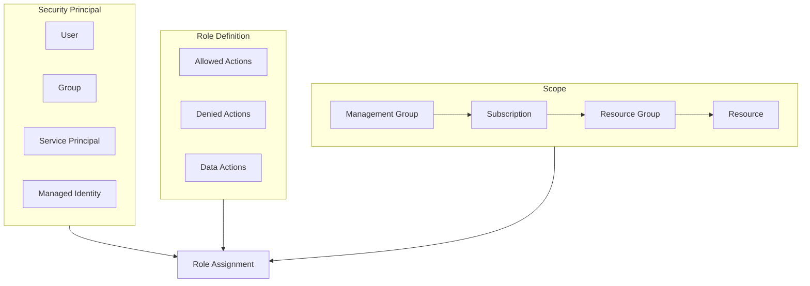

# How to Fix "Insufficient Permissions" RBAC Errors in Azure

Author: [nawazdhandala](https://www.github.com/nawazdhandala)

Tags: Azure, RBAC, Security, Permissions, IAM, Troubleshooting, Access Control

Description: Learn how to diagnose and fix "Insufficient Permissions" RBAC errors in Azure, including understanding role assignments, custom roles, and permission inheritance.

---

Role-Based Access Control (RBAC) errors in Azure can be frustrating because the error messages often do not tell you exactly what permission is missing. This guide helps you understand Azure RBAC, diagnose permission issues, and implement the right fixes.

## Understanding Azure RBAC



## Common Error Messages

When you lack permissions, Azure returns errors like:

- `AuthorizationFailed` - The client does not have authorization to perform action
- `LinkedAuthorizationFailed` - The client has permission but linked operation failed
- `PrincipalNotFound` - The service principal was not found
- `InvalidAuthenticationTokenTenant` - Token is from wrong tenant

## Diagnosing Permission Issues

### Check Your Current Permissions

```bash
# Check your current identity
az ad signed-in-user show --query "{Name:displayName, UPN:userPrincipalName, ObjectId:id}" --output table

# For service principals
az ad sp show --id <app-id> --query "{Name:displayName, AppId:appId, ObjectId:id}" --output table

# List all your role assignments
az role assignment list \
  --assignee $(az ad signed-in-user show --query id -o tsv) \
  --all \
  --output table

# Check permissions at a specific scope
az role assignment list \
  --assignee $(az ad signed-in-user show --query id -o tsv) \
  --scope "/subscriptions/<subscription-id>/resourceGroups/<resource-group>" \
  --output table
```

### Find the Required Permission

When you get a permission error, the message usually includes the action that was denied:

```
The client 'user@domain.com' with object id 'xxx' does not have authorization
to perform action 'Microsoft.Compute/virtualMachines/start/action' over scope
'/subscriptions/xxx/resourceGroups/xxx/providers/Microsoft.Compute/virtualMachines/myvm'
```

Extract:
- **Action needed**: `Microsoft.Compute/virtualMachines/start/action`
- **Scope**: The resource path

### Find Roles That Include the Action

```bash
# Search for roles that allow the specific action
az role definition list \
  --query "[?contains(permissions[0].actions, 'Microsoft.Compute/virtualMachines/start')].{Name:roleName, Description:description}" \
  --output table

# Get details of a specific role
az role definition list \
  --name "Virtual Machine Contributor" \
  --output json

# List all actions in a role
az role definition list \
  --name "Virtual Machine Contributor" \
  --query "[].permissions[0].{Actions:actions, NotActions:notActions}" \
  --output json
```

## Fixing Permission Issues

### Assign Built-in Roles

```bash
# Assign a built-in role to a user
az role assignment create \
  --assignee user@domain.com \
  --role "Virtual Machine Contributor" \
  --scope "/subscriptions/<subscription-id>/resourceGroups/<resource-group>"

# Assign to a service principal
az role assignment create \
  --assignee <app-id-or-object-id> \
  --role "Contributor" \
  --scope "/subscriptions/<subscription-id>"

# Assign to a managed identity
az role assignment create \
  --assignee <managed-identity-principal-id> \
  --role "Storage Blob Data Reader" \
  --scope "/subscriptions/<subscription-id>/resourceGroups/<rg>/providers/Microsoft.Storage/storageAccounts/<account>"
```

### Common Built-in Roles Reference

| Role | Scope | Common Use Case |
|------|-------|-----------------|
| Owner | Any | Full access including RBAC |
| Contributor | Any | Full access except RBAC |
| Reader | Any | View all resources |
| User Access Administrator | Any | Manage RBAC only |
| Virtual Machine Contributor | Compute | Manage VMs |
| Storage Blob Data Contributor | Storage | Read/write blobs |
| Key Vault Secrets User | Key Vault | Read secrets |
| AcrPush | Container Registry | Push images |

### Create Custom Roles

When built-in roles do not match your needs:

```bash
# Create a custom role definition
cat > custom-role.json << 'EOF'
{
  "Name": "VM Operator",
  "Description": "Can start and stop VMs but not create or delete them",
  "IsCustom": true,
  "Actions": [
    "Microsoft.Compute/virtualMachines/read",
    "Microsoft.Compute/virtualMachines/start/action",
    "Microsoft.Compute/virtualMachines/restart/action",
    "Microsoft.Compute/virtualMachines/deallocate/action",
    "Microsoft.Compute/virtualMachines/powerOff/action",
    "Microsoft.Network/networkInterfaces/read",
    "Microsoft.Network/publicIPAddresses/read"
  ],
  "NotActions": [],
  "DataActions": [],
  "NotDataActions": [],
  "AssignableScopes": [
    "/subscriptions/<subscription-id>"
  ]
}
EOF

# Create the role
az role definition create --role-definition custom-role.json

# Assign the custom role
az role assignment create \
  --assignee user@domain.com \
  --role "VM Operator" \
  --scope "/subscriptions/<subscription-id>/resourceGroups/<resource-group>"
```

### Fix Service Principal Permissions

```bash
# List current assignments for a service principal
SP_OBJECT_ID=$(az ad sp show --id <app-id> --query id -o tsv)
az role assignment list --assignee $SP_OBJECT_ID --all --output table

# Common issue: Service principal needs Reader + specific role
az role assignment create \
  --assignee $SP_OBJECT_ID \
  --role "Reader" \
  --scope "/subscriptions/<subscription-id>"

az role assignment create \
  --assignee $SP_OBJECT_ID \
  --role "Key Vault Secrets User" \
  --scope "/subscriptions/<subscription-id>/resourceGroups/<rg>/providers/Microsoft.KeyVault/vaults/<vault>"
```

### Fix Managed Identity Permissions

```bash
# Get managed identity principal ID
IDENTITY_PRINCIPAL_ID=$(az webapp identity show \
  --name myapp \
  --resource-group mygroup \
  --query principalId -o tsv)

# Assign required roles
az role assignment create \
  --assignee $IDENTITY_PRINCIPAL_ID \
  --role "Storage Blob Data Reader" \
  --scope "/subscriptions/<sub>/resourceGroups/<rg>/providers/Microsoft.Storage/storageAccounts/<account>"
```

## Common Scenarios and Solutions

### Scenario 1: Cannot Create Resources

```bash
# Error: AuthorizationFailed for Microsoft.Compute/virtualMachines/write

# Solution: Assign Contributor or specific resource contributor role
az role assignment create \
  --assignee user@domain.com \
  --role "Virtual Machine Contributor" \
  --scope "/subscriptions/<subscription-id>/resourceGroups/<resource-group>"
```

### Scenario 2: Cannot Access Storage Blobs

```bash
# Error: AuthorizationPermissionMismatch for blob operations

# Note: Storage has TWO permission models
# 1. Management plane (Azure RBAC) - for managing storage account
# 2. Data plane (Storage RBAC or keys) - for accessing blobs

# Solution: Assign data plane role
az role assignment create \
  --assignee user@domain.com \
  --role "Storage Blob Data Contributor" \
  --scope "/subscriptions/<sub>/resourceGroups/<rg>/providers/Microsoft.Storage/storageAccounts/<account>"
```

### Scenario 3: Cannot Access Key Vault Secrets

```bash
# Error: Access denied to Key Vault

# Note: Key Vault has two permission models
# 1. Vault access policy (legacy)
# 2. Azure RBAC (recommended)

# Check which model is used
az keyvault show --name myvault --query properties.enableRbacAuthorization

# If RBAC is enabled, assign data plane role
az role assignment create \
  --assignee user@domain.com \
  --role "Key Vault Secrets User" \
  --scope "/subscriptions/<sub>/resourceGroups/<rg>/providers/Microsoft.KeyVault/vaults/<vault>"

# If using access policies
az keyvault set-policy \
  --name myvault \
  --upn user@domain.com \
  --secret-permissions get list
```

### Scenario 4: Cannot Manage RBAC

```bash
# Error: AuthorizationFailed for Microsoft.Authorization/roleAssignments/write

# Solution: Assign User Access Administrator or Owner
az role assignment create \
  --assignee admin@domain.com \
  --role "User Access Administrator" \
  --scope "/subscriptions/<subscription-id>"
```

## Debugging Script

```bash
#!/bin/bash
# diagnose-rbac.sh - Diagnose RBAC issues

PRINCIPAL_ID="$1"
SCOPE="$2"

if [ -z "$PRINCIPAL_ID" ]; then
  echo "Usage: $0 <principal-id-or-upn> [scope]"
  echo "Example: $0 user@domain.com /subscriptions/xxx"
  exit 1
fi

SCOPE="${SCOPE:-/subscriptions/$(az account show --query id -o tsv)}"

echo "=== Principal Information ==="
# Try to resolve as user
az ad user show --id "$PRINCIPAL_ID" 2>/dev/null || \
# Try as service principal
az ad sp show --id "$PRINCIPAL_ID" 2>/dev/null || \
echo "Could not resolve principal"

echo -e "\n=== Role Assignments at Scope ==="
az role assignment list \
  --assignee "$PRINCIPAL_ID" \
  --scope "$SCOPE" \
  --include-inherited \
  --query "[].{Role:roleDefinitionName, Scope:scope, Inherited:condition}" \
  --output table

echo -e "\n=== All Role Assignments ==="
az role assignment list \
  --assignee "$PRINCIPAL_ID" \
  --all \
  --query "[].{Role:roleDefinitionName, Scope:scope}" \
  --output table

echo -e "\n=== Effective Permissions (sample) ==="
# This shows what actions are allowed
for role in $(az role assignment list --assignee "$PRINCIPAL_ID" --scope "$SCOPE" --query "[].roleDefinitionName" -o tsv); do
  echo "Role: $role"
  az role definition list --name "$role" --query "[].permissions[0].actions[:5]" -o tsv
  echo "---"
done
```

## Permission Propagation Delay

RBAC changes can take up to 5 minutes to propagate:

```bash
# After assigning a role, wait before testing
az role assignment create \
  --assignee user@domain.com \
  --role "Contributor" \
  --scope "/subscriptions/<subscription-id>"

echo "Waiting for RBAC propagation..."
sleep 300  # Wait 5 minutes

# Now test the operation
az vm list --resource-group mygroup
```

## Best Practices

### 1. Use Least Privilege

```bash
# Instead of Contributor at subscription level
# Use specific role at resource group level
az role assignment create \
  --assignee user@domain.com \
  --role "Virtual Machine Contributor" \
  --scope "/subscriptions/<sub>/resourceGroups/<rg>"
```

### 2. Use Groups Instead of Individual Users

```bash
# Create a group
GROUP_ID=$(az ad group create \
  --display-name "VM Operators" \
  --mail-nickname "vm-operators" \
  --query id -o tsv)

# Add users to group
az ad group member add --group $GROUP_ID --member-id <user-object-id>

# Assign role to group
az role assignment create \
  --assignee $GROUP_ID \
  --role "Virtual Machine Contributor" \
  --scope "/subscriptions/<subscription-id>"
```

### 3. Audit Role Assignments Regularly

```bash
# Export all role assignments for audit
az role assignment list \
  --all \
  --query "[].{Principal:principalName, Role:roleDefinitionName, Scope:scope}" \
  --output json > rbac-audit.json
```

### 4. Use PIM for Privileged Roles

For sensitive roles like Owner or User Access Administrator, use Privileged Identity Management (PIM) for just-in-time access.

---

RBAC errors are usually straightforward to fix once you understand the three components: who (principal), what (role), and where (scope). Start by identifying the exact action that is denied, find a role that grants that action, and assign it at the appropriate scope. Use the principle of least privilege and prefer groups over individual assignments for easier management.
