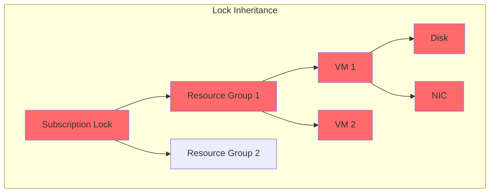

# How to Fix "Resource Group Locked" Errors

Author: [nawazdhandala](https://www.github.com/nawazdhandala)

Tags: Azure, Troubleshooting, Resource Locks, Security, DevOps, Governance, ARM

Description: Learn how to diagnose and resolve Azure resource lock errors, understand lock inheritance, and implement proper lock management strategies.

---

You try to delete a resource or modify a critical setting, and Azure responds with "The scope is locked" or "Cannot delete because resource group has a lock." Resource locks are a safety feature that prevents accidental changes, but they can block legitimate operations when you don't expect them. This guide covers how to identify, manage, and work around resource locks.

## Understanding Resource Locks

Azure resource locks prevent accidental deletion or modification of resources. They can be applied at subscription, resource group, or individual resource levels and are inherited by child resources.



### Lock Types

| Lock Type | Can Delete | Can Modify | Use Case |
|-----------|------------|------------|----------|
| ReadOnly | No | No | Production databases, critical configs |
| CanNotDelete | No | Yes | Resources that can be updated but not removed |

## Common Error Messages

```
The scope '/subscriptions/.../resourceGroups/prod-rg' cannot perform
delete operation because following scope(s) are locked:
'/subscriptions/.../resourceGroups/prod-rg'.
Please remove the lock and try again.
```

```
The resource 'myvm' cannot be modified because it or its parent
is locked. Lock ID: '/subscriptions/.../providers/Microsoft.Authorization/locks/NoDelete'
```

## Finding Locks

### Check Resource Group Locks

```bash
# List locks on a resource group
az lock list \
    --resource-group prod-rg \
    --output table

# Check locks on a specific resource
az lock list \
    --resource-group prod-rg \
    --resource-name myvm \
    --resource-type Microsoft.Compute/virtualMachines \
    --output table

# List all locks in subscription
az lock list --output table

# Get detailed lock information
az lock show \
    --name NoDelete \
    --resource-group prod-rg
```

### Using PowerShell

```powershell
# Get locks on resource group
Get-AzResourceLock -ResourceGroupName "prod-rg"

# Get all locks in subscription
Get-AzResourceLock

# Find lock by name
Get-AzResourceLock -LockName "NoDelete" -ResourceGroupName "prod-rg"

# Find locks on specific resource
Get-AzResourceLock `
    -ResourceName "myvm" `
    -ResourceType "Microsoft.Compute/virtualMachines" `
    -ResourceGroupName "prod-rg"
```

### Using Azure Portal

1. Navigate to the resource group or resource
2. Click "Locks" in the left menu under Settings
3. View all locks applied directly and inherited

## Removing Locks

### Temporary Lock Removal

```bash
# Remove a lock (requires Owner or User Access Administrator role)
az lock delete \
    --name NoDelete \
    --resource-group prod-rg

# Remove lock from specific resource
az lock delete \
    --name VMProtect \
    --resource-group prod-rg \
    --resource-name myvm \
    --resource-type Microsoft.Compute/virtualMachines
```

### Safe Lock Management Script

```bash
#!/bin/bash
# safe-unlock.sh - Safely remove lock, perform operation, restore lock

RESOURCE_GROUP="prod-rg"
LOCK_NAME="NoDelete"
OPERATION="$1"

# Store lock details before removal
echo "Saving lock configuration..."
LOCK_TYPE=$(az lock show \
    --name $LOCK_NAME \
    --resource-group $RESOURCE_GROUP \
    --query level -o tsv)

LOCK_NOTES=$(az lock show \
    --name $LOCK_NAME \
    --resource-group $RESOURCE_GROUP \
    --query notes -o tsv)

if [ -z "$LOCK_TYPE" ]; then
    echo "Lock not found, proceeding with operation"
else
    echo "Found $LOCK_TYPE lock, removing temporarily..."
    az lock delete \
        --name $LOCK_NAME \
        --resource-group $RESOURCE_GROUP
fi

# Perform the operation
echo "Performing operation: $OPERATION"
eval $OPERATION
OP_RESULT=$?

# Restore lock
if [ -n "$LOCK_TYPE" ]; then
    echo "Restoring lock..."
    az lock create \
        --name $LOCK_NAME \
        --resource-group $RESOURCE_GROUP \
        --lock-type $LOCK_TYPE \
        --notes "$LOCK_NOTES"
    echo "Lock restored"
fi

exit $OP_RESULT
```

Usage:
```bash
./safe-unlock.sh "az vm delete --resource-group prod-rg --name oldvm --yes"
```

## Creating Locks

### Using Azure CLI

```bash
# Create CanNotDelete lock on resource group
az lock create \
    --name NoDelete \
    --resource-group prod-rg \
    --lock-type CanNotDelete \
    --notes "Production environment - do not delete without approval"

# Create ReadOnly lock on specific resource
az lock create \
    --name ConfigProtect \
    --resource-group prod-rg \
    --resource-name prod-db \
    --resource-type Microsoft.Sql/servers \
    --lock-type ReadOnly \
    --notes "Database configuration locked - change requires approval"
```

### Using Terraform

```hcl
# locks.tf - Resource lock management
resource "azurerm_management_lock" "rg_lock" {
  name       = "production-nodelete"
  scope      = azurerm_resource_group.prod.id
  lock_level = "CanNotDelete"
  notes      = "Production environment - requires approval to delete"
}

resource "azurerm_management_lock" "db_lock" {
  name       = "database-readonly"
  scope      = azurerm_mssql_server.main.id
  lock_level = "ReadOnly"
  notes      = "Database settings locked for compliance"
}

# Conditional lock based on environment
resource "azurerm_management_lock" "conditional" {
  count      = var.environment == "production" ? 1 : 0
  name       = "env-protection"
  scope      = azurerm_resource_group.main.id
  lock_level = "CanNotDelete"
  notes      = "Auto-applied production protection"
}
```

### Using ARM Template

```json
{
  "$schema": "https://schema.management.azure.com/schemas/2019-04-01/deploymentTemplate.json#",
  "contentVersion": "1.0.0.0",
  "resources": [
    {
      "type": "Microsoft.Authorization/locks",
      "apiVersion": "2020-05-01",
      "name": "resourceGroupLock",
      "properties": {
        "level": "CanNotDelete",
        "notes": "Deployed via ARM template - production protection"
      }
    }
  ]
}
```

## Handling Locks in CI/CD

### Azure DevOps Pipeline

```yaml
# azure-pipelines.yml - Handle locks during deployment
stages:
  - stage: Deploy
    jobs:
      - job: DeployWithLockManagement
        steps:
          - task: AzureCLI@2
            displayName: 'Remove deployment lock'
            inputs:
              azureSubscription: 'Production'
              scriptType: 'bash'
              scriptLocation: 'inlineScript'
              inlineScript: |
                # Save lock state
                az lock show --name DeployLock --resource-group $(resourceGroup) \
                  --query "{level:level, notes:notes}" > /tmp/lock-state.json 2>/dev/null || true

                # Remove if exists
                az lock delete --name DeployLock --resource-group $(resourceGroup) 2>/dev/null || true

          - task: AzureResourceManagerTemplateDeployment@3
            displayName: 'Deploy ARM template'
            inputs:
              deploymentScope: 'Resource Group'
              azureResourceManagerConnection: 'Production'
              resourceGroupName: '$(resourceGroup)'
              location: 'East US'
              templateLocation: 'Linked artifact'
              csmFile: '$(Pipeline.Workspace)/templates/main.json'

          - task: AzureCLI@2
            displayName: 'Restore deployment lock'
            condition: always()
            inputs:
              azureSubscription: 'Production'
              scriptType: 'bash'
              scriptLocation: 'inlineScript'
              inlineScript: |
                if [ -f /tmp/lock-state.json ]; then
                  LEVEL=$(jq -r '.level' /tmp/lock-state.json)
                  NOTES=$(jq -r '.notes' /tmp/lock-state.json)

                  if [ "$LEVEL" != "null" ]; then
                    az lock create \
                      --name DeployLock \
                      --resource-group $(resourceGroup) \
                      --lock-type $LEVEL \
                      --notes "$NOTES"
                  fi
                fi
```

### GitHub Actions

```yaml
# .github/workflows/deploy.yml
jobs:
  deploy:
    runs-on: ubuntu-latest
    steps:
      - name: Azure Login
        uses: azure/login@v1
        with:
          creds: ${{ secrets.AZURE_CREDENTIALS }}

      - name: Manage Lock and Deploy
        uses: azure/CLI@v1
        with:
          inlineScript: |
            RG="prod-rg"
            LOCK_NAME="ProtectRG"

            # Check and remove lock
            LOCK_EXISTS=$(az lock show --name $LOCK_NAME --resource-group $RG 2>/dev/null && echo "yes" || echo "no")

            if [ "$LOCK_EXISTS" = "yes" ]; then
              LOCK_LEVEL=$(az lock show --name $LOCK_NAME --resource-group $RG --query level -o tsv)
              az lock delete --name $LOCK_NAME --resource-group $RG
            fi

            # Deploy
            az deployment group create \
              --resource-group $RG \
              --template-file ./infra/main.bicep

            # Restore lock
            if [ "$LOCK_EXISTS" = "yes" ]; then
              az lock create --name $LOCK_NAME --resource-group $RG --lock-type $LOCK_LEVEL
            fi
```

## Lock Audit and Compliance

### Audit Script

```bash
#!/bin/bash
# audit-locks.sh - Generate lock audit report

echo "=== Azure Resource Lock Audit Report ==="
echo "Generated: $(date)"
echo ""

# Get all subscriptions
SUBS=$(az account list --query "[].id" -o tsv)

for SUB in $SUBS; do
    echo "Subscription: $SUB"
    az account set --subscription $SUB

    # List all locks
    LOCKS=$(az lock list --query "[].{Name:name, Level:level, Scope:id, Notes:notes}" -o json)

    if [ "$LOCKS" != "[]" ]; then
        echo "$LOCKS" | jq -r '.[] | "  Lock: \(.Name) | Level: \(.Level) | Notes: \(.Notes)"'
    else
        echo "  No locks found"
    fi
    echo ""
done
```

### Azure Policy for Lock Enforcement

```json
{
  "mode": "All",
  "policyRule": {
    "if": {
      "allOf": [
        {
          "field": "type",
          "equals": "Microsoft.Resources/subscriptions/resourceGroups"
        },
        {
          "field": "tags['Environment']",
          "equals": "Production"
        }
      ]
    },
    "then": {
      "effect": "deployIfNotExists",
      "details": {
        "type": "Microsoft.Authorization/locks",
        "existenceCondition": {
          "field": "Microsoft.Authorization/locks/level",
          "equals": "CanNotDelete"
        },
        "deployment": {
          "properties": {
            "mode": "incremental",
            "template": {
              "$schema": "https://schema.management.azure.com/schemas/2019-04-01/deploymentTemplate.json#",
              "contentVersion": "1.0.0.0",
              "resources": [
                {
                  "type": "Microsoft.Authorization/locks",
                  "apiVersion": "2020-05-01",
                  "name": "PolicyEnforcedLock",
                  "properties": {
                    "level": "CanNotDelete",
                    "notes": "Applied by Azure Policy"
                  }
                }
              ]
            }
          }
        }
      }
    }
  }
}
```

## Troubleshooting Lock Issues

### Cannot Find the Lock

```bash
# Check parent resources for inherited locks
# Start from subscription level
az lock list --output table

# Check each level
az lock list --resource-group mygroup --output table

# The lock might be on a different resource in the dependency chain
# For example, deleting a VM might fail due to lock on its NIC or disk
az resource list --resource-group mygroup --query "[].{Name:name, Type:type}" -o table
```

### Permission Issues

```bash
# Check your role assignments
az role assignment list \
    --assignee $(az account show --query user.name -o tsv) \
    --output table

# You need Owner or User Access Administrator to manage locks
# Request appropriate role if needed
```

### Lock Applied by Policy

```bash
# Check if lock was applied by Azure Policy
az lock show --name PolicyEnforcedLock --resource-group mygroup

# If applied by policy, removing manually will just recreate it
# You need to create an exemption or modify the policy
```

## Best Practices

1. **Use CanNotDelete by default** - ReadOnly is too restrictive for most cases
2. **Document lock purpose in notes** - Future you will thank present you
3. **Automate lock management in CI/CD** - Don't manually remove locks
4. **Apply locks at resource group level** - Simpler than per-resource locks
5. **Use Azure Policy for consistent enforcement** - Prevents human error
6. **Audit locks regularly** - Remove unnecessary locks, add missing ones
7. **Never apply ReadOnly to storage accounts** - Breaks many operations

---

Resource locks are your safety net against accidental destruction. Use them wisely on production resources, but remember they require management. Build lock handling into your deployment pipelines and maintain clear documentation about why each lock exists.
