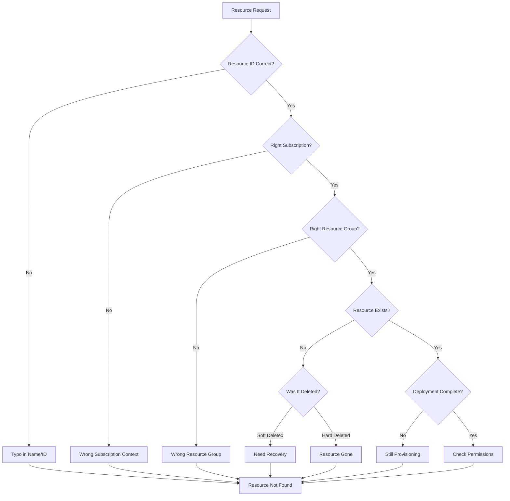

# How to Fix 'Resource Not Found' Errors in Azure

Author: [nawazdhandala](https://www.github.com/nawazdhandala)

Tags: Azure, Troubleshooting, Resource Management, Azure CLI, ARM, DevOps

Description: Learn how to diagnose and fix 'Resource Not Found' errors in Azure, including common causes like wrong subscriptions, typos, soft-deleted resources, and timing issues.

---

"Resource Not Found" is one of the most common errors when working with Azure. It appears as "ResourceNotFound," "ResourceGroupNotFound," or "NotFound" depending on the context. While the error message seems straightforward, the actual cause can be surprisingly tricky to identify. This guide walks through all the common causes and their solutions.

## Understanding the Error



## Cause 1: Wrong Subscription Context

The most common cause by far. You are looking for a resource in subscription A while your CLI is pointed at subscription B.

```bash
# Check your current subscription
az account show --query "{Name:name, ID:id}" --output table

# List all resources in current subscription to verify
az resource list --query "[].{Name:name, Type:type, ResourceGroup:resourceGroup}" --output table

# If resource is in a different subscription, switch
az account set --subscription "correct-subscription-id"

# Or specify subscription in the command
az vm show \
  --name myvm \
  --resource-group mygroup \
  --subscription "other-subscription-id"
```

## Cause 2: Resource Group Does Not Exist or Typo

```bash
# List all resource groups in subscription
az group list --query "[].name" --output table

# Check if specific resource group exists
az group exists --name mygroup

# Common typo: case sensitivity matters sometimes
# "MyResourceGroup" vs "myresourcegroup"
az group show --name MyResourceGroup 2>&1 || az group show --name myresourcegroup
```

## Cause 3: Resource Name Typo

```bash
# List all resources in a resource group
az resource list \
  --resource-group mygroup \
  --query "[].{Name:name, Type:type}" \
  --output table

# Search for similar names
az resource list \
  --query "[?contains(name, 'myapp')].{Name:name, Type:type, Group:resourceGroup}" \
  --output table
```

## Cause 4: Resource Still Deploying

Newly created resources take time to provision. Trying to access them immediately can fail.

```bash
# Check deployment status
az deployment group list \
  --resource-group mygroup \
  --query "[?properties.provisioningState!='Succeeded'].{Name:name, State:properties.provisioningState}" \
  --output table

# Wait for a specific deployment
az deployment group wait \
  --resource-group mygroup \
  --name my-deployment \
  --created

# Add retry logic in scripts
for i in {1..30}; do
  az vm show --name myvm --resource-group mygroup 2>/dev/null && break
  echo "Waiting for VM to be available... ($i/30)"
  sleep 10
done
```

## Cause 5: Soft-Deleted Resources

Some Azure resources support soft delete, meaning they are not immediately removed.

### Key Vault Soft Delete

```bash
# List soft-deleted key vaults
az keyvault list-deleted --query "[].{Name:name, DeletedDate:properties.deletionDate}" --output table

# Recover a soft-deleted key vault
az keyvault recover --name myvault

# Or purge if you want to reuse the name
az keyvault purge --name myvault
```

### Storage Account Recovery

```bash
# Check if storage account was recently deleted
# (Storage accounts can sometimes be recovered within 14 days)
az storage account list \
  --query "[?name=='mystorageaccount']" \
  --output table

# If you need to recreate with the same name, wait or use a different name
```

### App Configuration Soft Delete

```bash
# List deleted app configuration stores
az appconfig list-deleted --query "[].{Name:name, Location:location}" --output table

# Recover
az appconfig recover --name myconfig --location eastus

# Purge
az appconfig purge --name myconfig --location eastus
```

## Cause 6: Cross-Region Issues

Some resources are regional and won't be found if you're looking in the wrong region.

```bash
# Check resource's actual location
az resource list \
  --query "[?name=='myresource'].{Name:name, Location:location}" \
  --output table

# Some commands require location parameter
az appconfig show \
  --name myconfig \
  --resource-group mygroup
  # If this fails, the store might be in a different resource group
```

## Cause 7: Incorrect Resource Type in API Calls

When using ARM templates or REST API, wrong resource type causes "not found" errors.

```bash
# Get the correct resource type and API version
az provider show \
  --namespace Microsoft.Compute \
  --query "resourceTypes[?resourceType=='virtualMachines'].{Type:resourceType, Versions:apiVersions[0:3]}" \
  --output table

# Verify resource ID format
# Correct format:
# /subscriptions/{sub}/resourceGroups/{rg}/providers/Microsoft.Compute/virtualMachines/{name}

# Get full resource ID
az vm show \
  --name myvm \
  --resource-group mygroup \
  --query id \
  --output tsv
```

## Cause 8: Resource Moved to Different Resource Group

Resources can be moved between resource groups, breaking existing references.

```bash
# Find resource anywhere in subscription
az resource list \
  --name myresource \
  --query "[].{Name:name, ResourceGroup:resourceGroup, ID:id}" \
  --output table

# Check activity log for move operations
az monitor activity-log list \
  --resource-group mygroup \
  --offset 7d \
  --query "[?contains(operationName.value, 'move')].{Operation:operationName.value, Time:eventTimestamp}" \
  --output table
```

## Debugging Script

Create a comprehensive diagnostic script:

```bash
#!/bin/bash
# find-azure-resource.sh

RESOURCE_NAME="$1"
RESOURCE_GROUP="$2"

if [ -z "$RESOURCE_NAME" ]; then
  echo "Usage: $0 <resource-name> [resource-group]"
  exit 1
fi

echo "=== Current Subscription ==="
az account show --query "{Name:name, ID:id}" --output table

echo -e "\n=== Searching for '$RESOURCE_NAME' ==="

# Search across all resource groups
echo -e "\n--- In all resource groups ---"
az resource list \
  --query "[?contains(name, '$RESOURCE_NAME')].{Name:name, Type:type, Group:resourceGroup, Location:location}" \
  --output table

# If resource group specified, check if it exists
if [ -n "$RESOURCE_GROUP" ]; then
  echo -e "\n--- Resource group check ---"
  if az group exists --name "$RESOURCE_GROUP" | grep -q "true"; then
    echo "Resource group '$RESOURCE_GROUP' exists"

    echo -e "\n--- Resources in group ---"
    az resource list \
      --resource-group "$RESOURCE_GROUP" \
      --query "[].{Name:name, Type:type}" \
      --output table
  else
    echo "Resource group '$RESOURCE_GROUP' NOT FOUND"
    echo -e "\nSimilar resource groups:"
    az group list --query "[?contains(name, '${RESOURCE_GROUP:0:5}')].name" --output table
  fi
fi

# Check for soft-deleted resources
echo -e "\n=== Checking Soft-Deleted Resources ==="

echo "--- Key Vaults ---"
az keyvault list-deleted --query "[?contains(name, '$RESOURCE_NAME')].name" --output table 2>/dev/null || echo "No access or none found"

echo -e "\n--- App Configurations ---"
az appconfig list-deleted --query "[?contains(name, '$RESOURCE_NAME')].name" --output table 2>/dev/null || echo "No access or none found"

# Check other subscriptions
echo -e "\n=== Other Subscriptions ==="
for sub in $(az account list --query "[].id" -o tsv); do
  result=$(az resource list --subscription "$sub" --query "[?contains(name, '$RESOURCE_NAME')].{Name:name, Sub:'$sub'}" -o tsv 2>/dev/null)
  if [ -n "$result" ]; then
    echo "Found in subscription: $sub"
    echo "$result"
  fi
done
```

## Common Error Messages and Solutions

| Error Message | Likely Cause | Solution |
|--------------|--------------|----------|
| `ResourceNotFound` | Resource does not exist | Verify name, subscription, and resource group |
| `ResourceGroupNotFound` | Resource group missing | Check spelling, create if needed |
| `ParentResourceNotFound` | Parent resource missing | Create parent first (e.g., storage account before container) |
| `SubscriptionNotFound` | Wrong subscription | `az account set --subscription <id>` |
| `ResourceNotFoundInSubscription` | Resource in different sub | Search across subscriptions |

## Prevention Tips

### 1. Use Resource IDs Instead of Names

```bash
# Store and use full resource ID
RESOURCE_ID=$(az vm show --name myvm --resource-group mygroup --query id -o tsv)

# Reference by ID (unambiguous)
az vm start --ids $RESOURCE_ID
```

### 2. Validate Resources Exist Before Operations

```bash
# Check existence before proceeding
if az vm show --name myvm --resource-group mygroup &>/dev/null; then
  echo "VM exists, proceeding..."
  az vm start --name myvm --resource-group mygroup
else
  echo "VM not found!"
  exit 1
fi
```

### 3. Use Consistent Naming in Terraform/ARM

```hcl
# Terraform - Reference resources by their Terraform ID
resource "azurerm_resource_group" "main" {
  name     = "myapp-rg"
  location = "eastus"
}

resource "azurerm_virtual_network" "main" {
  name                = "myapp-vnet"
  resource_group_name = azurerm_resource_group.main.name  # Reference, not hardcoded
  location            = azurerm_resource_group.main.location
  address_space       = ["10.0.0.0/16"]
}
```

### 4. Handle Eventual Consistency

```bash
# Add polling for newly created resources
create_and_wait() {
  az vm create --name myvm --resource-group mygroup --image Ubuntu2204 --generate-ssh-keys

  # Wait for resource to be fully available
  until az vm show --name myvm --resource-group mygroup --query "provisioningState" -o tsv | grep -q "Succeeded"; do
    echo "Waiting for VM provisioning..."
    sleep 10
  done

  echo "VM is ready"
}
```

---

"Resource Not Found" errors are usually straightforward once you know where to look. Start by verifying your subscription context, then check the resource group exists, and finally confirm the resource name is correct. The diagnostic script above can help you quickly identify which of these is the actual issue. Remember that soft-deleted resources can also cause confusing behavior when you try to recreate them with the same name.
