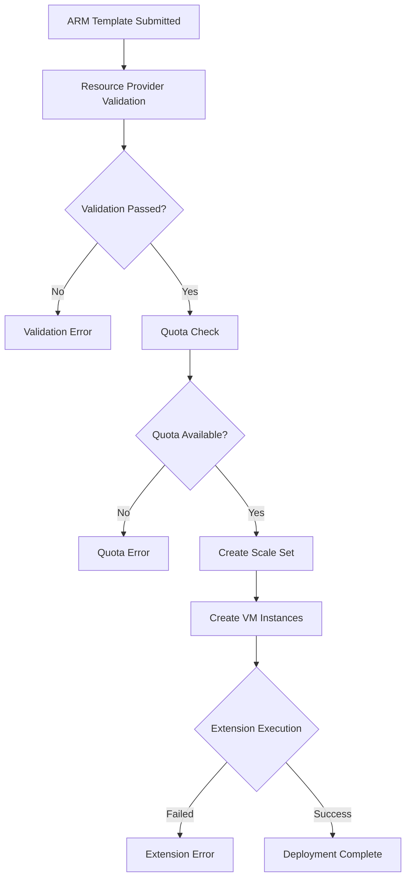
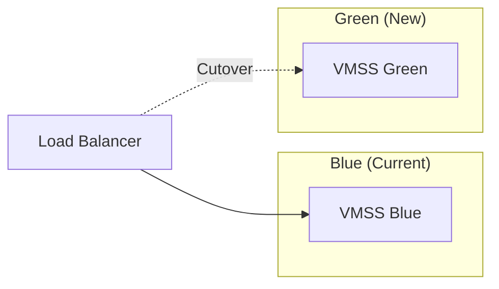

# How to Fix "Scale Set" Deployment Errors

Author: [nawazdhandala](https://www.github.com/nawazdhandala)

Tags: Azure, VMSS, Scale Set, Deployment, Troubleshooting, DevOps, ARM Templates

Description: A practical guide to diagnosing and fixing common Azure Virtual Machine Scale Set deployment errors with real solutions and examples.

---

Azure Virtual Machine Scale Sets (VMSS) enable you to deploy and manage a set of identical VMs that can automatically scale based on demand. However, deployment failures can be frustrating and time-consuming to debug. This guide covers the most common VMSS deployment errors and how to fix them.

## Understanding VMSS Deployment Flow

Before diving into errors, let's understand how VMSS deployments work.



## Common Error 1: Quota Exceeded

The most frequent deployment error involves exceeding subscription quotas.

### Error Message

```
Operation could not be completed as it results in exceeding approved
StandardDSv3Family Cores quota. Additional details - Deployment Model:
Resource Manager, Location: eastus, Current Limit: 100, Current Usage: 98,
Additional Required: 8, (Minimum) New Limit Required: 106.
```

### Solution

Check and request quota increases:

```bash
# Check current quota usage
az vm list-usage --location eastus --output table

# Request a quota increase via Azure Portal or support ticket
# Alternatively, use a different VM size or region

# Check available VM sizes in a region
az vm list-sizes --location eastus --output table | grep Standard_D
```

For Terraform deployments, you can add a check:

```hcl
# Check quota before deployment
data "azurerm_subscription" "current" {}

# Use this to validate before applying
locals {
  required_cores = var.instance_count * var.cores_per_instance
}
```

## Common Error 2: Image Not Found

Deploying with an invalid or unavailable image reference.

### Error Message

```
The platform image reference 'publisher:offer:sku:version' is not valid.
Verify that the publisher, offer, sku, and version are correct.
```

### Solution

Verify the image exists and get the correct reference:

```bash
# List available publishers
az vm image list-publishers --location eastus --output table

# List offers from a publisher
az vm image list-offers \
    --location eastus \
    --publisher Canonical \
    --output table

# List SKUs for an offer
az vm image list-skus \
    --location eastus \
    --publisher Canonical \
    --offer 0001-com-ubuntu-server-jammy \
    --output table

# Get the latest version
az vm image list \
    --location eastus \
    --publisher Canonical \
    --offer 0001-com-ubuntu-server-jammy \
    --sku 22_04-lts-gen2 \
    --all \
    --output table
```

Correct image reference in ARM template:

```json
{
    "imageReference": {
        "publisher": "Canonical",
        "offer": "0001-com-ubuntu-server-jammy",
        "sku": "22_04-lts-gen2",
        "version": "latest"
    }
}
```

## Common Error 3: Subnet Not Found or Invalid

Network configuration errors are common, especially with complex VNet setups.

### Error Message

```
Subnet '/subscriptions/.../subnets/vmss-subnet' referenced by resource
'/subscriptions/.../virtualMachineScaleSets/myVMSS' was not found.
```

### Solution

Verify the subnet exists and has correct configuration:

```bash
# List subnets in your VNet
az network vnet subnet list \
    --resource-group myResourceGroup \
    --vnet-name myVNet \
    --output table

# Check subnet details
az network vnet subnet show \
    --resource-group myResourceGroup \
    --vnet-name myVNet \
    --name vmss-subnet

# Ensure subnet has enough IP addresses for scale set
# Each VM needs at least one IP, plus some for scaling
```

Calculate required subnet size:

```bash
# For 100 VM instances, you need at least /25 subnet (126 usable IPs)
# Azure reserves 5 IPs per subnet
# Recommended: use /24 (251 usable IPs) for room to grow
```

## Common Error 4: Extension Provisioning Failed

Custom script extensions and other VM extensions often fail.

### Error Message

```
VM has reported a failure when processing extension 'CustomScript'.
Error message: "Command execution finished but failed with exit code 1"
```

### Solution

Debug extension failures step by step:

```bash
# Get extension status
az vmss extension show \
    --resource-group myResourceGroup \
    --vmss-name myVMSS \
    --name CustomScript

# Get detailed instance view
az vmss get-instance-view \
    --resource-group myResourceGroup \
    --name myVMSS \
    --instance-id 0

# Check extension logs on the VM (SSH into an instance)
sudo cat /var/lib/waagent/custom-script/download/0/stdout
sudo cat /var/lib/waagent/custom-script/download/0/stderr
```

Fix common extension issues:

```json
{
    "name": "CustomScript",
    "properties": {
        "publisher": "Microsoft.Azure.Extensions",
        "type": "CustomScript",
        "typeHandlerVersion": "2.1",
        "autoUpgradeMinorVersion": true,
        "settings": {
            "skipDos2Unix": false
        },
        "protectedSettings": {
            "commandToExecute": "bash install.sh 2>&1 | tee /var/log/install.log",
            "fileUris": [
                "https://mystorageaccount.blob.core.windows.net/scripts/install.sh"
            ]
        }
    }
}
```

Always log output and add error handling to your scripts:

```bash
#!/bin/bash
# install.sh - with proper error handling
set -e  # Exit on any error
set -o pipefail  # Catch errors in pipes

log() {
    echo "[$(date '+%Y-%m-%d %H:%M:%S')] $1" | tee -a /var/log/install.log
}

log "Starting installation..."

# Check if running as root
if [ "$EUID" -ne 0 ]; then
    log "ERROR: Please run as root"
    exit 1
fi

# Install packages with retry
for i in {1..3}; do
    apt-get update && break || sleep 10
done

apt-get install -y nginx || {
    log "ERROR: Failed to install nginx"
    exit 1
}

log "Installation completed successfully"
```

## Common Error 5: Overprovisioning Failures

When overprovisioning is enabled, Azure creates extra VMs to ensure the requested count is met.

### Error Message

```
Allocation failed. We do not have sufficient capacity for the requested
VM size in this region.
```

### Solution

Adjust overprovisioning settings or use availability zones:

```json
{
    "type": "Microsoft.Compute/virtualMachineScaleSets",
    "properties": {
        "overprovision": false,
        "platformFaultDomainCount": 1,
        "singlePlacementGroup": false,
        "zoneBalance": true
    },
    "zones": ["1", "2", "3"]
}
```

Using Terraform:

```hcl
resource "azurerm_linux_virtual_machine_scale_set" "main" {
  name                = "myVMSS"
  resource_group_name = azurerm_resource_group.main.name
  location            = azurerm_resource_group.main.location
  sku                 = "Standard_D2s_v3"
  instances           = 3

  # Disable overprovisioning if hitting capacity issues
  overprovision = false

  # Enable zone balancing
  zones         = ["1", "2", "3"]
  zone_balance  = true

  # Use flexible orchestration for better availability
  platform_fault_domain_count = 1
  single_placement_group      = false

  # ... rest of configuration
}
```

## Common Error 6: Health Probe Failures

Load balancer health probes failing cause instances to be marked unhealthy.

### Error Message

```
Instances in scale set are unhealthy. 3 instances have health state: Unhealthy
```

### Solution

Verify your health probe configuration and application health:

```bash
# Check health probe status
az network lb probe show \
    --resource-group myResourceGroup \
    --lb-name myLoadBalancer \
    --name healthProbe

# Check instance health
az vmss list-instances \
    --resource-group myResourceGroup \
    --name myVMSS \
    --query "[].{Name:name, Health:instanceView.statuses[?code=='HealthState/healthy']}" \
    --output table
```

Configure a proper health probe:

```json
{
    "probes": [
        {
            "name": "httpHealthProbe",
            "properties": {
                "protocol": "Http",
                "port": 80,
                "requestPath": "/health",
                "intervalInSeconds": 15,
                "numberOfProbes": 2
            }
        }
    ]
}
```

Implement a health endpoint in your application:

```python
# Flask example
from flask import Flask, jsonify
import psutil

app = Flask(__name__)

@app.route('/health')
def health_check():
    # Basic health check
    return jsonify({
        "status": "healthy",
        "cpu_percent": psutil.cpu_percent(),
        "memory_percent": psutil.virtual_memory().percent
    }), 200

# More sophisticated health check
@app.route('/health/ready')
def readiness_check():
    # Check dependencies
    checks = {
        "database": check_database_connection(),
        "cache": check_redis_connection(),
        "disk_space": psutil.disk_usage('/').percent < 90
    }

    if all(checks.values()):
        return jsonify({"status": "ready", "checks": checks}), 200
    else:
        return jsonify({"status": "not ready", "checks": checks}), 503
```

## Debugging Deployment Failures

Use these commands to get detailed deployment information:

```bash
# Get deployment operations with errors
az deployment group list \
    --resource-group myResourceGroup \
    --query "[?properties.provisioningState=='Failed']"

# Get detailed error messages
az deployment operation group list \
    --resource-group myResourceGroup \
    --name myDeployment \
    --query "[?properties.provisioningState=='Failed'].properties.statusMessage"

# View activity log for errors
az monitor activity-log list \
    --resource-group myResourceGroup \
    --status Failed \
    --max-events 10

# Get VMSS model view
az vmss show \
    --resource-group myResourceGroup \
    --name myVMSS \
    --output json > vmss-model.json
```

## Best Practices to Prevent Deployment Errors

1. **Validate Templates First**

```bash
# Validate ARM template before deployment
az deployment group validate \
    --resource-group myResourceGroup \
    --template-file template.json \
    --parameters parameters.json
```

2. **Use Incremental Deployments for Updates**

```bash
az deployment group create \
    --mode Incremental \
    --resource-group myResourceGroup \
    --template-file template.json
```

3. **Implement Blue-Green Deployments**



4. **Set Appropriate Timeouts**

```json
{
    "extensionProfile": {
        "extensions": [
            {
                "properties": {
                    "settings": {
                        "timestamp": "[parameters('deploymentTimestamp')]"
                    },
                    "provisioningTimeout": "PT30M"
                }
            }
        ]
    }
}
```

5. **Enable Boot Diagnostics**

```bash
az vmss update \
    --resource-group myResourceGroup \
    --name myVMSS \
    --set virtualMachineProfile.diagnosticsProfile.bootDiagnostics.enabled=true
```

---

VMSS deployment errors can be complex, but most fall into predictable categories: quota issues, image problems, network misconfigurations, and extension failures. By understanding the deployment flow and using the debugging techniques in this guide, you can quickly identify and resolve these issues. Always validate your templates before deployment and implement proper health checks to catch problems early.
