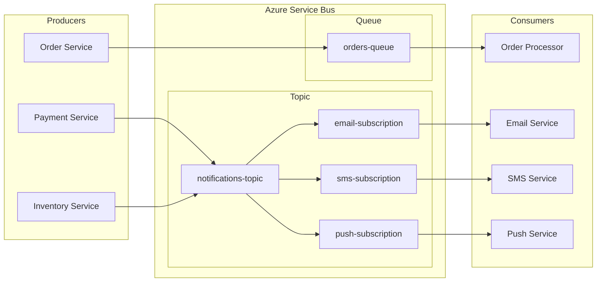

# How to Handle Azure Service Bus

Author: [nawazdhandala](https://www.github.com/nawazdhandala)

Tags: Azure, Service Bus, Messaging, Queues, Topics, Event-Driven Architecture, DevOps

Description: A practical guide to handling Azure Service Bus for reliable messaging, including queues, topics, dead letter handling, and error recovery patterns.

---

Azure Service Bus is Microsoft's enterprise messaging service. It provides reliable message delivery between applications with features like message ordering, transactions, and dead letter queues. This guide covers practical patterns for building robust messaging systems.

## Service Bus Architecture Overview

Service Bus offers two messaging patterns: queues for point-to-point and topics for publish-subscribe.



## Setting Up Service Bus

### Create Service Bus Namespace

```bash
# Create resource group
az group create --name rg-messaging --location eastus

# Create Service Bus namespace (Standard or Premium)
az servicebus namespace create \
  --name sb-myapp-prod \
  --resource-group rg-messaging \
  --location eastus \
  --sku Standard

# Create a queue
az servicebus queue create \
  --name orders-queue \
  --namespace-name sb-myapp-prod \
  --resource-group rg-messaging \
  --max-size 5120 \
  --default-message-time-to-live P14D \
  --lock-duration PT5M \
  --max-delivery-count 10 \
  --enable-dead-lettering-on-message-expiration true

# Create a topic
az servicebus topic create \
  --name notifications-topic \
  --namespace-name sb-myapp-prod \
  --resource-group rg-messaging \
  --max-size 5120

# Create subscriptions for the topic
az servicebus topic subscription create \
  --name email-subscription \
  --topic-name notifications-topic \
  --namespace-name sb-myapp-prod \
  --resource-group rg-messaging \
  --max-delivery-count 10

az servicebus topic subscription create \
  --name sms-subscription \
  --topic-name notifications-topic \
  --namespace-name sb-myapp-prod \
  --resource-group rg-messaging \
  --max-delivery-count 5
```

## Sending Messages (Producer)

### Basic Message Sending with Python

```python
# requirements: azure-servicebus>=7.0.0

from azure.servicebus import ServiceBusClient, ServiceBusMessage
from azure.identity import DefaultAzureCredential
import json
import os

# Connection string approach
connection_string = os.environ["SERVICEBUS_CONNECTION_STRING"]
queue_name = "orders-queue"

def send_single_message(order_data: dict):
    """Send a single message to the queue."""
    with ServiceBusClient.from_connection_string(connection_string) as client:
        with client.get_queue_sender(queue_name) as sender:
            # Create message with properties
            message = ServiceBusMessage(
                body=json.dumps(order_data),
                content_type="application/json",
                message_id=order_data["order_id"],
                # Custom properties for filtering
                application_properties={
                    "priority": order_data.get("priority", "normal"),
                    "region": order_data.get("region", "us-east")
                },
                # Time to live for this message
                time_to_live=timedelta(hours=24)
            )
            sender.send_messages(message)
            print(f"Sent order: {order_data['order_id']}")


def send_batch_messages(orders: list):
    """Send multiple messages efficiently in a batch."""
    with ServiceBusClient.from_connection_string(connection_string) as client:
        with client.get_queue_sender(queue_name) as sender:
            # Create a batch
            batch = sender.create_message_batch()

            for order in orders:
                message = ServiceBusMessage(
                    body=json.dumps(order),
                    message_id=order["order_id"]
                )
                try:
                    batch.add_message(message)
                except ValueError:
                    # Batch is full, send it and create new batch
                    sender.send_messages(batch)
                    batch = sender.create_message_batch()
                    batch.add_message(message)

            # Send remaining messages
            if len(batch) > 0:
                sender.send_messages(batch)

            print(f"Sent {len(orders)} orders in batches")


# Example usage
if __name__ == "__main__":
    order = {
        "order_id": "ORD-12345",
        "customer_id": "CUST-789",
        "items": [{"sku": "PROD-001", "quantity": 2}],
        "total": 99.99,
        "priority": "high",
        "region": "us-east"
    }
    send_single_message(order)
```

### Sending to Topics

```python
from azure.servicebus import ServiceBusClient, ServiceBusMessage
import json

def send_notification(notification_data: dict):
    """Send notification to topic for multiple subscribers."""
    connection_string = os.environ["SERVICEBUS_CONNECTION_STRING"]
    topic_name = "notifications-topic"

    with ServiceBusClient.from_connection_string(connection_string) as client:
        with client.get_topic_sender(topic_name) as sender:
            message = ServiceBusMessage(
                body=json.dumps(notification_data),
                content_type="application/json",
                # Properties used for subscription filtering
                application_properties={
                    "notification_type": notification_data["type"],
                    "customer_tier": notification_data.get("customer_tier", "standard")
                }
            )
            sender.send_messages(message)


# Create subscription filter (via Azure CLI)
# Only receive high-priority notifications for premium customers
# az servicebus topic subscription rule create \
#   --name premium-filter \
#   --subscription-name email-subscription \
#   --topic-name notifications-topic \
#   --namespace-name sb-myapp-prod \
#   --resource-group rg-messaging \
#   --filter-sql-expression "customer_tier = 'premium' AND notification_type = 'order_shipped'"
```

## Receiving Messages (Consumer)

### Basic Message Receiver

```python
from azure.servicebus import ServiceBusClient, ServiceBusReceiveMode
import json
import logging

logging.basicConfig(level=logging.INFO)
logger = logging.getLogger(__name__)

def process_messages():
    """Process messages from queue with error handling."""
    connection_string = os.environ["SERVICEBUS_CONNECTION_STRING"]
    queue_name = "orders-queue"

    with ServiceBusClient.from_connection_string(connection_string) as client:
        # PEEK_LOCK mode allows explicit completion or abandonment
        with client.get_queue_receiver(
            queue_name,
            receive_mode=ServiceBusReceiveMode.PEEK_LOCK,
            max_wait_time=30  # Wait up to 30 seconds for messages
        ) as receiver:

            while True:
                # Receive batch of messages
                messages = receiver.receive_messages(
                    max_message_count=10,
                    max_wait_time=5
                )

                if not messages:
                    logger.info("No messages, waiting...")
                    continue

                for message in messages:
                    try:
                        # Parse message body
                        order = json.loads(str(message))
                        logger.info(f"Processing order: {order['order_id']}")

                        # Process the order (your business logic)
                        process_order(order)

                        # Mark as completed - removes from queue
                        receiver.complete_message(message)
                        logger.info(f"Completed order: {order['order_id']}")

                    except json.JSONDecodeError as e:
                        logger.error(f"Invalid JSON: {e}")
                        # Dead letter malformed messages
                        receiver.dead_letter_message(
                            message,
                            reason="InvalidJSON",
                            error_description=str(e)
                        )

                    except ProcessingError as e:
                        logger.error(f"Processing failed: {e}")
                        # Abandon to retry later
                        receiver.abandon_message(message)

                    except Exception as e:
                        logger.error(f"Unexpected error: {e}")
                        # Dead letter unknown errors
                        receiver.dead_letter_message(
                            message,
                            reason="UnexpectedError",
                            error_description=str(e)
                        )


def process_order(order: dict):
    """Business logic for processing orders."""
    # Simulate processing
    if order.get("priority") == "high":
        # Fast track high priority orders
        pass
    # ... actual processing logic
```

### Subscription Receiver

```python
def process_email_notifications():
    """Process messages from topic subscription."""
    connection_string = os.environ["SERVICEBUS_CONNECTION_STRING"]
    topic_name = "notifications-topic"
    subscription_name = "email-subscription"

    with ServiceBusClient.from_connection_string(connection_string) as client:
        with client.get_subscription_receiver(
            topic_name,
            subscription_name,
            receive_mode=ServiceBusReceiveMode.PEEK_LOCK
        ) as receiver:

            for message in receiver:
                notification = json.loads(str(message))

                try:
                    send_email(
                        to=notification["email"],
                        subject=notification["subject"],
                        body=notification["body"]
                    )
                    receiver.complete_message(message)
                except EmailSendError as e:
                    # Retry transient failures
                    receiver.abandon_message(message)
```

## Handling Dead Letter Queues

Dead letter queues (DLQ) capture messages that could not be processed. Always monitor and handle them.

```python
def process_dead_letters():
    """Process messages from dead letter queue."""
    connection_string = os.environ["SERVICEBUS_CONNECTION_STRING"]
    queue_name = "orders-queue"

    with ServiceBusClient.from_connection_string(connection_string) as client:
        # Access the dead letter queue
        dlq_receiver = client.get_queue_receiver(
            queue_name,
            sub_queue=ServiceBusSubQueue.DEAD_LETTER,
            receive_mode=ServiceBusReceiveMode.PEEK_LOCK
        )

        with dlq_receiver:
            messages = dlq_receiver.receive_messages(max_message_count=100)

            for message in messages:
                # Get dead letter reason
                reason = message.dead_letter_reason
                description = message.dead_letter_error_description

                logger.warning(
                    f"Dead letter message: {message.message_id}, "
                    f"Reason: {reason}, Description: {description}"
                )

                # Analyze and potentially resubmit
                if reason == "InvalidJSON":
                    # Log for investigation, then remove
                    log_to_monitoring(message)
                    dlq_receiver.complete_message(message)

                elif reason == "TransientError":
                    # Resubmit to main queue
                    resubmit_message(message)
                    dlq_receiver.complete_message(message)

                else:
                    # Keep for manual investigation
                    pass
```

## Message Sessions for Ordered Processing

Sessions ensure messages with the same session ID are processed in order by a single consumer.

```python
def send_session_messages(customer_id: str, events: list):
    """Send ordered events for a customer using sessions."""
    with ServiceBusClient.from_connection_string(connection_string) as client:
        with client.get_queue_sender("customer-events-queue") as sender:
            for i, event in enumerate(events):
                message = ServiceBusMessage(
                    body=json.dumps(event),
                    session_id=customer_id,  # All messages for customer go to same session
                    message_id=f"{customer_id}-{i}"
                )
                sender.send_messages(message)


def process_session_messages():
    """Process messages in session order."""
    with ServiceBusClient.from_connection_string(connection_string) as client:
        while True:
            # Accept next available session
            try:
                session_receiver = client.get_queue_receiver(
                    "customer-events-queue",
                    session_id=NEXT_AVAILABLE_SESSION,
                    max_wait_time=30
                )

                with session_receiver:
                    session_id = session_receiver.session.session_id
                    logger.info(f"Processing session: {session_id}")

                    for message in session_receiver:
                        event = json.loads(str(message))
                        process_customer_event(session_id, event)
                        session_receiver.complete_message(message)

            except ServiceBusError as e:
                logger.error(f"Session error: {e}")
                continue
```

## Monitoring and Metrics

```bash
# Check queue metrics
az servicebus queue show \
  --name orders-queue \
  --namespace-name sb-myapp-prod \
  --resource-group rg-messaging \
  --query "{ActiveMessages:countDetails.activeMessageCount, DeadLetter:countDetails.deadLetterMessageCount, Scheduled:countDetails.scheduledMessageCount}"

# Check namespace metrics
az monitor metrics list \
  --resource "/subscriptions/<sub-id>/resourceGroups/rg-messaging/providers/Microsoft.ServiceBus/namespaces/sb-myapp-prod" \
  --metric "IncomingMessages,OutgoingMessages,DeadletteredMessages" \
  --interval PT1H
```

## Best Practices

**Message Design**: Keep messages small (under 256KB for Standard tier). Use blob storage for large payloads and include only references in messages.

**Idempotency**: Design consumers to handle duplicate messages. Use message IDs for deduplication.

**Lock Duration**: Set lock duration longer than your processing time. Renew locks for long-running operations.

**Dead Letter Monitoring**: Always monitor DLQ counts. Set up alerts when dead letter messages accumulate.

**Connection Management**: Reuse ServiceBusClient instances. Do not create new connections per message.

**Batching**: Use batch operations for better throughput when sending multiple messages.

---

Azure Service Bus provides reliable messaging for distributed applications. Start with simple queue patterns, add topics for fan-out scenarios, and implement proper dead letter handling. The key is designing for failure: assume messages will fail and build retry and dead letter processing from the start.
