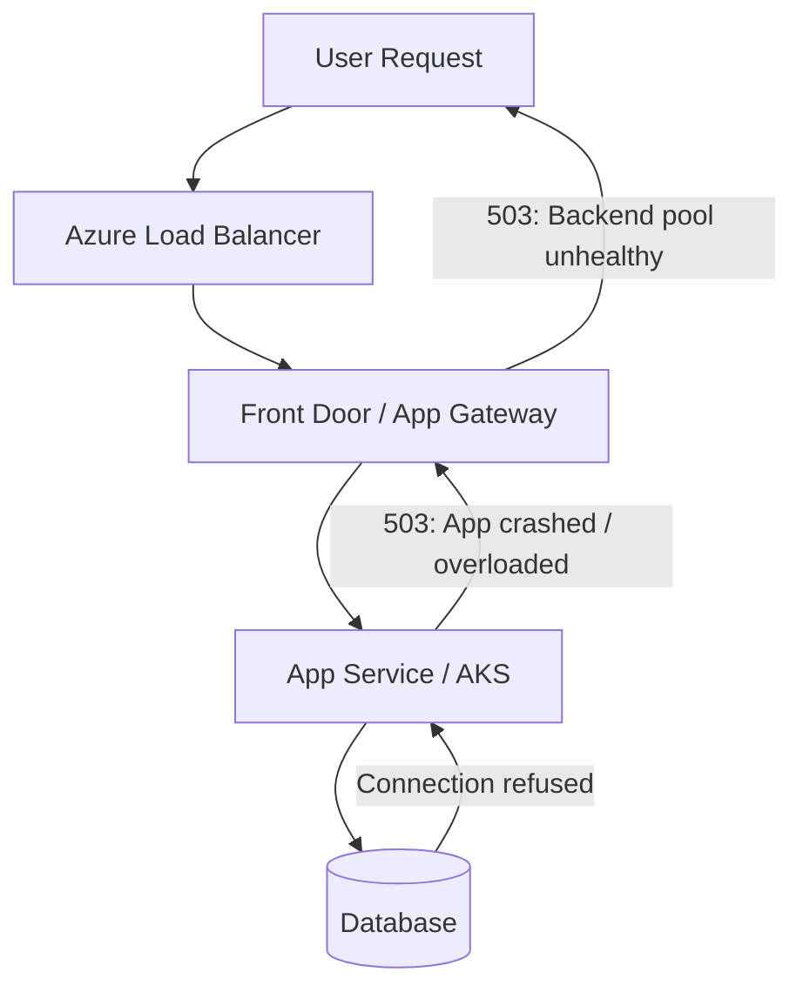
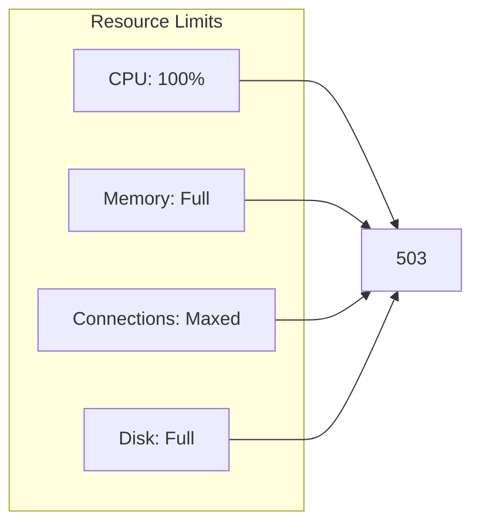
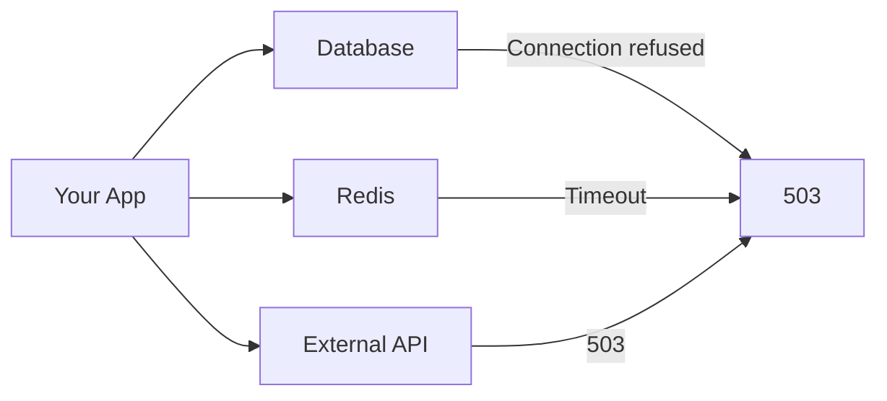
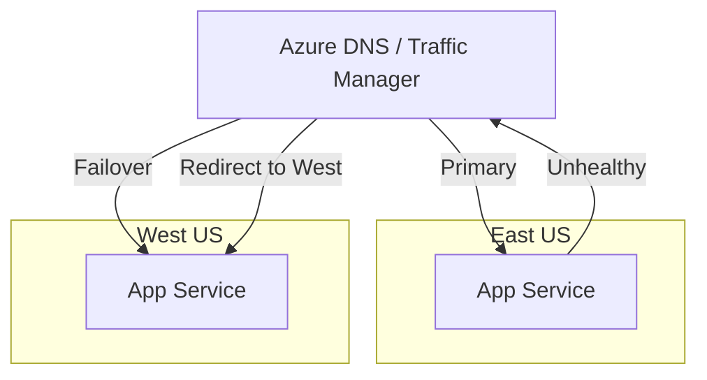

# How to Fix "Service Unavailable" Errors in Azure

Author: [nawazdhandala](https://www.github.com/nawazdhandala)

Tags: Azure, Service Unavailable, 503 Error, Troubleshooting, App Service, High Availability, DevOps

Description: A practical guide to diagnosing and resolving HTTP 503 Service Unavailable errors in Azure services including App Service, Functions, and AKS.

---

The 503 Service Unavailable error means your service exists but cannot handle requests right now. In Azure, this happens when your application crashes, runs out of resources, or when the underlying infrastructure has issues. Let's diagnose and fix it.

## Understanding 503 Errors in Azure

A 503 error tells clients to try again later. It can come from different layers in your Azure infrastructure.



### Common 503 Causes by Service

| Service | Common Causes |
|---------|--------------|
| App Service | App crash, out of memory, deployment in progress |
| Azure Functions | Cold start timeout, execution limit |
| AKS | Pod crash, resource exhaustion, failed health checks |
| Application Gateway | All backend instances unhealthy |
| Front Door | Origin not responding |

## Quick Diagnosis

Start with these commands to identify the issue.

### Check Service Health

```bash
# Check Azure service health for your region
az monitor activity-log list \
    --resource-group myresourcegroup \
    --start-time $(date -d '1 hour ago' +%Y-%m-%dT%H:%M:%SZ) \
    --query "[?contains(status.value, 'Failed')]"

# Check App Service status
az webapp show \
    --name myapp \
    --resource-group myresourcegroup \
    --query "{state:state,availabilityState:availabilityState,usageState:usageState}"
```

### Check Application Logs

```bash
# Stream live logs
az webapp log tail --name myapp --resource-group myresourcegroup

# Download logs for analysis
az webapp log download --name myapp --resource-group myresourcegroup --log-file logs.zip
```

### Check Metrics

```bash
# Get recent HTTP 503 count
az monitor metrics list \
    --resource "/subscriptions/{sub}/resourceGroups/{rg}/providers/Microsoft.Web/sites/myapp" \
    --metric "Http503" \
    --interval PT1M \
    --start-time $(date -d '1 hour ago' +%Y-%m-%dT%H:%M:%SZ)
```

## Fix 1: Application Crashes

The most common cause of 503 errors is your application crashing.

### Identify Crash Reason

```bash
# Check for Out of Memory errors
az webapp log show-container-logs --name myapp --resource-group myresourcegroup | grep -i "memory\|oom\|killed"

# Check for unhandled exceptions
az webapp log show-container-logs --name myapp --resource-group myresourcegroup | grep -i "exception\|error\|fatal"
```

### Add Global Error Handling

```csharp
// ASP.NET Core - Global exception handler
var builder = WebApplication.CreateBuilder(args);
var app = builder.Build();

// Catch all unhandled exceptions
app.UseExceptionHandler(errorApp =>
{
    errorApp.Run(async context =>
    {
        context.Response.StatusCode = 500;
        context.Response.ContentType = "application/json";

        var error = context.Features.Get<IExceptionHandlerFeature>();
        if (error != null)
        {
            // Log the error
            var logger = context.RequestServices.GetRequiredService<ILogger<Program>>();
            logger.LogError(error.Error, "Unhandled exception");

            await context.Response.WriteAsJsonAsync(new { error = "Internal server error" });
        }
    });
});
```

```javascript
// Node.js Express - Global error handler
process.on('uncaughtException', (error) => {
    console.error('Uncaught Exception:', error);
    // Log to Application Insights
    appInsights.defaultClient.trackException({ exception: error });
    // Give time to flush logs before exit
    setTimeout(() => process.exit(1), 1000);
});

process.on('unhandledRejection', (reason, promise) => {
    console.error('Unhandled Rejection at:', promise, 'reason:', reason);
    appInsights.defaultClient.trackException({ exception: reason });
});

// Express error middleware
app.use((error, req, res, next) => {
    console.error('Express error:', error);
    res.status(500).json({ error: 'Internal server error' });
});
```

## Fix 2: Resource Exhaustion

Your app is running but cannot handle more requests due to resource limits.



### Check Current Resource Usage

```bash
# Get App Service metrics
az monitor metrics list \
    --resource "/subscriptions/{sub}/resourceGroups/{rg}/providers/Microsoft.Web/sites/myapp" \
    --metric "CpuPercentage,MemoryPercentage,Connections" \
    --interval PT5M \
    --query "value[].timeseries[].data[-1]"
```

### Scale Up or Out

```bash
# Scale up to larger instance
az webapp update \
    --name myapp \
    --resource-group myresourcegroup \
    --set siteConfig.alwaysOn=true

# Change to higher tier App Service Plan
az appservice plan update \
    --name myplan \
    --resource-group myresourcegroup \
    --sku P2V3

# Scale out to multiple instances
az webapp scale \
    --name myapp \
    --resource-group myresourcegroup \
    --instance-count 3
```

### Configure Autoscale

```bash
# Create autoscale rule based on CPU
az monitor autoscale create \
    --resource-group myresourcegroup \
    --resource "/subscriptions/{sub}/resourceGroups/{rg}/providers/Microsoft.Web/serverFarms/myplan" \
    --resource-type Microsoft.Web/serverFarms \
    --name cpu-autoscale \
    --min-count 2 \
    --max-count 10 \
    --count 2

# Add scale out rule
az monitor autoscale rule create \
    --resource-group myresourcegroup \
    --autoscale-name cpu-autoscale \
    --condition "CpuPercentage > 70 avg 5m" \
    --scale out 2

# Add scale in rule
az monitor autoscale rule create \
    --resource-group myresourcegroup \
    --autoscale-name cpu-autoscale \
    --condition "CpuPercentage < 30 avg 5m" \
    --scale in 1
```

## Fix 3: Health Check Failures

Azure removes instances that fail health checks, causing 503 errors if all instances are unhealthy.

### Configure Health Check

```bash
# Set health check path
az webapp config set \
    --name myapp \
    --resource-group myresourcegroup \
    --health-check-path /health
```

### Implement Proper Health Endpoint

```csharp
// ASP.NET Core health check
builder.Services.AddHealthChecks()
    .AddCheck("database", () =>
    {
        try
        {
            using var connection = new SqlConnection(connectionString);
            connection.Open();
            return HealthCheckResult.Healthy();
        }
        catch (Exception ex)
        {
            return HealthCheckResult.Unhealthy(ex.Message);
        }
    })
    .AddCheck("redis", () =>
    {
        try
        {
            var redis = ConnectionMultiplexer.Connect(redisConnection);
            return redis.IsConnected
                ? HealthCheckResult.Healthy()
                : HealthCheckResult.Unhealthy("Redis not connected");
        }
        catch (Exception ex)
        {
            return HealthCheckResult.Unhealthy(ex.Message);
        }
    });

app.MapHealthChecks("/health", new HealthCheckOptions
{
    ResponseWriter = async (context, report) =>
    {
        context.Response.ContentType = "application/json";
        var result = new
        {
            status = report.Status.ToString(),
            checks = report.Entries.Select(e => new
            {
                name = e.Key,
                status = e.Value.Status.ToString(),
                description = e.Value.Description
            })
        };
        await context.Response.WriteAsJsonAsync(result);
    }
});
```

```javascript
// Node.js Express health check
app.get('/health', async (req, res) => {
    const checks = {
        database: 'unknown',
        redis: 'unknown'
    };

    try {
        // Check database
        await pool.query('SELECT 1');
        checks.database = 'healthy';
    } catch (error) {
        checks.database = 'unhealthy: ' + error.message;
    }

    try {
        // Check Redis
        await redisClient.ping();
        checks.redis = 'healthy';
    } catch (error) {
        checks.redis = 'unhealthy: ' + error.message;
    }

    const allHealthy = Object.values(checks).every(v => v === 'healthy');
    res.status(allHealthy ? 200 : 503).json({
        status: allHealthy ? 'healthy' : 'unhealthy',
        checks
    });
});
```

## Fix 4: Deployment Issues

503 errors during deployment are common. Minimize downtime with proper deployment strategies.

### Use Deployment Slots

```bash
# Create staging slot
az webapp deployment slot create \
    --name myapp \
    --resource-group myresourcegroup \
    --slot staging

# Deploy to staging first
az webapp deployment source config-zip \
    --name myapp \
    --resource-group myresourcegroup \
    --slot staging \
    --src app.zip

# Warm up staging slot
curl https://myapp-staging.azurewebsites.net/health

# Swap to production (instant, no downtime)
az webapp deployment slot swap \
    --name myapp \
    --resource-group myresourcegroup \
    --slot staging \
    --target-slot production
```

### Configure Warm-Up

```xml
<!-- web.config for warm-up -->
<system.webServer>
    <applicationInitialization doAppInitAfterRestart="true">
        <add initializationPage="/health" />
        <add initializationPage="/api/warmup" />
    </applicationInitialization>
</system.webServer>
```

## Fix 5: Dependency Failures

When a downstream service fails, your app may return 503.



### Implement Circuit Breaker

```csharp
// Using Polly for circuit breaker
builder.Services.AddHttpClient("ExternalApi")
    .AddPolicyHandler(Policy
        .HandleResult<HttpResponseMessage>(r => !r.IsSuccessStatusCode)
        .Or<HttpRequestException>()
        .CircuitBreakerAsync(
            handledEventsAllowedBeforeBreaking: 3,
            durationOfBreak: TimeSpan.FromSeconds(30),
            onBreak: (result, duration) =>
            {
                Console.WriteLine($"Circuit breaker opened for {duration.TotalSeconds}s");
            },
            onReset: () => Console.WriteLine("Circuit breaker reset")
        ));
```

```javascript
// Node.js circuit breaker with opossum
const CircuitBreaker = require('opossum');

const options = {
    timeout: 3000,
    errorThresholdPercentage: 50,
    resetTimeout: 30000
};

const breaker = new CircuitBreaker(callExternalApi, options);

breaker.on('open', () => console.log('Circuit breaker opened'));
breaker.on('halfOpen', () => console.log('Circuit breaker half-open'));
breaker.on('close', () => console.log('Circuit breaker closed'));

// Use the breaker
async function getData() {
    try {
        return await breaker.fire();
    } catch (error) {
        if (breaker.opened) {
            // Return cached data when circuit is open
            return getCachedData();
        }
        throw error;
    }
}
```

### Graceful Degradation

```csharp
// Return cached or default data when dependency fails
public async Task<ProductList> GetProductsAsync()
{
    try
    {
        var products = await _productApi.GetProductsAsync();
        await _cache.SetAsync("products", products, TimeSpan.FromMinutes(5));
        return products;
    }
    catch (Exception ex)
    {
        _logger.LogWarning(ex, "Product API unavailable, using cache");

        var cached = await _cache.GetAsync<ProductList>("products");
        if (cached != null)
        {
            return cached;
        }

        // Return empty list rather than 503
        return new ProductList { Products = new List<Product>(), IsCached = true };
    }
}
```

## Fix 6: Azure Platform Issues

Sometimes the issue is with Azure itself.

### Check Azure Status

```bash
# Check Azure status page programmatically
curl -s "https://status.azure.com/api/v1/services" | jq '.services[] | select(.status != "good")'

# Check Resource Health
az resource show \
    --ids "/subscriptions/{sub}/resourceGroups/{rg}/providers/Microsoft.Web/sites/myapp" \
    --query "properties.resourceHealth"
```

### Enable Multi-Region Failover



```bash
# Create Traffic Manager profile
az network traffic-manager profile create \
    --name myapp-tm \
    --resource-group myresourcegroup \
    --routing-method Priority \
    --unique-dns-name myapp-global

# Add primary endpoint
az network traffic-manager endpoint create \
    --name eastus-endpoint \
    --profile-name myapp-tm \
    --resource-group myresourcegroup \
    --type azureEndpoints \
    --target-resource-id "/subscriptions/{sub}/resourceGroups/{rg}/providers/Microsoft.Web/sites/myapp-eastus" \
    --priority 1

# Add failover endpoint
az network traffic-manager endpoint create \
    --name westus-endpoint \
    --profile-name myapp-tm \
    --resource-group myresourcegroup \
    --type azureEndpoints \
    --target-resource-id "/subscriptions/{sub}/resourceGroups/{rg}/providers/Microsoft.Web/sites/myapp-westus" \
    --priority 2
```

## Monitoring and Alerting

Set up alerts to catch 503 errors before users report them.

```bash
# Create alert for 503 errors
az monitor metrics alert create \
    --name "High503Errors" \
    --resource-group myresourcegroup \
    --scopes "/subscriptions/{sub}/resourceGroups/{rg}/providers/Microsoft.Web/sites/myapp" \
    --condition "total Http503 > 10" \
    --window-size 5m \
    --evaluation-frequency 1m \
    --action-group myactiongroup \
    --description "More than 10 503 errors in 5 minutes"

# Alert on instance health
az monitor metrics alert create \
    --name "UnhealthyInstances" \
    --resource-group myresourcegroup \
    --scopes "/subscriptions/{sub}/resourceGroups/{rg}/providers/Microsoft.Web/sites/myapp" \
    --condition "avg HealthCheckStatus < 100" \
    --window-size 5m \
    --action-group myactiongroup
```

## 503 Error Prevention Checklist

- [ ] Global exception handling in application
- [ ] Health check endpoint configured
- [ ] Autoscale enabled for traffic spikes
- [ ] Deployment slots for zero-downtime deploys
- [ ] Circuit breakers for external dependencies
- [ ] Graceful degradation with caching
- [ ] Multi-region deployment for high availability
- [ ] Monitoring alerts for 503 errors
- [ ] Application Insights enabled
- [ ] Resource limits appropriate for workload

---

503 errors indicate a temporary inability to serve requests. The fix depends on the cause: crashes need error handling, resource exhaustion needs scaling, health check failures need proper endpoints, and dependency failures need circuit breakers. Start with logs to identify the cause, then apply the appropriate fix. For production systems, always have monitoring in place to catch these issues before users complain.
